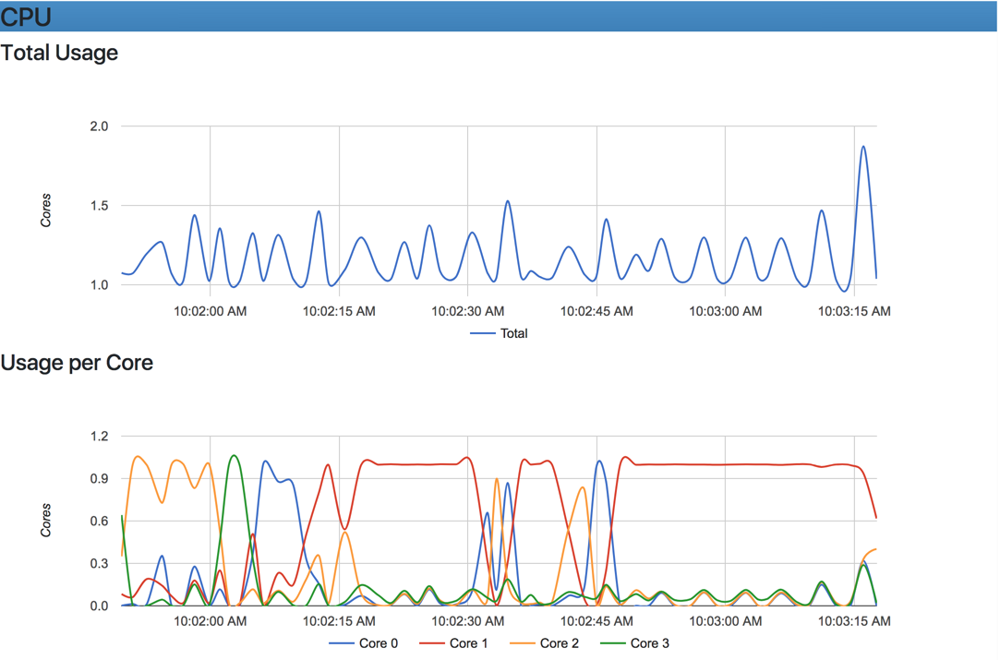

# docker

## install

https://allysonjulian.com/posts/setting-up-docker-with-xhyve/

https://docs.docker.com/v17.12/docker-for-mac/install/#download-docker-for-mac

```bash
brew update
brew install docker docker-compose docker-machine
```

### ~~xhyve~~

*deprecated, use hyperkit*

```bash
docker-machine-driver-xhyve

docker-machine env dev
```

### hyperkit

https://github.com/kubernetes/minikube/blob/master/docs/drivers.md#hyperkit-driver

```bash
curl -LO https://storage.googleapis.com/minikube/releases/latest/docker-machine-driver-hyperkit \
&& sudo install -o root -g wheel -m 4755 docker-machine-driver-hyperkit /usr/local/bin/
```

or 

```bash
docker-machine-driver-hyperkit
docker-machine create dev --driver hyperkit
```

## Docker

`docker exec -it vibrant_bell sh`

> run shell on container vibrant\_bell

### Healthchecks

**documentation**: [https://docs.docker.com/engine/reference/builder/\#healthcheck](https://docs.docker.com/engine/reference/builder/#healthcheck)

[https://ryaneschinger.com/blog/using-docker-native-health-checks/](https://ryaneschinger.com/blog/using-docker-native-health-checks/)

**health check samples:** [https://github.com/docker-library/healthcheck](https://github.com/docker-library/healthcheck)

### Startup dependencies

[https://docs.docker.com/compose/startup-order/](https://docs.docker.com/compose/startup-order/)

### compose / stack

compose is legacy

links are legacy.

`docker container run --name api-gateway --rm --link config-service:ali-config-service api-gateway:latest`

start stack

`docker stack deploy -c docker-compose.yml javelin`

### ENV vars

how entry points work: [https://stackoverflow.com/questions/41512237/how-to-execute-a-shell-command-before-the-entrypoint-via-the-dockerfile](https://stackoverflow.com/questions/41512237/how-to-execute-a-shell-command-before-the-entrypoint-via-the-dockerfile)

vars in dockerfile: [https://stackoverflow.com/questions/19537645/get-environment-variable-value-in-dockerfile](https://stackoverflow.com/questions/19537645/get-environment-variable-value-in-dockerfile)

environment replacement doc: [https://docs.docker.com/engine/reference/builder/\#environment-replacement](https://docs.docker.com/engine/reference/builder/#environment-replacement)

**how to run command to set env var**

1. Create dockerrun.sh script to set as entry point with the following

   ```text
   GATEWAY=$(ip route show 0.0.0.0/0 dev eth0 | cut -d\  -f3)
   SPRING_CONFIG_URI=http://$GATEWAY:8888
   java $JAVA_OPTS -DSPRING_CONFIG_URI=$SPRING_CONFIG_URI -Djava.security.egd=file:/dev/./urandom -Dserver.port=8081 -jar /app.jar
   ```

2. edit Dockerfile

   ```text
   FROM openjdk:8-jdk-alpine
   VOLUME /tmp
   EXPOSE 8081
   COPY target/dockerrun.sh /
   ADD target/api-gateway.jar app.jar
   ENV JAVA_OPTS=""
   ENTRYPOINT exec sh ./dockerrun.sh
   ```

3. 
### Networking

docs: [https://docs.docker.com/engine/userguide/networking/work-with-networks/\#basic-container-networking-example](https://docs.docker.com/engine/userguide/networking/work-with-networks/#basic-container-networking-example)

**get container ip**

```text
hostname -i
```

**get container gateway**

```text
$(ip route show 0.0.0.0/0 dev eth0 | cut -d\  -f3)
```

or

```text
ip route|awk '/default/ { print $3 }'
```

\*\* Use docker compose/stacks to network containers. old way was link. using the gateway address will also do it.

### tutorials

**getting started for java:** [https://github.com/docker/labs/tree/master/developer-tools/java/](https://github.com/docker/labs/tree/master/developer-tools/java/)

**getting started for spring boot:** [https://spring.io/guides/gs/spring-boot-docker/](https://spring.io/guides/gs/spring-boot-docker/)

**host multiple websites on single host docker:** [https://blog.florianlopes.io/host-multiple-websites-on-single-host-docker/](https://blog.florianlopes.io/host-multiple-websites-on-single-host-docker/)

**nginx template vars:** [https://docs.docker.com/samples/library/nginx/\#using-environment-variables-in-nginx-configuration](https://docs.docker.com/samples/library/nginx/#using-environment-variables-in-nginx-configuration)

### phantomjs

[http://fabiorehm.com/blog/2015/07/22/building-a-minimum-viable-phantomjs-2-docker-image/](http://fabiorehm.com/blog/2015/07/22/building-a-minimum-viable-phantomjs-2-docker-image/)

alpine linux won't build phantom:

[https://github.com/Overbryd/docker-phantomjs-alpine](https://github.com/Overbryd/docker-phantomjs-alpine)

### Playground

[http://play-with-docker.com](http://play-with-docker.com)

### Volumes

* mount points are owned by root, may have implications when mounting user home
  * create a VOLUME and run ls -la /home
  * add a volume at run to /home/username and run ls -la /home to see diff
  * paths on host must be absolute.
  * non-existent paths are created

#### Mac OS

[https://docs.docker.com/docker-for-mac/osxfs/\#namespaces](https://docs.docker.com/docker-for-mac/osxfs/#namespaces)

### Alpine linux

docs: [https://docs.docker.com/samples/library/alpine/ ](https://docs.docker.com/samples/library/alpine/)

creating users: [https://github.com/mhart/alpine-node/issues/48 ](https://github.com/mhart/alpine-node/issues/48)

```text
RUN addgroup -g 1000 -S username && \
    adduser -u 1000 -S username -G username
```

### montoring

[http://fuzzyblog.io/blog/docker/2017/06/25/docker-tutorial-understanding-container-memory-usage.html](http://fuzzyblog.io/blog/docker/2017/06/25/docker-tutorial-understanding-container-memory-usage.html)

[https://dzone.com/articles/monitoring-docker-containers-docker-stats-cadvisor-1](https://dzone.com/articles/monitoring-docker-containers-docker-stats-cadvisor-1) - breakdown of four types of monitoring including: stats, cadvisor, remote api, and universal control plane

**docker stats**

is a live 1sec view that streams

```text
docker stats
```

**docker remote api**

[https://docs.docker.com/develop/sdk/](https://docs.docker.com/develop/sdk/) - sdk for interacting

[https://docs.docker.com/engine/api/v1.37/](https://docs.docker.com/engine/api/v1.37/) - api docs

**using cAdvisor**

This will run in a docker container and expose a web view at: localhost:8080

```text
#!/usr/bin/env bash
docker run -d --name=cadvisor \
    -p 8081:8080 \
    --volume=/var/run:/var/run:rw \
    --volume=/sys:/sys:ro \
    --volume=/var/lib/docker/:/var/lib/docker:ro \
    google/cadvisor:latest
```

Gives you host and container metrics such as:  


Can be used with other tools for storage and retrieval. docs: [https://github.com/google/cadvisor/blob/master/docs/storage/README.md](https://github.com/google/cadvisor/blob/master/docs/storage/README.md)

### Caching/Layers

[https://thenewstack.io/understanding-the-docker-cache-for-faster-builds/](https://thenewstack.io/understanding-the-docker-cache-for-faster-builds/)

[https://docs.docker.com/develop/develop-images/dockerfile\_best-practices/\#run](https://docs.docker.com/develop/develop-images/dockerfile_best-practices/#run)

brute force: –no-cache during build

use multi-stage builds and separate layers correctly

## fix terminal size

fix issue where terminal has wierd wraps

```bash
docker exec -e COLUMNS="`tput cols`" -e LINES="`tput lines`" -ti mycontainer bash
```