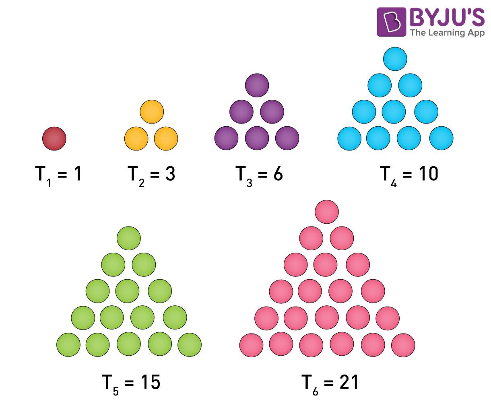

- https://byjus.com/maths - great basic math explanations

## Cartesian Product

Multiply two sets to get set of all ordered pairs.

https://www.mathstopia.net/sets/cartesian-product

## Combinations and Permutations

https://www.mathsisfun.com/combinatorics/combinations-permutations.html

### How many ways can you choose k items from n items without repetition and without order?

https://www.hackmath.net/en/calculator/n-choose-k?n=12&k=2&order=0&repeat=0

`n choose k`

## Triangle Numbers

https://en.wikipedia.org/wiki/Triangular_number

1,3,6,10...

`n * n-1 / 2`



## Pascal's Triangle

https://www.mathsisfun.com/pascals-triangle.html

## Kabsch-Umeyama Algorithm

https://zpl.fi/aligning-point-patterns-with-kabsch-umeyama-algorithm/

Used to find optimal translations, rotation and scaling. Example used is aligning the big dipper and little dipper. This works amazingly well. Very easy python example, golang required gonum.

## Manhatten Distance

> he distance between two points is the sum of the absolute differences of their Cartesian coordinates 
-- https://en.wikipedia.org/wiki/Taxicab_geometry

Used to quantify distance between points. In 3d it would be:

```md
pointA = [1105,-1205,1229]
pointB = [-92,-2380,-20]
|(1105 + -92)| + |(-1205 + -2380)| + |(1229 + -20)| = 3621
```
