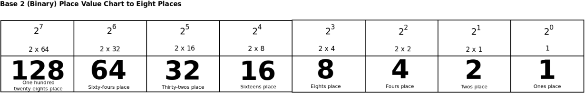

[reference and practice](http://www.binarymath.info)

[graphic representations and explanation](https://delightlylinux.wordpress.com/2014/08/25/binary-lesson-2-place-value/)

[](https://delightlylinux.wordpress.com/2014/08/25/binary-lesson-2-place-value/)

## addition rules

```sh
0 + 0 = 0
0 + 1 = 1
1 + 0 = 1
1 + 1 = 10
```

## multiplication rules

```sh
0 x 0 = 0
0 x 1 = 0
1 x 0 = 0
1 x 1 = 1
```
