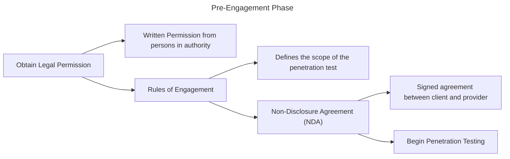
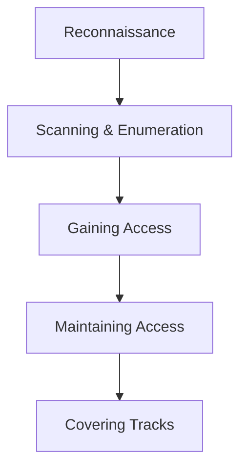
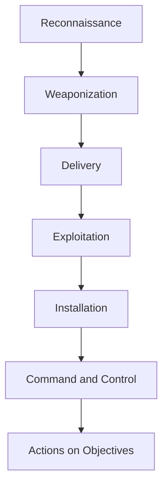

https://www.amazon.com/Ultimate-Kali-Linux-Book-cutting-edge-ebook/dp/B0CM6FSVCG/ref=tmm_kin_swatch_0

https://docs.getutm.app/guest-support/linux/#ubuntu-debian-apt-based-1

```bash
sudo apt install qemu-guest-agent
sudo apt install spice-vdagent
sudo updatedb
```

## Intro to Ethical Hacking

- `TTPs` Tactics, Techniques, and Procedures 
- `Cyber Kill Chain` is used by cybersecurity professionals to better understand cyberattacks.
- `Threat Actors` cyber criminals with the intention of causing harm or damage.
- `ransomware` crypto-malware that's designed to encrypt all data on the victims system with a ransom demand for the decryption keys. 
	- `Command and Control (C2)` communication channel with one or more C2 servers that are owned and managed by cyber criminals to receive updates and additional instructions.
	- Payment is not recommended, no guarentee of proper keys and data returned
	- Data is often exfilled and sold on the dark web or in pastedump sites such as pastebin.com
	- Decryption keys may be correct, but additional malware for more money later is a tactic
- `PII` personally identifiable information
- `Asset` anything of value to the organization or person.
	- `Tangible`  assets are physical assets with value, such as computeres, servers, network devices, and other security appliances.
	- `Intangible` assets are things wthout a physical form that hold value, such as applications, software license keys, intellectual property, business plans and models, and data.
	- `People` are the customers and employees of an organization. Protecting data from leaking on the dark web and safeguarding employees from threats are of highest importance.
- `Threat` potential to cause harm or damage to a system, network, or person.
- `vulnerability` security weakness or flaw that exists within a system that enables hackers to exploit it in order to gain unauthorized access or control over systems within a network.
- `exploit` anything such as a tool or code, that is used to take advantage of security vulnerabilities on a system. 
- `attack` simply a method or technique that is used by a threat actor to take advantage of (exploit) a secuirty vulnerability (weakness) within a system.
- `attack vector` is simply an area or pathway through which a targeted system, network, or organization can be compromised by a threat actor.
	- `direct access` - physical access to the targeted computer or network
	- `wireless` - exploiting security vulnerabilities found within the target's wireless network infrastructure
	- `email` - sending malicious email messages containing links to malware-infected services, fake websites, and malicious attachments
	- `supply chain` - compromising the security of a vendor or supplier to gain access to a target
	- `social media` - using deceptive messages or malicious advertising (`malvertising`) to tricke the target into revealing sensitive information or downloading a malicious file.
	- `removable media` - connecting malware-infected media to the targeted system
	- `cloud` - exploiting security vulnerabilities within cloud services and its infrastructure
- `risk` is the potential impact that a vulnerability, threat or attack presents to the assets of an organization and the likelihood an attack or threat has to cause harm to systems.
- `attack surface`  is all the vulnerable points of entry into a system, network, or organization that can be exploited by a threat actor to gain unauthorized access and expand their foothold on the network.
- `zero-day` is when a threat actor discovers a security vulnerability within a product or application and is able to exploit it before the vendor is either aware of the vulnerability or has time to develop a security patch to resolve the issue.
	- Common in nation-state attacks, Advanced Persistent Threat (`APT`) groups, and large criminal organizations.
	- Personal gain carries `hack value`

### Identifying Threat Actors and Intent

- `script kiddie` - common type of threat actor who is not necessarily a young adult or a kid, but does not fully understand the technical details of cybersecurity to perform a cyber-attack or develop a threat on their own.
- `cyber terroist` perform cyber-attacks that are designed to compromise communication channels and systems, with the intention to cause enough damage and disruption to create fear and/or intimidate a targeted society to achieve an ideological goal.
- `hacktivist` uses hacking skills to perform malicious activities such as defacing websites or launching Denial of Service (`DoS`) attacks in support of a political or social agenda.
- `insider` fake identity and curriculum vitae with the intention of applying for a job within their targeted organization and becoming an employee; a malicious insider.
	- `unintentional insiders` are insides who are legitimate employees and unintentionall cause harm to the organization due to negligence.
- `state-sponsored` threat actors are commonly referred to as `nation-state actors`. Hired by governments to perform reconnaissance on other countries and protect their own country from cyber-attacks and emerging threats.
- `organized crime` are made up of a group of people with the same goals in mind. When the level of effort and resources is brought to bear, the group becomes an `APT`.
- `black hat` hacker is a threat actor who uses their hacking skills for malicious reasons. 
- `white hat` hacker is someone who uses skills for good. e.g., ethical hackers, white hat hackers
- `gray hat` hacker metaphorically sits between the boundary of a white hat and a black hat hacker. Uses skills to help people during the day and at night for malicious reasons. 

## Penetration Testing

### Penetration Testing Execution Standard (PTES)

#### 1. Pre-engagement phase
- Key personnel are selected; they provide information, coordinate resources, and help the pen testers understand the scope, breadth, and rules of engagement in the assessment. 
- Usually includes a Non-Disclosure Agreement (`NDA`) and a Consulting Services Agreement (`CSA)
- written permission from persons in authority is your get out of jail free card
- Rules of engagement can be coupled with the CSA. The CSA includes the work schedule, timelines, scope of work, deliverables, payment terms, and more.
- The NDA is the legal agreement that specifies that a pen tester and their employer will not share or retain any sensitive or proprietary information that is encountered during the assessment.
- Scope, also known as rules of engagement, defines the systems and networks the pen tester is authorized to perform security assessments on. The scope should be directly aligned with testing objectives.


```mermaid
--- 
title: Pre-Engagement Phase
---
flowchart LR
  permissions[Obtain Legal Permission] --> written_permission[Written Permission from persons in authority]
  rules[Rules of Engagement] --> scope[Defines the scope of the penetration test]
  nda["Non-Disclosure Agreement (NDA)"] --> signed_nda[Signed agreement between client and provider]
  begin[Begin Penetration Testing]
  permissions --> rules
  rules --> nda
  nda --> begin
```

### Questions
- What is the size/class (IP addresses and/or network blocks) of the external network? (network penetration testing)
- What is the size/class (IP addresses and/or network blocks) of the internal network? (network penetration testing)
- What is the purpose and goal of the penetration test? (Applicable to any form of pen testing)
- How many site pages does the web application have? (web application penetration testing)

#### 2. Information-gathering phase
- Perform reconnaissance to collect information from various data sources to create a profile about the targeted organization and identify security vulnerabilities
- seasoned pros usually spend a day or two conducting extensive reconnaissance
- Helps identify the employees, infrastructure, and geolocation for physical access, network details, servers, and other valuable information about the targeted organization

#### 3. Threat Modeling
- Data is used to help pen testers simulate, assess, and address the most common threats that an organization, network, or application faces.
- Helps organizations and cybersecurity professionals better understand and evaluate cyber risks and threats that have the potential to negatively affect the assets of a company.
- Common models:
	- Spoofing identity, tampering with data, repudiation threats, information disclosure, denial of service, and elevation of privilege (STRIDE)
		- Spoofing identity: a malicious user can attempt to impersonate the identity of a legitimate user. For mitigation, the bank may use multi-factor authentication
		- Tampering with data: malicious actors may attempt to intercept and alter sensitive financial data that is being transmitted, causing unauthorized transfer of funds.
		- Repudiation threats: a threat actor could DoS attack the platform to deny any legitimate requests from authorized and trusted users. This creates a financial loss. As mitigation, the bank could implement transaction logging and further validate that each is associated with a unique identifier, such as a digital signature.
		- Information disclosure: customers' data could be exposed to unauthorized persons via security vulnerabilities in the database or an insecure API. For mitigation, the bank can implement security access controls and data encryption for the application and its database.
		- Denial of service: a malicious actor could flood unsolicited request messages to the bank's system, causing the resources of the hosting server to be overwhelmed. Mitigation includes CAPTCHA and intrusion prevention systems (IPSs).
		- Elevation of privileges: malicious actors may exploit a web application vulnerability on the bank's online portal to escalate their privileges and obtain unauthorized access to admin areas of the system. As a mitigation, using least privileges helps ensure minimum access. Regular auditing of privileges also helps. 
	- Process for attack simulation and threat analysis (PASTA)
		- Define the objectives: ensuring the information security and technologies of the online banking system to protect customers' data, preventing financial fraud, and sustaining the availability of the system. 
		- Define technical scope: the online banking system may include web and mobile applications, backend database servers, and hosting services, third-party vendor technology integration, and usage of application programming interfaces (APIs).
		- Decompose the application: identifying and documenting various components, data flows, and functionality within the online banking system. 
		- Analyze the threats: performing threat analysis to identify potential threats and attack scenarios that can be used to exploit security vulnerabilities in the online banking system.
		- Vulnerability analysis: identifying and assessing the security vulnerabilities found in the online banking system that can be exploited by a malicious actor.
		- Attack analysis: simulating real-world cyber-attacks based on identified security vulnerabilities and potential threats that can compromise a system.
		- Risk and impact analysis: focuses on evaluating the likelihood and potential impact each identified cyber threat would have on compromising the online banking system.
		- 

#### 4. Vulnerability analysis
- Manual and automated pen testing by an ethical hacker to identify hidden and unknown security flaws
- Manual testing is recommended to determine if vulnerabilities exist
- Automated systems analyze the impact with a score between 0-10 (low-severe). This helps prioritize fixes

#### 5. Exploitation
- Most challenging: you will develop or acquire an exploit and modify and test it to ensure it has the capability of taking advantage of the vulnerability in the targeted system
- It's the ammunition or evidence that helps articulate the vulnerability
- Without exploitation, the pen test is a vulnerability assessment

#### 6. Post-exploitation
- After compromise, the adversary usually attempts to expand their foothold on the network by compromising additional systems and setting up backdoor access
- Similarly, pen testers may apply common exploitation techniques such as lateral movement to compromise other systems on the network and set up C2 operations to control multiple systems simultaneously
- The primary goal is to demonstrate the impact that the vulnerability and access gained can pose to a target organization

#### 7. Report writing
- Most important
- It's the deliverable
- Involves much more than listing the security vulnerabilities that were found, their impact, and recommendations.
- It's the medium to convey risk and business impact, summarize your findings, and include remediation steps.
- It's crucial that it's understood by a variety of stakeholders

### Penetration Testing Approaches

- `white box` assessment is typical of web application testing but can extend to pen testing. In white box, the pen tester is provided full information about the targeted applications, systems, and networks.
- `black box` assessment is most common. The pen testers are given very little or no information.
- `gray box` assessment is a hybrid of black and white box testing. 

### Types
- Vulnerability assessment`: the cybersecurity pro uses a vulnerability scanner to perform authenticated and unauthenticated scans. 
- Penetration testing` manually tests vulnerabilities and provides a report

### Web Application Penetration Testing (WAPT)

- most common
- Performing manual identification and exploitation of security vulnerabilities using techniques such as SQL Injection (SQLi), Cross-site Scripting (XSS) and business logic errors that automated tools may miss

### Mobile Application Penetration Testing 
- Similar to WAPT but specific to mobile applications

### Social Engineering Penetration Testing
- Manipulating basic human psychology to find human-based vulnerabilities and trick potential victims into doing things they may not otherwise do
- The primary goal is to identify vulnerabilities in the organization's security awareness and procedures and to measure how employees respond to social engineering tricks
- May include phishing emails, making vishing phone calls, or talking your way into secure facilities and connecting a USB drive to the system to determine what a real adversary could achieve.

### Network Penetration Testing (external and internal)
- Focuses on identifying security weaknesses in a target environment.
- Bypassing intrusion detection system (IDS)/IPS
- bypassing firewall appliances
- password cracking
- gaining access to end devices and servers
- exploiting misconfigurations on switches and routers
- External is focused from outside to inside. Internal is done by putting a machine on the network, no longer concerned about bypassing the perimeter. 

### Cloud Penetration Testing
- Performing security assessments to identify the risks on cloud-based platforms to discover any security vulnerabilities that may expose confidential info to malicious actors
- Before attempting, get legal permission from the cloud provider. 
- Can include Sofware as a Service (SaaS), Platform as a Service (PaaS), and Infrastructure as a Service (IaaS)

### Physical Penetration Testing
- focuses on testing physical security access control systems in place to protect an organization's data.
- controls include:
	- security cameras and sensors: used to monitor an area
	- biometric authentication systems: biometrics are used to ensure only authorized people gain access
	- doors and locks: locking systems prevent unauthorized accesss
	- security guards: people assigned to protect something, someone, or an area

## Phases of Penetration Testing


```mermaid
flowchart TB
  Reconnaissance --> scanning[Scanning & Enumeration]
  scanning --> gain[Gaining Access]
  gain --> maintain[Maintaining Access]
  maintain --> cover["Covering Tracks"]
```

1. Reconnaissance
	- information gathering
	- using internet search engines
	- using social networking platforms
	- performing Google hacking techniques
	- performing domain name system (DNS) interrogation
	- using social engineering techniques
2. Scanning and Enumeration
	- Using a direct approach via active reconnaissance in engaging the target to obtain information that is not accessible via passive information gathering
	- Performing host discovery
	- Checking for firewalls and testing their rules
	- Checking for open network ports and running services
	- Checking for security vulnerabilities
	- Creating a network topology of the target network
	- Helps build a profile
3. Gaining Access (exploitation)
	- Most challenging sometimes.
	- Uses the information to craft an exploit or acquire one from online resources that is designed to compromise the security vulnerability of the target.
	- Needs to test the exploit to gain:
		- Retrieve and crack stored passwords on systems
		- escalating privileges
		- Transferring additional payloads and malware
4. Maintaining Access
	- Attempt to implement additional backdoors on the compromised system to expand the foothold
	- Perform lateral movement
	- Exfiltration of data
	- cleanup when done
5. Covering Tracks
	- leave no traces
	- avoid triggering alerts
	- 

## Cyber Kill Chain Framework

- 7-stage framework developed by Lockheed Martin. 
- Typical operation of a red team
- Red teamers typically don't have a scope or time constraint
- Still need legal permission
- Blue-teamers monitor and analyze
- 


```mermaid
flowchart TB
  Reconnaissance --> Weaponization
  Weaponization --> Delivery
  Delivery --> Exploitation
  Exploitation --> Installation
  Installation --> c2[Command and Control]
  c2 --> action[Actions on Objectives]
```

### Reconnaissance
- Gathering information and intelligence about a target
- Create a target profile

### Weaponization
- The objective is to compromise the confidentiality, integrity, and/or availability (CIA) of the systems or networks owned by the targeted organization
- Both pen testers and threat actors need to be concerned about endpoint detection and response systems (EDRs)
- Disguise the exploit

### Delivery
- Use an attack vector as a method to deliver the exploit onto the targeted system
- Delivery may be email, instant messaging, or dropping USB devices
- USB rubber ducky. 
	- Load onto a memory card, once inserted, reads as HID, such as a keyboard, then executes a script.

### Exploitation
- Ensure the exploit is executed
- if the exploit doesn't work, the threat actor or pen tester may be detected by the organization and the cyber kill chain is halted

### Installation
- Create multiple backdoor accesses to the compromised system
- Additional applications may be installed while the threat actor takes precautions to avoid detection

### Command and Control (C2)
- threat actor group can control a group of infected systems
- threat actor can create an army of zombies
- Use data encryption, encapsulation, and various tunneling techniques to evade detection in systems within target organizations

### Actions on Objectives
- If reached here, the blue team failed. 

## Reources
 - https://www.cisa.gov/news-events/cybersecurity-advisories/aa23-075a
 - https://owasp.org/www-project-web-security-testing-guide/latest/3-The_OWASP_Testing_Framework/1-Penetration_Testing_Methodologies
 - https://www.crowdstrike.com/en-us/cybersecurity-101/threat-intelligence/threat-model/
 - https://www.lockheedmartin.com/en-us/capabilities/cyber/cyber-kill-chain.html
 - https://attack.mitre.org/tactics/enterprise/
 - http://www.pentest-standard.org/index.php/PTES_Technical_Guidelines
 - https://listings.pcisecuritystandards.org/documents/Penetration-Testing-Guidance-v1_1.pdf
 - https://csrc.nist.gov/pubs/sp/800/115/final
 - https://www.isecom.org/OSSTMM.3.pdf
 - https://owasp.org/www-project-web-security-testing-guide/
 - https://owasp.org/www-project-mobile-app-security/
 - https://github.com/scriptingxss/owasp-fstm
 - http://www.vulnerabilityassessment.co.uk/Penetration%20Test.html

## Building a Penetration Testing Lab
- https://owasp.org/www-project-juice-shop/
- https://sourceforge.net/projects/metasploitable/files/Metasploitable2/
- https://portal.cloud.hashicorp.com/vagrant/discover/rapid7

### Physical Lab Disadvantages
- Physical space is required to store servers and networking equipment
- The power consumption per device will result in an overall high cost
- The cost of buildling/purchasing each physical device is high

### Componenets
- Hypervisor: enables virtualization of operating systems and allows them to run on any hardware. VirtualBox is one.
- Attacker Machine: creates and launches various types of attacks
- Vulnerable machines: set up vulnerable systems such as Metasploitable 2 and Metasploitable 3
- Vulnerable web application: To identify web app threats
- Internet access: set up on the Kali virtual machine
- Virtual Network Interface Cards (vNICs): virtual network adapters
- 

Download a hypervisor: VirtualBox, UTM, etc.
	1. https://www.oracle.com/virtualization/technologies/vm/downloads/virtualbox-downloads.html
	2. https://www.oracle.com/virtualization/technologies/vm/downloads/virtualbox-downloads.html#extpack
	3. https://download.virtualbox.org/virtualbox/7.2.16/
Create a virtually isolated network

```
vboxmanage dhcpserver add --network=PentestNet --server-ip=172.30.1.1 --lower-ip=172.30.1.20 --upper-ip=172.30.1.50 --netmask=255.255.255.0 --enable

vboxmanage list dhcpservers

vboxmanage dhcpserver add --network=HiddenNet --server-ip=10.11.12.1 --lower-ip=10.11.12.20 --upper-ip=10.11.12.50 --netmask=255.255.255.0 --enable	

vboxmanage dhcpserver add --network=RedTeamLab --server-ip=192.168.42.1 --lower-ip=192.168.42.20 --upper-ip=192.168.42.50 --netmask=255.255.255.0 --set-opt 6 192.168.42.40 --enable
```

Open the .vbox file

```bash
 enabled Nested VT-x/AMD-V virtualization feature
vboxmanage list vms
vboxmanage modifyvm "kali" --nested-hw-virt on
```

Adjust RAM to the yellow and red zones on the base memory scale. It can use 2G memory, however if you have more than 8G system memory, consider 4G.

Adjust cores, between 1-2

Connect to the physical internet network. 

Adapter 1
	- Enable the network adapter
	- Attached to: bridged adapter
	- Name: select the physical network connection

Assign Adapter 2
	- Enable the network adapter
	- Attached to: internal network
	- Name: PentestNet
	- Promiscuous Mode: Allow All (for packet capture)
Assign adapter 3
	- Enable the network adapter
	- Attached to: Internal Network
	- Name: RedTeamLab
	- Promiscuous Mode: Allow All
	- After enabling, disable for now

Login with kali/kali

Install guest additions: https://www.kali.org/docs/virtualization/install-virtualbox-guest-additions/

Follow machine settings from https://kskroyal.com/kali-linux-virtualbox-apple-silicon/

Disable IPv6
	- Advanced Network Configuration
	- Select wired connection 1
	- IPv6 Settings
	- Disabled
	- Save

Run `ip address` to verify network connections

> [!NOTE]
> I switched to UTM because apple silicone doesn't support nested visualization on M1 and it's a nicer virtualbox alternative

### UTM Setup

https://www.kali.org/docs/virtualization/install-utm-guest-vm/

- Download latest, use QEMU
- Open Settings > Network
- Add networks for the three settings
- Create three new networks, rename to PentestNet, HiddenNet, RedTeamLab
- go into VM settings and open network, select named host networks
- manually setup DHCP with nmcli

- vNIC 1: bridged. 
- vNIC 2: host only, PentestNet, set static IP in 172.30.1.0/24 range, 172.30.1.20 matches book
- vNIC 3: host only. RedTeamLab, static in range 192.168.42.0/24, e.g. 192.168.42.20
 - vNIC 4: host only, HiddenNet (10.11.12.0/24). Static IPs: Windows Server = 10.11.12.20, Metasploitable3 Linux = 10.11.12.21

```bash
sudo apt update
sudo apt install spice-vdagent
sudo apt install qemu-guest-agent
sudo apt install spice-webdavd

```

If sources don't update see  https://www.kali.org/docs/general-use/kali-linux-sources-list-repositories/

## Ensure IPv4

https://raw.githubusercontent.com/PacktPublishing/The-Ultimate-Kali-Linux-Book-3E/main/Chapter%2002/network-configuration.service`

```bash
wget https://raw.githubusercontent.com/PacktPublishing/The-Ultimate-Kali-Linux-Book-3E/main/Chapter%2002/network-configuration.service
sudo mv network-configuration.service /etc/systemd/system/
sudo systemctl daemon-reload
sudo systemctl enable network-configuration.service 
```

## Pimpmykali

https://github.com/Dewalt-arch/pimpmykali

```bash
git clone https://github.com/Dewalt-arch/pimpmykali
cd pimpmykali
sudo ./pimpmykali.sh
```


## Packages

Check the policy of liblzma5 `apt-cache policy <oackage_name>` 

Upgrade a specific version `sudo apt update && sudo apt install -y --only-upgrade liblzma5`

## OWASP Top 10

https://owasp.org/www-project-top-ten/

https://owasp.org/www-project-juice-shop/

```bash
sudo docker pull bkimminich/juice-shop 
sudo docker run --rm -p 3000:3000 bkimminich/juice-shop
```

## Docker

```bash
sudo apt update 
sudo apt install -y docker.io
sudo systemctl start docker
sudo systemctl enable docker

 stop
sudo systemctl stop docker
sudo systemctl disable docker
```

## Deploy Metasploitable 2

https://sourceforge.net/projects/metasploitable/files/Metasploitable2/

Download, unzip.

Convert image for UTM `

```bash
brew install qemu
qemu-img convert -O qcow2 Metasploitable.vmdk Metasploitable.qcow2
```

- create a new vm with emulate and other type
- skip attaching a boot ISO
- before booting edit settings
	- uncheck UEFI boot
	- modest resources: 1G RAM, default CPU
	- netowrk mode: host only, host network: PentestNet, statis IP in 172.30.1.0/24 range
	- remove default blank drive
	- attach the converted drive (`qcow2`) to the cotnainer in IDE mode
- boot and login with `msfadmin`, then ifconfig to confirm network 

`sudo ifconfig eth0 172.30.1.21 netmask 255.255.255.0 up` to set network immediataely

Persist network

```bash
sudo vi /etc/network/interfaces
# edit file
sudo /etc/init.d/networking restart

# from kali, 
ping 172.30.1.21
```

```
auto eth0
iface eth0 inet static
    address 172.30.1.21
    netmask 255.255.255.0
```

Network errors:

Find the mac on the PentestNet for kali. e.g. `FE:16:94:B6:7A:03`

`ip lnk show` to identify the interface for the mac

`nmcli con show` to find connection name/ids

```bash
# PentestNet
nmcli con add type ethernet ifname eth1 con-name PentestNet ipv4.method manual ipv4.addresses 172.30.1.20/24
nmcli con up PentestNet

# RedTeamLab
nmcli con add type ethernet ifname eth2 con-name RedTeamLab ipv4.method manual ipv4.addresses 192.168.42.20/24
nmcli con up RedTeamLab
```


## Vagrant

```bash
brew tap hashicorp/tap
brew install hashicorp/tap/hashicorp-vagrant
vagrant plugin install vagrant-reload
vagrant box add rapid7/metasploitable3-win2k8 --provider virtualbox
vagrant box add rapid7/metasploitable3-ub1404 --provider virtualbox

cd ~/.vagrant.d/boxes/
# for each box convert images
qemu-img convert -O qcow2 metasploitable3-win2k8-disk001.vmdk metasploitable3-win2k8-disk001.qcow2
```

Import VMs with similar settings as other converted disk.

linux

- create a new vm with emulate and other type
- attach the converted drive (`qcow2`) to the cotnainer in IDE mode
- before booting edit settings
	- uncheck UEFI boot
	- resources: 2G RAM, default CPU
	- network mode: host only, host network: HiddenNet, ip in 10.11.12.0/24 range

1. login with vagrant
1. set network
	- `ip a` to verify not set already
	- `sudo vi /etc/network/interfaces` and make changes below
	- `sudo /etc/init.d/networking restart`
	- `ip addr show eth0` should have new ip
1. test
	- linux: `ping 10.11.12.20`
	- win: `ping 10.11.12.21`

network interfaces

```
auto eth0
iface eth0 inet static
    address 10.11.12.21
    netmask 255.255.255.0
```

windows

- create a new vm with emulate and other type
- attach the converted drive (`qcow2`) to the cotnainer in IDE mode
- before booting edit settings
	- uncheck UEFI boot
	- resources: 4G RAM, 2 CPU
	- netowrk mode: host only, host network: PentestNet, statis IP in 172.30.1.0/24 range
	- network mode: host only, host network: HiddenNet, ip in 10.11.12.0/24 range
	- performance tweaks
		- remove sjounds, usb controller, extra disks, cd-roms, emulation adds overhead

1. Start the box, may need to repair
1. login with default vagrant creds
1. Run repair, use the command prompt to fix the disc settings

```bash
reg load HKLM\offline C:\Windows\System32\config\SYSTEM
reg add "HKLM\offline\ControlSet001\services\atapi" /v Start /t REG_DWORD /d 0 /f
reg add "HKLM\offline\ControlSet001\services\intelide" /v Start /t REG_DWORD /d 0 /f
reg add "HKLM\offline\ControlSet001\services\pciide" /v Start /t REG_DWORD /d 0 /f
reg add "HKLM\offline\ControlSet001\services\msahci" /v Start /t REG_DWORD /d 0 /f
reg unload HKLM\offline
```

1. After starting normally, login with vagrant. 
1. close all windows and do not activate the operating system
1. Configure networks
	- Start menu > `ncpa.cpl` > enter
	- right click each adapter and set the settings. They are non descript, the lower number is likely your first adapter. Set ip and mask, leave all else blank, uncheck validate
	- PentestNet: ip: 172.30.1.22, mask: 255.255.255.0
	- HiddenNet ip: 10.11.12.20, mask: 255.255.255.0
1. close dialogs
1. in a prompt run `ipconfig` to see changes
1. Test connectivity
	- from win: `ping 172.30.1.20`
	- from kali: `ping 172.30.1.22`

## Advanced Pentest Setup

Downloads

- https://go.microsoft.com/fwlink/?linkid=2334167&clcid=0x409&culture=en-us&country=us
- https://go.microsoft.com/fwlink/p/?linkid=2195685&clcid=0x409&culture=en-us&country=us

windows server

- Name: Windows Server 2019
- Type: other
- remove boot, disable UEFI
- CPU: 2, memory: 4G
- add drive pointing to VHD downloaded
- network: host only, RedTeamLab: 192.168.42.0/24
- add a drive for guest tools
- install guest tools
- `netsh interface ipv4 set address name="Ethernet" static 192.168.42.40 255.255.255.0` in powershell
- `Rename-Computer -NewName "DC1" -Restart` rename computer
- install active directory services. `Install-WindowsFeature -name AD-Domain-Services -IncludeManagementTools`
- configure AD forest and domain. `Install-ADDSForest -DomainName redteamlab.local -skipprechecks`
- After reboot as admin run these user creation commands
	```Powershell
	 net user gambit Password1 /add /domain
	 net user rogue Password1 /add /domain
	 net user wolverine Password123 /add /domain
	 net user sqladmin Password45 /add /domain

	 net localgroup "Administrators" wolverine /add
	 net group "Domain Admins" wolverine /add /domain
	 net group "Enterprise Admins" wolverine /add /domain
	 net group "Group Policy Creator Owners" wolverine /add /domain
	 net group "Schema Admins" wolverine /add /domain

	 net localgroup "Administrators" sqladmin /add
	 net group "Domain Admins" sqladmin /add /domain
	 net group "Enterprise Admins" sqladmin /add /domain
	 net group "Group Policy Creator Owners" sqladmin /add /domain
	 net group "Schema Admins" sqladmin /add /domain

	# disable anti-malware
	 New-GPO -Name DisableAVGPO -Comment "This GPO disables AV on the entire domain"
	 # turn off realtime protection
	 Set-GPRegistryValue -Name 'DisableAVGPO' -Key "HKLM\Software\Policies\Microsoft\Windows Defender\Real-Time Protection" -ValueName "DisableRealtimeMonitoring" -Type DWORD -Value 1
	 # turn off defender antivirus
	 Set-GPRegistryValue -Name DisableAVGPO -Key "HKLM\Software\Policies\Microsoft\Windows Defender" -ValueName "DisableAntiSpyware" -Type DWORD -Value 1
	 # turn off defender firewall
	 Set-GPRegistryValue -Name DisableAVGPO -Key "HKLM\Software\Policies\Microsoft\WindowsFirewall\StandardProfile" -ValueName "EnableFirewall" -Type DWORD -Value 0
	 Set-GPRegistryValue -Name DisableAVGPO -Key "HKLM\Software\Policies\Microsoft\WindowsFirewall\DomainProfile" -ValueName "EnableFirewall" -Type DWORD -Value 0
	 Set-GPRegistryValue -Name DisableAVGPO -Key "HKLM\Software\Policies\Microsoft\WindowsFirewall\PublicProfile" -ValueName "EnableFirewall" -Type DWORD -Value 0
	```

Re-run powershell as admin

https://learn.microsoft.com/en-us/windows/win32/ad/service-principal-names

```Powershell
# create a share
cd \
mkdir CorporateFileShare
net share DataShare=c:\CorporateFileShare

# create a service principle name
setspn -a DC1/sqladmin.REDTEAMLAB.local:64123 REDTEAMLAB\sqladmin
# prevent automatically powering off, trial version
slmgr /rearm
```

Create Windows 11 VMs

- Emulate
- Windows
- point to ISO, default placeholder key: `NPPR9-FWDCX-D2C8J-H872K-2YT43` `	XGVPP-NMH47-7TTHJ-W3FW7-8HV2C`. See https://learn.microsoft.com/en-us/windows-server/get-started/kms-client-activation-keys?tabs=windows1110ltsc%2Cwindows81%2Cserver2025%2Cversion1803
- 4G memory, 2 cores
- install drivers and spice tools
- network
	- RedTeamLab
	- `192.168.42.0/24`
	- `192.168.42.22`

After install relax settings for the book:

```Powershell
# relax SMB settings
Set-SmbServerConfiguration -RequireSecuritySignature $false -Force
Set-SmbClientConfiguration -RequireSecuritySignature $false -Force

# verify both read false
Get-SmbServerConfiguration | Select RequireSecuritySignature
Get-SmbClientConfiguration | Select RequireSecuritySignature
```

## Further Resources

- https://learn.microsoft.com/en-us/windows-server/identity/ad-ds/deploy/install-active-directory-domain-services--level-100-
- https://www.techtarget.com/it-infrastructure/feature/Wireless-security-Differences-between-WEP-WPA-WPA2-WPA3
- https://www.techtarget.com/cybersecurity/definition/RADIUS

## Reconnaissance 

- System Information
	- OS/Version
	- Live hosts on a network
	- Hostnames of devices
	- Running services and versions
	- Open service ports
	- Unauthenticated network shares
	- Usernames and passwords
- Network Information
	- Domain Name System (DNS) records
	- Domain names
	- Sub-domain names
	- Firewall rules and policies
	- IP addresses and network blocks
	- Network protocols and services
- Organizational Information
	- Employees' details and contact information
	- Geo-location of the organization and remote offices
	- Employees' roles and profiles

- Passive
	- no direct interaction with the target
	- collecting and analyzing publicly available information from multiple data sources
	- Improves stealth
- Active
	- Direct connection to the target
	- Collect sensitive information not available through passive reconnaissance
	- Special probes

### MITRE ATT&CK framework

- active recon
- gather victim host infomration
- gather victim identity information
- gather victim network information
- gather victim organization inforamtion
- phishing for information
- search closed sources
- search open technical databases
- search open websites/domains
- search victim owned websites

### Footprinting

- better understand security posture
- quickly identify security vulnerabiliites in the targeted systems and networks
- create a network map of the organization
- reduce the area of focus to the specific IP addresses, domain names, and types of devices regarding which info is required


### Search Engines

- https://www.google.com/
- https://www.yahoo.com/
- https://www.bing.com/
- https://duckduckgo.com/
- https://yandex.com/ (Russain, better for APAC)

### Open source intelligence (OSINT)

- collection and analysis of publicly available information from multiple data sources
- assess target data leakage
- legal and ethical considerations
- using job posting to analyze tech
- social accounts
- forums: https://stackoverflow.com/
- search engines
- public databases
- internet archive: https://archive.org/
- WHOIS
- public records
- code repos
- geospatial data
- organizational data

### What to Collect?

- What are the pen test deliverables?
- Is the org interested in determining whether its data is intentionally and unintentionally leaked online?
- How will the attacker identify and exploit the security vulnerability in the systems?
- What would the impact be if anadversary were to leverage OSINT about the org to plan the attack?

- Identify scope
- Data collection and retreival
- data analysis
- enhancing the targets profile with additional data
- weaponization (develop an exploit)
- dleivery (using attack vewctors to deliver the exploit)
- eploitation (actual compromise)

### Advise

- Set a time limit for each phase
- Use project management tools to track progress
- Implement a phased approach to break down each phase
- Incorporatgie automated tools to reduce time spent collecitng data
- Prioritizxe tasks during each phase

Your OSINT Graphical Analyzer (YOGA) mindmap helps ethical hackers and pen testers better visualize how data points connect

https://yoga.myosint.training/

### Sock Puppet

A Sock puppet is a misrepresentation of an individual, such as a fake identity or persona with the intent to infiltratte and online community to gather information.

Pretending to be someone else is unlawful, hackers always create a fake identiy on the internet. 

- https://www.fakenamegenerator.com/
- https://www.thispersondoesnotexist.com/
- https://privacy.com/

- Persona development: creating and maintaining a believable background, character, and interests
- Social engineering
- digital footprint management
- anonymity and operation security (OpSec): VPN and TOR
- Scripting and automation: using AI
- Cross platform integration
- Continuous monitoring and adaptation
- buner phone: use a webiste such as Privacy to mask credit card purchases

guidelines

- Ensure you are not using your real IP address. Consider free public WiFi
- When creating social media, do not use VPN or TOR, they may detect and require more verification
- Should look like a normal person to avoid red flags
- Consider a burner email address. https://proton.me/ has extra security. You can use free gmail, outlook, or yahoo 
- After creation, ensure frequent share updates, statuses, pictures, and interact, and connect with others
- Do not use another person's picture. A reverse image search can identify fakes

## Annoymizing Traffic

Critical to avoid detection, CAPTCHAS, etc.
  
### VPN

- Use a commercial VPN (paid)
- Ensure the VPN does not keep logs or sell user data
- Ensure the service provider allows unlimited or unmetered bandwidth
- Ensure the VPN has support and a Client
- You can host your own
- Ensure no DNS lakes
	- https://www.dnsleaktest.com/
- Consider disabling IPv6
- https://openvpn.net/access-server/

### Proxies

Proxychains allows multiple hops, may introduce latency. 

- HTTP
- HTTPS
- SOCKS4
- SOCKS5

- https://spys.one/en/ - list of free proxies. WARNING, there are fakes, traps, etc.
- 


```bash
sudo updatedb
locate proxychain
sudo vi /etc/proxychains4.conf
```

uncomment `dynamic_chain`
comment `strict_chain`
comment `socks4 127.0.0.1 9050` to disable tor
add new poxies to the list

```txt
socks5 <ip> <port>
```

use `curl ifconfig.co` to find real public ip first

launch firefox with proxychains `proxychains4 -f /etc/proxychains4.conf firefox`

visit https://ifconfig.co/ to verify the public ip

verify with curl: `proxychains4 -f /etc/proxychains4.conf curl ifconfig.co`

### TOR

Route internet traffic through multiple nodes on the TOR network. 

1. Packer sent into TOR, the TOR app will encrypt in multiple layers of encryption
1. When it arrives at the first node, the first node decrypts the first layer to determine how to forward
1. The second node decryts another layer and it's repeated until the last node
1. The exit node performs final decryption to determin the true detination. 

limits

- Reduction of network speeds and increased latency
- Exit node may contain vulnerabilities, could be intercepted
- Exit node IP maybe blocked
- Unrealiability and instability
- Legal and ethical condiserations

```bash
sudo apt update
sudo apt install -y tor # torbrowser-launcher fails on arm, install manually https://pkg.kali.org/pkg/torbrowser-launcher

torbrowser-launcher
```

Proxy chain config

uncomment `socks4 127.0.0.1 9050`
comment all others

```bash
sudo systemctl start tor
sudo systemctl status tor
proxychains4 firefox
```

### Further Reading

- https://attack.mitre.org/tactics/TA0043/
- https://www.sans.org/blog/what-is-open-source-intelligence/
- https://osintframework.com/

## OSINT

- https://www.kali.org/get-kali/
- https://github.com/resurrecting-open-source-projects/dnsmap > https://github.com/pagvac/dnsmap
- https://github.com/aboul3la/Sublist3r
- https://github.com/sherlock-project/Sherlock

### Google Dorking

Leveraging advanced google search parameters to filter results. 

- `site:<domainname>` filters to a specific domain
- `site:<domainname> <keyword>` filter by domain and keyword
- `site:<domainname> <keyword> AND <keyword>` ands the keywords, plus domain filter
- `site:<domainname> <keyword> OR <keyword>` ors the keywords, plus domain filter
- `site:<domainname> filetype:<filetype>` filters by domain and filetype, e.g. pdf
- `site:<domainname> intitle:<keyword>` filters by domain and keyword in title
- `site:<domainname> -www` filters domains minus www
- `site:*.<domainname> site:www.<domainname>.com` find subdomains

Google Hacking Database (GHDB) is maintained by Kali Linux and https://www.offsec.com/

- https://www.exploit-db.com/google-hacking-database

## Domain REconnaissance

Use `sudo systemctl restart NetworkManager` to restart the network if having issues. `cat /etc/resolv.conf` hsould show DNS servers

- Classified as active if directly on retreived from a DNS server owned by the organization
- Classified as passive if collected from other trusted sources not directly linked

### WHOIS

Will be masked if the owner pays for the privacy features.

- Registrant contact info
- Administrative contact info
- Technical contact info
- Name servers
- Important dates, such as registration, update and expiration dates
- registry domain ID
- Registrar information

Sources

- https://who.is/
- https://www.whois.com/
- https://lookup.icann.org/
- https://whois.domaintools.com/

```bash
whois <domainname
```

### DNS Enumeration

DNS root servers map public hostnames to IP addresses. 

- https://www.cloudflare.com/learning/dns/glossary/dns-root-server/
- https://www.cloudflare.com/learning/dns/dns-server-types/

- Located all over the world and hosted by large companies or threat actors. 
- USe a trusted provider to improve security

- https://1.1.1.1/
- https://www.quad9.net/
- https://www.opendns.com/
- https://developers.google.com/speed/public-dns

Types of Records

- A: maps a hostname to an IPv4 address
- AAAA: used to map a hostname to an IPv6 address
- NS: used for specifying the name servers for a domain
- MX: specifies the mail exchange or email servers for the domain
- PTR: maps an IPv4 or IPv6 address to a hostname
- CNAME: used to specify an alias for another record
- RP: report contains the responsible person for the domain
- SOA: record specifies the authority for the domain
- SRV: record contains the service records such as port numbers for specific services on the domain
- TXT: record allows the domain owner to specify a text record. Commonly used for verification of ownership for a domain.

#### dnsrecon

Enumerate public DNS records

```bash
# retrieve public records from cloudflare
dnsrecon -d microsoft.com -n 1.1.1.1
```

#### Exploiting DNS Zone Transfer

DNS zxone transfer allows the zone records from one DNS server to be copied from a master DNS server onto another DNS server over a network. 

Sometimes, people forget to secure their DNS server and prevent the records from being copied to unauthorized DNS servers.

If an attacker were to perform a DNS zone transfer, they would see public and private DNS records. 

If the target does not separate internal and external namespaces it can lead to DNS transfer attacks. 

- https://www.cisa.gov/news-events/alerts/2015/04/13/dns-zone-transfer-axfr-requests-may-leak-domain-information
- https://digi.ninja/ useful testing info, https://digi.ninja/projects/zonetransferme.php for this exercise

```bash
# retreive records
host zonetransfer.me

# retreive NS records
host -t ns zonetransfer.me

# query the nameserver to identiy bulnerable DNS
host -l zonetransfer.me nsztm1.digi.ninja 
host -l zonetransfer.me nsztm2.digi.ninja 

# automate DNS analysis
dnsenum zonetransfer.me
```

#### Spiderfoot

OSINT tool to help ethical hackers, pen testers, and cybersecurity researchers automate their processes and workloads. 

```bash
# start
spiderfoot -l 0.0.0.0:1234
```

1. open browser at http://127.0.0.1:1234/
1. Click new scan
1. Give it a name and target, click scan

### Sub-domain Harvesting

#### Enummeration with DNSMap

DNSMap attempts to enumerate the sub-domains of a targeted parent domain by querying a built-in wordlist within Kali.

```bash
sudo apt update
sudo apt install dnsmap
```

#### Sub-domain discovery with Knockpy

Leverage the power of search engines to discover sub-domains.

```bash
sudo apt update
sudo apt isntall -y knockpy

# run 
knockpy --recon --dns 8.8.8.8 -d microsoft.com
```

### Identifying Organizational Infrastructure

#### Data leakage on job websites

Listing details helps:

- A potential candidate will have an idea of the environment and technologies they will be working with if they are successful during the interview process
- A potential candidate can determine whether they have the skillset for the job

Leaks:

- Technologies to the public, can be used by a threat actor
- A hacker can determine the infrastructure and select exploits and tools to perform a cyber-attack on the targeted organization

### Finding Vulnerable Systems Using Shodan

Shodan is a search engine for internet of things (IoT), systems, and networks that are directly connected to the internet.

Ethical hackers, penetration testers, and even threat actors use Shodan to indentify their organization's or target's assets.

The scan's are active by Shodan, not the users themselves. The users are passive.

1. Go to https://www.shodan.io/
1. create an account 
1. search for `windows server 2008`

- https://www.iana.org/assignments/service-names-port-numbers/service-names-port-numbers.xhtml
- https://cve.mitre.org/
- https://www.techtarget.com/whatis/definition/threat-intelligence-cyber-threat-intelligence

#### Discovering Exposed Systems with Censys

Censys is an internet search engine that helps cybersecurity professionals and researchers collect and analyze information about internet-facing systems and identify their attack surface.

- https://search.censys.io/ > https://platform.censys.io/home

#### Mapping External Systems with Maltego

Maltego is a graphical OSINT tool created and maintained by Maltego Technologies. Collects intelligence on a targeted oranization's infrastructure by using a graphical intereactive data mining application.

- https://www.maltego.com/ce-registration/

```bash
sudo apt update
sudo apt install maltego
```