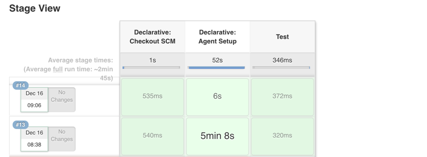

### automation

[https://github.com/arangamani/jenkins_api_client](https://github.com/arangamani/jenkins_api_client) - ruby libraries

[https://jenkins.io/doc/book/managing/cli/](https://jenkins.io/doc/book/managing/cli/) - cli

[https://wiki.jenkins.io/display/JENKINS/Figuring+out+URL+binding+of+Stapler](https://wiki.jenkins.io/display/JENKINS/Figuring+out+URL+binding+of+Stapler) - uri bindings investigation

[https://github.com/kohsuke/jenkins/tree/55203ebeed1b7e182878d3e3c1184ac042f20473/core/src/main/java/hudson/cli](https://github.com/kohsuke/jenkins/tree/55203ebeed1b7e182878d3e3c1184ac042f20473/core/src/main/java/hudson/cli) - cli repos

[http://javadoc.jenkins-ci.org/](http://javadoc.jenkins-ci.org/) - java doc

[https://github.com/jenkinsci/credentials-plugin/blob/master/src/main/java/com/cloudbees/plugins/credentials/cli/UpdateCredentialsByXmlCommand.java](https://github.com/jenkinsci/credentials-plugin/blob/master/src/main/java/com/cloudbees/plugins/credentials/cli/UpdateCredentialsByXmlCommand.java) - update credentials code

{jenkins_server}/cli/ - cli docs

[https://github.com/jenkinsci/job-dsl-plugin/wiki](https://github.com/jenkinsci/job-dsl-plugin/wiki) - example dsl configuartions

[http://unethicalblogger.com/2017/07/24/groovy-automation-for-jenkins.html](http://unethicalblogger.com/2017/07/24/groovy-automation-for-jenkins.html) - groovy jenkins config

[http://www.greenreedtech.com/creating-jenkins-credentials-via-the-rest-api/](http://www.greenreedtech.com/creating-jenkins-credentials-via-the-rest-api/) - example of automating credentials

[http://www.tsbakker.nl/jenkins.html](http://www.tsbakker.nl/jenkins.html) - automation with CLI

[https://github.com/sheehan/job-dsl-gradle-example/tree/master/src/jobs](https://github.com/sheehan/job-dsl-gradle-example/tree/master/src/jobs) automating jobs

#### credentials

[http://www.greenreedtech.com/creating-jenkins-credentials-via-the-rest-api/](http://www.greenreedtech.com/creating-jenkins-credentials-via-the-rest-api/) - create credentials via REST

### Github

[h](https://support.cloudbees.com/hc/en-us/articles/224621668-GitHub-User-Scopes-and-Organization-Permission)[ttps://support.cloudbees.com/hc/en-us/articles/224621668-GitHub-User-Scopes-and-Organization-Permission](https://support.cloudbees.com/hc/en-us/articles/224621668-GitHub-User-Scopes-and-Organization-Permission) - scopes needed

[https://jenkins.io/solutions/github/](https://jenkins.io/solutions/github/) - current integration doc

[https://support.cloudbees.com/hc/en-us/articles/224543927-GitHub-webhook-configuration](https://support.cloudbees.com/hc/en-us/articles/224543927-GitHub-webhook-configuration) - webhooks

## builds

wrapping a process in try/catch will not fail the build on exit 1

## docker runs



only defined step is 'Test'. declarative auto created steps


#### shared pipelines

[https://jenkins.io/blog/2017/10/02/pipeline-templates-with-shared-libraries/](https://jenkins.io/blog/2017/10/02/pipeline-templates-with-shared-libraries/)

#### groovy tricks

[https://github.com/cloudbees/jenkins-scripts](https://github.com/cloudbees/jenkins-scripts)

[https://github.com/tkrzeminski/jenkins-groovy-scripts](https://github.com/tkrzeminski/jenkins-groovy-scripts)

[https://github.com/samrocketman/jenkins-bootstrap-shared/tree/master/scripts](https://github.com/samrocketman/jenkins-bootstrap-shared/tree/master/scripts)

[https://github.com/edx/jenkins-configuration/tree/master/src/main/groovy](https://github.com/edx/jenkins-configuration/tree/master/src/main/groovy)

[https://github.com/docker/jenkins-pipeline-scripts/tree/master/vars](https://github.com/docker/jenkins-pipeline-scripts/tree/master/vars)

[https://github.com/blacklabelops/jenkins/tree/master/groovy](https://github.com/blacklabelops/jenkins/tree/master/groovy)

[http://unethicalblogger.com/2017/07/24/groovy-automation-for-jenkins.html](http://unethicalblogger.com/2017/07/24/groovy-automation-for-jenkins.html)

```groovy
println Jenkins.instance.metaClass.methods*.name.sort().unique()
```

```groovy
Jenkins.instance.getItems().each {it ->
  println it.name
}
Jenkins.instance.getComputers().eachWithIndex{ it, index ->
  println it.name
  println it.description
  println it.getAllExecutors()

  println it.metaClass.methods*.name.sort().unique()
}
println Jenkins.instance.metaClass.methods*.name.sort().unique()
```

#### execute script on slave

[https://stackoverflow.com/questions/26583979/run-a-remote-command-on-all-jenkins-slaves-via-masterss-script-console ](https://github.com/kaltepeter/notes/tree/cfd36b59cb201b8ecf6d88b3f15e467d17968139/h%20ttps:/stackoverflow.com/questions/26583979/run-a-remote-command-on-all-jenkins-slaves-via-masterss-script-console/README.md)

```groovy
import hudson.util.RemotingDiagnostics;

print_ip = 'println InetAddress.localHost.hostAddress';
print_hostname = 'println InetAddress.localHost.canonicalHostName';

// here it is - the shell command, uname as example
uname = 'def proc = "uname -a".execute(); proc.waitFor(); println proc.in.text';

for (slave in hudson.model.Hudson.instance.slaves) {
    println slave.name;
    println RemotingDiagnostics.executeGroovy(print_ip, slave.getChannel());
    println RemotingDiagnostics.executeGroovy(print_hostname, slave.getChannel());
    println RemotingDiagnostics.executeGroovy(uname, slave.getChannel());
}
```

#### get ips of computers

```text
import hudson.model.Computer.ListPossibleNames

Jenkins.instance.getComputers().eachWithIndex{ it, index ->
  println it.name
  if (it.getChannel()) {
      println it.getChannel().call(new ListPossibleNames())
  }
}
```

### execute bash on slave

[https://gist.github.com/hfs/68b2f124d1952233ba49](https://gist.github.com/hfs/68b2f124d1952233ba49)

```text
import hudson.util.RemotingDiagnostics;

script = 'def proc = "ls -1 /home".execute(); proc.waitFor(); println proc.in.text';

for (slave in Jenkins.instance.slaves) {
  println slave.name;
  try {
    println RemotingDiagnostics.executeGroovy(script, slave.getChannel());
  } catch (all) {
    all.printStackTrace();
  }
}
```

```text
def sout = new StringBuilder(), serr = new StringBuilder()
def proc = 'ls /badDir'.execute()
proc.consumeProcessOutput(sout, serr)
proc.waitForOrKill(1000)
println "out> $sout err> $serr"

```

#### list dirs on particular slave

```text
import hudson.util.RemotingDiagnostics;

def workspace = '/home/jenkins/jenkins_slave/workspace/ration_ds1-ui-tests_develop-LYDYDYVNXVUTNVBKZNYKHEE2HAP2OLNY36LSUVBCCMTSPUWGACXQ'
script = "def proc = \'ls -1 ${workspace}\'.execute(); proc.waitFor(); println proc.in.text";

for (slave in Jenkins.instance.slaves) {
    println slave.name;
  if (slave.name == 'us2s-slave-name-0') {
    try {
          println RemotingDiagnostics.executeGroovy(script, slave.getChannel());
    } catch (all) {
        all.printStackTrace();
    }
  }
}
```

### Declarative pipeline

[https://gist.github.com/abayer/925c68132b67254147efd8b86255fd76](https://gist.github.com/abayer/925c68132b67254147efd8b86255fd76)

[https://github.com/jenkinsci/pipeline-examples](https://github.com/jenkinsci/pipeline-examples)

#### Env vars

**Debugging**

```text
sh 'printenv'
```

**environment block**

```text
environment {
            HIPCHAT_NOTIFS = credentials('HIPCHAT_NOTIFS')
            hipchat_room = "${pipelineParams.prNotificationRoom}"
//            https://github.com/jenkinsci/hipchat-plugin/issues/103 single quote hipchat tokens
            hipchat_changes = '${HIPCHAT_CHANGES}'
            JENKINS_TEMPLATES_URL = "git@github.com:MyOrgName/repo-name.git"
        }
```

## kill all jobs and pending

[https://gist.github.com/realityforge/c57eb3d1854320d14252ac881fc6cedf](https://gist.github.com/realityforge/c57eb3d1854320d14252ac881fc6cedf)

kill jobs and pending

```groovy
import jenkins.model.Jenkins

import hudson.model.*

def q = Jenkins.instance.queue

q.items.each { q.cancel(it.task) }


def cancelBuilds(root) {
  for (job in root.items) {
    if (!job.hasProperty('builds')) {
      println "job has no property builds. ${job}"
      cancelBuilds(job)

    } else {
      for (build in job.builds) {
        println "build: ${build}"
//        println build.metaClass.methods*.name.sort().unique()
        //if (build == this.build) { continue; } // don't cancel ourself!
        if (!build.hasProperty('causes')) { continue; }
        if (!build.isBuilding()) { continue; }
        for (cause in build.causes) {
          println('Stopping ' + build.toString());
          build.doStop();
          println(build.toString() + ' stopped.');
          break;
        }
      }
    }
  }
}

cancelBuilds(Jenkins.instance)
```

kill pending

```text
import hudson.model.*

def q = Jenkins.instance.queue

q.items.each { q.cancel(it.task) }
```

## running docker containers with jenkins

[https://jenkins.io/doc/book/pipeline/docker/\#using-multiple-containers](https://jenkins.io/doc/book/pipeline/docker/#using-multiple-containers)

### Multiple containers can be tricky.

If you have a top level agent an override in one stage you will get a different workspace@2 and run into a strange error:

```text
OCI runtime exec failed: exec failed: container_linux.go:296: starting container process caused "chdir to cwd
```

other possible issues: [https://github.com/docker/cli/issues/297](https://github.com/docker/cli/issues/297)

**Before:**

```text
pipeline {
    agent {
        docker { image 'maven:3-alpine' }
    }
    stages {
        stage('Back-end') {
            steps {
                sh 'mvn --version'
            }
        }
        stage('pcf') {
            steps {
                sh 'cf --version'
            }
        }

        stage('Front-end') {
            agent {
                docker { image 'node:7-alpine' }
            }
            steps {
                sh 'node --version'
            }
        }
    }
}
```

**Solution:**

```text
pipeline {
    agent none
    stages {
        stage('Back-end') {
            agent {
                docker { image 'maven:3-alpine' }
            }
            steps {
                sh 'mvn --version'
            }
        }
        stage('pcf') {
            agent {
                docker { image 'maven:3-alpine' }
            }

            steps {
                sh 'cf --version'
            }
        }
        stage('Front-end') {
            agent {
                docker { image 'node:7-alpine' }
            }
            steps {
                sh 'node --version'
            }
        }
    }
}
```

### Vars in docker agent block

[https://issues.jenkins-ci.org/browse/JENKINS-42369](https://issues.jenkins-ci.org/browse/JENKINS-42369)

agent block can't access env.WORKSPACE or $HOME for instance. docker volumes must be an absolute path.

**issue:**

```text
 stage('deploy') {
    agent {
        docker {
            image 'mrllsvc/pcf-tools:3'
            args "-v ${env.WORKSPACE}/:/home/pcf/tools/"
        }
    }
}
```

**workaround 1:**

```text
stage('deploy') {
    agent {
        docker {
            image 'mrllsvc/pcf-tools:3'
            args "-v ${WORKSPACE}/:/home/pcf/tools/"
        }
    }
    parameters {
        string(defaultValue: '/home/jenkins/blah', description: '', name: 'WORKSPACE')
    }
}
```

**Downside**: paramaterized build is not as nice. default is not dynamic

**finding a better solution:**

looking at the logs...

```text
00:53:26 $ docker run -t -d -u 1000:1000 bash cf-cli.sh -d jenkins-templates/deploy-params.json -w /home/vagrant/workspace/lar2-seed_jenkins-migration-ICO5IXAUDRSS4U26C74JGCAJHYXPZRHEECFNHNAA5JEOKVASU73A -v /home/vagrant/workspace/lar2-seed_jenkins-migration-ICO5IXAUDRSS4U26C74JGCAJHYXPZRHEECFNHNAA5JEOKVASU73A:/home/vagrant/workspace/lar2-seed_jenkins-migration-ICO5IXAUDRSS4U26C74JGCAJHYXPZRHEECFNHNAA5JEOKVASU73A:rw,z -v /home/vagrant/workspace/lar2-seed_jenkins-migration-ICO5IXAUDRSS4U26C74JGCAJHYXPZRHEECFNHNAA5JEOKVASU73A@tmp:/home/vagrant/workspace/lar2-seed_jenkins-migration-ICO5IXAUDRSS4U26C74JGCAJHYXPZRHEECFNHNAA5JEOKVASU73A@tmp:rw,z -e ******** -e ******** -e ******** -e ******** -e ******** -e ******** -e ******** -e ******** -e ******** -e ******** -e ******** -e ******** -e ******** -e ******** -e ******** -e ******** -e ******** -e ******** -e ******** -e ******** -e ******** -e ******** -e ******** -e ******** -e ******** -e ******** -e ******** -e ******** -e ******** -e ******** -e ******** -e ******** mrllsvc/pcf-tools:3 cat
00:53:26 $ docker top 966271e9c4bf7663017dda99fda1ed3d271794f51b693a220790cb02b961a0e7 -eo pid,comm
```

jenkins will autocreate and mount the workspace. I do not need to modify the volume or workspace in this case

however... if i need to use a sub dir as base workspace i have an option that supports relative pathing from workspace root

> customWorkspace
>
> A string. Run the Pipeline or individual`stage`this`agent`is applied to within this custom workspace, rather than the default. It can be either a relative path, in which case the custom workspace will be under the workspace root on the node, or an absolute path

this won't solve the above problem since WORKSPACE is created after agent. but will work in other scenarios with other global vars

```text
stage('deploy') {
    agent {
        docker {
            image 'mrllsvc/pcf-tools:3'
            customWorkspace '$MYENVVAR/blah'
        }
    }
}
```

for the other example I can change to the sub directory

```text
stage('deploy') {
    agent {
        docker {
            image 'mrllsvc/pcf-tools:3'
            customWorkspace '$MYENVVAR/blah'
        }
    }

    steps {
        script {
            dir('jenkins-templates') {
                sh 'ls -la'
            }
        }
    }
}
```

**permissions issues**

mounting a volume from the jenkins home can cause permissions issues:

[https://support.cloudbees.com/hc/en-us/articles/218583777-How-to-set-user-in-docker-image-](https://support.cloudbees.com/hc/en-us/articles/218583777-How-to-set-user-in-docker-image-)

[https://github.com/jenkinsci/docker-workflow-plugin/pull/57](https://github.com/jenkinsci/docker-workflow-plugin/pull/57)

[https://github.com/jenkinsci/docker/issues/165](https://github.com/jenkinsci/docker/issues/165)

[https://github.com/jenkinsci/docker\#usage](https://github.com/jenkinsci/docker#usage)

> Avoid using a bind mount from a folder on host into
>
> `/var/jenkins_home`
>
> , as this might result in file permission issue. If you
>
> _really_
>
> need to bind mount jenkins_home, ensure that directory on host is accessible by the jenkins user in container \(jenkins user - uid 1000\) or use
>
> `-u some_other_user`
>
> parameter with
>
> `docker run`

## publish html reports

[https://www.cloudbees.com/blog/publishing-html-reports-pipeline](https://www.cloudbees.com/blog/publishing-html-reports-pipeline)

## pipeline

[https://jenkins.io/doc/pipeline/steps/](https://jenkins.io/doc/pipeline/steps/) - steps reference

[https://github.com/jenkinsci/pipeline-examples/tree/master/pipeline-examples](https://github.com/jenkinsci/pipeline-examples/tree/master/pipeline-examples) - pipeline examples

[https://jenkins.io/pipeline/getting-started-pipelines/](https://jenkins.io/pipeline/getting-started-pipelines/) - getting started guide

### cps/@NonCPS

[https://jenkins.io/blog/2017/02/01/pipeline-scalability-best-practice/](https://jenkins.io/blog/2017/02/01/pipeline-scalability-best-practice/) - guide

https://issues.jenkins-ci.org/browse/JENKINS-45904

Note: When using the @Override chances you will need @NonCPS

#### examples

calling code

```groovy
  def message = Notifications.getSuccessMessage(env, currentBuild, pipelineParams)
  println "mesage from slackSend: ${message}"
//  Message message = new Message(channel: Rooms.NODE_DEFAULT.roomId, text: 'yo3')
  def payload = JsonOutput.toJson(message)
  println payload.dump()
  println payload.toString()

  // method from message class
  @Override
  @NonCPS // added in after example
  String toString() {
    "${getClass().getName()}(${text}, ${attachments}, ${channel}, ${channelName})"
  }
```

before adding @NonCPS to @Override methods

```bash
mesage from slackSend: -2014110711
[Pipeline] echo
<java.lang.String@a6a49095 value=-2014110711 hash=-1499164523>
[Pipeline] echo
-2014110711
[Pipeline] echo
slack send failed: java.lang.Exception: slack send res.ok: json_not_object
```

after adding @NonCPS to @Override methods

```bash
mesage from slackSend: com.mrll.javelin.slack.Message(CICD-417: adding NonCPS to override methods<br>https://issues.jenkins-ci.org/browse/JENKINS-45904<br>An @Override of a method defined in a binary supertype must also be<br>marked @NonCPS. Doc<br>, [], NODE_DEFAULT, )
[Pipeline] echo
<java.lang.String@799ce7f9 value={"attachments":[],"text":"CICD-417: adding NonCPS to override methods<br>https://issues.jenkins-ci.org/browse/JENKINS-45904<br>An @Override of a method defined in a binary supertype must also be<br>marked @NonCPS. Doc<br>","channelName":"","channel":"NODE_DEFAULT"} hash=2040326137>
[Pipeline] echo
{"attachments":[],"text":"CICD-417: adding NonCPS to override methods<br>https://issues.jenkins-ci.org/browse/JENKINS-45904<br>An @Override of a method defined in a binary supertype must also be<br>marked @NonCPS. Doc<br>","channelName":"","channel":"NODE_DEFAULT"}
[Pipeline] echo
slack send failed: java.lang.Exception: slack send res.ok: channel_not_found
```

### parameter types

https://github.com/jenkinsci/pipeline-model-definition-plugin/wiki/Parametrized-pipelines

### generate dsl job

https://devops.datenkollektiv.de/from-plain-groovy-to-jenkins-job-dsl-a-quantum-jump.html

http://engineering.curalate.com/2016/09/29/programmatic-jenkins-jobs.html

https://github.com/SweSri31/JobDsl/blob/b5146c81ce204dec18cb8b898e35994a24d383a8/job-dsl-core/src/test/groovy/javaposse/jobdsl/dsl/DslScriptLoaderSpec.groovy

```groovy
import javaposse.jobdsl.dsl.DslScriptLoader
import javaposse.jobdsl.plugin.JenkinsJobManagement

def jobDslScript = new File('/var/jenkins_home/jobs.groovy')
def workspace = new File('.')

def jobManagement = new JenkinsJobManagement(System.out, [:], workspace)

new DslScriptLoader(jobManagement).runScript(jobDslScript.text)
```

```bash
docker run --detach --volume=$HOME/.gradle:/home/gradle/.gradle -p 5050:5050 ewypych/job-dsl-playground:latest
```

### tuning

#### gc

https://jenkins.io/blog/2016/11/21/gc-tuning/

https://support.cloudbees.com/hc/en-us/articles/229795948-Required-Data-CJP-CJT-Hang-Issue-On-Linux

[https://support.cloudbees.com/hc/en-us/articles/115003461772-IO-Troubleshooting-on-Linux](https://support.cloudbees.com/hc/en-us/articles/115003461772-IO-Troubleshooting-on-Linux)

https://support.cloudbees.com/hc/en-us/articles/115003461772-IO-Troubleshooting-on-Linux

### cloudbees core

https://go.cloudbees.com/docs/cloudbees-core/cloud-intro/

### jenkins x

https://jenkins.io/projects/jenkins-x/

### concurrency

https://jenkins.io/blog/2016/10/16/stage-lock-milestone

### cleanup/backup

recreate jenkins config structure only

```bash
find . -name 'config.xml' -exec cp --parents \{\} ~/temp/jenkinstest \;
```

find string in directory and log it

```bash
grep -R --line-buffered -e 'utils/util' . > findutil.log
```

### hooks

https://issues.jenkins-ci.org/browse/JENKINS-43561

```
Checking pull request #1044
    (not from a trusted source)
      ‘Jenkinsfile’ found
    Met criteria
Scheduled build for branch: PR-1044
```

## cloudbees jenkins book

https://go.cloudbees.com/docs/cloudbees-documentation/cje-user-guide/index.html#nectar-intro

## disk usage

find usage

```bash
find $JENKINS_HOME -mindepth 2 -maxdepth 2 -type d -exec du -hs {} \; > usage.txt
```

bulk delete jobs

make sure to reload from disk or restart after

```bash
seq 0 1 300 | xargs rm -rf {}
```
