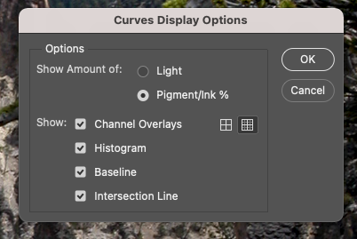

## Curves

1. Move the light to the left (255). Click 'Pigement/Ink %'
1. Use 10% increments for the grid. Click the smaller grid icon.

## Lab Color Adjustment

1. Image > Mode > LAB Color
1. Right click layer, duplicate. Lock original and hide.
1. Layer > New Adjustment Layer > Curves
1. In curves switch to a channel. These are subjective by image, just mirror the channels to cross same center point.
    1. Bring the top grid line one grid line to the left.
    1. Bring the bottom grid line one grid line to the right.
1. Repeat for channel b. Should mirror a channel.
1. Switch to lightness
    1. hover to find your midtones, adjust the curve up/down.
1. Display L channel only in the channels palette.
1. Select the base layer, got to filter > sharpen > unsharp mask
    1. Adjust sharpness, example given: amount 200%, radius 1 px, threshold 10 levels
1. export to RGB or CMYK

## Lab Color

- a channel is magenta-green
- b channel is yellow-blue
- l is lightness
- negative numbers for cool colors
- positive numbers for warm colors
- In RGB and CMYK channels affect both color and contrast
- In LAB L is contrast and a/b are color
- Channels are opponent color channels. When A is light grey it contributes magenta, dark grey is green
- Color channels are gray scale from 0 - 100%. 50% is neither magenta nor green.
- negative numbers have ()

## Settings

- For curves, use 3x3 or 5x5 sample, not point sample. option+click or selection in options bar
- Set the default white endpoint to 97L0A0B and black endpoint to 6L0A0B. (channels auto options)

## Color Correct -> 50% grey

- Find lightest and darkest spot
  - use image > adjustments > threshold. Check preview and move slider until white to find darkest.
