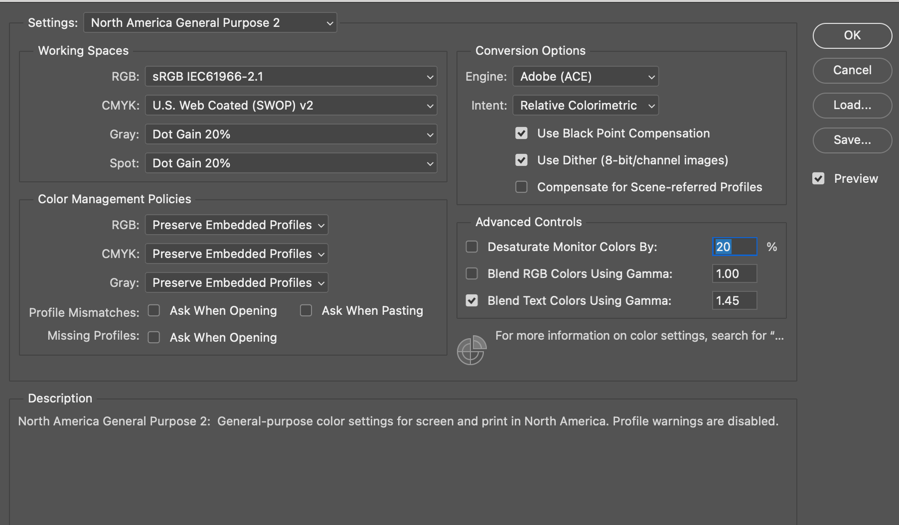
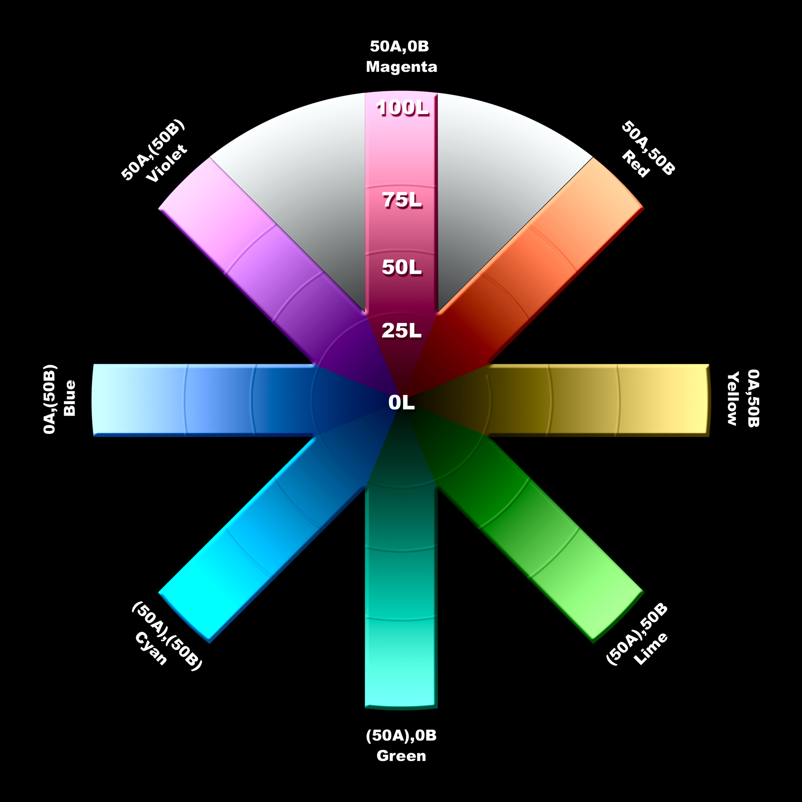
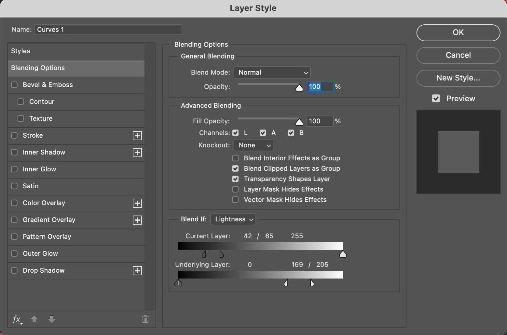
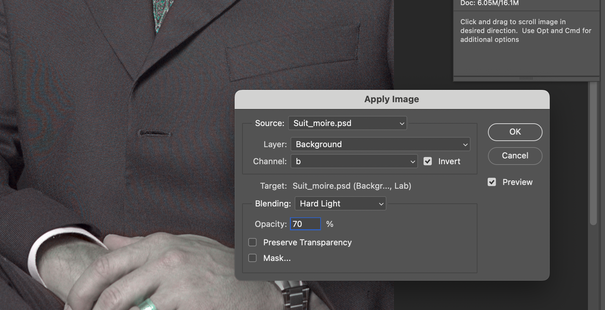
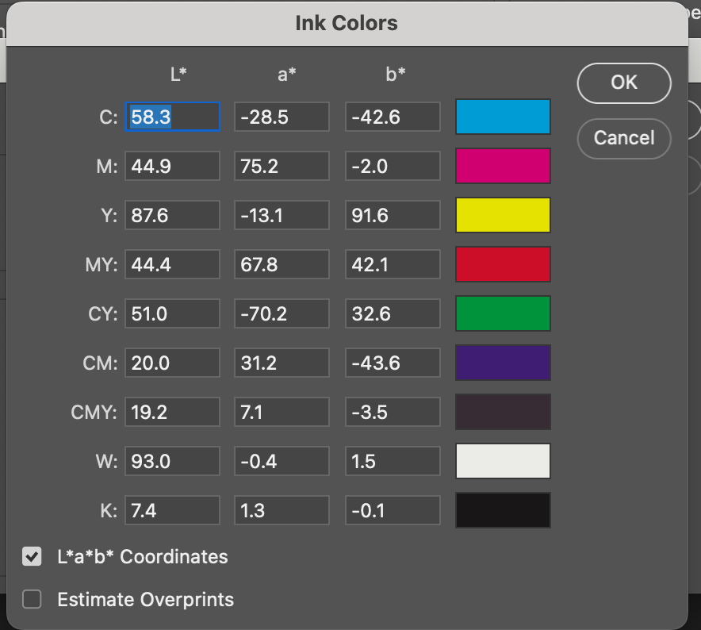

## Curves

1. Move the light to the left (255). Click 'Pigement/Ink %'
1. Use 10% increments for the grid. Click the smaller grid icon.

## Lab Color Adjustment

1. Image > Mode > LAB Color
1. Right click layer, duplicate. Lock original and hide.
1. Layer > New Adjustment Layer > Curves
1. In curves switch to a channel. These are subjective by image, just mirror the channels to cross same center point.
    1. Bring the top grid line one grid line to the left.
    1. Bring the bottom grid line one grid line to the right.
1. Repeat for channel b. Should mirror a channel.
1. Switch to lightness
    1. hover to find your midtones, adjust the curve up/down.
1. Display L channel only in the channels palette.
1. Select the base layer, got to filter > sharpen > unsharp mask
    1. Adjust sharpness, example given: amount 200%, radius 1 px, threshold 10 levels
1. export to RGB or CMYK

## Lab Color

- a channel is magenta-green
- b channel is yellow-blue
- l is lightness
- negative numbers for cool colors
- positive numbers for warm colors
- In RGB and CMYK channels affect both color and contrast
- In LAB L is contrast and a/b are color
- Channels are opponent color channels. When A is light grey it contributes magenta, dark grey is green
- Color channels are gray scale from 0 - 100%. 50% is neither magenta nor green.
- negative numbers have ()
- 0A0B is neutral or gray

## Settings

- For curves, use 3x3 or 5x5 sample, not point sample. option+click or selection in options bar
- Set the default white endpoint to 97L0A0B and black endpoint to 6L0A0B. (channels auto options)
- converting to RGB. Use Edit > Convert to Profile with Dither unchecked.
- converting to CMYK. Use Image > Mode > CMYK
- Double click eye droppers to set white to 97L and black to 6L to work with auto adjustments

## Color Correct -> 50% grey

- Find lightest and darkest spot
  - use image > adjustments > threshold. Check preview and move slider until white to find darkest. On the points that show, open the info panel and hover to see the values.
- Goal is 97L and 6L for dark and light.
- Check gray things for color casts
- decide on shifting to warmer or cooler in areas and use that as a guide
- Perfect gray is 0A0B and negative numbers are green/blue and positive are megenta/yellow

- Stop 1: A and B sharply positive. Defines Red. Human faces are red, espcecially lighter ones. When the B is more positive it is angrier, when A is more positive its sedated. Red roses are more positive A.
- Stop 2: Near zero A, B sharply positiive. Yellow. Big B plus 0 A is blonde hair. A banana has a slightly negative A. 
- Stop 3: Sharply negative A, B sharply positive. Lime. Describes things that grow
- Stop 4: Sharply negative A, B near zero. Green. More like teal. 
- Stop 5: A and B sharply negative. Cyans, not common in nature.
- Stop 6: Near zero A, B sharply negative. Blue. Printing is bad at blue. Prefer a cyanish to purplish one. Most cases slightly negative A. A positive A is royal blue
- Stop 7: sharply positive A, B sharply negative. Violet. Eggplants, grapes, red wine and little lives here.
- Stop 8: sharply positive A, b near zero. Magenta. common in flowers and not much else.

When an image has a cast, you can still stright line curves to accecuate color. The cast can be eliminated by passing through the center point. 

## Sharpen the L, Blur the A/B

- Noise happens in color channels, rarely luminosity
- LAB can be ideal to sharpen the L and Blur the A/B
- Most noise is in the blue/yellow channels in RGB and CMYK or B in LAB
- Use channels panel to select particular channels. Keyboard shortcuts should be Command-<num> where num is the channel number, command~ to select all
- Later PS introduced Filter > Blur > Surface Blur which should be a first choice for blurring A/B channels
- Use surface blur most times, guassian with 3px radius or less can work. Dust and scratches may be necessary.
- L channel can use an alternate method: unsharp mask with high radius and low amount. radius of 7-20px, amount less than 100%. Conventional sharpening emphasizes edges, hiraloam (high radius, low ammout) gives shape
- 1.0 gamma would be a direct middle gray, perception is different. Most RGB spaces vary a bit. Mac uses 1.8, Windows 2.2. sRGB and adobe rgb use 2.2, apple rgb is 1.8.

### Alternatives (not better)

- Edit > Fade > Luminosity after sharpening in RGB
- Safer: duplicate layer, sharpen and switch mode to luminosity

## When to use LAB

- when the colors are muted/close
- Sometimes darkening in CMYK on black channel is better, do that after lab
- Sometimes the L channel can produce a better black and white, convert is better many times. 
- Only in Photoshop
- Don't use 16bit for editing purposed. shoot in 16 
- Convert to RGB -> CMYK when going from LAB to print will yield better results

### Grayscale trick

- start in RGB, in this case the red channel was flat. select it and use image: apply image to replace it with blue
- had a green tinge, modify the green curves to bring out highlights and shadows
- convert to grayscale

## Basic Workflow

1. After converting to LAB, see if the main focus of interest can be isolated in a narrow band in the L channel, if so, steepen that area
1. Decide whether the greys are really grey or if there is a color cast. If so steepen the A and B around the midpoint. If not, move the midpoint left or right.
1. if necessary blur the A and B channels separately and sharpen the L channel

### Mandatory steps, optional steps

1. Imput device, if you have raw and more controls you can start there.
1. arrive in RGB and make changes
1. convert to LAB and make changes
1. convert to destination and make changes.

Step 1 may be out of your control, decide there.
  - get the best you can

Step 2 is often a start
  - decide whether there will be a step 3. 
  - If there will be a LAB step. Create a duplicate layer. Example problem: light near white fluffy clouds, won't adjust well with blue sky in LAB. Fix it here with lightening the quarter tone region of the red channel of the curve. 
  - It that looks good, flatten the image. If not sure or the color is good but not detail, set layer mode to color and move to LAB. 

Step 3 is optional, LAB workflow

Step 4 depends of step 3
  - If goal is CMYK consider sharpening. If mostly one color in image, due that in CMYK, if not, L. 
  - IF step 4 is RGB sharpen in L
  - If step 4 is CMYK and shadow is light do that in CMYK. For RGB either LAB or RGB. 

## Blending Options

Use option key to split sliders.

This was used to bring back warm yellow light on the curves adjustment after removing a yellow cast. It only brings back the yellow in the light source.

## Commands

Equivelent commands: Image: Apply Image, Image: Adjustments > Channel Mixer, Image: Calculations

Curves and other commands aimed at gross changes: work better in acquisiton stage or LAB. Often RGB offers channel-blending opportunities that can reduce devistation, but if somethings really wrong it's the third worst choice. CMYK is worse.

Curves that aim at fine tuning the image: work better in CMYK, RGB is runner up. LAB and acquistion software are blunt instruments.

Curves aimed at brightening, suppressing, enhancing or changling color generally work better in LAB that others.

When we aren't sure what we are trying to get: LAB is flexible and forgiving. Acquisitions allow quick visualizations.

The image: adjustments > Hue/Saturation and close relative Image: Adjustments > Selective color are best at the end. 

Making difficult selections or masks: starts by finding a channel that resemles what you want and working through Image: Calculations to make a copy of it. CMYK is a bad choice. Acquisition moduels have limited options. RGB is a good start and LAB is underrated.

Adjusting a shadow thats too light with little detail: cake in CMYK by darken the shadow half of the black channel. RGB is second best

Any attempt to blur colored noise is best in A/B in LAB. Acquisition modules may be better due to gamma. Camera Raw is 1.0 but not as good as LAB.

Most flexible for sharpening: CMYK. If the image is dominated by a single color it will have two weak channels, black, complimentary. LAB is best, RGB and CMYK can be as good. Acquisition software is a poor choice because they should be done later in the process.

Image: Adjustments > Shadow/Highlights: used to open up dark images, best in LAB.

Channel blending to add contrast or change color works better in RGB than CMYK. Certain powerful blends available in A/B of LAB.

Retouching, using blending and/or painting tools to merge new detail works best in LAB. 

## When to Use LAB

- increase variation in colors
- make certain colors purer
- blur away color noise
- use shadow/highlight command to open detail
- increase contrast in small tonal range
- simplify difficult retouching

## Imposible Colors

### Five Galaxies

- Colors that are valid in both RGB and CMYK. 
- Colors that are possible in either RGB or CMYK but not both. CMYK has difficulty with rich blues and pastels. RGB case is much rarer, like  a solid yellow printed on paper doesn't exist in RGB.
- Colors that exist somewhere but not in RGB or CMYK. A pronounced color that is simutaneously either very light or very dark. e.g. a dark shadow in a green forest, is very dark green but doesn't exist in RGB or CMYK and has to be neutral.
- Colors that are concievable whether they exist or not. Fireworks and lasers have yet to produce a good yellow but seeing the reds, greens and blues let's you imagine them.
- Colors that do not and cannot exist. Something as brillantly green as an exploding firework and as dark as the night sky at the same time. They can exist in LAB.

### Why?

- Imagine printing CMYK, the lightest possible color is the paper at 0C0M0Y. If you try to print the lightest green that requires cyan and yellow which will be darker than the paper. The lightest green is out of CMYK gamut. The same scenaro in RGB, the lights possible is 255R255G255B and turning off some of the red and blue light is already darker. It's out of RGB gamut.
- The most magenta possible in CMYK is 0C100M0Y0K and cannot exist in RGB. It can exist in LAB as 52L81A(7)B. Assuming you have the same color settings.
- LAB color with an A channel of 90+ can't exist in RGB or CMYK. Even though LAB allows up to 127A, we can't get there from CMYK only up to 81A and that is if there is a 52L to go with it. The further L moves away from 52 the closer to zero the A will have to be.
- When converting imaginary colors to RGB and CMYK, photoshop will split the difference and lighten too dark things.

Imaginary colors force Photoshop to move away from neutrality in extremely light areas while simutanesously darkening them; and to move away from neutrality in extremely dark areas while simutaneasouly lightening them.

### Solution

When dealing with imaginary colors and converting to CMYK, go to RGB first and save headache. Then immediately CMYK.

## Color Processes

**Multitone**: a file with every channel based on a common ancestor, which may have been modified by a curve. The channels are related and create a monochromatic effect.

**Duotone**: two colors, which can be any two, typically one is black. Most common the second color is sepiatone, which is brownish, yellowish brown, or coffee colored to produce an antique look.

Printing CMYK is technically a multitone, but that is a distinction that doesn't matter. Traditional sepiatones used special ink and a press and is expensive.

To make a good duotone, you need a quality black and white to start with or it will look flat.

## Downloading Pantone

Adobe removed Pantone in 2022. See https://helpx.adobe.com/creative-suite/kb/new-pantone-plus-digital-libraries.html and https://exchange.adobe.com/apps/cc/103029

## Creating a Duotone

- Start with a quality grayscale image
- Image: Mode > Duotone
- Click the curve and navigate/load to a duotone presets folder. Choose a pantone (e.g. PMS 159) or similar.  Curve 1 is also richest, curve 4 is closest to black and 2 and 3 are in the middle. 
- (alt) Click the color box and load libraries with presets (alt without pantone) or use color picker and the LAB values and adjust the curve manually

### Using Lab to Duotone 45A61B

1. Start in LAB with a black and white
1. Add a color fill layer, select the color
1. Change layer mode to color
1. drop opacity to around 25%

**Note:** color mode is most useful outside of lab because it emulates lab splitting luminosity from color. The luminosity comes from bottom and color from top. 

Avoid this techinique because it produces imaginary colors. Use the Duotone technique instead.

## Pantone (PMS)

In order to match the system, they use LAB to supply numbers. Photoshop only has one LAB space, CMYK and RGB have several. Cannot produce imaginary colors, since they are designed for ink (specialized). Converting to CMYK can produce out of gamut without specialized ink. They can create vivid blue.

To find the LAB color of PMS colors:

1. open the color picker
1. click color libraries
1. select a pantaone 
1. LAB values are shown in the picker

## Fixing blown out highlights

e.g. highlight on light skin cheek with high reflection.

1. In RGB, Select a color that represents the sking tone, not too close to the blown out aread
1. Make a selection to adjust
1. add a solid color layer over selection, set mode to color
1. Mvoe to LAB without flattening
1. Flatten before leaving LAB
1. move to CMYK or RGB, photoshop will split the difference and fix the color

## Fixing a blown out sky and bumping up green

e.g. a tourist photo with lots of green, mountains and a hazy blown out sky. LAB is good for cumping up greenery and fixing blown out areas. There is equal white in the bottom half of the picture that we don't want to affect. The example is neutrally correct, except for the sky lacking blue.

**NOTE:** Most times skilled retouchers avoid specifics until the global corrections are done, imaginary colors like adding blue to a sky is best done before globals for better blending.

1. LAB mode, duplicate layer
1. Apply a curve to it to add the blue 
1. apply a mask by Layer: Add layer mask > reval all (or hide all)
1. use the selection tool to split the areas that need blue
1. select > feather to create a soft edge
1. use layer blending options to further restrict the blue. In the lightness channel restrict the darkness for the bottom layer, split the slider for a smooth transition. In the B channel, split the sliders and restrict top layer areas that were previously more blue than yellow for the underlying layer. 
1. if printing transition to RGB than CMYK. The command proof color fails with imaginary colors and this will smooth

**NOTE:** a curve adjustment layer provides a mask and feather options 

## Selections

### Magic Wand

Straight forward for high contrast.

### Select Color Range

### Lasso and Pen Tool

### Blending Options

### Quick Mask

### Single Channel Selection

1. Adjust the LAB channels as needed
1. Select the luminosity channel and add as mask

### RGB

1. Image: Adjustments > Calculate. Apply the strong channel to itself in hard light mode

### Shadow/Highlights

1. Apply shadow/highlights to L channel
1. Follow with LAB curves for more vivid colors, remove cast
1. Use blending options to exclude color ranges

### Working with selections masks

1. make a selection
1. select: save selection

### Loading a layer mask

1. select a mask layer
1. image: apply image and choose channel
1. Image: Levels > Auto levels (option)
1. apply a steep curve to a fresh copy of B

### Blurring

Masking requires mild blurrying. Usually 3px or less guassian blur.

### Remove a color cast when iamge has two casts

1. Open the image, duplicate it.
1. In new image go to: Image: mode > LAB
1. Select the B channel and go to selection: save selection
1. select original CMYK image and new layer, add a name and click ok
1. Select the copied B channel and blur, auto levels. Adjust levels more if needed.
1. Create a mask from the inverted selection
1. In the original CMYK load selection
1. flatten
1. add a hue/saturation layer and drop saturation to -50

## Change the color of a main focal point

1. In LAB select the channel you want to change
1. Invert the channel e.g. red -> green

### More Complex

1. Decide on the color to use. Pantone woul be common. Select the point to move using the color sampler tool.
1. Establish a new layer and apply curves in the new color. Or a curves adjustment layer. Drive curves until the read out matches the color you want.
1. figure out a way to restore colors that shouldn't change. Blending options is good. Layer mask also works.

### Saving a blending mode mask

1. make a flattened copy of the original and the one with blending options
1. convert both to RGB and apply one in difference mode. This creates black where the two are identical.
1. convert to grayscale or steal an RGB channel and save as a mask

Changing colors that are not oppostite may require inverting both A and B and flattening them.

Making colors more vibrant is hard. One technique to apply the stronger channel to the other on a copy. Teal -> Yellow would apply A to B before curves. When you have a curve on top and copy in the middle. The blending mode can be adjusted on the curves for L and stronger channel and the stronger channel on the middle layer.

## Retouching

### Rainbows

Rainbows are a good candidate. Cameras don't see the color the way we do.

1. Adjustment Layer > curves
1. Apply curves in the A/B to bring out color
1. In the layer mask fill with black
1. use a soft tool, 10% opacity and paint the rainbow

### Removing object/color

e.g. removing a timestamp

1. duplicate layer
1. select a rectangle area next to the replacement area and copy to clipboard
1. paste the rectangle on top the damaged area
1. use blending options to hide/show
1. use the l channel on the duplicate layer to rebuild texture with tools like stamp or selections
1. change top layer to color only

If you can't establish a credible patch. Patch A first, then L. Than patch A/B together. This is because errors show up in A first.

### Photo Restoration

e.g. Damaged old sepiatone/black and white photo with lots of scratches

1. open a new LAB copy of the original
1. select the B channel, save selection as a new file
1. apply auto levels
1. invert to a negative
1. add a gaussian, 4px, to soften scratches
1. Edit: fade > lighten to prevent the blur from darkening areas of the mask for damaged areas, while allowing to expand slightly in undamaged areas. Note new photoshop has fade guassian blue instead. I did that with lighten mode at 100%
1. in the original selection: load selection, select the new file
1. Use the rubber stamp tool, select areas that are correct and paint in the selection
1. when done CMYK is likely best to continue, the black channel shows more.

### Adding color to blown out areas

RGB/CMYK would darken light areas

1. Use the brush in color mode

### desaturate/saturate

e.g. towers with bricks too red and not enough yellow. 

When using the burn/dodge in A or B channels set the tool to affect midtones since the A/B channels neutral is 50% gray.

Exposure should be low, like 10%

1. duplicate layer
1. start with the sponge in the a channel
1. when satisfied, select the B while leaving the composite visible
1. image > apply, the target is the b layer since that is all that is active
1. set the layer to the original and channel to b, play with opacity until correct
1. 

You would have to be careful with green with the above approach.

1. duplicate the original layer
1. use the burn tool with midtone selected in the A channel (or dodge, or B channel, depending on image)
1. once happy use layer blending
1. duplicate layer, use sponge on the gilded towers
1. use layer blending to cleanup edges and sky

### Eliminate Moiré

This happens with scanned print images. Magenta is more important than cyan which is more important than yellow. 

1. duplicate layer
1. save the original a channel as an alpha
1. Blur A/B
1. apply curve to l
1. move to alpha channel (copy of original a) and apply curves to create high contrast. Apply in Lighten mode to the L channel. Paint blown out areas as needed.
1. Adjust L with curves 
1. On the L filter > unsharp mask. e.g. 75% amount, 45 radius, 12 threshold
1. 

### Interference

Happens when two regular patterns overlap. Then it becomes moiré. Scanning can pick this up.

Why?

In commercial printing the cyan is angled at 15º from the vertical and also 105º customarily. Magenta is usually at 75º. The two are 60º or 30º apart and don't moiré against each other or the black, which is at 45º. All 30º possibilities are now exhausted. The yellow is wedged in at some other angle, usually 0º.    

To solve in scanning:

Best results happen when the pattern is 30º relatvie to the scan. This can happen with digital cameras too.

1. Place image at 45º which is 30º away from the cyan and magenta angles. 

To fix in photoshop:

1. Select the object and save as a selection
1. Blur the pattern in A/B channels on duplicate layer with the selection
1. Choose a channel, B in the example to apply image with a mode that ignores 50% gray. i.e. overlay, soft light, hard light. and set opacity. Also invert if needed.

## Command Clicking

When to use command clicking vs. straight line basic recipe. If all objects are equal use a straight line. If there are objects that are important and you need to drive them apart use command click.

### Man from Mars Recipe

take a flat image and apply color without understanding LAB. 

**NOTE**: in newer photoshop command + click didn't seem to work, there is a drag to modify curve icon that will allow you to just click

1. New Layer > Adjustment Layer > curves. 
1. Command + Click the image (craete pivot point) an area that is typical of the flat color your trying to affect.
1. drag the lower left point of the L curve to the right, half way between the start and the pivot point.
1. In the A command + click the image to create another pivot point
1. move lower part of a until the top half snaps into a straight line
1. repeat the previous two steps on the B channel
1. reduce top layer opacity to tast

### Color Correcting with Pivot Points

e.g. product image with white background

e.g. a blue jacket that is too dull/purple and missing distinction between shoulder color block on pure white background, the lining should also remain neutral

1. command click the neutral, the main color and the color block (three points) in the B channel (blue/yellow)
1. adjust curves. e.g. raise top, lower middle and leave bottom
1. move to A. Uses a similar three point approach
1. L doesn't have this approach, lower the quartertone to increase contrast
1. to make sure to keep background white, use blending options to hide anything pure white in under layer

**TIPS**:

1. Use a duplicate layer and use opacity if too much
1. In particular when points are close together, only move up/down, using arrow keys can help
1. Start with the most critical color channel.
1. Take advantage of showing the grid at a larger size, normally a waste

## Universal Interchange Standard

**Color Model**: overall framework, for example CMYK vs. RGB
**Color Space**: variants within the color model, for example sRGB vs. ColorMatch RGB

LAB is both a color model and color space in Photoshop, 1 variant only.

Determining references needs three points, SWOP gives this with tollerances:

- whether they are the same color
- whether they reflect the proper light when printed solid
- whether the relationship between 50% and solid, called dot gain

**Specifications for Web Offset Publications (SWOP)**: Ink control.

View photoshop seetings: Edit: Color Settings > Working Spaces > CMYK > Custom CMYK > Ink Colors > Custom. Default is XYZ, can check box for LAB. This dialog can be used to convert color spaces with control.

Color space for LAB with perpetual uniformity: CIEL*a*b. LAB is more perpetually uniform than XYZ but not perfect.

### Recipe: Print High Res CMYK proof with two spot colors

1. Go to the high res image, select the first spot color with Select all > Copy
1. Open a new doc that by default matches the clipboard (graysacle and size). Paste. Layer > Flatten Image
1. Image > Mode > Duotone, select Monotone. Double click the color icon and choose the Pantone
1. Image > Mode > LAB
1. Repeat the process with the other spot color in a new document. You now have two documents of the same size. 
1. Paste one as a layer on the other and choose multiply
1. Convert to CMYK with flatten.

### Printers

Not exact. A printer that doesn't comply with the exact spec for a yellow dot gain may be better than one who complies fully. In print, Black is more important than magenta, cyan is less important than that, followed by yellow. In RGB, green is more important than red, than the blue.

**Delta E (dE)**: a single number from a complex formula to represent the difference in color measured with machines. A dE of 0 is ideal. Opinions of dE importance vary, the answer is in the middle. 

Matching press to home for proofing is a challenge. People will get press swatches printed and compare at home to match.

Challenges:

- Humans expects greens to be greener than machines, so a greener result makes the human think its a closer match. 
- how far off a color channel appears off depends on others, this is lost on spectrometers
- age of a spectrometer doesn't affect readigns, but age of human eye does

[CIE](https://cie.co.at/)

PDFs for explanations of color theory:

- [Graphics for Color Science](../pdf/ciegraph17052004.pdf)
- [CIELab Color Space](../pdf/cielab03022003.pdf)
- [CIE Color Space](../pdf/ciexyz29082000.pdf)
- [CMYK Gamuts in CieLab](../pdf/cmykgamut23042003.pdf)
- [The Gamma Question](../pdf/gamquest18102001.pdf)
- [Gamuts](../pdf/gamuts08072002.pdf)

### Pantone matching

Pantone requires special inks that can't be matched with standard inks. The ask is to emulate for proofs. 

The workaround was a set of CMYK equivelents that some applications supplied and some still do.

The challenges included paper source mismatches and RGB printers for desktop. Pantone responded by making real equivelents with LAB in Photoshop 7. Now CMYK and RGB are computed from LAB. Unless you have a printed pantone swatchbook it's hard to know what's right.

### Conversion Issues

- Colors that can't be matched simply can't be matched
- Relative colormetric is the default in later Photoshop when converting a profile and takes the assumption to match all it can and ignore the unmatchable. This is a good default stance.
- Hand off in LAB to avoid mistakes and assumptions by printers of what RGB/CMYK colorspace is used

### RGB spaces

sRGB was made popular by HP and Microsoft in the 90s with commercial success. It's most prominant and less colorful. Most consumer devices use this and many commerical providers assume this one.
Adobe RGB is a wider gamut color space and more colorful, preferred by photographers.

Prefer to handoff in LAB. Second would by CMYK you convert. Third would be sRGB.

LAB is safest and people may have questions.

CMYK is where more printers go.

sRGB is the most expected.

curvemeister is a windows only photoshop plugin that intreprets LAB values from RGB.

LinoColor is a narrow gamut LAB offered by another program.

## Once for Color, Once for Contrast

HSB can be nearly drop in for LAB.

Theory: find the lightest and darkest parts of the image and spread them apart. Curves are the usual option. The steeper the curve the more contrast. Objects in steep areas gain contrast, those in flat areas loose out. 

Many people and tools define adding contrast as adding midtone contrast at the expense of light and dark. Photoshops Adjustments: Brightness and Contrast is one command that does this.

An S curve is how contrast is often applied. This only works for images that need contrast in the midrange. A black or white cat is no good but a gray cat would work well.

A quartway up is called quartertone, and three quarters up is three quarter tone. These create S curves. 

In most the book we S curved the L channel, this is more common in LAB.

If you work with an image with very bright colors, the L channel is where to add contrast. Dull colors is RGB. 

### Averages

When converting to LAB from RGB, Photoshop creates the L channel out of weighted averages. Typically 60% to Green, 30% to Red and 10% to Blue.

Starting in RGB is correcting now and averaging later. Starting in LAB is averaging now and correcting later. This is why LAB L channel likes and S curve.

### Processing a dull blue color range

e.g. dull ocean blending with the sky, the sky and ocean need to be separated.

1. Start in RGB
1. Adjust the curves of each channel. Don't worry that colors are wrong, they will be separated out. Focus on contrast.
1. If you didn't want to leave RGB, use a separate adjustment layer set to luminosity
1. For better color variation convert to LAB. With both original and this one open in LAB, select the L and Image: Apply Image using the L in normal mode at 100% opacity. 
1. sharpen with high radius and low amount due to no hard edges
1. Use A/B curves to break the water/sky apart using the control + click method

### Processing a cast in RGB then going to LAB

e.g. an image with a yellow cast in the light clouds, cast that varies as the iamge gets darker (not good for LAB)

1. Convert to RGB and kill the cast with curves
1. Clouds should be neutral in the light part and gradually take on color of the sky as they darken
1. Image: Adjustments > Channel Mixer (to make green pop). Create a new green channel with more than 100% green and the same amount more negative in the blue. e.g. 130% green, -30% blue.
1. Convert to LAB, adjust the L for contrast. Bump the A/B as needed

### Which Channel to Use?

- In normally lit photos with skintones, the green is usually best
- In areas with greenery, the blue channel is the worst. We don't know which is better of the remaining two but the rest is a large difference.
- A powerful sky is usually best in the red.

### Using the red to beef up a sky

e.g. dull sky with building

1. duplicate layer
1. Image: Apply Image, use the red channel as source, blending mode darken
1. change layer mode to luminosity, restoring original blue
1. If color quality is critical, convert to LAB without flatteing, blues will be out of gamut

### Combining techniques

e.g. canyone with sky

1. duplicate layer
1. Image: Apply Image, use the green channel as source, blending mode darken, this fixes the canyon, sky is worse
1. change layer mode to luminosity
1. duplicate top layer
1. Image: Apply Image, use the red channel as source, blending mode darken, this fixes the sky. make sure to specify the source is the bottom layer
1. change layer mode to luminosity
1. sky wasn't dark enough, duplicate third layer and apply red again from the merged layers in darken, set transparency to 50%
1. conert to LAB without flattening
1. apply curves in each A/B with command + click method

### Better color through gray

gray balance is used in printing to control process. perfect neutral gray is harder in LAB/RGB and impossible in CMYK. If red is too dark the cast is blue/green. If green is too dark it's a purple cast. Overwieght blue is yellow.

e.g. colorful image of a priest with a yellow cast. Blue is too dark, blend another channel into it. Blending green into blue is usually best to remove yellow. Because the priest is wearing green this won't work. 

1. Create a duplicate layer
1. Image: Apply Image. Blend red into blue, 32% opacity picked out of a hat, with lighten mode.
1. Normally you would set layer blending mode to color, not here
1. Make a third layer, duplicating the second and apply the blue channel, with merged layers. 
1. set the layer to luminosity with 60% opacity
1. Flatten the image only after conversion
1. Apply LAB curves

### FInal Advice

1. When opening RGB, check channels to see if blending is indicated
1. If you decide to work on color in RGB, just eliminate the impossible, LAB can do far more with color
1. A picture's full potential is color and contrast. Keep them separate in your mind.

## Blending with the A and B

A/B channels can't be black and white. Neutral is 50% gray. 

Using Image: Apply Image on the L channel with overlay mode of varying opacity can change lighting and bring elements up. This works because in A/B neutral is 50% at 0A nad 0B and 50% is ignored, anything lighter than is blended, anything darker then is blended. 

B has more decisive color breaks than A. Anything more blue is B negative, darker than 50% for overlay. Anything more yellow is lighter in overlay. When B is applied to L color doesn't change but darkness does. Checking invert reverses effect.

Other modes:

- vivid light, linear light, pin light are useless with this
- hard light and overlay are identical on the A/B themselves but not when applying on the L. Hard light extracts extra detail from the highlights and shadows.
- soft light has less of an impact than overlay. It slightly favors darkening. Increases intensity of warm colors, it accentuates cool colors more.

You can apply the entire image to bump colors in overlay mode and than adjust the L by replacing the L with the original L.

When applying A/B in overlay make sure to duplicate layer and select the L channel.

Overlaying the A and B onto themselves is a boost to color.

### Selective Lighting

Whenever a picture is taken with the sun behind Image: Adjustments > Highlight/Shadow will do. This is different for partial shadows.

e.g. bow hunter with dark partial shadows on face and leaves

1. duplicate layer, apply b to L in overlay 100%
1. duplicate original layer, apply a to L in overlay 100% (bump color)
1. set layer mode to overlay at 30% for top layer 

### Separating Greens

e.g. waterfall in the deep forest, too dark and too light at the same time, dull/inconsistent greens

1. duplicate layer, blend B into L, overlay 100%
1. Repeat the move at 50% opacity to bump up more
1. overlay the A onto itself at 100% opacity to bump color
1. overlay the B to B at 80% opacity
1. apply the L to itself in overlay mode at 35%

**NOTE**: curves can likely do a better job than overlaying L on itself. Combining techniques might make most sense.

## Faces are like Canyons

e.g. RGB file of face with normal lighting

Basic Recipe for fleshtones on cruise control

Before continuing check for any color casts and correct in RGB before continuing.

1. Create a duplicate layer. To it, apply the green channel, which turns the top layer into a grayscale since all three channels are now identical. Change the layer mode to luminosity. (possible alternate: if the face is excessively dark or light examine the red and blue channels as alternatives to the green). **NOTE**: if the original image had any dark red or purples, use layer blending options to exclude them, by bringing the left hand blend if slider for green, underlying layer, to the right until they dissappear. 
1. Convert to LAB and flatten the image. Use Edit: Convert to Profile rather than mode change. When the layers iclude only normal, luminosity and color, let LAB handle the flatten. Uncheck dither and flatten iamage. Flatten after LAB.
1. Create a duplicate layer. Apply the A channel to itself in overlay mode, 100% opacity. Then do the same with the B. (Possible variation: in individuals with lighter or darker than average complexions, consider decreasing the percentage of the A and B overlay respectively)
1. Lower the opacity of the new layer to taste. After doing so, consider applying a contrast-enhancing curve to the L channel, knowing that the impact will be reduced by lower opacity.
1. After sharpening the L channel (usally in hiraloam mode;) Unless you are storing the image in LAB, flatten and convert to RGB or CMYK. **NOTE**: If the final destination is CMYK, be conservative with the L sharpen. Sharpening the black of CMYK ordinarily works well with face shots. Do hiraloam in LAB and sharpen only black in CMYK. This is because skin typically has no detail in black.

e.g. blonde woman with blue eyes, pale skin, red lipstick

For step 1, the lips are too red. To restore apply the blue channel in lighten mode 100% to the original image luminosity layer to fix. This is easier than blending options.

For the A/B overlays, light skin usually means higher percentage B. A is 80% and B is 100%

Hiraloam (High radius, low ammount) sharpening adds depth to the face. To restrict most of the sharpening to the darker areas (away from flesh), load an inverted luminosity mask, and only sharpen the L channel. Use Filter: Sharpen > Unsharp Mask with amount 500%, radius 1.0, threshold 0. We are still on a layer at only 70%. Increased threshold to 8 to avoid noise in the neck. Deselect the mask and leave only the L channel open. Proceed to the Hiraloam step. 

The key to hiraloam is getting the radius right. Set the amount rediculously high and watch the effect of the radius. Final amount 55%, radius 27, threshold 8.

e.g. Asian young woman

Equal A/B overlays.

e.g. African American Man

yellow tones are objectionable. reverse the overlay ration. 100% A, 75% B

e.g. Young girl in bright flowers with uneven light

The recipe works for normal lighting, this is not.

1. 
