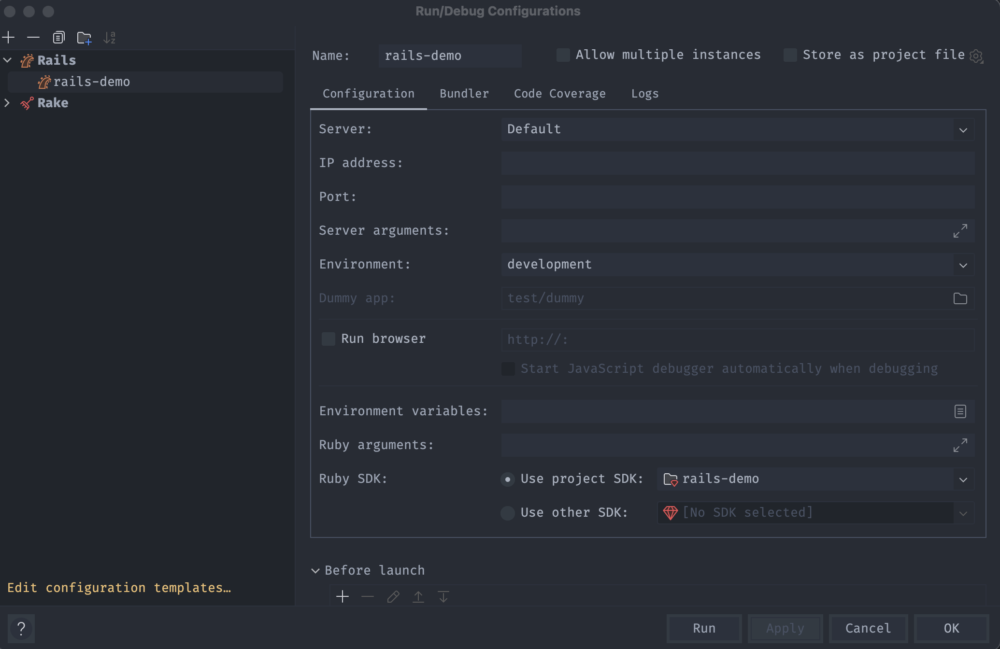

## New App

- [Suspenders](https://github.com/thoughtbot/suspenders/tree/main) - thoughbot default settings and libraries


## Active Record

- Scope vs class method, similar, pick one.

### Belongs to

- `Person.all.joins(:role)` does a sql inner join on roles by the foreign key.

- The join table is available for the query but not returned to the results.

- `.where(roles: {billable: true})` filters by the field billable.

example class method to support where clause:

```ruby
class Role < ActiveRecord::Base
  def self.billable
    where(billable: true)
  end
end
```

- `Person.all.joins(:role).merge(Role.billable)` same as earlier using class method.

### Has many

- `Location.joins(people: :role)` inner join on people and roles, like on the fly has many through

- `distinct` selects unique. order by has to be in the select and has to be distinct.

- `Location.from(Location.billable, :locations)` wraps in a subquery.

### N+1

- Typically database client issue.
- https://github.com/MiniProfiler/rack-mini-profiler
- https://github.com/flyerhzm/bullet
- gem called bullet catches most, not all
- https://github.com/evrone/quiet_assets cuts noise down
- logging is useful

`tail -f log/development.log | grep SELECT` view db selects

`includes` is eagar loading which can decrease n+1, if you know you need relations.

- Polymorphic has to use `preload` polymorphic associations. Won't work if you need to use the join table in the query.

- Includes works for non-polymorphic and if you have to do something with the stuff.

- can introduce bloat

## Autoloading and reloading constants

<https://guides.rubyonrails.org/v5.2/autoloading_and_reloading_constants.html>

Errors such as:

```bash

```

## Factory Bot

- <https://semaphoreci.com/community/tutorials/working-effectively-with-data-factories-using-factorygirl#introduction-to-factorybot>
- <https://github.com/thoughtbot/factory_bot/blob/master/GETTING_STARTED.md#best-practices>

## Service Objects

<https://www.toptal.com/ruby-on-rails/rails-service-objects-tutorial>

## Reset the DB

Typically easy as `bundle exec rails db:reset` which will run `db:drop` and `db:setup`.

`db:setup` runs `db:create`, `db:schema:load`, `db:seed`

Or `bundle exec rails db:migrate:reset` which is `db:drop`, `db:create`, `db:migrate`

### Issues

- Older versions of postgres require all connections closed to do a full reset.
- Newer versions of postgres will allow you to force with active connections but you must pass that in.

### Workarounds

- Kill all active connections, this can get annoying or difficult in a live env.
- Pass the force option if supported.
- Run `model_name.destroy_all` instead. (will not reset auto ids). Run truncate to reset auto ids.

## Fake Data

- <https://github.com/faker-ruby/faker#usage>
- <https://pganalyze.com/blog/fastest-way-importing-data-into-postgres-with-ruby-rails>

### Performance

- <https://www.cloudbees.com/blog/speeding-up-bulk-imports-in-rails>

1. Use background workers if possible i.e. sidekiq

### Approaches

1. Seed data. Meant for data that is required and consistent.
1. Scrub production data for [sensitive information](https://thoughtbot.com/blog/anonymizing-user-company-and-location-data-using).
1. Generate fake data. This can be improved to mimic production with statistics and code.

## Getting statistics on existing data

- <https://work.stevegrossi.com/2015/04/25/how-to-count-with-activerecord/>

### Counts

- Use sql count. `Post.all.count` will perform a sql count on the posts table. i.e. `SELECT COUNT(*) FROM "posts"`

- `Post.all.to_a.count` will perform a full select and than count. Prefer the first method for performance.

- `Post.all.length` is similar to a `to_a` count, but faster

- `Post.all.size` will negotiate the fastest lookup, considering counter caches, etc. **This should be preferred.**

- `.group(:type).count` will group and count by the type field

- `.group(:type).count.pluck(1)` will group and count by the type field and return just the numberic counts

### Stats

## Queries

`Model.order(Arel.sql('RANDOM()')).first` will select the first random record in rails 6+

### any?, empty?

- Both will efficiently decide how to check.
- Mostly opposite with caveats.
- `any?` has to check each element
- `[false].empty?` is `false` because it contains an element
- `[false].any?` is `false` because nothing is `true`

## Dynamic constants

Getting the model from a table name of 'users'

- `:users.to_s` -> `"users"` simple string conversion
- `:users.to_s.classify` -> `"User"`, used to get the model from a symbol
- `:users.to_s.classify.constantize` -> ` User(...)` returns the model as a symbol
- `safe_constantize` will return nil if the model doesn't exist instead of an error

Getting association information

- `Author.reflect_on_association(:books).klass` returns the class/model of the association books

## Rake

- <https://www.lynnbright.com/6-tips-to-ensure-your-rake-task-runs-smoothly/>

### Passing arguments to a rake task

```ruby
namespace :db do
  namespace :delete do
    desc "Reset data..."
    task :reset_data, [:truncate] => :environment do |_t, args|
      # do stuff
    end
  end
end
```

```bash
unsetopt nomatch # for zsh to avoid errors with non string args
bundle exec rails db:delete:reset_data[true]
bundle exec rails 'db:delete:reset_data[true]' # will pass 'true' as string always and works with bash/zsh
```

### Logs and timing

The utils will allow you to wrap a section with a message and collect timings. It also configures logging to stdout.

```ruby
module FakeDataUtil
  def wrap_with_log(log_prefix, message)
    start_at = Time.zone.now
    @logger.info "[#{log_prefix}] #{message}"
    yield
    end_at = Time.zone.now
    duration = (end_at - start_at).to_i
    @logger.info "[#{log_prefix}] completed in #{duration}s"
  end
end

@logger = Logger.new(STDOUT, datetime_format: '%H:%M:%S')
desc 'Wait for transactions to create...'
task :wait_for_create_transactions => :environment do |_t|
    include FakeDataUtil
    @logger.progname = "[#{_t.to_s}]"
    @logger.info "START"
    wrap_with_log 'db:transactions', "Waiting for job to complete..." do
    # do stuff
    end
    @logger.info "END"
end
```

### Limit to envs

```ruby
raise 'You cannot run this in production' if Rails.env.production?
raise 'You cannot run this in test, use the factories instead' if Rails.env.test?
```

## Modules and loading

- <https://juzer-shakir.medium.com/accessing-module-in-root-in-ruby-8eb46dbb38e1>
- <https://blog.arkency.com/2014/11/dont-forget-about-eager-load-when-extending-autoload/>
- <https://guides.rubyonrails.org/v5.2/autoloading_and_reloading_constants.html>

```ruby
# workers/fake_data.rb
module FakeData
  extend FakeDataUtil

  def self.get_top_seniorities
#   do stuff
  end
end

# apps/utils/fake_data_util.rb
module FakeDataUtil
  def wrap_with_log(log_prefix, message)
  end
end

# workers/fake_data/insert_companies_worker.rb
module FakeData
  class InsertCompaniesWorker
    include Sidekiq::Worker
    include FakeDataUtil

    wrap_with_log ':db:companies', "Creating #{total_companies} companies" do
      FakeData::get_top_seniorities
    end
  end
end
```

### Errors

`WARN: LoadError: Unable to autoload constant`

- <https://stackoverflow.com/questions/64548442/unable-to-autoload-constant-bug-in-rails-5-2-0/64601195#64601195>
- <https://www.bigbinary.com/blog/rails-5-disables-autoloading-after-booting-the-app-in-production>

- If you have multiple files in a module (nested), add an empty module that matches the folder name.
- Rails 5.2 needs to define every module explicitly
- Autoloading is not thread safe, be careful in things like workers.

## Sidekiq

- <https://dev.to/appaloosastore/active-record-sidekiq-pools-and-threads-18d5>
- <https://devcenter.heroku.com/articles/concurrency-and-database-connections>
- <https://github.com/sidekiq/sidekiq/wiki/Advanced-Options#concurrency>
- <https://developer.workarea.com/articles/workers.html>

```ruby
@connection_pool_concurrency = ENV['RAILS_MAX_THREADS'] || 10
sidekiq_options :queue => :add_fake_data,
                :retry => 1,
                :concurrency => @connection_pool_concurrency,
                :fetch => :eager
```

`:fetch => :eager` solves module loading issues, since they are not thread safe.
`concurrency` sets number of threads for a worker, make sure you account for the db pool size.

### Errors

```bash
could not obtain a connection from the pool within 5.000 seconds (waited 5.002 seconds); all pooled connections were in use (ActiveRecord::ConnectionTimeoutError)
```

- Default sidekiq workers have 10 threads
- Connection pool should be equal to number of threads
- Active record connections clear after a default timeout which is much longer than 5 sec. Clearing the connections in workers may be a good idea.

```ruby
ActiveRecord::Base.clear_active_connections!
```

Setting active record pool:

```ruby
pool: <%= ENV["DB_POOL"] || ENV['RAILS_MAX_THREADS'] || 5 %>
```

check connections `bundle exec rails dbconsole`

```sql
select count(*) from pg_stat_activity where pid <> pg_backend_pid() and usename = current_user;
```

## Routing

<https://guides.rubyonrails.org/routing.html>

`resource` vs. `resources` is acting on one record vs many.

`resource` skips the index route and usually skips passing ids through.

## Active Record

### Finding

- <https://www.rubyguides.com/2019/07/rails-where-method/>

- `find_by`, `find_by_<key>` returns a single record or nil
- `where` returns `ActiveRecord::Relation`
- `find` a single record found by primary key, raise an exception if not found

### Scopes

- <https://www.sitepoint.com/dynamically-chain-scopes-to-clean-up-large-sql-queries/>
- <https://guides.rubyonrails.org/active_record_querying.html#scopes>

A scope is a way to add custom lookups/finders outside the defaults. They can be chained.

```ruby
# model
scope :my_follows, ->(user_id) { where(user_id: user_id) }

# controller
Follow.my_follows(current_user.id)
```

### Validations

- <https://guides.rubyonrails.org/v2.3.8/activerecord_validations_callbacks.html>
- <https://edgeguides.rubyonrails.org/active_record_validations.html#using-a-symbol-with-if-and-unless>

### Custom Validations

- <https://guides.rubyonrails.org/v2.3.8/activerecord_validations_callbacks.html#creating-custom-validation-methods>
- <https://betterprogramming.pub/how-to-implement-custom-activerecord-validations-235543f5dd8c>
- <https://api.rubyonrails.org/classes/ActiveModel/Errors.html#method-i-key-3F>

```ruby
validate :resource_must_exist, unless: lambda {
  errors.messages.include?(:resource_type) || errors.messages.include?(:resource_id)
}

def resource_must_exist
  resource
end

def resource
  resource_type.constantize.find_by!(id: resource_id)
end
```

## Controllers

### Custom hooks

`before_action` fires by default for all actions, can be limited to specific.

```ruby
before_action :validate_resource_id

def validate_resource_id
    return if permitted_params[:resource_id] && permitted_params[:resource_type]

    return unless permitted_params[:resource_id] && !permitted_params[:resource_type]

    render status: :bad_request,
            json: {
                errors: ['resource_type is required']
            }
end
```

## SSL

- <https://gist.github.com/tadast/9932075>

### Using ngrok

1. Install and start

    ```bash
    brew install ngrok
    ngrok http 3000
    ```

1. Edit `config/environments/development.rb` and replace `<id>.ngrok-free.app` with your local ngrok url.

    ```ruby
    config.hosts << '<id>.ngrok-free.app'
    ```

### Using mkcert

<https://www.filippoliverani.com/ssl-rails-local-development-puma>

1. Install mkcert

    ```bash
    brew install mkcert
    brew install nss # if you use Firefox
    ```

1. Add pem file to gitignore

    ```bash
    echo "*.pem" >> .gitignore
    ```

1. Create a script to generate certs and directory to store them.

    ```bash
    touch generate-certs.sh && chmod u+x generate-certs.sh
    ```

1. Edit the script

    ```bash
    #!/usr/bin/env bash
    set -o errexit
    set -o pipefail
    set -o nounset
    [[ ${DEBUG:-} == true ]] && set -o xtrace
    readonly __dir="$(cd "$(dirname "${BASH_SOURCE[0]}")" && pwd)"
    readonly cert_dir="${__dir}/config/certs"

    if ! command -v mkcert > /dev/null; then
      echo "This repo requires mkcert to genearte a local trusted cert. Install with 'brew install mkcert' or follow os instructions."
    fi

    if [[ ! -d "${cert_dir}" ]]; then
      mkdir -p "${cert_dir}"
    fi

    if [[ ! -f "${cert_dir}/localhost.pem" ]]; then
        mkcert -install
        mkcert localhost
        mv localhost.pem "${cert_dir}/localhost.pem"
        mv localhost-key.pem "${cert_dir}/localhost-key.pem"
    fi
    ```

1. Run the script

    ```bash
    ./generate-certs.sh
    ```

1. Edit puma config, refactor the port and env nad startup based on env.

    ```ruby
    # pull up the vars we need
    rails_env = ENV.fetch("RAILS_ENV") { "development" }
    rails_port = ENV.fetch("PORT") { 3000 }

    environment rails_env # environment ENV.fetch("RAILS_ENV") { "development" }

    if rails_env == 'development'
      ssl_bind(
        '0.0.0.0',
        rails_port,
        key: ENV.fetch('SSL_KEY_FILE', 'config/certs/localhost-key.pem'),
        cert: ENV.fetch('SSL_CERT_FILE', 'config/certs/localhost.pem'),
        verify_mode: 'none'
      )
    else
      # Specifies the `port` that Puma will listen on to receive requests; default is 3000.
      #
      port rails_port
    end
    ```

1. Enforce SSL in your environments files: `config/environments/{development,production}.rb`

    ```ruby
    config.force_ssl = true
    ```

1. Start your server `rails s`. Visit https://localhost:3000. You should see logs like: `Listening on ssl://0.0.0.0:3000?cert=config%2Fcerts%2Flocalhost.pem&key=config%2Fcerts%2Flocalhost-key.pem&verify_mode=none`

1. Commit your script and config settings to the repository and add instructions to the readme to run the `./generate-certs.sh` one time.

### Starting with RubyMine

If you use the default RubyMine it will provide an address using the `rails s -b` option and port which overrides the ssl settings.

1. Edit your server config and delete the IP address and port options to fix.

    

### CORS

- <https://github.com/cyu/rack-cors>

`config.enforce_ssl` should be enabled in higher environments if not all.

If you absolutely must exclude a route or set of routes you can exclude the path. This may be something like health/liveness checks.

If you make a request to an SSL enforced api it will complain about invalid requests or mismatch of protocol.

```ruby
config.force_ssl = true

# skip ssl for 'skipssl' path
config.ssl_options = {
redirect: {
    exclude: -> request { request.path =~ /skipssl/ }
}
}
```

Allow cross site requests from various origins.

```ruby
# config/initializers/cors.rb
use Rack::Cors do
  allow do
    origins 'localhost:3000', '127.0.0.1:3000',
            /\Ahttp:\/\/192\.168\.0\.\d{1,3}(:\d+)?\z/
            # regular expressions can be used here
    resource '*',
             headers: :any,
             methods: %i(get post put patch delete options head)
  end
end
```

In Rails make sure the origin header does not have a traling slash. An origin header is required for CORS.

## UI/Themes

- [Materialize CSS](rails/materialize.md)
- [Rails UI](https://railsui.com/docs/themes)
- [Simple Form](https://github.com/heartcombo/simple_form)
- [Show For](https://github.com/heartcombo/show_for)
- [JQuery](https://github.com/rails/jquery-rails)
- [JQuery Datatables](https://github.com/mkhairi/jquery-datatables)
- [SassC](https://github.com/sass/sassc-rails)

### SVGs

- [undraw](https://github.com/mkhairi/undraw)
- [inline-svg](https://github.com/jamesmartin/inline_svg)

## Rails Templates/Examples

<https://railsbytes.com/>

## Templating Engines

- [Slim](https://github.com/slim-template/slim-rails)
  - [Cheatsheet](https://devhints.io/slim)

## Asset Pipeline

<https://guides.rubyonrails.org/asset_pipeline.html>

### Javascript

### CSS

## Responses

- [Responders](https://github.com/heartcombo/responders)

## Admin Tools

- [Trestle](https://github.com/TrestleAdmin/trestle)
