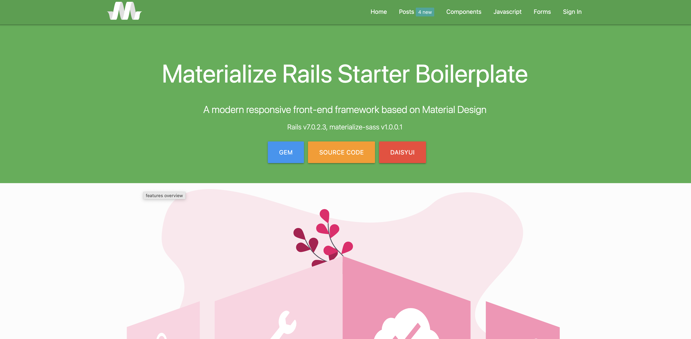
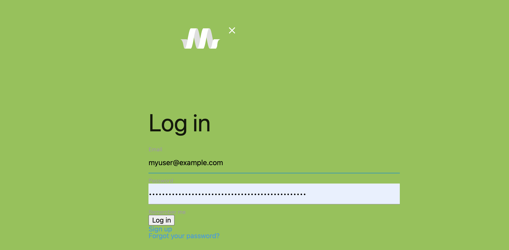
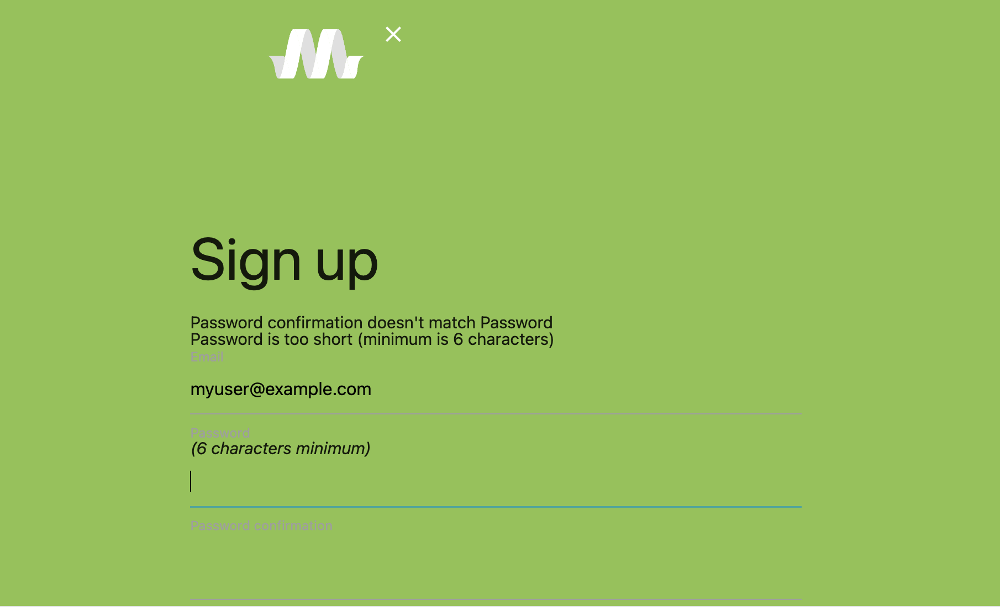

## Getting Started

- <https://materializecss.com/getting-started.html>
- <https://github.com/mkhairi/materialize-sass>

`gem 'materialize-sass'`

### Using the Example Repo

- [Demo](https://materialize.labs.my/)
- [Example Repo](https://github.com/mkhairi/materialize-rails)





- A little out of date with devise
- Inconsistent UI, see the login vs landing examples
- Materialize doesn't properly reset all the browser styles (likely out of date rails implementation)
- random theme color on load is cool, not always easy to read

app/assets/config/manifest.js

```javascript
//= link_tree ../images
//= link application.css
//= link application.js
```

app/assets/stylesheets/application.scss

```scss
@import 'reset';
@import 'materialize';
$primary-color: color("blue", "lighten-2") !default;
$secondary-color: color("yellow", "base") !default;
@import 'materialize/extras/nouislider';
@import "datatables";
@import 'style';
@import "devise";
@import "custom";
```

app/assets/javascripts/application.js

```javascript
//= require jquery
//= require materialize/extras/nouislider
//= require materialize-sprockets
//= require datatables
//= require init
//= require activestorage
```

app/views/layouts/_header.html.slim

```ruby
title
  | Example
meta content="text/html; charset=UTF-8" http-equiv="Content-Type" /
meta content="width=device-width, initial-scale=1, maximum-scale=1.0" name="viewport" /
= csrf_meta_tags
= stylesheet_link_tag 'https://fonts.googleapis.com/icon?family=Material+Icons'
= favicon_link_tag 'favicon.png'
= stylesheet_link_tag 'application', 'data-turbo-track': 'reload', media: 'all'
= javascript_include_tag 'application', 'data-turbo-track': 'reload'
```


## References

- <https://materializecss.com>
- <https://www.rubyinrails.com/2015/09/17/how-to-integrate-material-ui-with-rails/>
- <https://materializecss.com/templates/parallax-template/preview.html>
