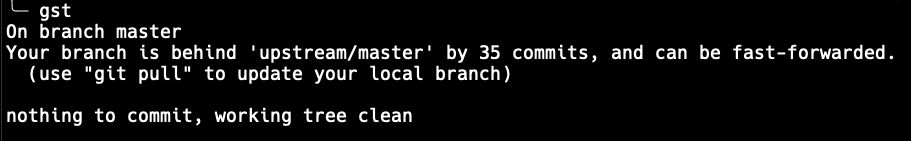
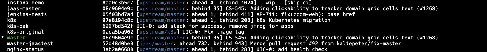
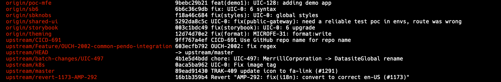

## Learning Git

1. <https://gitimmersion.com/> really good walk-through of concepts.
   - A bit dated but holds up well
   - Interactive
1. <https://frontendmasters.com/courses/git-in-depth/> Advanced Git Course
   - Really in depth, advanced topics
1. <https://git-scm.com/book/en/v2> Pro Git Book
   - Reference style book

---

### Zsh and Friends


1. Update local git to latest with brew
1. Install Oh My Zsh
1. Open a new terminal and type `git che<tab>`, autocompletion should work

---

## Inspect Aliases Provided

`alias` show all aliases

`alias | grep git` show all git aliases

## Top Examples

`..` shortcut to nav up a dir

`gst` git status

`gcmsg` git commit -m ...

`g` git

`gfa` git fetch --all --prune

`grbi` git rebase --interactive

`gwip` commit changes, skip ci and label [WIP]

`gunwip` reset HEAD, stage WIP changes

`gco` and `gco -b` git checkout [-b] \<branch>

---

## Viewing State



- This is 'tracking' against 'upstream/master' (source, master)
- Shows the count of commits ahead/behind, will show diverged branches
- Fast forwarded means no merge-commit needed (clean history)



- Shows each branch, tracking, ahead/behind counts



- Shows remote branches

---

## Tracking Branches

---

## Keeping Repos Up To Date

```bash
gfa # git fetch --all --prune
```

---

## gwip/gunwip

---

## Merge Lockfiles

1. Merge package.json, run npm install, continue merge

-- OR --

https://www.npmjs.com/package/npm-merge-driver

---

TK

rerere
post merge install
gh/hub
gwip
ga -p
rebase
fork and pull
git configs
