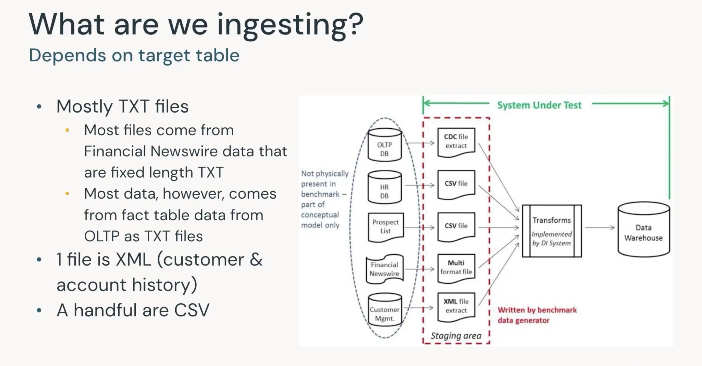

https://customer-academy.databricks.com/learn/course/4021/data-warehousing-with-databricks?hash=659d47b87224f702c6caee964e056b68982375bb&generated_by=1251190

## TPC-DI

Specification used. Industry standard benchmark for data integration and ETL, focused on performance and cost.
 
- Extract and combine data from a variety of data source formats, transforming that data into a unified data model representation and loading it into a data store.
- The TPC-DI benchmark combines and transforms data extracted form an On-Line Transaction Processing (OTLP) system along with other sources of data and loads it into a warehouse.
- The source and destination data models, transformations, and rules were designed to be broadly representative traditional/modern data integration requirements.

