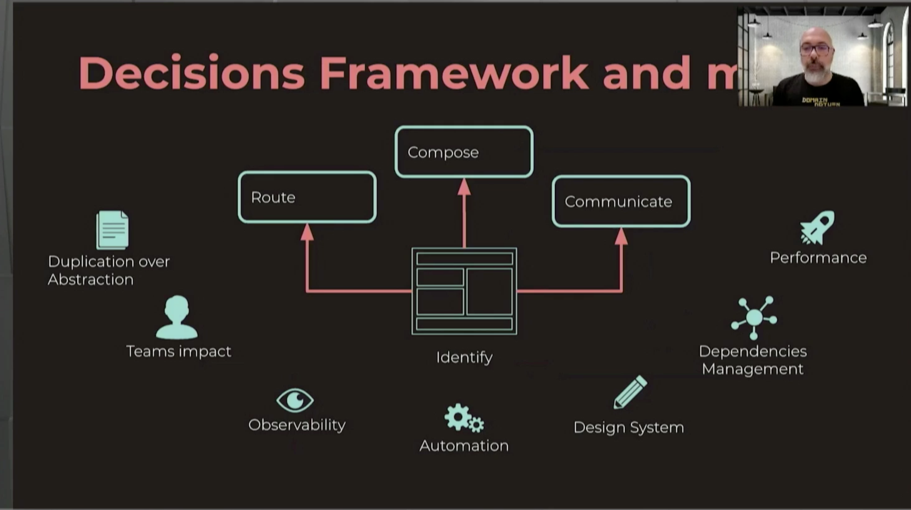

## Angular 11

- HMR
- webpack 5 (exp)
- eslint

## MFE

Horizontal vs. Vertical Split

1. Up front investment
2. Team Structure
3. Testing challanges
4. Scalability challenges
5. Dep management

vert

1. Traditional dev
2. Embracing JS system
3. Dynamic rendering for SEO

Composition

https://learning.oreilly.com/library/view/building-micro-frontends/9781492082989/

## Micro-frontend Revolution

Don't build an incredible machine.

https://www.npmjs.com/package/@angular-architects/module-federation?activeTab=readme

DO NOT SHARE STATE - antipattern --> creates distributed monolith

USE PUB/SUB to share state

## Performance

https://github.com/angular/angular/tree/master/packages/benchpress

https://www.youtube.com/watch?v=ybNj-id0kjY&feature=youtu.be

- memoize calls (pure pipes, store results)
- skip change detection, (onpush, run outside zone)
- render fewer components

Essential pre-conditions

- production mode - skip circular `ng build --prod`
- no mangle `NG_BUILD_MANGLE=false`
- no extensions (browser, incognito mode)

`NG_BUILD_MANGLE=false ng build --prod`

`npm i -g serve`

https://web.dev/rail/

Flame graphs:

chrome experiments > Timeline: v8 timeline (compile)

## state management patterns

- direct entity duplication

Store id instead of entire client object, handles state changes.

implicit state duplicaiton: e.g. totalClients as number

calculate by length with selectors

franken state: data inconsistencies

solution: planning

Multiple triggers for actions: create a separate action for each area, use reducer on to multiple actions

https://www.sourceallies.com/2020/11/state-management-anti-patterns/

NG 11

- tslint/codelyzer deprecated

- vscode languange service official in post 11

## azure deployments

https://docs.microsoft.com/en-us/users/johnpapa-0554/collections/yj40aeq82drmg3?WT.mc_id=javascript-0000-jopapa

https://docs.microsoft.com/en-us/azure/static-web-apps/?WT.mc_id=javascript-0000-jopapa

## CICD

trunk based development is a requirement
