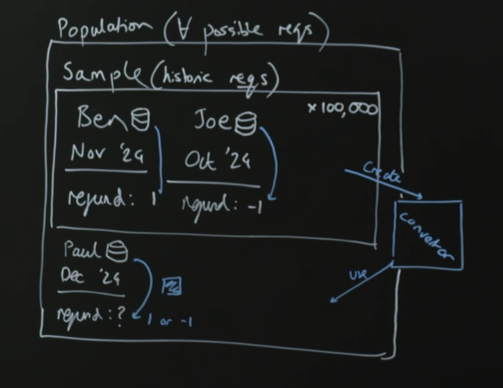
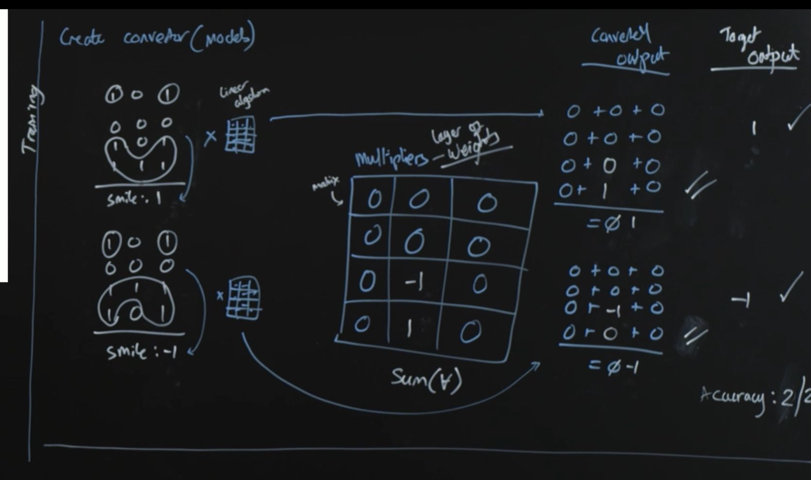
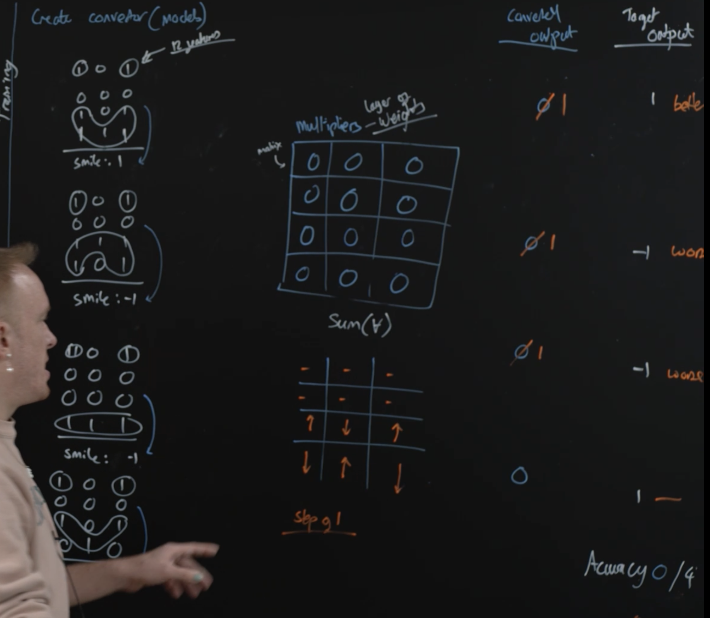

https://frontendmasters.com/workshops/engineering-and-ai/

- https://docs.google.com/presentation/d/1bseVZV-ej5wznudiXiihEWiL-oVcE5wEWGBvp_sErGY/edit?pli=1#slide=id.g316e75ef6fc_0_189


∀ = all

- population = all data
- sample = subset of data



- parameters - the rules
- features - the data pieces
- model - the algorithm

50 - why 50?

`50^3 = 125000`

greedy - get each stage correct, separately


## Finding Features

- Data exploration (data scientist led)
    - Smaller sample: 10-20%
    - understanding the problem and data, watch for imbalances
    - experiment with different model/approaches
- production model (ml engineer led)
    - performance of training at scale
    - end to end deployment
    - ongoing performance

## Sigmoid

`σ` sigmoid

signoid function converts all positive numbers to > 50% and all negative numbers to <50%

## Neural Network



- weights: the values of the matrix
- matrix: multipliers

## gradient descent

iindependent steps towards improved accuracy at once



```
 0  0  0
 0  0  0
 1 -1  1
-1  1 -1
```


## Results

loss = error rate

closer to 0 is -1 or not

closer to 100% is 1 or yes

## Learning Materials

- deep learning (nerual network with lots of layers) - practical applications 
- grokking series
- https://www.manning.com/books/grokking-algorithms


# LLM

https://docs.google.com/presentation/d/e/2PACX-1vSPT7SVveXts7-u5TDGxFc5quBDhg8FW9mY5wvIxL7Iu1CUvPw1CAaqH-C9v_AtqY6QTv4yVb7l5IJF/pub?slide=id.g316f40d9e89_0_254

## Natural Language Processing (NLP)

- text classification
- named entity recognition (NER)
- machine translation
- text transslation
- speech recognition
- text summarization
- question answering

`tokeniization`: splitting to smallest unit of semantic meaning

## Embeddings

Embeddings express the model's understanding of an input. We don't (yet) know what these embeddings mean, but we can use them to find similarity and features.

- https://ig.ft.com/generative-ai/
- https://jalammar.github.io/illustrated-word2vec/

## Self-attention

- attention is the correlation of a given word to anohter word in a sentence
- self-attention allows a model to determine (and embed) the relevance to a given word of every other word in the sentence

## Pre-training

- each pre-training epoch builds the model's 'understanding' of the dataset
- the model's predictive ability is contained wihtin it's parameters, which include a lossy compressed version of the training data
- pre-training produces a base model capable of generating that resemble its pre-training dataset

https://github.com/karpathy/nanoGPT

## LLM Knowledge

- there is no intuitive way to discover what the model 'knows' (yet)
- models store probabilities, the pre-training objective is generalization
- fact generation is an unpredictable side effect

https://pair.withgoogle.com/explorables/fill-in-the-blank/

## Fine Tuning

- using an LLM to follow instructions
- we produce alignment by fine-tuning the model to understand prompts and respond with a particular tone

## Prompting

- programming in natural language

## Mental Model

### Imperfect

- pre-training and fine-tuning build the model's capacity to 'reason' (predict) through inplicit rules (long-term memory)
- prompting provides context to guide the model (short-term memory)

### Better

- system 1 thinking: instictive, automatic, unconsicous, 2 * 3 =
- system 2 thinking: deliberate, effortful, consicous, 173 * 82 =

models are only capable of system 1 thinking

## Strive For

- grounding
- consistency
- confidence
- interpretability
- alignment
- robustness

## risks

- reliability
- social bias
- toxicity
- disinformation
- legal (fair use)
- cost / environmental impact / access

## concerns

- testing
- version control
- latency
- modularity / composition
- monitoring

# Prompting

- https://docs.google.com/presentation/d/e/2PACX-1vTbnDXx1tzzOFzGQpFqrCpeUo5MAhOBi_QvaF_gVZOcZMSamP7S8xks96gS30dwfi4TfoITWFLAdBiH/pub?slide=id.g316f41a4fc4_0_128


https://blog.matt-rickard.com/p/a-list-of-leaked-system-prompts

