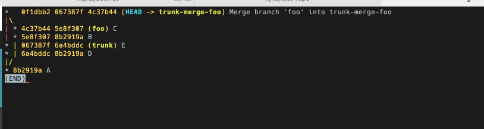

<https://theprimeagen.github.io/fem-git/>

- Git is an acyclic graph.

`man git-` for the friendly manual

```bash
git config --add --global user.name "ThePrimeagen"
git config --add --global user.email "the.primeagen@aol.com"
```

```bash
glgg --decorate # git log --graph --decorate
```

SHA is: {two_letter}{hash}

storage is .git/objects/{two_letter}/{hash}

`git cat-file -p <sha>`

To get to the file contents:

```bash
g cat-file -p c8aa8046ae53c4b509d3add044dd4527c12ae717 # prints tree sha 3fef558baa397fc4e45b6125671cc7c87bdd4f42
g cat-file -p 3fef558baa397fc4e45b6125671cc7c87bdd4f42 # prints file sha
g cat-file -p 3454f81a56a809cac7aac8245ff7b5d5d950fb81 # prints contents
```

```bash
git config --get-regexp fem # list fem section
```

```bash
git config --unset fem.git # cannot unset multiple value key
git config --unset-all fem.git
git config --remove-section fem # remove whole section
```

Git branch will create a branch and not changing anything.

```bash
git branch foo
git checkout -b foo # create and checkout
```

branches are stored in `.git/refs/head/`

`g log --parents --graph --decorate --oneline`




```bash
git reflog # whole history
```

rerere

```bash
git config rerere.enabled true
```


```bash
git checkout --ours README.md #use "ours" change
git checkout --theirs README.md #use "theirs" change
```

search

```bash
git log -p --grep "foo"
git log -p -- src/index.js
```

worktrees

```bash
git worktree add ../foo-bar   
git worktree prune
git worktree list
git worktree remove ../foo-bar     
```
