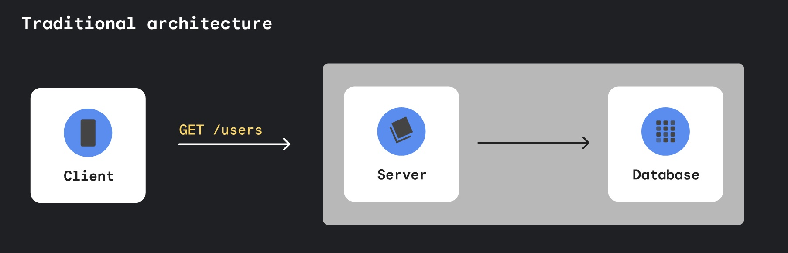

# Firebase Fundamentals

<https://frontend-masters-firebase.web.app/>

## Arch Shift

**Using async/await is an anti-pattern for writes. It runs offline.**

- Will auto retry on network failure
- Docs will show async/await example. Only use when this is paramount. Using onSnapshot gives you more.

`setDoc` is destructive
`updateDoc` looks at delta and updates. Document must exist or errors.

`setDoc` can take `{merge: true}` to combine best of both worlds.

`==` for all queries, triple equals doesn't exist
