https://frontendmasters.com/workshops/fullstack-system-design/

## Tools

- https://app.diagrams.net/

## Diagramming

### Pizza Shop

1. Customer places an order
1. Resteraunt receives the order
1. Staff takes the order after completing other orders
1. If missing ingredients, has to prepare/acquire them
1. Order ready: delivery or in store
1. Customer receives order

Pizza Ordereed

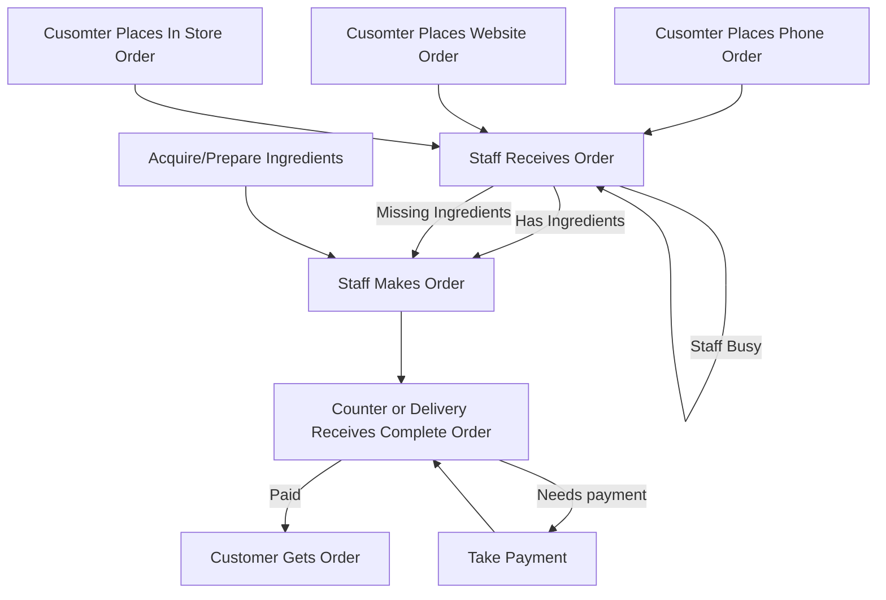

### Flow

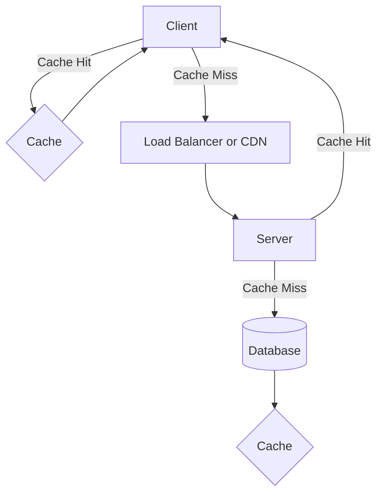

## Translating Business Requirements

### TODO App

- What is actually needed?

- Create a TODO
- Read a TODO or list
- Update a TODO
- Complete a TODO
- Delete a TODO

### Mobile Banking

- How realtime?
- 

- Manage Users: CRUD
- Authenticate a User
- Authorize a User
- Display recent transactions
- Display historical transactions
- Make a payment
- Transfer money
- Withdraw money
- Show Balance
- Apple/Google Pay

Non-functional

- performant, very fast
- live data
- secure

### URL Shortener

Questions:
- Can users customize the shortened URL?
- How long are short URLs persisted?
- What about keys/duplicates?
- What happens if the site is no longer available?
- How long is too long for short?
- HTTPS?
- Performance expectations
- Can a URL change?
- Can a URL be deleted?

Functional:
- Users should be able to convert long URL's into shortened versions
- 

### TODO App

Functional
- tasks can only be text
- users should be able to:
    - read their todos
    - edit todos
    - create new todos
    - mark a todo as complete
    - delete a todo
    - reorder todos
    - create a list
    - edit list
    - filter or sort
    - delete a list
    - ~~share a list~~
    - create account
    - login

non-functional
- only authenticated users can access tasks
- task oeprations must complete within 1000ms
- 

## CAP Theorem

- Realiability: ability for a system to function correctly over time
- Availability: proportion of time a system is operational and accessible
- Resiliency: how well does the system handle failures
- Consistency: how do we ensure that all the users see the same data at the same time

Distributed systems can only guarentee 2 of 3 at a time.

Consistency: every read receives the most recent write on error
Availability: a request for data gets a response, even if one or more nodes are dow
Partition Tolerance: the cluster must continue to work despite any number of communication breakdowns between nodes in the system.

- ~~C + A: only works without network issues~~
- C + P: Always show the latest data but unreliable performance
- A + P: Always responds but might who outdated data

## Non-functional Requirements

### Mobile Banking

- How many MAU's?
- How many transactions per user?
- How often do users have to transfer money, i.e. write through the app
- How often do the users use the app per month?
- 

Non-functional
- the system should have 4 nines of availability
- transactions should be backed up daily
- transaction data must be encrpyted in transit at rest
- transactions cannot be lost
- every transaction and user action must be audited

### URL Shortener

- How many MAUs?
- What is the average requests per second?
- What is the maximum latency allowed?
- What is the max length of the URL?
- Do URL's expire?

Non-functional
- Redirects should happen in no more than 500ms
- the system should support 1 million RPS
- long URLS can be at most 3kb
- short urls can at most 0.3kb
- 

## Modeling

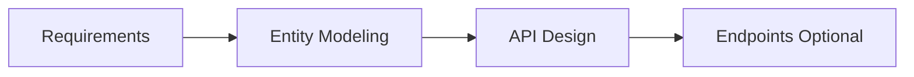

Entities

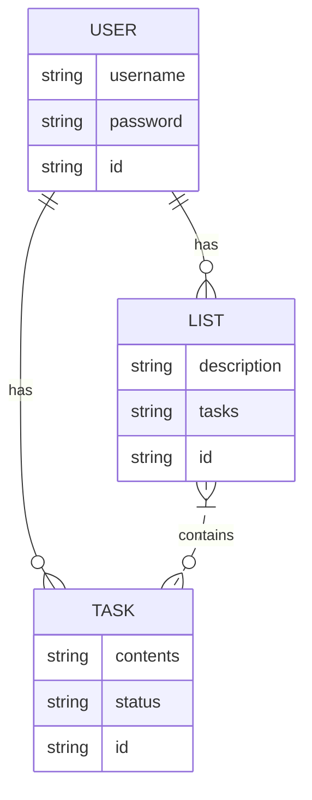

## Protocols
- HTTP: stateless, simple, human readable, supported by all browsers
- Websockets: bi-directional communication, peristent connection
- Server Side Events: one way communication (server to client), human readable
- gRPC: binary protocol (HTTP/2), Strongly-types contracts
- REST: multiple endpoints, human readable, supported by all, stateless
- GraphQL: single endpoint, precise data retrieval, self documenting API, strongly typed

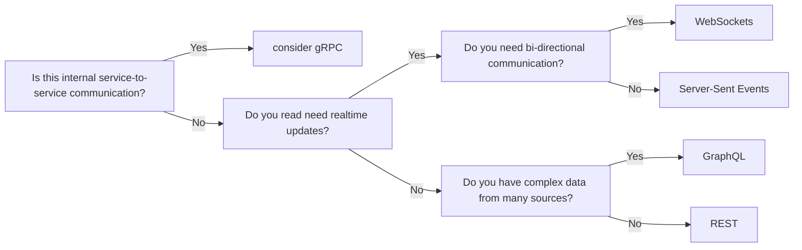

## Database Scaling

### Partiioning

- Same DB
- Easier
- Transactional guarentees
- Queries span multiple tables

### Sharding

- Load balanced over different machines
- 

## Replication

- making copies of your data across multiple servers or locations
- increases fault tolerance
- increases read performance

### Primary / Replica

- All writes go to the primary server
- Replicas copy data from the primary and handle read requests
- If the primary fails, a replica can take over

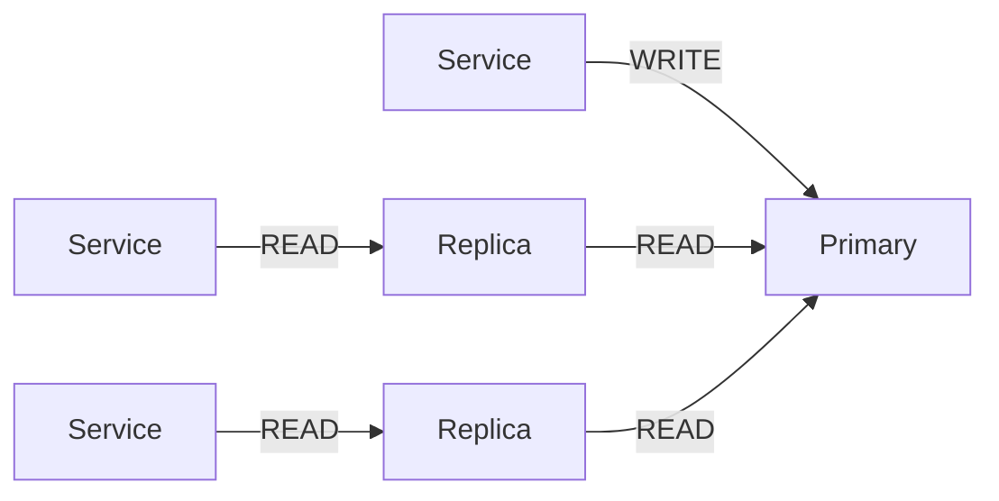

### Primary / Primary

- Multiple servers acept reads/writes
- Data is synchonized between all servers

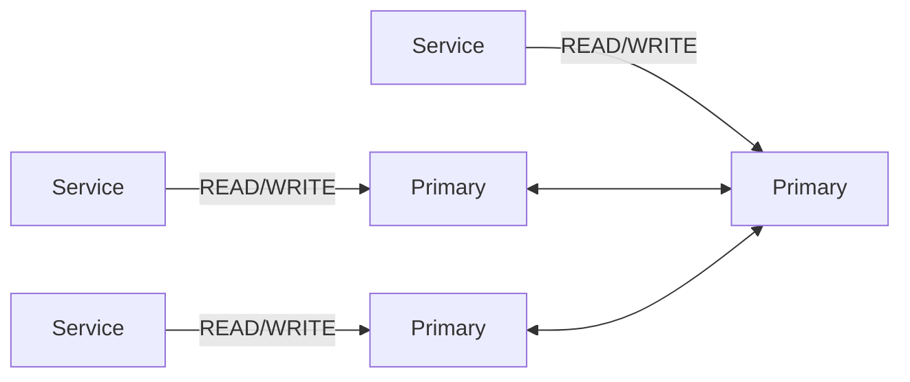

### Peer to Peer

- Every server can read and write
- Changes are shared with all other servers

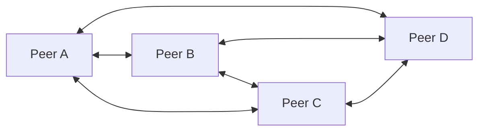

### Strategies

- Transactional
- Snapshotting
- Merging

## Caching

### Cache Aside (Lazy Loading) READ

1. Cache miss
2. Read from database
3. Update Cache

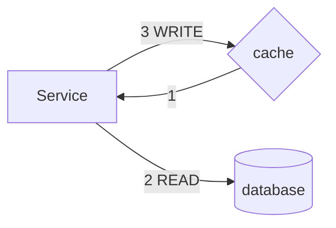

### Cache Aside (Lazy Loading) WRITE

1. Write to database
1. Write to cache

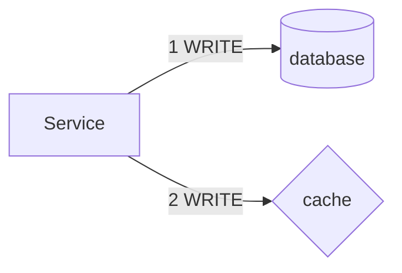

### Write Through

1. Write to cache
2. Write to DB

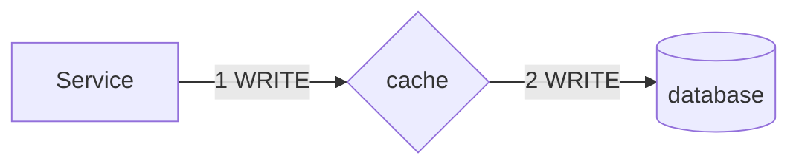

### Read Through

1. Read from cache
2. on miss, read from db
3. write to cache

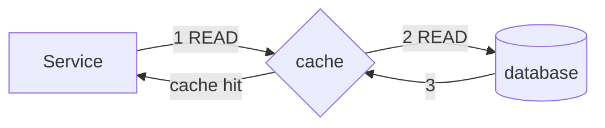

### Write Behind

1. write to cache
2. immediately return
3. asynchronously, write to db

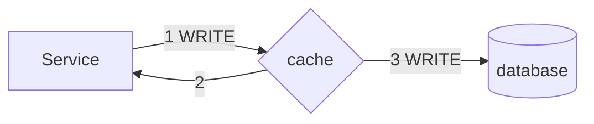

### Cache Invalidation

- Time-based expiration (TTL)
- Event-based
- Version tagging
- Refresh ahead

### Cache Eviction

LRU is a double linked used.

- FIFO: first in first out
- LIFO: last in first out
- LRU: least recently used
- MRU: most recently used
- LFU: least frequently used
- RR: random replacement

## Estimations

- help ground vague requirements in reality
- helps you think about the speficis of the system components
- shows the interviewer your thought process
- don't have to be precise

### Strategy

- clarify
    - what are you estimating?
        - users, requests, storage
    - ask or make reasonable assumptions
        - how many users?
    - validate your assumptions
        - write it down
- do the math
- sanity check the results

## TODO System Design

Questions
- 

Requirements
- 

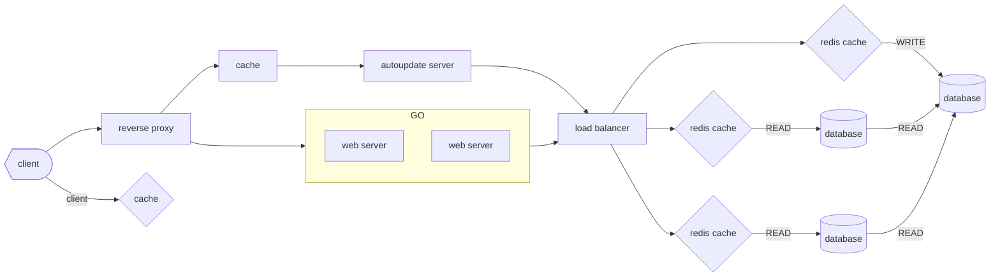

## Security

SSL./tls

- option 1: termination at load balancer
    - most common
    - application receives http
- option 2: termination at application layer
    - load balancer passes through encrypted traffic
    - each application instance handles decryption
- option 3: re-encryption
    - terminate at load balancer
    - re-encrypt between load balancer and applications

### Authentication 

Who are you?

### Authorization

Determines permissions, what can you do?

## Asynchorinicity

- help adders the challenge of working with computationally expensive tasks
- keep the system responsive

### Expensive Tasks

- uploading and processing a large video file
- generating a report
- processing payments
- image resizing or thumbnail creation

### Components

- message broker
    - rabbitMQ
    - kafka
- message queue
    - rabbitMQ
    - Amazon SQS
- worker management
    - kubernetes

## Video Upload Service

- supported resolutions / formats?
- is there a size limit?
- do we need generated thumbnails?
- how many users are uploading at once?
- do we need to process videos?
- do we need captions / subtitles
- do we need to process audio?

features

- up to 4k
- max filesize 4g
- 1 upload per user / day @ 1000 users
- yes thumbnails
- no trim/edit
- not today for captions
- yes on audio
- audio track is separate
- no perf metrics on upload speed

entities

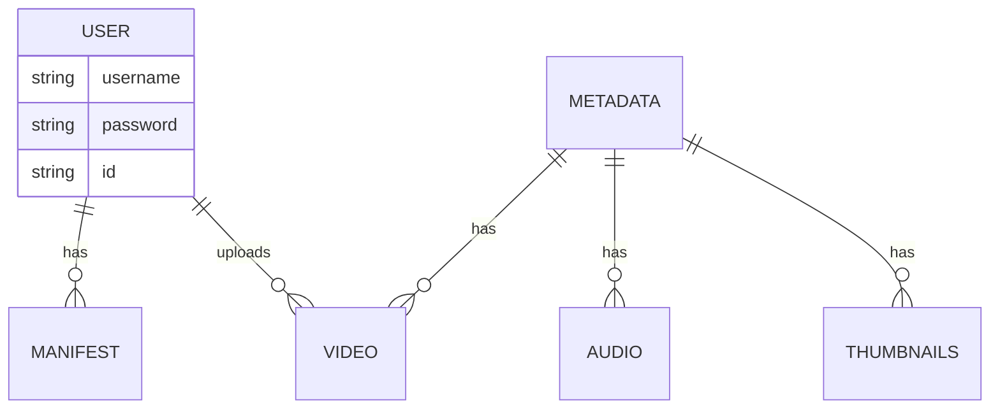

- user gives a title
- user starts uploading a video
- user is notified when upload is successful
- process video
- user notified when processing complete
- 

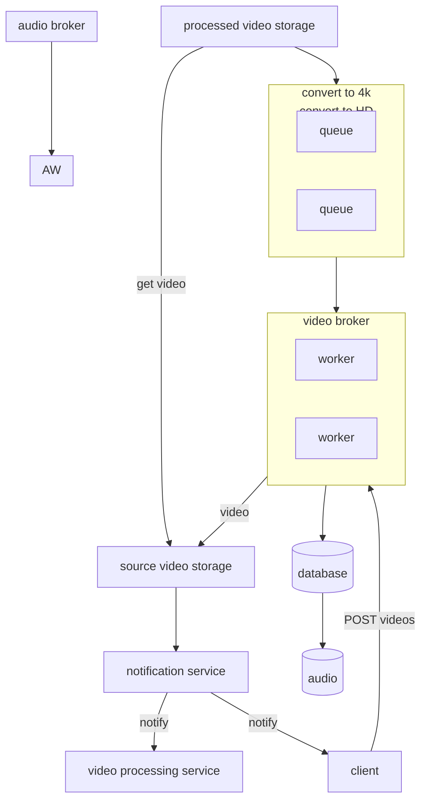