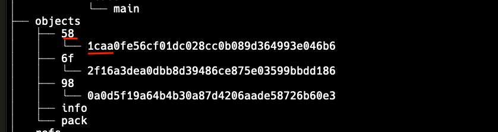
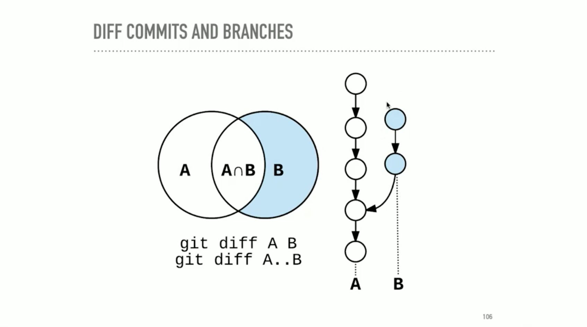
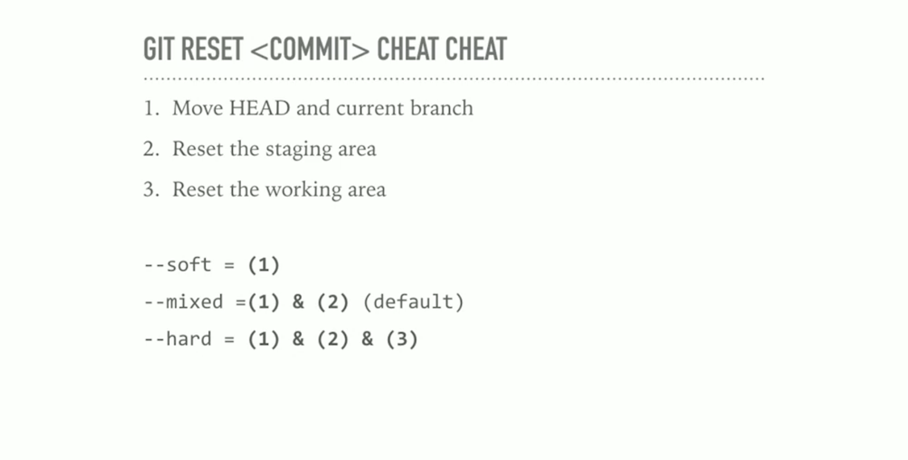
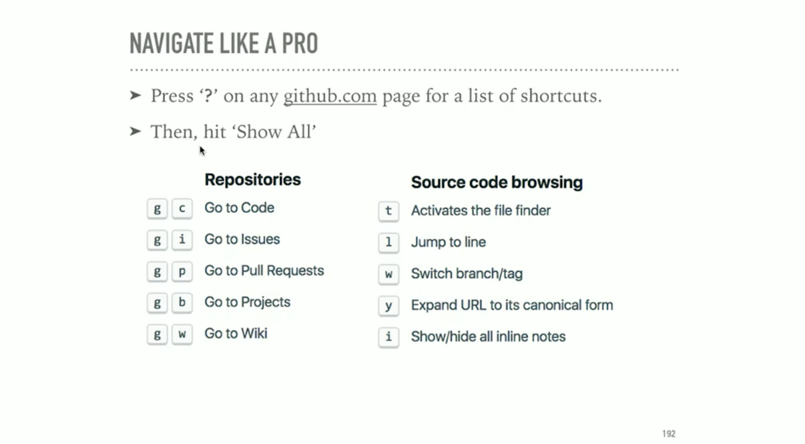

`echo 'Hello, World!' | git hash-object --stdiin` print git hash, uses SHA1
`echo 'blob 14\0Hello, World!' | openssl sha1` print same hash that git hash-object would
`echo`Hello, World!' | git hash-object -w --stdin` writes the blob to the git data store.
`git cat-file -t <sha>` print type of content
`git cat-file -p <sha>` print the contents
`cat .git/refs/heads/master` prints sha1 of master HEAD
`cat ./git/HEAD` show current head
`git ls-files -s` show the fiels in the staging area
`git add -P` stage in chunks interactively
`git checkout <stash name> -- <filename>` checkout one file from stash, it will overwrite local changes

## Tree / Blob Storage

Tree contains pointers using SHA1



The first 6 chars are the short hash. The first 2 are the directory in the git tree.

For example, to get details on the red underlined blob, use `581caa`.

## Configure

<https://git.io/config-editor>

```bash
git config --global core.editor vim
```

<https://git.io/use-less>

## Viewing Objects

```bash
brew install tree
tree .git
```

```bash
git cat-file -t 581caa # print the type
git cat-file -p 581caa # print the pretty info
```

```bash
cat .git/HEAD # where are you now
cat .git/refs/heads/main # sha of HEAD branch
```

```bash
tree .git/refs # show refs/branches
```

```bash
git --no-pager log --oneline # show last commit info
git --no-pager log --graph # show last commit info in graph mode
```

## Staging

- clean isn't empty
- baseline is an exact copy of the latest commit

```bash
git ls-files -s # show staged commits
```

```bash
git add . # add all
git add -p # interactive stage, ? shows commands
```

Un-staging does not remove files.

## Stash

- Save uncommitted work.
- Safe from destructive work.

```bash
git stash list
git stash show stash@{0}
git stash apply
git stash --include-untracked # include new files, apply keeps untracked
git stash --all # all, even ignored, use with caution
git stash save "WIP: my comment"
git stash branch <branchname> <optional stash name>
git checkout <stash name> -- <filename> # grab single file from stash
git stash pop # apply stash and delete
git stash drop # clean stash
git stash clear # clear all stashes
git stash -p # selectively stash changes
```

## Branches

- a pointer to a particular commit
- HEAD is how git knowns what the next parent will be
- It's a pointer
  - Usually points to the name of the current branch
  - Can point to a commit too (detached HEAD)
- moves when:
  - you make a commit to the active branch
  - when you checkout a new branch

```bash
git checkout - # shortcut to switch to previous branch
```

## Tags

- lightweight tags are simple pointers to a commit
- Creating a tag with no arguments points to head
- snapshot, doesn't move

```bash
git tag my_tag
```

### Annotated Tags

- point to a commit but store additional information
  - Author, message, date
  - typical tag type

```bash
git tag -a v1.0 -m "Version 1.0 of my blog"
```

```bash
git tag
git show-ref --tags
git tag --points-at <commit>
git show <tag-name>
```

## Head-less / detached HEAD

- you checkout a commit instead of tag/branch
- moves HEAD to the commit
- checking out a different branch or commit, the value of HEAD will be that SHA
- No reference pointing to commits made in a detached state
- To save: `git branch <new branch name> <commit>`
- If you don't point a new branch, they are garbage collected

## Merge Commits

- Commits have more than one parent, typically 2
- Maintains all commits from feature branch
- Fast forward commit add commits and moves pointer forward

```bash
git merge --no-ff # force merge commit, used for bug tracking
```

## Merge Conflicts

- Attempt to merge, but has conflicts
- Git will stop
- Git RERERE - reuse recorded resolution <https://git-scm.com/docs/git-rerere>
  - long lived feature branch
  - rebasing

```bash
git config rerere.enabled true # one project, use global for all
```

## Commit Messages

- Commit message is future tense 'Fix' vs. 'Fixed'
- Short subject, followed by blank line
- A description of the current behavior, short summary of why the fix is needed. Mention side effects.
- Give context and how, not what
- 72 char per line

## Good Commits

- Good commit message
- Encapsulate one logical idea
- Doesn't introduce a breaking change
  - tests pass

## Git Log

```bash
git log --since="yesterday"
git log --since="2 weeks ago"
git log --name-status --follow -- <file> # log files moved or renamed
git log --grep <regexp> # e.g. git log --grep=mail --author=nina --since=2.weeks
git log --diff-filter=R --stat # find renamed files
```

`^` or `^n` -- show the nth parent commit or first
`~` or `~n` -- show the n number of commits before
`^` and `~` -- can be combined

## Git Show

```bash
git show <ref>
git show <ref> --stat
git show <commit>:<file>
```

## Git Diff

- diff between commits
- diff between staging area and repository
- what's in working area

```bash
git diff # unstaged
git diff --staged #staged
```



```bash
git diff A B
git diff A..B
```

Shows all changes on branch B, and not branch A

```bash
git branch --merged master # branches merged into master
git branch --no-merged master # branches not merged into master
```

## Fixing Mistakes

`git checkout` restore working tree or switch branches
    1. Change HEAD to point to the new branch
    1. Copy the commit snapshot to the staging area
    1. Update the working area with the branch commits

`git checkout -- <file>` completely overwrite files in working directory without warning

`--` end of command operation, start of positional parameters

`git checkout <commit> -- <file>` copies to both staging and working area

`git checkout <deleting_commit>^ -- <file>` restore deleted file

`git clean` clear working area of untracked files `--dry-run`, prompts for changes

`git reset` by default used 'mixed' mode.
    1. For commit: moves head pointer, optionally modify files
    1. For file path: does not move HEAD pointer, modifies files

```bash
git reset --soft HEAD~ # moves head pointer back one commit, has a dangling commit
git reset --mixed HEAD~ # moves head pointer back one commit, moves files to staging area (un-stage command)
git reset --hard HEAD~ # destructive, move head, copies files to stage and working.
git reset ORIG_HEAD # reset to original head
```



__Never__ push change history to shared repository

## Git Revert

- Safe revert
- Keeps history
- Has merge commit

```bash
git revert 2b0b3f2 # revert commit with a merge commit
```

## Git Amend

- Shortcut to make changes to previous commit
- SHA's change

```bash
git add .
git commit --fixup <SHA>
git rebase -i --autosquash <SHA>^
```

## Git Rebase

- Pull latest changes from master, avoid messy commit history and apply changes cleanly on top
- __Rebase__ means give a commit a new parent
- Commits can be: edited, remoed, combined, re-ordered, inserted
- `-i` interactive rebase
- Can split commits
- you can copy the branch before if you are afraid of it
- keeps history neat and clean
- never rewrite public history

```bash
git rebase -i <commit-to-fix>^
git rebase -i --exec "run tests" <commit> # run command after every rebase
git rebase --abort # abandon ship
```

## Remotes

- Stored elsewhere
- __origin__ default name git gives the server you cloned
- Can't push to origin if you clone someone elses
- Forks are yours and you can push
- setup an upstream
- __upstream__ can pull down changes to original repository

```bash
git remote -v
git branch -vv # shows branch tracking, commits ahead/behind
```

## Workflows

- Triangular is the most common
  - Clone your fork
  - make changes, push to fork
  - PR from fork to upstream

- Tracking branches, tie to upstream branch

```bash
git checkout -t origin/feature # checkout with tracking
git push -u origin feature # tell git the first time you push where to track
```

## Updates

- `fetch` updates local info, doesn't change anything
- `pull` fetch and merge

```bash
git pull --rebase
git push --tags # push tags
```

## Open Source Guidelines

### Before opening

- Keep history clean, rebase if needed
- Run project tests on your code
- Pull in upstream changes (prefer rebase)
- Check for a CONTRIBUTING (md/txt) in the root

### After opening

- Explain your changes thoroughly in the pull request
- Link to any open issues that your pull request might fix
- Check back for comments from the maintainers

## Best practice

- Always use a fork'
- Rebase commits on local feature branch
- Merge feature branches back to origin (or upstream)

### When Accepting

- Squash and merge or rebase with care

## Recovering

- Use the reflog, keeps 2 weeks

## GitHub


