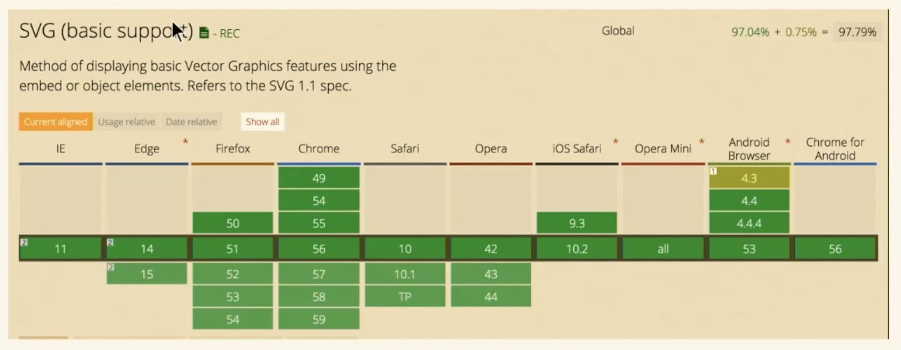

## Resources

- [Code Pen Extension](https://chrome.google.com/webstore/detail/codopen/agnkphdgffianchpipdbkeaclfbobaak/)
- [GitHub Repo](https://github.com/sdras/svg-workshop)
- [Greensock Plugin List](https://codepen.io/GreenSock/pen/OPqpRJ)
- [Course](https://frontendmasters.com/courses/svg-essentials-animation/)
- [Slides](https://slides.com/sdrasner/adv-svg-1?token=UCdXy3zz)

## Collections

- [SVG and CSS/GreenSock CodePen Collection](http://codepen.io/collection/XvBQJQ/)
- [SVG Resources](https://codepen.io/collection/DkNQaP/)
- [My Favorite SVG Animations- inspiration](https://codepen.io/collection/XvBrJr/)
- [Intro to D3 Collection](http://codepen.io/collection/XKgVVV/)
- [Mo.js Collection](http://codepen.io/collection/XOEKow/)

## What/why SVG?

1. Crisp on any display
1. Less HTTP requests
1. Easily scalable for responsive
1. Small file size if you design for performance
1. Easy to animate
1. Easy to make accessible
1. Fun



## SVG DOM

### Platonic Shapes

- `rect` x, y width, height
- `circle` cx, cy, radius
- `polygon`
- `line`

### Viewbox

Four points filling the width. Elements outside of viewbox are clipped. They still exist.

### `preserveaspectratio`

Almost never needed. Align the **_of the element's viewBox with the_** value of the viewport

`meet` default

- entire viewBox visible in viewport
- the viewbox is scaled up as much as possible, meeting other criteria
- viewBox < viewport

`slice`

- entire viewport is covered by the viewbox
- the viewBox is scaled down as much as possible, meeting other criteria
- viewBox > viewport

`none`

- removes constraints
- use it for the layout to allow responsive

### Paths and Groups

`g` a group, like a div
`path` 'z' closes the path, has a 'd' for drawing, starts with 'm' for moveTo

<https://codepen.io/netsi1964/pen/pJzWoz>

Applying fill, stroke, etc to a group will apply to all children

`polyline` like polygon with points

`M,m` move to
`L,l` line to
`H,h` only need one coord, horizontal
`V,v` only need one coord, vertical
`Z,z` joins end of path

Upper case letters are absolute coordinates
Lower case letters are relative coordinates

`C,c` cubic-bezier
`S,s` reflecting cubic-bezier
`Q,q` quaratic bezier - where both sides share the same control
`T,t` like q but relected
`A,a` eliptical arc

[Book](https://learning.oreilly.com/library/view/svg-essentials-2nd/9781491945308/)

<https://codepen.io/anthonydugois/pen/mewdyZ>
<https://developer.mozilla.org/en-US/docs/Web/SVG/Tutorial/Paths#curve_commands>
<https://www.jasondavies.com/animated-bezier/>

## Accessibility

- Title for elements in the SVG DOM
- Role to let the screen reader know whether to traverse
- Adding language aides in translation

<https://www.tpgi.com/using-aria-enhance-svg-accessibility/>
<https://css-tricks.com/accessible-svgs/>

## Optimization

- Object > Path > Simplify
- drop shadows can be large, use SVG Filters -> AI Drop shadow instead
- Use select -> same -> fill color, convert to giant rectangle behind shapes

<https://jakearchibald.github.io/svgomg/>
<https://petercollingridge.appspot.com/svg-editor>
<https://github.com/svg/svgo> and <https://github.com/svg/svgo-gui> CLI and GUI to optimize

### Illustrator

- Save as is really bulky
- Sketch is really bad, lots of groups and paths
- Illustrator > export as > SVG
  - inline styles are great for react
  - presentation splits css out
  - decimal may help
  - responsive removes width and height

## Design Tips

- Design begin and end first, then slowly reveal
- Storyboards can help figure out middle
- Prototyping: thumbnails and notes for yourself
- Storyboards: are for collaboration
- low fidelity prototypes show motion

## SVG for Animation Support

- For img, src, object, embed, background url and iframe you can only designate animation if inside the SVG
- For inline, both SVG animation and interactivity are supported

## CSS Animation

<https://frontendmasters.com/courses/css-in-depth-v2/css-animations-features/>

## Free Images

- <http://www.freepik.com/>
- <https://thenounproject.com/>
- <http://icomoon.io/>

## SVG Sprites

- <http://responsiveicons.co.uk/>
- <https://www.smashingmagazine.com/2014/03/rethinking-responsive-svg/>

- viewbox shift requires javascript

## DOM/Virtual DOM vs. Canvas

| DOM/Virtual DOM                                           | Canvas                                                                                                                   |
| :-------------------------------------------------------- | :----------------------------------------------------------------------------------------------------------------------- |
| Pros                                                      | Pros                                                                                                                     |
| - Great for UI/UX animation                               | - Dance, pixels, dance!                                                                                                  |
| - Great for SG that is resolution independent             | - Great for really impressive 3d or immersive stuff                                                                      |
| - Easier to Debug                                         | Movement of a tons of objects                                                                                            |
| Cons                                                      | Cons                                                                                                                     |
| - Tanks with a lot of objects                             | - Harder to make accessible                                                                                              |
| - Because of ^ you have to care about the way you animate | Not resolution independent [out of the box](https://egghead.io/lessons/javascript-make-canvas-responsive-to-pixel-ratio) |
|                                                           | - Breaks to nothing                                                                                                      |

## Tools for the Job

| CSS/SCSS                                      | GSAP (GreenSock)                            | React Spring/React-Motion                                    |
| --------------------------------------------- | ------------------------------------------- | ------------------------------------------------------------ |
| - Small sequences and simple interactions     | - Great for sequencing and complex movement | - Great for single movements that you want to look realistic |
| - Onces you get more than 3... switch to: --> | - Cross-browser consistency                 |                                                              |

- Snap.svg is more like jQuery for SVG
- AnimeJS is a lot like GSAP! But less plugins
- Web Animations API looks great, still waiting on suport
- Velocity is similar to GSAP with less bells and whistles
- [Mo.js](https://css-tricks.com/introduction-mo-js/) won't come out of beta
- D3.js was built for data vis but you can do a lot more with it

- [Comparison of Animation Technologies](https://css-tricks.com/comparison-animation-technologies/#article-header-id-16)
- [Easing Demo](https://cubic-bezier.com/#.17,.67,.83,.67)
- [Green Sock Easing Demo](https://greensock.com/ease-visualizer)

## Performance

- Don't animate with margin, left, top, etc, they cause repaints
- Transforms are what you should use
- Try to hardware accelerate

  ```javascript
  @mixin accelerate() {
    transform: translateZ(0);
    backface-visibility: hidden;
    perspective: 1000px;
  }

  .foo {
    @include accelerate();
  }
  ```

<https://css-tricks.com/debugging-css-keyframe-animations/>
<https://web.dev/animations-guide/>
<https://eng.wealthfront.com/2015/06/30/implementing-netflix-redesign/>
<https://una.im/CSSgram/>
[Book: Transitions and Animations](https://learning.oreilly.com/library/view/transitions-and-animations/9781491929872/)

[Hardware Acceleration Demo](https://codepen.io/sdras/MexoMw)

## Greensock

<https://codepen.io/sdras/full/JobJMO>
