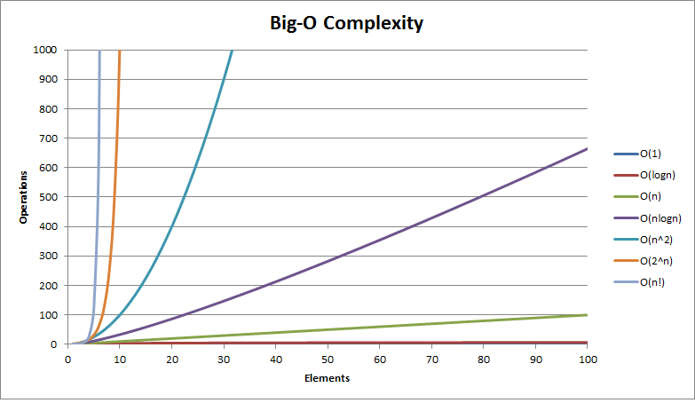

<https://theprimeagen.github.io/fem-algos/>

## Resources/Books

- <https://amzn.to/3bYmBMu>
- <https://amzn.to/3Qp9KlB> or <https://learning.oreilly.com/library/view/a-common-sense-guide/9781680508048/>

## Big O Notation

Look for loops.

Important concepts

1. growth is with respect to the input
1. Constants are dropped
1. Worst case is usually the way we measure

- O(n). Single loop counting chars.
- O(log n). Binary Search trees.
- O(n log n). Quicksort.
- O(n^2). Two nested loops.

```text
N = 1, O(10N) = 10, O(N^2) = 1
N = 5, O(10N) = 50, O(N^2) = 25
N = 100, O(10N) = 1,000, O(N^2) = 10,000 // 10x bigger
N = 1000, O(10N) = 10,000, O(N^2) = 1,000,000 // 100x bigger
N = 10000, O(10N) = 100,000, O(N^2) = 100,000,000 // 1000x bigger
```

Complexity Cheat Sheet

<https://www.hackerearth.com/practice/notes/big-o-cheatsheet-series-data-structures-and-algorithms-with-thier-complexities-1/>



Kata Machine <https://github.com/ThePrimeagen/kata-machine>
