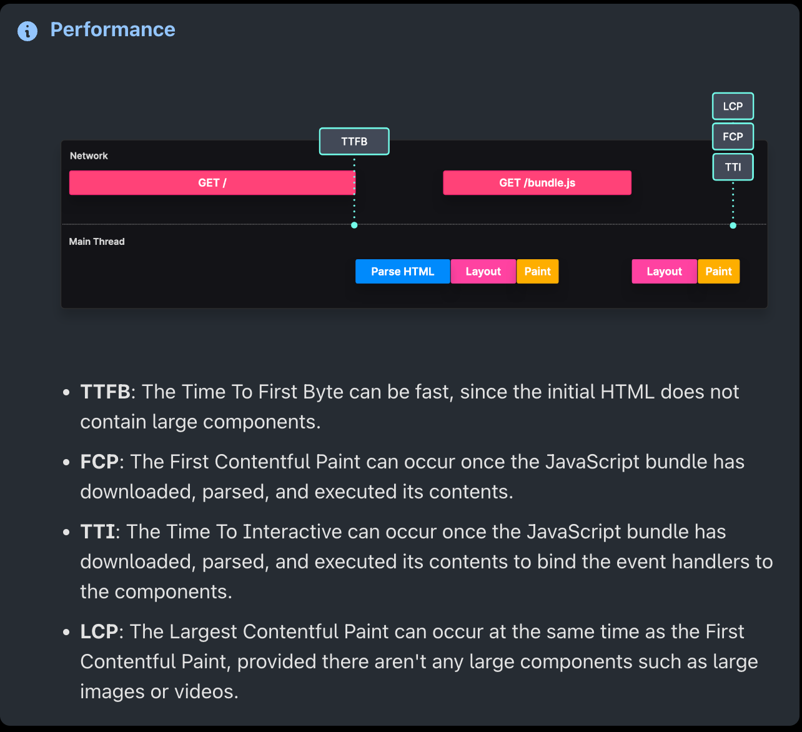
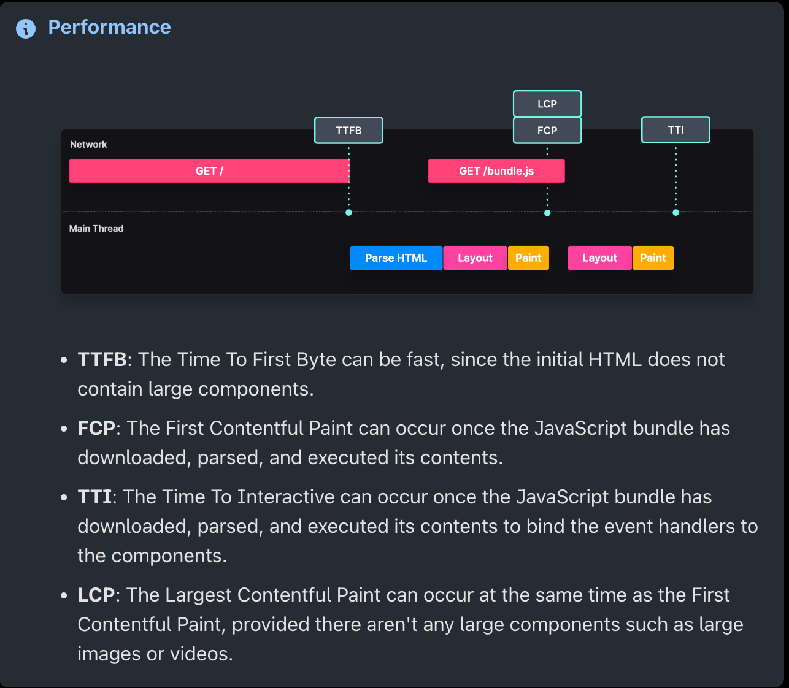
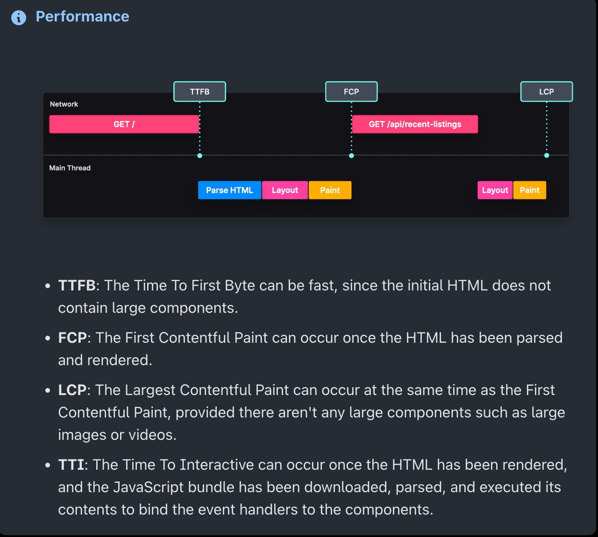
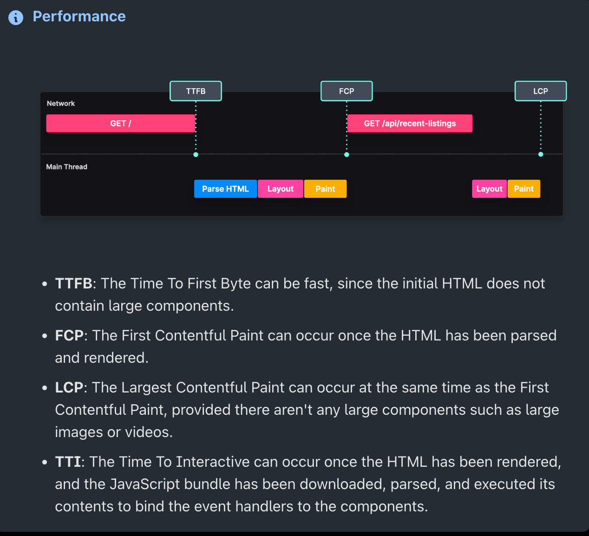
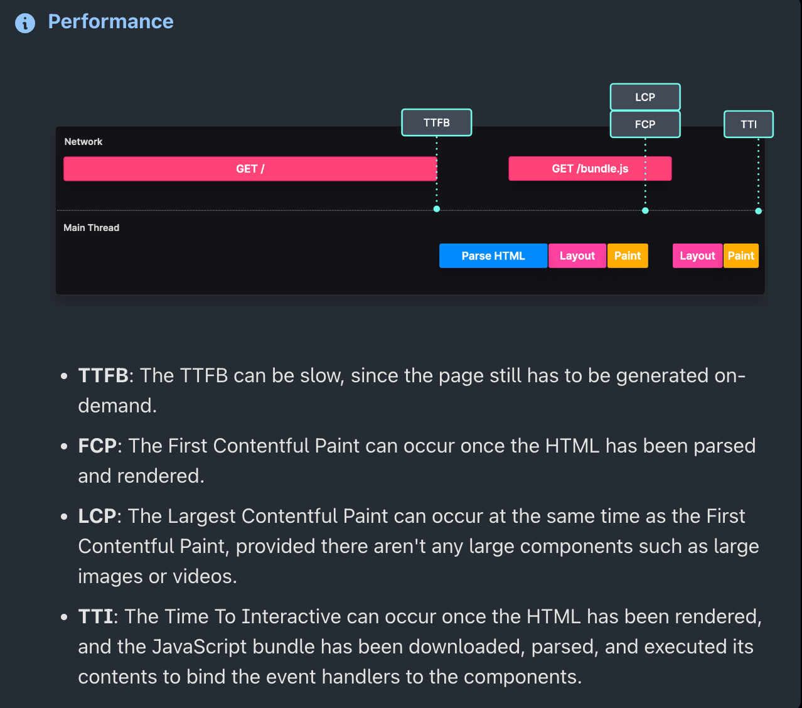
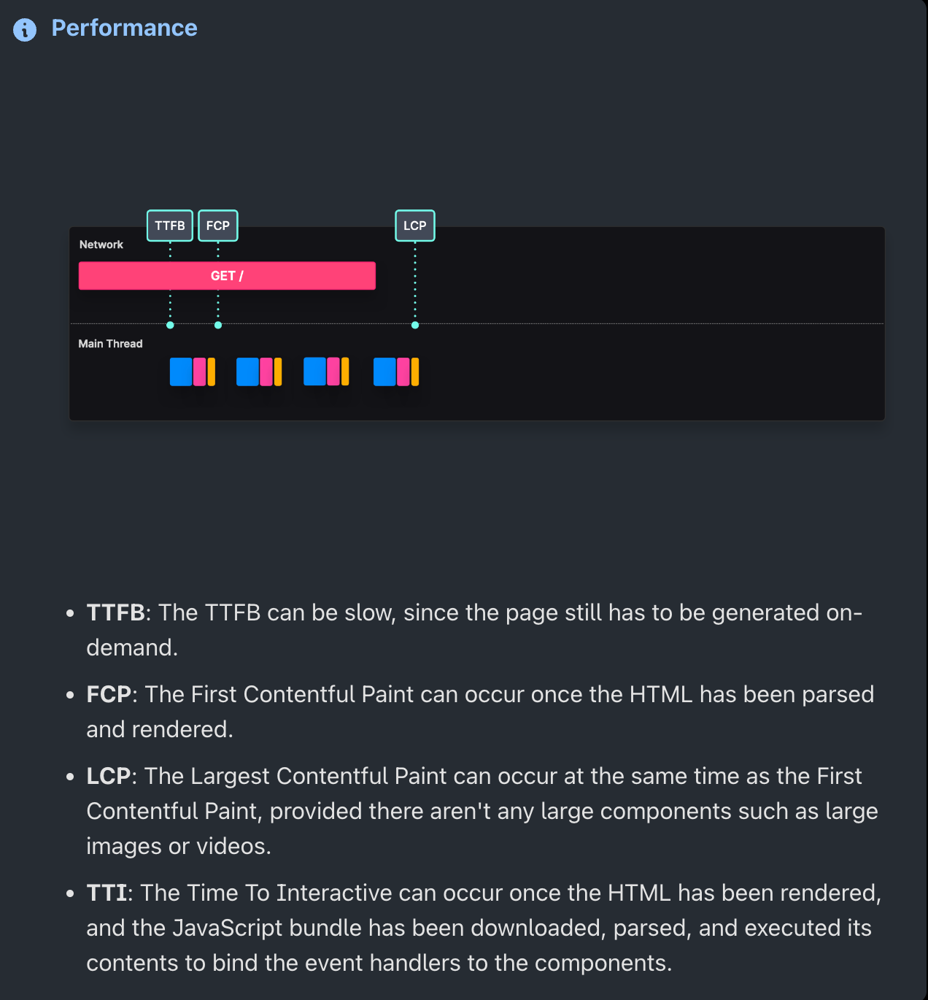

# A Tour of JS Patterns

- https://javascriptpatterns.vercel.app/patterns/design-patterns/singleton-pattern
- https://frontendmasters.com/courses/tour-js-patterns/
- https://www.patterns.dev/
- https://leanpub.com/composingsoftware
- https://www.theavocoder.com/
✅ ⚠️ ⛔

### Module Pattern
✅ encapsulation: controls public/private footprint
✅ reusability: can be used in entire app

`type="module"` or use `.mjs` extension

### Singleton Pattern
Use case: ensure a single DB connection
✅ memory: can save memory for one instance
⚠️ unnecessary: ES2015 modules are singletons
⚠️ dependency hiding: it's not clear that you are using a singleton
⚠️ global scope pollution: they are global vars
⚠️ testing: reset after every test

Make sure to export the instance not the class and freeze objects.

```
// 2. Freeze the object using the `Object.freeze` method, to ensure the object is not modifiable.
const singletonCounter = Object.freeze(counterObject);

// 3. Export the object as the `default` value to make it globally accessible.
export default singletonCounter;
```

### Proxy Pattern
Use case: validation, logging, formatting, notifications, debugging
- https://developer.mozilla.org/en-US/docs/Web/JavaScript/Reference/Global_Objects/Proxy

✅ Control: see use cases
⚠️ Long handler execution can cause performance problems

Reflect returns a truthy value which is important for proxies.

### Observer
✅ separation of concerns, loose coupling
⚠️ notifying all observers can take a lot of time if it becomes complex or if there are too many observers to notify

Could parallelize if promises or similar.

- https://frontendmasters.com/learn/async-rx-js/

### Factory
✅ DRY
⚠️ Not very memory efficient or useful in js

A function that returns objects

### Prototype
✅ memory efficient. Items are stored on the prototype rather than each instance
⚠️ Readability. With multiple extensions it's hard to see where properties came from.

`__proto__` shows prototype

### Container/Presentation Pattern
Separate logic from the view.
✅ separation of concerns. the presentation can be pure functions
✅ reusability. views don't affect state
✅ testing, eay pure functions
⚠️ Not necessary with hooks, they achieve the same thing
⚠️ overkill for smaller applications

### HOC
Wraps a component and adds props, extracts logic 
✅ separation of concerns
⚠️ naming collisions 
⚠️ readability

## Render Props
Passing components as props to other components
✅ Reusability
✅ Separation of concerns
✅ Solution to HOC problems
⚠️ Unessesary with hooks

## Hooks
Add state to functional components, reuse stateful logic, and manage component lifecycle.

✅ Simplifies components
✅ Reusing stateful logic
✅ Sharing non-visual logic
✅ Good alternative to older react design patterns.
⚠️ Rules of hooks. 

## Provider Pattern
A HOC that allows passing a context. 
✅ scalability
⚠️ components that consume the provider context re-render whenever a value changes

## Compound Pattern
Multiple components work together for a single task.
✅ State management, compound components manage their own internal state and share with children.
✅ single import
⚠️ Nested components. Only direct children have access to props
⚠️ Naming collisions. Cloning performs a shallow merge.

## Bundling/Tree-shaking/compiling

### Bundlers
Bundles the application in one or multiple files, making it possible to run in other environments.
-   [Webpack](https://webpack.js.org/) (We'll be using this one in the following examples)
-   [Parcel](https://parceljs.org/)
-   [Rollup](https://rollupjs.org/guide/en/)
- https://frontendmasters.com/learn/webpack/

### Compilers
Converts javascript or Typescript into another version. 
-   [Babel](https://babeljs.io/)
-   [TypeScript](https://www.typescriptlang.org/)

### Minifiers 

Reduce the size by removing comments, making variable and function names smaller, removing white space, etc.
-   [Terser](https://terser.org/)
-   [Uglify](https://www.uglifyjs.net/)

### Combination
There are tools that combine the steps
-   [SWC](https://swc.rs/) - a Rust-based compiler, bundler, and minifier
-   [ESBuild](https://esbuild.github.io/) - a Go-based compiler, bundler, and minifier.

### Bundle Splitting
Creating multiple, smaller bundles rather than one large bundle. 

### Tree shaking
Dropping unused code

## Static Import

Importing code exported by another file. As long as you only import used classes it can only bring in what is needed.

```
import module1 from './module1'
```

✅ loading instant dependencies. They are compiled this way
✅ optimizations. Statically imported modules are analyzed and tree-shaked
⚠️ Large bundle size. If importing all, you might bring in unneeded code

## Dynamic Import

Import code on demand. Static imports are bundled and included. Dynamically imported is the run time, when the user interacts.

✅ Faster initial load.
⚠️ Layout shift. The dynamic layout can shift.
⚠️ User experience. Lazy loading needs an initial render, which may be long.

## Import on Visibility
Load non-critical components when they are visible.
- https://developer.mozilla.org/en-US/docs/Web/API/Intersection_Observer_API
- https://www.npmjs.com/package/react-intersection-observer
- 

✅ Faster initial load.
⚠️ Layout shift. If the fallback component differs the layout will shift.

## Route Based Splitting

Dynamically load components based on the current route.

✅ Faster initial load.

## Browser Hints

Use hints to tell the browser about (optionally) critical resources.

### Prefetch
Fetch and cache the resources that may be requested soon.

```html
<link rel="prefetch" href="./about.bundle.js" />
```

```typescript
const About = lazy(() => import(/* webpackPrefetch: true */ "./about"));
```

✅ loading time
⚠️ unnecessary. If the user never needed the resource, it was extra.

### Preload
Inform the browser of critical resources before they are discovered.

Will fetch no matter what.

```html
<link rel="preload" href="./search-flyout.bundle.js" />
```

```typescript
const SearchFlyout = lazy(() =>
  import(/* webpackPreload: true */ "./SearchFlyout")
);
```

✅ loading time
✅ layout shift. preloading styles, fonts, and images can reduce layout shifts.
⚠️ performance. they get fetched regardless of need. Only preload items that are instantly necessary.

## Rendering

- https://www.theavocoder.com/blog/rendering-patterns

### Web Vitals

|Key| Name | Description |
| --- | --- | --- |
| TTFB | Time to First Byte | Time it takes for a client to receive the first byte of page content |
| FCP | First Contentful Paint | Time it takes the browser to render the first piece of content after navigation |
| LCP | Largest Contentful Paint | Time it takes to load and render the page's main content | 
| TTI | Time To Interactive | Time from when the page starts loading to when it's reliably responding to user input quickly |
| CLS | Cumulative Layout Shift | Measures visual stability to avoid unexpected layout shift |
| FIP | First Input Delay | Time from when the user interacts with the page to the time when the event handlers are able to run |

> **Compiling**: Converting JavaScript into native machine code
> **Execution time**: The time it takes to execute the previously fetched, parsed, and compiled data
> **Hydration**: Attaching handlers to a DOM node whose HTML contents were server-rendered, making the component interactive
> **Idle**: The browser's state when it's not performing any action - **Loading time**: The time it takes to fetch the data from the server
> **Main thread**: The thread on which the browser executes all the JavaScript, performs layout, reflows, and garbage collection
> **Parsing**: Converting an HTML source into DOM nodes, and generating an AST
> **Processing**: Parsing, compiling, and executing the previously fetched data
> **Processing time**: The time it takes to parse and compile the previously fetched data
> -- https://javascriptpatterns.vercel.app/patterns/rendering-patterns/introduction

### Client-side rendering
SPAs, the client does the rendering.



✅ Interactivity
✅ Single server roundtrip
⚠️ Bundle size
⚠️ SEO

### Static rendering
Deliver pre-rendered HTML content that was generated when the site was built.


✅ Cacheability. Can be used with a CDN.
✅ SEO
✅ Availability. Always online
✅ Backend load.
⚠️ Dynamic data. If there is dynamic data it can be a long LCP.

### Dynamic data
Adding dynamic data to static pages. Frameworks such as Next.js support it. 

 

✅ Static benefits.
✅ Dynamic data.
⚠️ Redeployment is needed to refresh data.
⚠️ Long build times.

### Fetching dynamic data client side

Using client-side fetch to add dynamic data.

 

✅ Static benefits.
⚠️ Server costs
⚠️ Layout shifts

## Incremental Static Regeneration

Pre-render certain pages, and render others on demand.

 

✅ Static benefits.
⚠️ Server costs

## Server-side rendering

With server-side rendering, we can generate HTML on the server on every request.

 

✅ Personalized pages.
✅ Render blocking.
⚠️ Initial load. Optimize with db queries and cache control.
⚠️ Availability. If a region goes down, so does your website.

### Streaming server-side rendering

Generate HTML on every request, sending it down piece by piece

 

✅  Performance regardless of the page size. 
✅ Network backpressure. 
⚠️ Support. Not all runtimes support HTTP streaming.
