https://mammothclub.com/course-learn/definitive-comptia-network-certification-n10-009-bundle-20-with-10-practice-exams-1/13287-01-01-01-introduction-to-networking

## Communication Types

- unicast (email)
- broadcast (video stream)
- multicast - receive data sent to group address. e.g. streaming and multimedia
- anycast - assigned to multiple devices and data is routed to the nearest with the ip. e.g. load balancing

## Network Models and Topologies

- OSI model: theroetical framework developed by ISO, dividing into 7 layers
  - Physical layer - transmission and reception over a physcial medium.
    - Modem.
  - Data link layer - provides error detection and correction.
    - NIC, Switches
  - Network layer - manages routing and forwarding packets between devices across different networks.
    - Routers
  - Transport layer - end to end communication, reliability, and error recovery between devices.
    - Gateways
  - session layer - manages and establishes sessions or connections of applications between different devices.
    - Software components
  - presentation layer - translate data between application and lower layers ensuring compatibility.
    - Software components
  - application layer - provides network services directly to end users or applications, ftp or email. - Computers, Servers, Applications
- TCP/IP (Transmission Control Protocol)
  - link layer - equivelent to physical and data link layers
  - internet layer - equivelent to OSI network layer
  - transport layer - similar to OSI transport layer
  - application layer - similar to session, presentation, and application layers in OSI models

### RM (Reference Model)

Simplified version of OSI model. 4 layers

- 1: Network access layer.
  - phsical connection and transport
  - NIC, switches, bridges, ethernet, Wi-Fi
- 2: internet layer.
  - handles routing and path determination
  - routers, IP, ICMP
- 3: transport layer
  - e2e communication between devices
  - flow control
  - sanitization
  - gateways, TCP, UDP
- 4: application layer
  - network services for end users
  - computers, servers, appliations, HTTP, SMTP, FTP, HTTPS

### Workgroup

- peer-to-peer networking
- decentralized management
- ease of setup

### Domain

- A network conrfiguration characerized by a centralizxed server that manages user authernication, access control and resource sharing.
- Scalability

### Netork Topologies

Referws to the phisical and logical layout of devices and the way they are interconnected

Physical

- Bus topology - datga travels along a bus and all devices read the data
  - single comm line
  - simple structure
  - shared comm medium
  - ethernet technology
- Star topology - all devices connect to a central hub or switch. e.g. home wifi
  - centralizxed hub or switch
  - easy management
  - scalability
  - dependence of central hub
- Ring topology - All connected in a closed loop. Data moves from one to another.
  - Closed loop, circular
  - data flows in one direction
  - fault tollerance challenges
  - simple structure
- Mesh topology - Devices are connected with multiple paths, if one fails, another will work
  - redundency
  - scalability

Logical

Are connected with how data appears to flow within the network, irrespective of the physcial layout

- Bus
- star
- ring
- mesh

Wireless

- Infrastructure mode
- Ad-hoc mode
- mesh topology (wireless mesh)

## Network Components

Hardware

- Router
  - connects different networks
  - makes decisions based on the address of the data
- Switches
  - Function within a local area network
  - Manage the flow of data within a specific network
- Network Cables
  - Establish phsical connections in a network
  - Quality and type inpacts the speed and reliability of data transmission
- Nodes
  - Devices within a network
  - They can send and receive data within a network

Software

- Operating System (OS)
  - Manages computer hardware and provides services for computer programs
  - Acts as intermediary between users and computer hardware
- Web browsers
  - Allow users to access and interact with the world wide web
  - Interpret and display web pages
- Database Management Systems (DBMS)
  - Manage and organize data in databases
  - MySQL, Oracle, Postgres

Network Services

Invisible architects and traffic mangers ensuring that this flow is efficient, secure, and well coodrinated.

- Communication Services
  - TCP
  - IP
- Security Services
  - Firewalls
  - Intrusion Detection Systems (IDS)
  - Encryption protocols
- Management Services
  - Simple network management protocol (SNMP)

## Standards

A set of rules, specifications, or guidelines that define how components of a network should operate.

- Consistency
- Interoperability
- Scalability
- Security - SSL, TLS
- Facilitating innovation - baseline to build on

Examples

- Ethernet
- Wi-Fi (IEE 802.11)
- TCP/IP
- HTTP and HTTPS

Standards Ogranizations

Entities that develop and establish guidelines, rules, and specifications to ensure interoperability, compatability, and reliability of network technologies.

- International Organization for Standardization (ISO)
- Institute of Electrical and Electronics Engineers (IEEE)
- Internet Engineering Task Force (IETF)
- International Telecommunication Union (ITU)
- Electronic Industries Alliance (EIA)

IEEE Network Standards

Plays a pivotal role in developing and maintaining standards for various technologies, including those related to computer networking.

- IEEE 802 family
  - IEEE 802.3 - ethernet
  - IEEE 802.11 - Wi-Fi
    - 802.11a, 802.11b, 802.11g, 802.11n, 802.11ac, etc.
  - IEEE 802.1Q - Virtual LANs (VLANs)
  - IEEE 802.15 - Wireless Personal Area Network (WPANs), bluetooth, zigbee
  - IEEE 802.16 - WiMAX - wireless over long distance

## 10Base Standards

Series of networking standards used in ethernet networks

- "10" indicates a network speed of 10 megabits per second
- "Base" represents the type of cabling used in the network

### 10Base-2 (Thinnet)

- Bus topology
- Thin coaxial cable
- 185 meters segment length
- 30 nodes per segment
- Baseband (Digital signaling)

### 10Base-5 (Thicknet)

- Bus topology
- Thick coaxial cable (RG-8)
- 500 meters
- 100 nodes per segment
- Baseband
- More challenging to install due to thickness

### 10Base-T

- Star topology
- Twisted pair (Category 3 or higher)
- 100 meters segment length
- 2 nodes per segment (point-to-point connection)
- Baseband

### 10Base-F (Fiber Optic)

- Star topology
- Twisted pair (Category 3 or higher)
- 100 meters segment length
- 2 nodes per segment (point-to-point connection)
- Baseband

## Ethernet

- Widely used networking technology that defines the physical and data link layers of the OSI model.
- Provides a standard for connecting computers and devices on a local area network
- Simple, scalable, and versitile
- CSMA/CD Protocol - stops collisions, uses backoffs
- Frame structure - discrete units. Source, dest, ac addresses, data payload, error chekcing bits, etc.
- Data rate and media types - 10/100/1000mbps

### Ethernet Frames

- fundamental units of data transmission in ethernet networks
- Encapsulates the data to be transmitted, along with the essential control information

### Components of Ethernet Frame

- Preamble, alternating 1 and 0 at the beginning for synchronizing with the bit stream
- Start Frame Delimiter (SFD), marks the end of the preamble and beginning of the frame
- Destination and Source MAC Addresses, identifies the sender and receiver
- Lenght/Type field, indicates length of data or type of protocol
- Data payload, info transmitted
- Frame Check Sequence (FCS), allows for error checking

Variations: Ethernet II Frame (DIX Ethernet) and 802.3 Frame (IEEE Ethernet)

## MAC Addresses

Media Access Controller

A hardware address associated with the physcial network interface of a device.

Format

- 48-bit alphanumeric value
- Represented as six groups of two hexadecimal digits separated by colons
- First half/24 bits usually identifies the manufacturer
- E.g. 00:1A:2B:3C:4D:5E

Uniqueness

- 2^48 possible combinations
- Two devices rarely have the same MAC address
- Ensures that each device on a network can be reliably identified

Function

- Devices on a local network use the MAC address to communicate on the same subnet

Mac Addresses and Switching

Enables switches to forward data only to the port where the recipient device is connected, reducing uneccsary traffic

- LAN communication
- Switching in Action
- Changing MAC Addresses. Some allow changes for privacy and security.

## Access Methods

Refer to the set of rules and protocols that govern how network devices, particularly computers, gain access to the network medium for transmitting data.

- Efficient resource utilization
- Fairness
- Minimization of collisions

Common Access Methods

- Carrier sense multiple access with collision detection (CSMA, CD). common in ethernet, 10Base-T
- Carrier sense multiple access with collision avoidance (CSMA/CA). Wireless. Devices send channel before transmission and use methods to avoid collisions. Detecting is more challenging.
- Token passing. Special data packet circulates the network, only the device with the token can transmit data. Token ring network.
- Polling. Central controller polls and allows transmissions. Legacy.

## OSI Reference Model (OSI/RM)

- Developed by ISO
- 7 layers

Upper Layers

- Application, presentation, and session are primarily concerned with user experience.

Lower Layers

- Physical layer, Data link layer, Network layer.

## Network Communication

- Protocols
- Data Transmission
- Devices
- Media
- Topologies
- Addressing
- Routing

### Cabling

- Ethernet cables
  - Twisted pair
    - UTP (Unshielded Twisted Pair)
    - STP (Shielded Twisted Pair), extra shielding to prevent Electromagnetic Interference
    - Cat 5e. Up to 1g / sec
    - Cat 6
    - Cat 6a. 10g/sec or more
    - Cat 7
- Fiber Optic. Uses light
  - Single mode. Longer distances
  - Multi mode. Best for shorter distance
  - LC,SC,ST,MTP/MPO are different types of connectors. Differ in size and simplicity.
- Coaxial cables.
  - Cable
  - CAT TV

### Connectors

- RJ45 Connector: Standard for ethernet, 8 pins.
- Fiber Optic Connectors: Lucent Connector (LC), Subscriber Connector (SC), and Straight Tip (ST)
- BNC Connectors: Used for coaxial, especially older ones in a T connector configuration
- USB (Universal Serial Bus) Connector. Commonly used to connect devices and networking equipment. USB A, USB B, USB C
- MTP / MPO : fiber lines, connected in single connector
- Modular: phone and data. RJ45. RJ11.

### Transmission Methods

Serial vs. Parallel

- serial: bit transmission, pathway, speed, applications.
  - 1 bit at a time
  - single path
  - slower
  - Better for long distance, fewer wires, simplicity, less prone to interference.
- parallel: cabling consumption, speed advantages and disadvantages.
  - multiple bits over channels at once
  - can send and receive concurrently
  - faster transfer
  - short distance using parallel bus
  - cabling consumption requires extra wires
  - high speed
  - several bits processed at once
  - complex
  - signal interference

Baseband vs. Broadband

- baseband.
  - digital signal.
  - full bandwidth, uses entire channel for single signal
  - localized, short distance
  - ethernet
  - simple, low interference
  - signal loss means long distances don't work, one signal at a time
- broadband.
  - modulated analog signal.
  - numerous frequency ranges for bandwidth
  - simutaneous transmission of multiple signals
  - voice, video, and data over the same channel
  - cable tv uses broadband
  - high data speed, numerous signals at once
  - complexity, interference risk

### Twisted Pairs

- Cable used in networking which consists of paired-insulated twisted-wires
- Helps reduce the electromagnetic interference
- connectors terminate and connect
  - RJ45 (registered jack). Ethernet, 8 pin Unshielded twisted pair cables. 8 positions, 8 contracts, modular plug configuration
  - RJ-11. telephone lines. 6 positions, 4 contacts. smaller than RJ45, smaller guage cables, cat3 or similar.
  - T568A, T568B are for ethernet standards

### Copper Media Types

Most devices can use either, but the same must be used on both ends.

| T568A        | T568B        |
| ------------ | ------------ |
| White/Green  | White/Orange |
| Green        | Orange       |
| White/Orange | White/Green  |
| Blue         | Blue         |
| White/Blue   | White/Blue   |
| Orange       | Green        |
| White/Brown  | White/Brown  |
| Brown        | Brown        |

## Data Access Methods

- circuit switching
  - dedicated path between two devices for the duration of the conversation. e.g. Telephone networks
- packet switching
  - breaking down data into smaller packets before transmission
  - sent independently
  - reassembled on the receiver
  - IP protocol
- message switching
  - older method
  - entire message sent
  - intermediate nodes store and forward the complete message resulting in delays
- frame relay
  - high speed packet switching operating at the data link layer
  - commonly used in LAN or WAN
- ATM (Asynchronous Transfer Mode)
  - fixed sized cells for data transmission
  - combines elements of circuit switching and packet switching
  - high speed networks
- Ethernet
  - Widely used LAN
  - connection based
- Token Ring
  - Devices are connected in a ring or star topology
  - A token is passed around the network and only the device holding the token can transmit data
- Wireless Access Methods
  - CSMA/CA
  - TDMA (Time Division Multiple Access)

### Digital Signals

Representation of data using binary codes.

- Devices such as computers, routers, and switches use digital
- `0` represents low voltage and `1` represents high voltage
- reliable
- noise immune
- allow for efficient error detection and correction, making it robust
- Ethernet, Wi-Fi, etc.

### Media Converters

- Devices used in networking to enable communication between different network media
- They facilitate connectivity in mixed-media environments

### Transceivers

- Transmitter-receiver
- Often used in computers with NIC cards
- enable sneding and receiving data

### Demarcation Point

- The physical or logical point where the responsibility of the service provider's network ends, and the customers network begins

### LAN Components

- Routers
- Access Points
- Firewalls
- Network Interface Cards (NIC)

### Wiring a Workstation

- Planning
- Selecting cable type
- Measuring and cutting
- Terminating cables
- Installing wall outlets
- Routing cables
- Connecting to patch panels
- Connecting to switches
- Testing
- Documentation

## TCP/IP

Developed by the U.S. Department of Defense in the 1970s, fundamental in modern communication.

- Transmission Control Protocol (TCP): reliable communication
  - Connection-oriented protocol
  - Reliable delivery, using segments with numbers of the correct order
  - Error chekcing, corrupt segments are discarded and requested again
  - Flow control, rate of exchange is adjusted with sliding window
- Internet Protocol (IP)
  - Addressing: unique identifiers
  - Routing

### Layers

- application layer: provide services to end users via HTTP, FTP, Telnet, SMTP, POP3, IMAP, SNMP, DNS, DHCP
  - user interface from the network and the end user
  - application services such as email, file transfer, web browse
  - protocols and standards: HTTP, FTP, SMTP, DNS
  - port numbers
  - data representation and encryption
  - network virtual terminal
  - file transfer and management
  - email services
  - security and encryption
- transport layer: e2e communication
- internet layer: handles addressing, routing and fragmentation of data packets
- link layer: concerns about physical connections between devices

### Core Protocols

- IP: addressing and routing packets of data across networks
- TCP: connection oriented protocol providing reliable, ordered, and error-checked delivery of data
- UDP: User Datagram Protocol: connectionless protocol providing faster but less reliable communication compare to TCP
  - connectionless
  - faster
  - unreliable data delivery
  - low overhead
  -
- ICMP: Internet Control Message Protocol, supports network diagnostics and error reporting for IP
- IGMP: Internet Group Management Protocol, used by hosts and adjecent routers for multicast groups
- ARP: Address Resolution Protocol, resolves IP adresses to hardware addresses (e.g. MAC addresses) on a local network
- DNS: Domain Name System: resolves human-readable domain dnames to IP addresses

## Socket

- software abstraction
- programming interface for network communication
- establish communication channels
- IP Address maps to socket
- Each socket has a port number
- Transport protocol: TCP/UDP
- Stream Sockets (TCP), continuous stream in order
- Datagram Sockets (UDP), connectionless, unreliable, order is not guarenteed

Lifecycle

- Socket creation
- Binding
- Listening (TCP)
- Connection Establishment (TCP)
- Communication

Application of Sockets

- Process communication
- Muliplexing with ports
- Transport protocol selection
- Internet communication
- Server-client communication
- Networked applicaitons

Internet Layer

Addressing and routing.

- addressing
- routing
- IP
- Fragmentation and reassmbly
- ICMP: error reporting. PING and TRACEROUTE
- Address resolution
- IPv6 Transition
- Multicast and multiregional support

IP Datagrams

Basic unit of data in the IP protocol.

- header
- payload
- routing and network communication
- fragmentation for variable network sizes
- support for different transport protocols
- internet scalability

## Well Known Ports

System ports reserved for standard services ranging from 0 to 1023

- 20 and 21 (FTP)
- 22 SSH
- 23 Telnet
- 25 SMTP
- 53 DNS
- 80 HTTP
- 110 POP3
- 143 IMAP
- 443 HTTPS
- 3389 RDP

challenges

- limited
- port number collisions
- dynamic and unpredictable prot usage
- security concerns
- port scanning and enumeration
- port blocking by ISPs and firewalls

## IP Addresses

Can be public or private, using IPv4 or IPv6, using dotted-decimal notation.

## Subnet Masks

- IP Address Components, network and host
- Subnet mask, similar to IP, in binary
- netowrk portion and host portion
- subnetting. divides a network
- bitwise AND determines the network and host. Use AND on the subnet mask and IP

## IPv4

- 32-bit structure
- dotted decimal notation
- public and private addresses
- classful and classless addressing. Class A/B/C, CIDR is classless
- Subnetting
- reserved addresses for special purposes.
  - 0.0.0.0 or 127.0.0.1 loopback
  - 169.254.0.0 - 169.255.255 for private addresses when no DHCP
  - 192.0.2.0 - 192.0.2.255 for documentation and example
  - 244.0.0.0-239.255.255.255 for multicast addresses
- address exhaustion

## Valid Masks

- Consistent prefix: 1 bits by 0 bits.
- prefix length: length determines the size of network, number after slash is number of bits. /24 subnet
- CIDR notation: subnet notation, ip address/prefix length. 192.168.1.0/24, network with subnet mask of 255.255.255.0
- Binary representation: binary representation, 1 is network and 0 is host
- Network and host identification: 1 bits is network, 0 is host
- subneting

## Default Gateway

- Crucial for computer to computer networking
- Typically a router or a layer 3 switch
- Acts as a bridge to connect different netorks
- Routes data: to talk to a dest network, goes through default gateway
- Internet connectivity
- Subnet mask comparison: is layer 3 and uses the subnet mask to determine if the address in on the same network or a different one

Configuration

- Static configuration
- DHCP (Dynamic Host Configuration Protocol)

Troubleshooting

- Check gateway configuration
- make sure devices can ping default gateway

## IP Address

IPv4

32-bit decimal

66.94.29.13 -> 01000010.01011110.00011101.00001101

| Decimal | 128 | 64  | 32  | 16  |  8  |  4  |  2  |  1  |
| ------: | :-: | :-: | :-: | :-: | :-: | :-: | :-: | :-: |
|      66 |  0  |  1  |  0  |  0  |  0  |  0  |  1  |  0  |
|      94 |  0  |  1  |  0  |  1  |  1  |  1  |  1  |  0  |
|      29 |  0  |  0  |  0  |  1  |  1  |  1  |  0  |  1  |
|      13 |  0  |  0  |  0  |  0  |  1  |  1  |  0  |  1  |

IPv6

128-bit hexidecimal address, each hex character represents 4 bits. Hex is single digits, using A-F after 9.

| Decimal | Hex |
| :-----: | :-: |
|   10    |  A  |
|   11    |  B  |
|   12    |  C  |
|   13    |  D  |
|   14    |  E  |
|   15    |  F  |

76DC:4F59:34CF:71CD:9DC6:89CD:45D6:67A2

|  8  |  4  |  2  |  1  | Hex |
| :-: | :-: | :-: | :-: | :-- |
|  0  |  0  |  1  |  0  | 2   |
|  0  |  1  |  1  |  0  | 6   |
|  1  |  1  |  0  |  1  | D   |
|  1  |  0  |  1  |  1  | B   |

## Windows

`ipconfig /all`

## Public Addresses

- Globally unique addresses assigned by internet authorities
- Routable: connect different networks
- Used for devices accessible anywhere on the internet
- assigned by authorities: regional internet authorities or internet service providers

## Private Addresses

- Reserved for private networks
- e.g. 192.168.x.x, 172.16.x.x
- Used for internal communication with a local network
- local only
- non-routable
- address reuse: different networks can have the same address
- routers uses NAT

## Classable Addressing

- fixed allocations: fixed division of bits for network and host, the rigid structure led to predetermined address space for each class
- inflexible structure: many orgs had more than they needed leading to shortages
- routing challenges: fixed size contributed to growth of global routing table and inefficiencies
- hierarchial system: organized routing in growing ecosystem

### Class A

Designed for large organizations, few available

- **Range**: 1.0.0.0 to 126.0.0.0
- **Network/Host Split**: first octet is network, the rest are hosts
- **Number of Networks**: 128 (2 ^ 7)
- **Number of Hosts per Network**: approx. 16 million

### Class B

Medium sized organizations

- **Range**: 128.0.0.0 to 191.255.0.0
- **Network/Host Split**: first two octets is network, the rest are hosts
- **Number of Networks**: 16,384 (2 ^ 14)
- **Number of Hosts per Network**: approx. 65,000 (2 ^ 16-2)

### Class C

small organizations

- **Range**: 192.0.0.0 to 223.225.0.0
- **Network/Host Split**: first three octets is network, the rest are hosts
- **Number of Networks**: 2,097,152 (2 ^ 21)
- **Number of Hosts per Network**: approx. 254 (2^8-2)

## Classless Addresses: CIDR (Classless Into Domain Routing)

- overcvomes limitations of the class system
- includes address and subnet mask
- Variable-Length Subnet Masks (VLSM): allows more flexible routing
- Prefix Notation: ip address / significant bits in network portion. e.g. 192.168.1.0/24 is class C with subnet of 255.255.255.0
- Aggregation: reduces size of routing tables on internet. Combines blocks into single useable blocks
- efficient address allocation: allows for networks of different sizes

## Subnetting

- Division of IP address space into smaller, more manageable subnets
- Ensures improved utilization of address space, network segmentation, and enhanced security
- Each IPv4 address is 32 bits, divided into 4 octets
- /24 -> 24 bits for network, 8 for host. 32 - 24 = 8

Steps

1. Define the IP Address Range, typically provided by ISP or chosen by organization
1. Choose a subnet mask based on size and requirements. Common /24 (255.255.255.0), /16 (255.255.0.0), /8 (255.0.0.0)
1. Determine the number of subnets and how many hosts needed per subnet
1. calculate the subnet mask and subnet size. e.g. 8 subnets with 30 hosts each, allow at least 32 hosts. /27 (2^5 = 32)
1. assign subnet addresses. Divide your network into subnets based on the subnet mask. Assign each subnet a specific range of ip addresses, ensure no overlap and reserve for network and broadcast addresses.
1. update routing tables and configs on routers and devices
1. allocate ip addresses to devices, being mindful of each subnet mask
1. document subnet allocation. network ids, subnet masks, address ranges, number of available hosts

### Simple

- a method of dividing a larger IP address space into smaller, equal-sized subnet works or subnets
- used when network is uniform and straightforward

1. Define the IP Address Range, typically provided by ISP or chosen by organization
1. Choose a subnet mask based on size and requirements. Common /24 (255.255.255.0), /25 (255.255.255.128)
1. Determine the number of subnets and how many hosts needed per subnet
1. calculate the subnet mask and subnet size. e.g. /24 has 256, smaller /26 -> 64 addresses, or /27 -> 32 addresses
1. assign subnet addresses. Divide your network into subnets based on the subnet mask. Assign each subnet a specific range of ip addresses, ensure no overlap and reserve for network and broadcast addresses.
1. update routing tables and configs on routers and devices
1. allocate ip addresses to devices, being mindful of each subnet mask
1. document subnet allocation. network ids, subnet masks, address ranges, number of available hosts

### Complex

- More intricate into smaller, unequally sized subnets
- flexible

1. Define the IP Address Range, typically provided by ISP or chosen by organization
1. Choose a subnet mask based on size and requirements. Multiple masks.
1. Determine the number of subnets and how many hosts needed per subnet
1. assign subnet addresses. Divide your network into subnets based on the subnet mask. Assign each subnet a specific range of ip addresses, ensure no overlap and reserve for network and broadcast addresses.
1. update routing tables and configs on routers and devices
1. allocate ip addresses to devices, being mindful of each subnet mask
1. document subnet allocation. network ids, subnet masks, address ranges, number of available hosts
1. Address growth and future planning
1. Optimization and efficiency

## Auto Configuring IPv6

- Stateless Address Autoconfiguration (SLAAC): devices configure their own address based on info from the router, RA messages. DHCP is not required.
  - Router Advertisement (RA): messages sent by router with important configuration information
  - Address Configuration by devices: after receiving RA messages, using network info, append their own identifier, based on MAC or random
  - No DHCPv6 server required
- Stateful Address Autoconfiguration (DHCPv6): a DHCPv6 server is used to provide addresses and other configuration details. More granular control.
  - DHCPv6 is required, assigns address and configs
  - Address assignment: when a device joins it sends a request, the server responds with an address and config
  - Address configuration: can pass config such as DNS, domains, etc
  - Combination with SLAAC: can be combined.

## Devices

Physcical or virtual entities that handle communication in a network.

- Routers
  - layer 3
  - routing capability
  - makes decisions based on ip addresses
  - NAT to map addresses to a single public address
- switches
  - layer 2
  - use MAC addresses to forward data only to the intended recipient
  - connects devices in a LAN
  - VLAN support
  - STP prevents loops
  - types
    - unamanged: simple, plug and play
    - managed: higher level of control, configs, features
    - layer 2: forward data in a LAN based on MAC addresses
    - layer 3: combine switch and routers, routing with MAC and ip addresses, connecting different networks
    - power over ethernet (PoE): ip cameras, VOIP, etc. provides power and data
      - POE standards: IEEE 802.3AF, IEEE 802.3AT PoE+, IEEE 802.3BT 4BPoE define power levels.
      - device compatability: supported by many devices
      - simplified installation
      - remote power management
    - stackable: interconnected and unified. scalability
    - data center: high performance environments, high port densitiy, and low latency
    - enterprise switches: large scale enterprises, advanced security, redundency, and diverse protocols
    - address learning: maintain a mapping of ports and MAC addresses
    - forwarding: direct forwarding frames is efficient
    - filter: precise control of traffic, enhanced security
    - collision domains: isolate data to segments minimizes collisions
    - full duplex communication: reduces latency
    - VLAN support: logical segmentation
  - initial config
    - management interface configuration: switch ip, subnet and gateway address
    - hostname assignment: user friendly ID
    - user authentication and access control: only authorized users can access
    - VLAN config: assign devices to VLANs
    - port config: speed, duplex mode, etc.
    - STP (spanning tree protocol) config: identify and block network loops, preventing broadcast storms
      - loop prevention
      - redundent paths and selectively block them, using others as backup
      - bridge protocol data units (BPDU): comms between switches for path choice
      - dynamic topology adaption: adjusts as needed and recalculates trees
      - path blocking and unblocking: controls switch ports
      - broadcast domain control: isolates broadcast traffic between VLANs
      - port states
        - blocking state: no forwarding, listens to BPDU to determine best path
        - listening: starts transition to BPDU to learning state, not forwarding yet
        - learning: continues BPDU and learns addresses
        - forwarding: forwards to addresses
    - updating firmware and software: security and improvements
  - steps
    - physical connection
    - console connection (optional): if it has a port connect to a terminal, such as PUTTY
    - access switch: CLI or browser or SSH
    - set ip address if managed
    - security config: basic settings
    - VLAN config: if needed, create and assign ports and propertis
    - configure ports: speed, duplex, etc
    - STP: prevent loops
    - Quality of Service (QoS): prioritize traffic
    - save config
    - test connectivity: verify devices in same VLAN can connect
  - management
    - remote management
    - simple network management protocol (SNMP): admins collect info about performance remotely
    - syslog and logging: important events and errors
    - port security: MAC filtering, limit addresses
    - VLAN management: create, modify and delete VLAN
    - Network redundancy protocols
- hubs
  - layer 1
  - broadcast to all devices
  - lack intelligence
  - used to expand number of ports
  - more efficient switchees may be preferred
  - amplify signals
  - basic connectivity
  - types
    - active hubs provide power
    - passive (unpowered) are simpler and do not provide power
    - intelligent hubs
      - limited but can detect traffic and manage
- bridges
  - layer 2
  - NAC addresses to make decisions
  - connect segments
  - minimize data collisions on a segment
  - filtering
  - collision domains
  - transparent operation
  - learning and aging
  - improve performance
  - enhance reliability and redundency
  - security
  - simplified network design and scalability
  - types
    - LAN bridges - enhance performance
    - transport bridges - MAC filtering and invisible
    - source route bridges (SRB) - predetermined routes, token ring uses it
    - spanning tree bridges (STP) - avoid redundent links and network storms
    - remote bridges - distant networks without cabling
  - challenges
    - config complexity
    - scalability converns
    - compatabiliy issues
    - limiited support for advanced protocols
- gateways
  - translate between networks with different architectures, higher layers
  - different protocols
  - mimize datga collisions on a segment
- modems
  - modulate digital to analog and vice versa.
  - connecting to internet
  - layer 2
  - mimize datga collisions on a segment
- firewalls
  - filter network traffic
  - enforce security policies
- Network Interface Cards (NIC)
  - interface between the internal bus and network cabling
  - Ethernet NIC - wired, high speed
  - Wireless NIC - connect to wireless networks
  - Gigabit NIC - 1000 mb/s, hirer speed
  - Fiber Optic NIC
- Repeaters
  - extends the reach of a network by amplifying and retransmitting signals
  - signal regeneration
  - amplification of signals
  - overcoming distance limitations
  - interconnecting network segments
  - types
    - analog
    - digital
    - bi-directional
    - fiber optic
    - amplifiers
- data link filtering
  - process of selecting allowing or blocking frames
  - enhanced security
  - bandwidth optimization and performance
  - error detection and correction
  - efficiehnt resource utilization
  - types
    - positive filtering - allow only
    - neagtive filtering - block by default
  - techniques
    - MAC address filtering
    - VLAN filtering
    - protocol filtering
    - frame size filtering
    - error checking
  - challenges
    - configuration complexity
    - overhead on network performance
    - dynamic network environments
    - interoperability and standardization
- virtual capabilities
  - VLANS: logical segmentation of networks. Enhance security and efficiency
    - logical segments
    - traffic isolation: devices in same VLAN talk as if on the same network, outside requires routing
    - broadcast domain control: broadcast to only nodes on same network
    - improved performance
    - enhanced security
  - VRF: Virtual routing and forwarding: multiple virtual routers on a single router, operating independently. Isolation of traffic, valueable in multi-tenant situations.
  - VPN: Virtual Private Network, secured network, create secure, encrytped channels over a private network. Can connect remote networks securely.
  - Network function virtualization (NVF): create network components on standard hardware. expands firewalls, load balancers, and intrusion detection systems using software
  - virtual switching: used to create networks for virtualized infrastructures
  - software-defined networking (SDN): decouples control plane from data plane in networking devices. Allowing centralized control and programability.

## Trunking Protocols

Trunking: refers to the method of carrying traffic from multiple VLANs over a single link between switches

- VLAN tagging: ID traffic
- 802.1Q: VLAN tagging protocol
- Native VLAN: carries untagged frames, simplifying switch communication
- types
  - Dynamic Trunking Protocol (DTP): Cisco propiatary, negotiates trunking between switches, whether they are trunk or access links.
  - VLAN Trunking Protocol (VTP): Cisco, manages configs between switches
  - Link Aggregation control protocol (LACP): multiple physical links aggregates. load balancing

### RSTP (Rapid Spanning Tree Protocol)

- evolution of STP
- faster convergence: simplifies active topology with new port states and roles
- new port roles and port states
  - discarding, faster than blocking
  - learning
  - forwarding
  - root port
  - alternate port
  - backup port
- topology changes
  - direct transition to forwarding
- proposal and agreement mechanism
- variants: 802.1w - IEEE backward compatible
- multiple spanning tree protocol (MSTP) 802.1s

## Routing

Determines the optimal path.

- routers: layer 3
- routing algorithms: used by routers to detmine optimal paths for packet transmission
- routing tables: data structure about routes and paths
  - guides routers to best path
  - destination netowrk: maintains list of all destinations
  - next-hop information: what is the next hop
  - cost or metric: gives cost for a route using bandwidth, hub count, delay
  - routing protocol information
  - administrative distance: trust worthiness of a route
  - route type: direct, static, or dynamically learned
  - subnet mask or prefix length: longest prefix match
  - process
    - packet arrival: examines destination
    - routing table lookup: finds most specific match
    - subnet mask or prefix length: find the longest prefix match
    - next-hop determination: identiy next hop
    - packet forwarding: forward to next hop
- IP address: logical addressing to identify source and destination
- routing protocols: RIP (routing information protocol), OSPF (open shortest path first), BGP (border gateway protocol)
- routing tables update: dynamically updated based on network changes
- packet forwarding: forward to next hop in route
- Internet Control Message Protocol (ICMP): error reporting and diagnostics such as PING and TRACEROUTE

### Challenges

- routing loops
- routing instability
- suboptimal routing
- convergence delays
- scalability issues

## Network Segmentation

- enhanced security
- improved performance
- efficient network management
- scalability: neew segments can be added
- QoS: can be applied more effectively
- compliance: regulated/sensitive data
- fault isolation: one fault is minimizxed
- enhanced user experience: localized resources

## Static Routing

- manual configuration
- simplicity
- limited scalability
- resource efficiency
- fixed paths

## Dynamic Routing

- automatic route updates
- adapability
- complexity
- fast convergence
- resource utiliziation

## Routing Protocols

- route discovery: learn paths
- route selection: determine efficient path
- route maintenance: continuous monitor for best path
- convergence: stable and consistent state
- types
  - Interior Gateway Protocols (IGPs)
    - corporate netowrk
    - ISP network
    - RIP (routing information protocol)
    - OSPF (open shortest path first)
    - IS-IS (Intermediate System to Intermediate System)
    - EIGRP (enhanced interior gateway routing protocol), combines link state and distance
    - used within autonomous system, a collection of network devices under common admin with a consistent policy
    - topology exchange
    - dynamic updates
    - fast convergence
    - scalability
  - Exterior Gateway Protocols (EGPs)
    - different systems or corp to corp
    - BGP (border gateway protocol) is most widely used
    - inter-domain routing
    - policy based routine
    - path selection
    - scalability and stability
    - exterior gateway protocol was mostly replaced by BGP
    - path selection
    - scalability and stability
- distance vector routing protocols
  - RIP, ERGRP
  - based on number hops and routers.
  - Each router has a table with best path to each destination.
  - table contains distance metric to detinations and next hop router
  - routers exchange tables with neighbor routers
- link state protocols
  - OSPF, IS-IS
  - build a detailed map by exchanging link state advertisements (LSAs) within neighboring routers.
  - Each router constructs a complete map of the network and calculates a complete path of the shortest path to each destination using algorithms such as Dijkstra's shortest path
- path vector routing protocol
  - BGP
  - large scale networks, interdomain routing
  - relies on vectors on autonomous systems (AS)

## Metric

Used to measure the desireability of the route based on cost or efficiency.

- hub count
- distance
- admin

## VoIP (Voice over Internet Protocol) Phones

- voice and multimedia over a packaged switched internet
- voice is converted to digital
- categories
  - desk phones: look like traditional office
  - executive phones: larger screens and programmable
  - coordless: digital enhanced
  - conference: handle the room
  - softphones: computer installed
  - specialized: shared on temp workspaces or rugges/industrial
  - Analog telephone adapters (ATAs): traditonal analog converts to digital

## Load Balancers

Devices or software applicaitons that contribute network or application traffic across multiple servers.

- categories
  - hardware: physical appliances dedicated to network traffic across servers, with efficient managment
  - software: run on general purpose servers or VMs. Flexibility, scalability. Often in Cloud networks.
    - NGINX
    - HAProxy
    - Azure LB
  - cloud load balancers
    - multiple instances or services
    - scalability and flexibility
    - AWS ELB
    - Google Cloud Load Balancing
  - Application Delviery Controllers (ADC)
    - Akira Load Balanancer ADC
    - A10 Networks ADC
  - software-defined load balancers
    - modern, dynamic, and virtualized env
    - cloud native
    - AVI networks
    - NGINX ingress
  - container load balancers
    - designed for things like Kubernetes with dynamic scaling
    - Trafik
    - NGINX ingress controller
  - open source load balancers
    - control cost
    - customizeable
    - HAProxy
    - Pen Balance
- salability and performance optimizations
  - even workloads
- high availability and reliability
  - direct traffic away from failed resources
- cost-efficient resource utilization
  - optimal usagge
  - avoid overwhelming single resources
- security and SSL offloading
- traffic management and routing
  - server health
  - geo location
- adaptation to Cloud and Hybrid environments

## Traffic Shapers

    - bandwidth shapers
    - manage and shape data to keep networks efficient
    - bandwidth control: policies and priorities
    - traffic prioritization: higher or lower priority based on priority
    - congestion management: delay or prioritize to prevent bottlenecks
    - packet scheduling: organization transmission to avoid spikes
    - compliance with service level agreements (SLAs)

## Intrusion Prevention Systems (IPS)

Designed to monitor, detect and prevent malicious attacks.

- real-time monitoring
- threat detection: signature, heuristics, and anomaly detection
- response mechanisms: block or allow threats or connections
- integration with firewalls
- signature-based protection: known threats
- anomaly-based protection: unusual patterns
- categories
  - Network-based (NIPS)
    - network layer
    - prevent DOS attacks
    - may struggle to prevent subtle application layer attacks
  - host-based IPS (HIPS)
    - installed on devices
    - prevent malware
    - does not provide holistic view of network wide threats
  - wireless IPS (WIPS)
    - secure wireless networks
    - rogue access points
    - unauthorized devices
  - Network behavior analysis (NBA) IPS
    - analyze pattern of behavior and establishes a baseline
    - can have false positives
  - Virtual IPS (VIPS)
    - protect virtualized environments
    - specific integration requirements with platforms
  - Cloud IPS (CIPS)
    - monitor network and system activiy for security exploits and malicious activity
    - cloud infra and data
    - diverse platforms can vary
- network security enhancement
- threat prevention and mitigation
- comprehensive defense strategy
- incident response and forensics
- regulatory compliance

## Firewalls

A network security device or software that monitors and controls incoming and outgoing network traffic, based on predetermined rules.

- traffic monitoring
- access control
- network security policies
- proxy services
- logging and reporting
- intrusion prevention
- virtual private network (VPN) support
- application layer control
- categories
  - packet filtering
    - layer 3, inspect packets based on rules
  - proxy firewalls ( application layer)
    - layer 7
    - hides internal network details
  - deep packet inspection (DPI)
    - inspect contents and payloads
    - granualar control
  - Next gen firewalls (NGFW)
    - traditional with additional features: user tracking, IPS
    - more holistic
    - app controls
    - advanced threat detection
  - cloud firewalls
    - monitor and control data in cloud
    - cloud native
    - scalable
    - flexible
- risk mitigation
- network security
- access control and policy enforcement
- data protection and privacy
- prvention of network attacks
- secure remote access
- incident repsonse and forensics
- prevention of network attacks
- compliance and regulatory requirements
- access control
- packet filtering
- proxy and network address translation (NAT)
- Deep packet inspection (DPI)
- IPS may be combined
- VPN support
- logging and auditing
- application layer control

## Monitoring Devices

Tools designed to observe and collect data from various systems, networks, or environments.

- Network monitoring
  - capture and analyze traffic, detect issues and optimize network performance.
  - Packet sniffing tools.
- Server monitoring
  - monitor metrics such as CPU, disk space, memory usage, and response time.
  - Log analyzer tools.
- Security montiroing
  - Intrusion destection.
  - Firewalls.
- Application monnitoring
  - Application Performance Monitoring (APM)
  - Database performance monitoring
- Environmental monitoring
  - monitor environment of data center for temp, humidity, and air quality
  - power level monitoring
- Endpoint monitoring
  - monitor the individual's devices
  - mobile device management

### Features

- Real-time monitoring
- Alerting and notifications
- data collection and logging
- historical reporting
- remote monitoring and management
- customizeable dashboards
- proactive issue detection
- optimizing performance
- security threat detection
- resource utilization planning
- troubleshooting and debugging
- compliance and reporting

## Internet of Things (IOT)

Network of devices, vehicles, appliances, and other objects embedded with sensors, software, and network connectivity.

- Connectivity
  - Wi-Fi, Bluetooth, RFID, radio, cell, etc.
- Sensors and actuators
  - can collect environment data
  - temperature, motion, cameras, and more
  - actuators perform actions based on data received
- data collection and analysis
  - data is collected constantly
  - sent to platforms for analysis using AI and ML
- automation and control
  - smart thermostat
- itneroperability
- ubiquity
- categories
  - smart home
  - idustrial IOT (IIOT)
    - connected sensors on manufacturing
    - asset tracking
    - predictive maintenance systems
    - automation to improve efficiency and reduce downtime
  - healthcare
    - wearable to monitor health metrics
    - remote patient monitoring
  - smart cities
    - traffic management
    - waste management
    - environmental monitoring
    - smart street lights
    - public safety solutions
  - connected vehicles
    - GPS
    - telematics for tracking peformance and maintenance needs
    - infotainment
    - safety features such as collision detection and automated emergency response
  - retail and supply chain
    - inventory management
    - supply chain managment
    - RFID for tracking products, smart shelfs, smart checkout, and personalized marketing
- importance
  - informed decision-making
  - business opportunities
  - enhanced efficiency and productivity
  - interconnected ecosystems
  - data analytics and insights

## SCADA

- Supervisory Control and Data Acquistion
- A system hardware and software components that works together to allow industrial organizations to remotely control and monitor industrial processes.
- Supervisory control
  - allows remote monitoring and control
- data acquistion
  - data collected in real time
- human-machine interface (HMI)
  - provides humans with visuals and alerts
- remote communication
  - monitor and control from a central control room
- alarm and event logging
  - SCADA generate alerts and log events based on thresholds
- historical data storage
- security measures
- importance
  - efficient process monitoring and control
  - operational safety and reliability
  - data-driven decision making
  - cost efficiency and resource optimization
  - cyber secuirty and systems integrity

## Internet Connectivity

- ability of a device, network, or system to establish a connection to the internet
- enabled data exchange and communication across the global network
- components
  - network infrastructure
    - ISP
    - hardware
  - protocols and standards
    - IP Internet Protocols
    - TCP
  - connectivity methods
    - wired
    - wireless Wi-Fi, cell, satalite
  - internet service types
    - broadband: faster than traditional dialup
    - fiber optic: high bandwidth and faster transmission
  - devices and endpoints
    - computers and laptops
    - mobille phones and tablets
    - IOT devices
  - internet security
    - firewalls and security measures
    - encryption
- importance
  - access to information
  - communication and collaboration
  - business operations and e-commerce
  - remote work and telecommuting
  - technology integration and smart devices
  - cyber security awareness

## Wireless Devices

Devices that communicate with each other without a wired connection.

- wireless communication technologies
  - Wi-Fi
  - bluetooth, short-range communication
  - cellular networks
- types of devices
  - smart phones and tablets
  - laptops and computers
  - smart home devices
  - wearables
- wireless networking devices
  - wireless routers
  - access points
  - wireless network adapaters
- entertainment devices
  - speakers
  - smart tvs
- health and fitness devices
  - watches and trackers
  - medical devices
- IOT
  - smart home
  - connected appliances
- importance
  - efficient connectivity and communication
  - flexibility and mobility
  - internet access and information reteival
  - smart home and automation control
  - entertainment and multimedia consumption
  - professional productivity and collaboration
  - integration with emerging technologies

## Data Center Architecture

Three-tiered: three-layered architecture or structure in various contexts such as software development, network design, or system architecture.

### Examples

- e-commerce website
- online banking system
- hospital management system
- human resources management system
- social media platform
- learning management system
- crm systems

### Tiers

- presentation
  - web-based interface
  - desktop
  - mobile apps
- application
  - middle, business logic
  - manage rules and workflows
  - intermediate between data and presentation
- data
  - stored and accessed from application tier
  - DBMS

### Importance

- modularity and separation of concerns
- scalability
- flexibility in technology choices
- maintenance and updates
- collaborative development
- security

## Access Layer

Refers to the point where end-user devices and their peripherals connect to the local area network or the network infrastructure.

- provides connectivity to the network
- robust security measures
- VLAN
- switches and access points
- QoS applied at this layer
- many switches provide PoE support
- security policies
- bandwidth management
- components
  - access switches
    - provide physical access
    - support internet connectivity and PoE
  - end-user devices
  - access points
  - VLANs
    - logical segementation
  - network interface cards (NICs)
    - translates data between the device and the network
  - security measures
    - port security
    - 802.1X authentication
    - MAC address filtering
- importance
  - user connectivity
  - device authentication and authorization
  - network segmentation
  - wireless access points (WAPs) integration
  - PoE implementation
  - device manager

## Aggregation Layer

- intermediaary between access and core layers
- load balancing and traffic optimization
- routing and switching
- high bandwidth and redundency
- security implementation

## Additional Design

Refers to extra or supplementary components that are incorporated in a design beyond the priamry or essential aspects.

- architecture design
  - decorate elements
  - interior design
  - landscaping elements
- product design
  - extra features
  - embelishments
  - attachments
- graphic design
  - digital elements
  - icons
  - graphics
- fashion design
  - accessories
  - unique details
- web design
  - interactive
  - animations
  - special features
- technology design
  - extra features
  - peripherals
  - addons
- importance
  - innovation and creativity
    - novel solutions
    - diferentiate
  - problem solving
    - identify root cause
    - effective solutions
    - enchance useability
  - user-centered design
    - prioritize needs of users
    - more intuitive, user friendly
  - cross-disciplinary colloboration
    - collab between individuals with diverse expertise
    - holistic designs
  - global perspectives
  - adaptability and flexibility
    - respond to changes
  - continuous learning
  - quality improvement

## Network Location

- Defines the location of a facility in a larger network
- holds the nodes that provide service to a facility
- network topology
  - physical or logical arrangement of nodes and devices
  - impacts effiecieny, reliability, and scalability
- load balancing
  - distributing network traffic
  - prevent overload
- virtual lans (VLANs)
  - logical segmentation
  - group devices across locations
- software defined networking (SDN)
  - uses software controllers or APIs to direct traffic and communicate with underlying hardware
  - control over resources across different locations
  - enhances flexibility
- Datacenter Interconnect (DCI)
  - connect multiple data centers
  - geo-distributed locations
  - efficient data transfer
- Sub-netting and IP Addressing
  - divide larger network
  - assign unique addresses
- importance
  - resource optimization
  - performance monitoring
  - security
  - network planning and design
  - remote access and mobile devices
- components
  - security considerations
    - control plane centralized
    - segmentation and isolation
    - real time threat response
  - technology independence
    - abstracts network, enabled hardware choices based on needs
    - open standards and APIs allows interoperability
    - compatibility with legacy systems
  - performance optimization
    - dynamic traffic engineering
    - routes efficiently
    - QoS management
    - load balancing and path selection
  - system reliability
    - resilliance through cetralized control
    - programmable failure recovery
    - redundency and high availability
- benefits
  - flexibility and programmability
  - centralizxed management
  - improved network automation
  - enhanced scalability
    - separate control plane from data plane
  - improved security
  - cost reduction
  - quick deployement of new services
  - open standards

## DHCP

- Dynamic Host Configuration Protocol
- Protocol used to automatically assign and manage IP addresses and other network configuration information to devices on a network.
- how it works?
  - request from client
  - DHCP discovery
  - DHCP offer
  - DHCP request
  - DHCP acknowledgement
  - configuration parameters
  - lease duration

### DHCP leases

- DHCP lease: temporary assign ip
- lease duration: period allowed to use assigned ip address and configuration
- lease renewal: before lease expires, the client can request a renewal, if approved, the client maintains the address
- address pool: assignable addresses
- releasing and rebinding: if device doesn't need address, it's released to the pool

### Lease Renewal

Process of extending or renewing the lease of a network resource or address assigned to a device

- DHCP
- lease duration
- lease renewal process
- dynamic nature
- benefits
- configuration options

### DHCP Server Placement

- Subnet boundaries
  - crucial role in placement
  - efficient IP Address location: typcially in same subnet they assign
  - minimizing broadcast traffic: placing in same subnet reduces scope
  - Subnet-specific configuration: each may have own configuration
  - Reducing latency: close to devices it serves
- Geographical location
  - physical placement of DHCP servers in different geographical areas or sites within a network
  - reduced latency
  - bandwidth optimization
  - fault isolation and resilience
  - load distribution
  - scalability
  - compliance and legal requirements
- Redundancy and high availability
  - cricital aspects to enable continuous service
  - redundancy: multiple servers performing the same function
  - failover mechanisms: shared responsibility of ip assignment
  - load balancing: evven utilization of servers
  - shared DHCP configuration
  - monitoring and alerts
  - geographic redundency
- Scalability
  - adapt and grow seemlessly as the size and demands of the network increase
  - capacity planning
  - redundancy and load balancing
  - dynamic address pools
  - flexible subnet deisgn

### Implemenations

- lease agreement
- address pool management
- dynamic configuration
- lease renewal

- ISC DHCP (Internet Systems Consortium DHCP)
  - widely used across Linux, Windows, and unix
  - flexible
  - IPv4 and IPv6
- Microsoft DHCP server
  - dynamic or static assignment
  - integrates with active directory
- Cisco DHCP
  - smaller networks
  - wide range of config
- Router and firewall DHCP
  - consumer grade
  - basic
- Kea DHCP
  - open source
  - modern, flexible and scalable
  - REST API
  - IPv4 and IPv6

## DHCP Servers

- setting up a DHCP server
- configuring a DHCP server
  - DHCP server setup: install
  - DHCP scope: range of ip addresses and default gateway, DNS servers, and subnet mask and lease duration
  - additional config
    - name servers DNS
    - subnet mask
  - DHCP reservation
    - reserved addresses
  - monitoring and troubleshooting
  - security considerations
    - access controls
- client request
- DHCP server response
- IP lease time
- client configuration

### Name Resolution

- process of translating human-readable hostnames or domain names into IP addresses
- user input or application request
- local cache check
- DNS query
- Recursive query: find ip address through multiple DNS servers
- Response and caching
- examples
  - Domain Name System (DNS)
    - most common
    - www.name.com -> ip
  - NetBios Name Resolution
    - network basic input/output system
    - legacy used in windows networks to resovle names to ip addresses
    - local network resolution with Windows
    - WINS (Windows Internet Name Service)
  - mDNS (Multicast DNS)
    - allow local devices to discover each other using domain names without cetnral DNS
    - devices broadcast hostname
    - others resolve without a dedeicated DNS server
  - LLMNR (Link-Local Multicast Name Resolution)
    - name resolution on the same subnet without a DNS server
    - sends multicast query to local network
    - if device is on the same network it responds with its ip address
  - Host files
    - local text file mapping hostnames to ip address
    - manual assignment

### DNS

- translates human-readable domain names into numerical IP addresses
- internet
- domain names: human readable labels www.example.com
- IP addresses: numeric id
- DNS servers: distributed network of servers
  - authoritative
  - root
  - recursive
- DNS resolution
  - multiple servers starting with local until reaching authoritative
- DNS hierarchy
  - root
  - TLD
  - SLD
  - subdomains
- Caching
  - improve performance
  - TTL

## Resource Records

- types
  - A (Address Record), associates domain name with ip address
  - AAAA associates domain name with IPv6 record
  - C (canonical) domain record, allows multiple domains to resolved to the same location
  - MX (mail exchange), simplifies receiving mail
  - PTR (Pointer Record), reverse domain lookup, ip -> domain
  - NS (name server), identifies authoritative domain servers
  - SOA (start of authority), admin info about domain
  - TXT (text record), bit of text for domain verification
- format of records
  - fields: name of domain, type of record, TTL, and data with record
  - format varies by record type
- name and domain hierarchy
  - names are hierarchy, read right to left. TLD on right, SLD on left, split by dot
- TTL (time to live)
  - amount of time the record is valid by caching servers
- authoritative DNS servers
  - storing and providing authoratative info
- dynamic updates
  - load balancing

## Domains

- Hierarchial and distributed naming system that translates human-readable domain names into numberical IP addresses
- `example.com`, `example` is label, `.com` is the TLD
- Top-level domain
  - TLD
  - highest level
  - .net, .com, .edu, .org
- Second-level domain
  - `exmmple`
- subdomain
  - extension of domain
  - `blog.example.com` -> `blog` is subdomain

## DNS Zones

- portion of DNS namespace, often corresponding to a specific domain
- logical and administrative space wherea designated authority has ccontrol over the domain names and associated record
- zone file
  - plain text of DNS resource records, ip adresses, MX records, NS records, and more
- authority
  - entity that has control over the zone is the authoritative
- name servers
  - designated name servers
  - store DNS for the domain
- delegation
  - further divided

## Name Resolution Process

Process to translate human-readable hostnames to IP addresses, used to locate and communicate with devices on the network

- user input or application request
- user cache check
- hosts file check
- DNS resolver query
- recursive or iterative query
- root DNS server
- TLD DNS server
- Authoratative DNS server
- Response to DNS resolver
- Response to application or user

## Query

Refer to request made by clients to servers or other network devices to retreive information or perfrom actions

- information retreival queries
  - request info from server o network device
- data modification queries
  - modifying or updating data on the server or network device
- status queries
  - sync info about current status or health
- configuration queries
  - obtain or update config on devices
- authentication queries
  - verify identity of user or device
- authorization queries
  - check permissions
- transaction queries
  - ensure consistency and integrity of data
- event queries
  - requesting logs for a time period

## Remote Networking

Ability to connect and communicate with computer networks or devices that are located at a distance from a central location.

- remote access
  - connect from a location outside the physical location
  - RDP and VPN facillitate secure remote access
- Virtual Private Network (VPN)
  - secure and encrypted connection enabling users to access the internet or a private network from a remote location
- Remote Desktop Services (RDP)
  - Microsoft
  - enables users to accesss and interact with a desktop or applicaiton hosted on a remote server
  - Desktop sharing as if you are sitting there
- Cloud computing
  - transformative technology that has revolutionized the way businesses and individuals access and utilize computing resources
  - remote server access
  - scalability
- telecommuting
  - refers to working from a location away from the central office, utilizing technology to staty connected
  - flexible work arrangement
  - technology connectivity
  - imporved work/life balance
- remote work
  - broader term encompassing any work performed away from the traditional office environment
  - while traveling
  - location independence
  - satalite offices
  - co-working
  - global collaboration
  - diverse work settings
- Secure File Access
  - critical aspect of information security, which ensures that only authorized individuals or systems can access and manipulate files, documents, or data
  - authentication
  - authorizxation: ACLs
  - encryption: in transit and at rest
  - secure protocols
  - data synchronization
- remote node
  - computing device or entity that is located at a distance from the central system or network
  - servers
  - IOT
  - network connectivity
    - connectivity
    - mediums
  - access and control
    - remote access
    - control protocols
  - application areas
    - server management
    - IoT devices
    - remote workstations

## Authentication

Fundamental process in computer security that verifies the identify of a user, system, or entity before granting access to specific resources or services.

- something the user knows
  - password
- something the user is
  - biometrics
- something the user has
  - key, token, ring
- single factor uses one, multi factor uses more
- single factor auth
  - one method of verifying
  - user knows
  - password or pin
- multi factor auth
  - users provide two or more factors
- password security
  - complexity requirements
  - rotating
- protocols
  - open authorization (oAuth)
  - Seecurity assertion markup language (SAML)

## CHAP (Challenge Handshake Authentication Protocol)

- security protocol designed for authentication of users or devices, granting them access to a network
- operates on a challenge-response mechinism
- distinct feature: period authentication

## MS-CHAP (Microsoft Challenge Handshake Authenentication Protocol)

- security protocol designed for authentication of users or devices, granting them access to a network
- operates on a challenge-response mechinism
- distinct feature: mutual authentication
  - early verions had vulnerabilities
  - mutual authentication is more secure than period
  - v2 is stronger
- primary windows

## EAP (Extensible Authentication Protocol)

- versitile framework that provides a standardized way for various authentication methods to be transported over a network
- common in wireless and Point to Point
- flexibility in auth methods
- security layers
  - multiple protocols
  - auth between client and server mutually occurs within the EAP framework
- widespread applicability
  - remote dial-up
  - wifi
  - VPN

## Other Protocols

- PEAP (Protected Authentication Extensible Protocol)
  - EAP with added encrypted channel for communication
  - used in wireless
- LEAP (Lightweight Extensible Authentication Protocol)
  - Cisco
  - designed for wireless
  - username/paqssword exchange
  - has vulnerabilities
- EAP-TLS (EAP - Transport Layer Security)
  - digital certs for client and server
  - Enterprise networks
- radius
  - centralized authentication
  - user authorization
    - determines level of access based on policies
  - scalability
  - protocols and security
    - various protocols
    - UDP
    - encryption
  - accounting and auditing
    - tracking user activity
  - compatability

## VPN

- secure and encrpted connection that allows users to access private networks, over a public network
- tunnel types
  - Point to point tunneling protocol (PPTP)
    - one of the earliest
    - secure tunnel between two points
    - less secure
  - layer 2 tunnel protocol (L2TP)
    - doesn't include encrption, usually bunddled with another protocol like IPSC
    - more secure the PPTP, less fast
  - internet protocol security (IPsec)
    - network layer
    - in combination with other protocols such as L2TP
    - widely used for site to site VPN
  - Secure Socket Tunneling Protocol (SSTP)
    - Microsoft
    - uses HTTPS to establish a secure connection
    - secure remote access
  - OpenVPN
    - open source
    - flexibility
    - secure
  - WireGuard
    - new and lightweight
    - simplicity
    - faster
    - more secure
    - ease of use

### Encapsulation

- Wrapping data in layers of protocol for secure and efficient transmission
- protective layers
- layered approach
  - each layer has it's own repsonsibility, OSI
- security measures
- flexible and modular
- remote access connection

### Concepts

- VPN tunnel
  - core to VPN
  - shields info
- encryption
  - data remains secure
- VPN protocols
  - each has own rules
- authentication
  - only authorized users can access
- VPN client
  - apps or software to facilitate the connection to the VPN
  - handle encryption
- VPN servers
  - backone of the infra
  - manage connections
  - auth
  - encryption
- Split tunnel
  - access both private network and public internet
  - careful configuration

### VPN Protocols

- leverage various protocols to establish secure communication channels
- define the rules and mechnanisms for transmitting data securely over the internet
- OpenVPN
  - UDP/TCP
  - openssl
- IPsec
  - network layer
  - with other protocols
  - transport mode for e2e
  - tunnel mode for securing the channel
- L2Tp/IPsec
  - layer 2
  - two protocols
  - compatable
  - encrypted data
- PPTP
  - earliest
  - simple
  - fast
  - less secure
- SSTP
  - Microsoft
  - SSL
  - traverse firewall

## Organizational Documents and Policies

- establish structure and goals
- operational principles
- adherence to standards
- decision-making process
- change management
- documentation standards
- significance
  - guidance and standardization
  - security and compliances
  - change management
  - incident response and recovery
  - documentation and knowledge transfer
  - resource optimization

## Plans and Procedures

- Involve the structured strategies and documented processes that guide the management, maintenance, and optimization of computer networks.
- network planning
- implementation procedures
- monitoring and maintenance
- security plans and procedures
- documentation
- training and skill development

## Hardening and Security Policies

- crucial measures aimed at fortifying the security of a computer network
- disabling unecesary services or software
- configuring access controls
- security policies
  - comprehensive documents that outline the rules, procedures, and guidelines governing the security practices within a network
  - ensure compliance with industry/legal requirements
- components
  - device hardening
  - operating system hardening
  - access control policies
  - network segmentation
  - encryption and privacy measures
  - user education and awarenett
  - regulatory compliance
  - regular security audits and assessment
  - vendor security guidelines

## Network Documentation

Involves the meticulous creation, organiztion, and upkeep of thorough records and information pertianing to the infrastructure, configurations, and operational procedures of a computer network.

- Inventory and infrastructure
- network topology
- IP Address Management (IPAM)
- Configuration
- Security Priorities
- procedural documentation
- cabling and physical connectivity
- vendor contracts and support information
- documentation access and permissions
- security policies

## Business Agreements

- Instrumental contracts that define the intricate relationships and expectations among entities engaged in network services
- components
  - Service Level Aggreements (SLAs)
  - vendor contracts
  - outsourcing agreements
  - non-disclosure aggreements (NDAs)
  - partnership agreements
  - data processing agreements
  - interconnection agreements
  - renewal and termination provisions
  - compliance and regulatory agreements

## Network Monitoring

Refers to the systematic observation and analyssis or a computer network's performance, traffic, and devices

- proactive issue identification
- optimizing performance
- resource utilization and capacity
- security monitoring
- compliance and reporting
- downtime
- types
  - performance monitoring
  - traffic monitoring
  - fault monitoring
  - security monitoring
  - configuration monitoring
  - avability monitoring
  - capacity monitoring
  - uptime monitoring
  - user experience monitoring
  - compliance monitoring

## Performance baselines

Establishment of standard benchmarks or reference points that represent the normal operating conditions, and behavior of a computer network.

- metrics and parameters
- establishment of norms
- periodic monitoring
- identification of anomalies
- capacity planning
- trend analysis
- response to changes
- proactive issue resolution

## Network Tools

- diverse set of tools and technologies employed to observe, analyze, and manage computer networks
- useful for network administrators
- network monitoring tools
  - wireshark
  - NAGIOS
- diagnostic tools
  - ping
  - traceroute
- packet analyzer
  - wireshark
- performance monitoring tools
  - response times
  - latency
  - SNMP
- security
  - essential
  - IDS
  - firewall
- configuration management
- bandwidth monitoring tools
- logging and reporting tools
- remote administrative tools

## Analyzing Traffic

- identification of data sources and destination
- protocol utilization
- bandwidth utilization
- application identification
- detection of anomalies
- security monitoring
- troubleshooting network issues

## Interface Statistics

Detailed metrics and information associated with the interfaces of networking devices such as routers, switches, and network interfaces on servers

- traffic throughput
- packet counts
- error and discard rates
- collision statistics
- interface utilization
- link status
- broadcast and multicast traffic
- improtance
  - real-time performance monitoring
  - troubleshooting network issues
  - optimizing resource allocation
  - capacity planning
  - ensuring quality of service (QoS)
  - proactive network management

## Environmental Monitoring

Involves the systematic observation and analysis of physical conditions surrounding the network infrastructure

- syslog
  - centralized logging
  - environmental alerts
  - troubleshooting and diagnostics
  - itnegration with monitoring systems
  - security incident detection
  - compliance and auditing
  - fitlering and sorting capabilities
- network device logs
  - event logging
  - error detection and troubleshooting
  - security monitoring
  - configuration changes
  - historical access
  - alerts and notificaitons
- SNMP
  - protocol for network management and monitoring
  - allows network admins to collect info from network devices
  - plays role in gathering data about the conidtions of network devices
  - components
    - managed devices
    - SNMP agents
    - Network management systems (NMS)
    - management information base (MIB)
  - packet types
    - get request
    - get next request
    - get response
    - set request
    - trap
    - inform request
    - resposne (response PDU)

## High Availability

- terms
  - uptime: amount of time the service is available
  - downtime: opposite of uptime, services unavailable
  - failover: switch to backup system
  - redundency: provide failover or redundent systems
  - SLA: contract between service provider and customer
  - RPO (Recovery Point Objective): maximum data loss a company can tolerate on failover
  - RTO (Recovery Time Objective): max available downtime before system must be restored
  - Fault tolerance: ability to continue operating properly in the event of a failure of one or more systems
  - clustering: multiple servers or nodes to work collectively
- continous operation
- risk management
- system design
- monitoring and maintenance
- business continuity planning
- concepts
  - redundancy
  - fault tolerence
  - failover
- options
  - redundant harware components
  - clustering
  - load balancing
  - data replication and synchronization
  - geographic redundency
  - cloud services
  - disaster recovery solutions

## Hardware Redundancy

- component redundancy
  - power supplies
  - hard drives/storage
  - network interfaces
- system redundancy
  - clustering
  - failover systms
  - hot swappable components
- site redundancy
  - active-active data centers
  - disaster recovery sites

## Facilities and Infrastructure

- data centers
- power and cooling systems
- network infrastructure
- physical security
- environmental monitoring and management

## Disaster Recovery (DR)

    - risk assessment and analysis
    - business impact analysis (BIA)
    - disaster recovery planning
    - data backup and recovery
    - tseting and training
    - continuous improvement

## Maintaining Business Continuity

- goal is to minimize downtime, mitigate financial losses, preserve reputation< and fulfill obligations to customers, stakeholders< and regulatory authorities.
- risk assessment and business impact analysis (BIA)
- developing business continuity plans (BCPs)
- establishing redundancy and resilience
- testing, training, and exercising
- continous improvement and monitoring

## Network Security

- measures, polocies, and technologies
- designed to protect computer network systems and data from unauthorized access, attack,s damage, or any form of unauthorizxed manipulation
- access control
- firewalls and intrusion prevention systems (IPS)
- encryption
- network monitoring and surveilliance
- vulnerability managment
- security policies and procedures
- characteristics
  - confidentiality
  - integrity
  - availability
  - authentication
  - authorization

## CIA Triad

- foundation for desigining and implementing effective security measures in information systems
- confidentiality
  - only those allowed to access can see the info
- integrity
  - accuracy and reliability
- availability
  - accessibility of resources by authorized users
- importance
  - comprehensive security framework
  - risk management
  - legal and compliance requirements
  - security policy development
  - incident response and recovery
  - user awareness and training
  - security architecture design
  - technology selection and implementation

## Network AAAA Records

- IPv6 address records in the domain system
- Known as "QUAD-A" records
- used to map domain names to IPv6 addresses
- types
  - Internet Protocol version 6 IPv6
  - Local area networks (LANs)
    - resolve domains to IPv6 in local network
  - wide area networks (WANs)
  - virtual private networks (VPN)
- features
  - IPv6 address mapping
  - 128-bit address format
  - hexadecimal representation
  - migration support
  - IPv6 protocol support
  - dual-stack environments
  - future-proofing

## Network Threats

- malicous activities or actions that target the security, integrity, and availability of computer networks
- types
  - malware
  - phishing
  - denial-of-service (DOS) and Distributed Denial-of-service (DDOS)
  - MITM
  - SQL injection
  - cross-site scripting (XSS)
  - zero-day exploits
  - insider threats
- components
  - vulnerabilities
  - exploits
  - malware
  - attack vectors
  - social engineering
  - payloads and consequences
- characteristics
  - covert operation
  - persistence
  - adaptability
  - polymorphism
  - propagation mechinisms
  - reource consumption
- importance
  - data breach and confidentiality
  - fincanical loss
  - reputation damage
  - operational disruption
  - intellectual property theft
  - legal and regulatory consequences

## Network Vulnerabilities

- weaknesses or flaws in computer network's infrastructure, protocols< components, or configurations that could be exploited by malicious entities
- typs
  - software vulnerabilities
    - software bugs
    - errors
  - hardware vulnerabilities
    - processors
    - memory modules
  - configuration vulnerabilities
    - weakness in settings
  - human factor vulnerabilities
    - phishing
    - unintentional disclosure
  - outdated software
  - insufficient access controls
    - gaps in user access
- contributing factors
  - operating systems
  - software applicaitons
  - network devices
  - human factors
  - access controls
  - physical security
  - malware and malicious code
  - network protocols
- features
  - exploitable weaknesses
  - potential for security breach
  - identifiable and measureable
  - dynamic nature
  - risk amplification
  - varied origins
- importance
  - prevention of unauthorized access
  - data protection
  - preservation of system integrity
  - maintaining availability
  - compliance wtih regulations
  - protection against financial loss

## Understanding Risk

- involves the ability to access and comprehend the likelihood and potential impact of uncertainties or events that may have adverse effects on objectives, projects, processes, or assets
- threat identification
- vulnerability assessment
- risk assessment
- risk mitigation
- risk tolerance
- continuous monitoring
- importance
  - effective decision making
  - risk mitigation
  - financial planning and management
  - business management
  - informed risk-taking
  - compliance and regulation

## Digital Signatures

- Cryptographic technique used to verify the authenticity and integrity of a digital document, message, or transaction
- types
  - Simple digital signature
    - uses private key
    - simple
  - advanced digitial signature
    - adds timestamp
  - biometric digital signature
    - difficult to fake
  - qualified digital signature
    - meets legal requirements
    - issues by authorities
  - adobe digital signature
    - acrobat and reader
    - sign PDF
  - block-chain-based digital signature
    - tamper proof
    - centralized
- importance
  - authentication
  - integrity
  - non-repudiation
    - can't refute signing
  - tamper-eveident
    - tampering makes it invalid
  - efficiency
    - easier
  - legal validity
    - same as handwritten
- best practice for performance
  - set of guidelines, strategies, and recommendations aimed at effectively managing access rights and permisions within digital systelms, applications, and networks
  - role-based access control (RBAC)
  - Principle of least privilege (POLP)
  - regular reviews and audits
  - segregation of duties (SOD)
  - Multi-factore authentication (MFA)
  - Monitoring and logging
- importance
  - security enhancement
  - compliance requirements
  - data protection
  - risk mitigation
  - operational efficiency

## Best Practices for Employees

guidelines, prodcedures, and behaviors that are considered most effective, efficient, and ethical in the workplace

- types
  - communication
  - time management
  - continuous learning
  - adaptability
  - workplace wellness
  - increased efficiency
  - consistency
  - risk mitigation

## Defense in Depth

Involves implementing multiple layers of security controls, and measures throughout an organization's IT infrastructure to protect against various types of cyber threats

- no single security measure is fool-proof
- layered security controls
- network segmentation
- perimeter defense
- endpoint protection
- data protection
- monitoring and detection
- types
  - network security
  - perimeter security
  - endpoint security
  - data security
  - application security
  - physical security
- importance
  - resillience against evolving threats
  - mitigation of human errors and technical failures
  - protection of critical assets
  - compliance with regularity requirements
  - enhanced detection and resposne capabilities

## Network Security Planning

- strategic and proactive approach that organizations undertake to safeguard their digital assets
- components
  - threat assessment
  - vulnerability identification
  - threat-vulnerability pairs
  - risk assessment
  - mitigation strategies
  - onging monitoring and adaptation
  - incident response planning
  - compliance considerations
- importance
  - protection of sensitive data
  - prevention of cyber attacks
  - business continuity
  - compliance with regulations
  - protection against evolving threats
  - protection of sensitive data
  - prevention of cyber attacks
  - buesiness continuity
  - compliance with regulations
  - protection against evolving threats
- types of threats
  - malware
  - phishing attacks
  - denial-of-service (DOS)
  - Distributed Denial-of-service (DDOS)
  - insidedr threats, intentional or unintentional
  - man in the middle (MitM) attacks
  - SQL injection
  - zero-day exploits
  - eavesdropping (sniffing) attacks

## Threat Vulnerability Pairs

- involve specific combinations of potential threats and vulnerabilities within a system
- examples
  - malware and outdated software
  - phishing attacks and weak authentication
  - denial-of-service (DOS) and unprotected network infrastructure
  - insider threats and inadequate access controls
  - man-in-the-middle (MittM) attacks and unencrypted communication

## Identifying Vulnerabilities

- a crucial step in network security that involves systematically assessing a network to pinpoint weaknesses or gaps that could be exploited by potential threats
- comprehensive assessment
- automated scanning tools
- manual testing and penetration testing
- reviewing configuration settings
- patch and update management
- analyzing logs and events
- social engineering testing
- security configuration reviews
- third party assessments
- continuous monitoring
- prioritization of remediation

## Network Vulnerabilities

Weaknesses or flaws in a network's infrastructure that could be exploited by malicious actors to compromise the confidentiality, integrity, or availability of information.

- types
  - software vulnerabilities
  - hardware vulnerabilities
  - configuration vulnerabilities
  - human factor vulnerabilities
  - network protocol vulnerabilities
  - encryption vulnerabilities
  - web application vulnerabilities
  - mobile device vulnerabilities
  - insider threats
  - physical security vulnerabilities
  - supply chain vulnerabilities
  - zero-day vulnerabilites

## Mitigating Risks

Implementing strategies and measure to reduce the likelihood and impact of potential threats and vulnerabilities

- involves safeguarding the integrity, confidentiality, and availability of organizational assets
- strategies
  - identify threats
  - prioritize risks based on their significance
  - implement robust security controls
  - regular software updates
  - network segmentation
  - encryption of sensitive data

## Risk Assessments

systematic processes designed to identify, evauluate< and prioritize potential risks and vulnerabilities within an organization's network infrastructure

- risk prioritization
- threat modeling
- compliance assessment
- documentation and report findings
- engagement of stakeholders

## threat categories

Refer to different classification of types of risks and potential dangers that organizatgions may face

- physical threats
- cybersecurity threats
  - malware
  - phishing
  - insider threats
  - advanced persistent threats (APTs)
- social engineering threats
  - phishing attacks
  - spear phishing
  - pre-texting
- environmental threats
- supply chain threats
  - supplier backruptcies
  - production delays
  - transportation disruptions
  - counterfeit products

## Software Attacks

- malware attacks
- phishing attacks
- exploit kits
  - pre-packaged kits to exploit known vulenerabilites
- zero-day exploits
  - vulnerabilities unknown to the vendor or unpatched
- SQL injection

## Malicious Code Attacks

- malware
- creation and deployment of software designed to cause harm to computer systems, networks, or users
- characteristics
  - objective
  - propagation
  - impact
  - global
  - prevention and mitigation
- types
  - viruses
  - worms
  - trojans
  - ransomeware
  - spyware
  - adware
  - rootkits
    - modify system files
    - allow priveledged access

## Network Threat

Refers to any potential danger or risk that can compromise the security, integrity, or availability of a computer network and the data it contains.

- malware
- phishing and social engineering
- man-in-the-middle (MitM) attacks
- SQL injection and web application attacks
- insider threats
- zero-day exploits
- botnets

## Port Scanning

method used by attackers to identify open ports and services running on a target computer or network

- enumeration
- response analysis
- service identification
- reconnaissance tool
- legitimate use
- security risk
- eavesdropping
  - unauthorized interception of communication between two parties without their knowledge or consent
  - packet sniffing
  - passive interception
  - data interception
  - privacy violation
  - purposeful monitoring
  - security risk

## IP Spoofing

Technique used by attackers to falsify the source IP address in a packet header with the intention of conceling the identity of the sender or impersonating another entity

- involves falsification of the source IP address
- commonly employed in DoS and DDoS
- session hijacking
- defenses against IP spoofing

## Denial of Service (DoS)

Type of cyber-attack in which an attacker seeks to disrupt the normal function of a target system, network, or service by overwhelming it with a flood of illegeitimate traffic, requests or data

- disruption of service
- attack techniques
  - bandwidth consumption
    - volumetric attack
  - protocol exploitation
  - application layer attacks
- Distributed Denial of Services (DDoS)
  - reffered to as "bots" or "zombies"
  - coordianted to simultaneously attack the target
  - collectively known as botnet
  - more challenging to mitigate
- impact
  - loss of revenue
  - reputation damage
  - operational disruptions
- defense mechanisms
  - network firewalls
  - intrusion detection/prevention systems (IDS/IPS)
  - rate limiting
  - content delivery networks (CDNs)
  - traffic analysis

## On-path attack

Type of cyber attack where a malicious actor intercepts and potentially alters communication between two parties without their knowledge or consent.

- interception
- monitoring
- analysis
- manipulation
- imnpersonation

## Human Attacks

- social engbineering
- form of secuirty threat that exploits human psychologoy and beavior to manipulate individuals into divulging sensitive information, performing actions, or providing access to restricted areas or systems
- types
  - social engineering
  - pretexting
  - tailgating/piggy backing
  - dumpster diving
  - impersonation
  - quid pro quo
- features
  - pshycological manipulation
  - deception
  - exploitation of trust

## Wireless Vulnerabilities and Threats

- encompasses risks and weaknesses associated with wireless networks and devices
- eavesdropping
- rogue access points
- man-in-the-middle (MitM) attacks
- Denial of service (DoS) attacks
- evil twin attacks
  - malicious access points with same name as legit
- WEP and WPS vulnerabilities

## Protecting the Network

Implementation of various security measures and protocols to safeguard a companies network from unauthorized access, cyber attacks, and data breaches

- types
  - firewalls
  - intrusion detection systems (IDS)
  - intrusion protection systems (IPS)
  - antivirus software
  - encryption
  - access controls
  - network segmentation
  - sucurity policies and procedures
- importance
  - data security
  - preventing malware attacks
  - maintaining business continuity
  - protecting intellectual property
  - maintaining business continuity
  - preventing unauthorized access
  - compliance and legal requirements
- physical security
  - perimeter security
  - surveillance systems
  - access control
  - intrusion detection systems
  - security lighting
  - locks and safes
  - security personnel
  - features
    - deterrence
    - access control
    - layered defense
    - response capabilities
    - scalability
    - integration with technology
    - compliance with regulations
    - physcial environment considerations
  - importance
    - safeguarding assets
    - personal safety
    - preventing unauthorized access
    - safety and security of personnel
    - protecting critical infrastructure
    - complying with regulations and standards
    - safeguarding intelectual property

## Physical Security Options

Refer to the various strategies, measures, and technologies employed to protect physical assets, locations, and people from unauthorized access, theft, vandalism, or harm.

- perimeter security
- access control systems
- surveillence systems
- intrusion detection systems (IDS)
- security lighting
- locks and physical barriers
- security personnel
- asset tracking and inventory control
- emergency preparedness and response
- importance
  - prevention of theft and vandalism
  - safety of personnel
  - compliance with regulations
  - public safety and confidence

## Anti-malware

Refers to software tools and programs designed to detect, prevent, and remove various types of malicious software, commonly called Malware.

- real-time scanning
- malware detection
- quarantine and removal
- scheduled scans
- updates and definitions
- email protection
- firewall integration
- scanning of external devices
- reporting and alerts
- examples
  - malwarebytes
  - bitdefender antivirus
  - norton antivirus
  - kaspersky anti-virus
  - avast anti-virus
- protection of personal data
- prevention of unauthorizxed access to sensitive information
- maintenance of system performance

## Network Hardening

The process of securing a computer network by implementing various measures to protect it against potential threats and vulerabilities.

- firewalls
- intrustion detection and prevention systems (IDPs)
- access control
- patch management
- encryption
- network segmentation
- security policies and procedures
- security monitoring
- backup and recovery
- importance
  - protection against cyber attacks
  - compliance and regulations
  - protection of organization assets
- characteristics
  - strong authentication methods
  - firewall configuration
  - deploying intrusion detection and prevention systems (IDPS)
  - network segmentation

## Securing Network Communications

Refers to the process of implementing measure to protect data as it is transmitted between over a computer network

- encryption
- secure protocols
- digital signatures
- authentication
- access control
- data integrity checks
- secure configuration
- monitoring and logging
- characteristics
  - safeguarding sensitive data
  - preserving data integrity
  - preventing unauthorized access
  - mitigates risk of cyber attacks
  - mitigates insider threats
- best practices
  - technical best practices
  - security best practices
  - compliance best practices
  - risk management best practices
  - quality assurance best practices
  - project management best practices
  - leadership and management best practics
  - customer service best practices

## Wireless Security

Refers to the measure and protocols implemented to protect wireless networks, devices, and data from unauthorized access, misuse or interception.

- encryption
- authentication
- access control
- security protocols
- intrusion detection and prevention
- types of wireless security
  - WPA3 (Wi-fi protected access 3)
    - more secure than predecesors
    - latest standard
    - better encryption
  - WPA2 (Wi-fi protected access 2)
    - avoids stronger encryption
    - widely used
    - Key Resolution Attack vulnerabilites
  - 802.1X Authentication
    - port based network access control
    - EAP
  - MAC address filtering
    - limits to specific addresses
    - addresses can be spoofed
    - not very secure
  - VPN (Virtual Private Network)
    - encrypt end to end
  - firewalls
    - monitor and restrict incoming/outgoing traffic
    - intrusion detection systems (IDS) and intrusion protection systems (IPS)
      - IDS detects
      - IPS blocks in real time
- importance
  - protection of data
  - prevention of unauthorized access
  - network integrity

## Authentication

Process of verifying the identity of a user, device, or entity attempting to access a system network, or resource

- types
  - password based
    - most common
    - vulnerable to brute force, phishing, password guessing
  - biometric authentication
    - relies on biometics such as finger print, faceid, typing pattern, voice recognition
    - strong security
  - token-based authentication
    - users have phyiscal or digital tokens
  - multi-factor authentication (MFA)
    - combines multiple types: something you have, something you know, or something you are
    - password + one time code
  - Single Sign-On (SSO)
    - auth once and gain access to multiple apps at once
    - improves ease of use while maintaining security
    - centrally managed
  - Time-based one-time passwords (TOTOP)
    - 30-60 seconds
    - syncronized with server clock
- features
  - identification
  - verification
  - crednetials
  - multi-factor authentication (MFA)
  - authentication factors: know, has, is
  - session maangement
  - secure communication
  - audit trails and logging
- importance
  - data security
  - prevention of unauthorized access
  - compliance requirements
  - protection against insider threats
  - preservation of privacy
  - securing remote access
  - preventing identity theft
  - enhancing trust and reputation
  - supporting business continuity

## Authentication Factor

Piece of information or a characteristic used to verifythe identiy of an individual or entity for attempting to access a system, service, or resource

- types
  - knowledge factors
    - password
    - secret phrase
    - pin
  - possession factors
    - tokens
    - OTP
    - cryptographic keys
    - smart cards
    - mobile devices
  - inherence factors
    - biometric traits
    - iris pattern
    - finger print
    - DNA
  - location factors
    - geolocation
    - ip geolocation
    - bluetooth based
  - time factors
    - with OTP
  - contextual factors
    - user device
    - transaction history
- importance
  - verification identification
  - prevention of unauthorized access
  - mitigation of risks associated with identiy theft and fraud
  - promote user accountability
  - adaptation based on contextual factors

## Network Access Control (NAC)

Secuirty technology used to enforce policies and control access to network resources by devices seeking to connect to a network

- authentification
- authorization
- endpoint security assessment
- network visibility
- components and functionalities
  - policy enforcement
  - remediation
  - integration with existing infrastructure
- types
  - Endpoint-based NAC
    - assessing and controlling at the individual device level
    - installing software on devices
    - integrate with existing firewalls and antivirus
  - network-based NAC
    - used in switches and routers
    - IEEE 802.1N
    - ACL
  - cloud-based NAC
    - cloud based
    - ease of deployment
    - integrate with cloud-based IAM
  - poly-based NAC
    - enforce based on defined rules
    - user role
    - device type
    - time of day
    - compliance status
  - 802.1X NAC
    - standards based
    - port based
    - endpoints auth themselves
    - wired and wireless
  - mobile device management (MDM) and Mobile NAC
    - manage and secure mobile devices
    - remote device wipe
- importance
  - maintenance of secuirty, integrity, and performance of networks
  - defense against cybersecurity threats
  - prevention of unauthorized access
  - access management
  - minimizing downtime and disruptions

## Troubleshooting

- akin to detective work
- systematic approach employed to uncover the root cause
- characteristics
  - analytical mindset
  - effective communication
  - adaptability

identifying the issues - examine error messages - checking server logs - confirming other users are experiencing similar problems - characteristics - observation - diagnostic tools - active listening

establish a theory of probable cause - characteristics - critical thinking - hypothesis testing - documentation

create an action plan - characteristics - strategic planning - contingency planning - collaboration

putting it together

    - troubleshooters implement the action plan, monitor system behavior, and adjust their appraoch as needed
    - characteristics
        - alternative approach
        - continuous improvement
        - accountability

## Hardware Troubleshooting Tools

Indespensable for diagnosing and resolving issues with physical components of computers and electronic devices

- multimeter
- power supply tester
  - analyes power output and voltage levels
- loopback plugs
  - test ports such as serial, parallel, and network ports by sending signal back to the device for testing
- post card
  - power on self test
  - detects faulty components

## Network Toolkit

Required to diagnose and resolve issues related to connectivity, performance, and security

- Ping
  - test connectivity by sending ICMP echo packets
- traceroute
  - determines network path
  - details latency and packet loss
- wireshark
  - packet analyzer
- network analyzers
  - network performance metrics

## Software Toolkits

Assist in diagnosing and resolving issues related to operating systems, applications, and system configurations.

- task manager
  - shows running processes and metrics
- event viewer
  - log system events and failures
- system file checker (SFC)
  - builtin to windows
  - restores missing or damaged os files

## OS Troubleshooting Tool

Specific to diagnose and resolve issues within the OS environment

- disk cleanup
  - remove temp files, system update file to free disk space
- system restore
  - rollback to previous state
- recovery console
  - advanced options
  - restoring backups

## Wireless Issues

Refers to the challenges and problems encountered in the operation, performance, and security of wireless networks

- interference
  - shared radio frequency bands
  - other wireless devices, microwave, bluetooth, obsticles
- signal strength and coverage
  - dead zones
  - distance from access points
  - interference
- channel congestion
  - multiple networks operate on the same channels
- bandwidth limitations
  - multiple users and devices
  - peak usage
- device compatibility and standards
  - different firware versions
  - different protocols
  - limited functionality
- firmware and driver issues
  - outdated firmware
  - performance
  - security
- user error and misconfiguration
  - improper placement of access points
  - bad configuration

## Wireless Signal Issues

Common challenges encountered in network troubleshooting, affecting the reliabilty and performance of wireless networks

- signal strength and coverage
- distance from access point (AP)
  - signal diminishes
- physical obstructions
  - walls, floors, furnature
  - concrete, thick walls/floors
- inferference from other devices
- channel congestion
  - switch channel
- environmental factors
  - extreme temperature
  - humidity
  - electromagnetic fields

## Troubleshooting Hardware and Configuration

Focuses on identifying and resolving problems related to network devices and the configurations

- identify faulty hardware
  - check for physical damage
  - diagnostics
- diagnosing connectivity issues
  - slow speed
  - verify connections
- verifying hardware configurations
  - best practices
- testing network interfaces
  - issues with ports
- resolving configuration errors
- updating firmware and software
- performing hardware diagnostics
- docuementing changes asnd configuration
- collaborating with vendors and support

## Wireless Security Issues

Encompass challenges and vulnerabilities related to securing wireless networks from unauthorized access, data breaches, and malicious attacks.

- unauthorized access
- encryption weakness
- weak authentication mechanisms
- SSID Spoofing
- physcial security risks
- lack of security updates

## Wired Connectivity Issues

Identifying and resolving problems related to the physical and logical connections of a wired network devices

- Physical connectivity checks
- link status and activity lights
- network device configuration
- network interface settings
- testing connectivity
- checking network hardware
- testing with different devices
- seeking technical support

## Common Cable Issues

- refer to problems associated with the physical infrastructure of network cabling
- includes ethernet cables, patch cables< and connectors
- cable damage
- loose connections
- connector issues
- cable length limitations
- crosstalk and intereference
- improper caable category
- cable congestion and tangles
- incorrect wiring

## Network Service Issues

Involves identifying and resolving problems realted to the availability, performance, and functionality of network services

- services availability
- performance degradation
- connectivity problems
- authentication and authorization isseus
- service configuration errors
- DNS resolution problems
- DHCP lease issues
- logging and monitoring

## Security Issues

Involves identifying, analyzing, and resolving problems related to the security posture of a computer network or system

- incident detection
- vulnerability assessment
- secuiry policy compliance
- unathorized access attempts
- data breaches
- configuration vulnerabilities

## Network Functionalities

- core capabilities that enable digital communication
- like a portal system for digital information
- essential services for modern connectivity
- foundation for all network operations
- functions
  - addressing
    - unique home address
    - ip address
    - mac address
    - ports
  - routing
    - finds best path
    - uses routing tables to make decisions
    - considers factors like: distance, speed, netowrk congestion
  - name rsolution
    - resolves name to ip
    - DNS
    - NetBIOS: used for local computer name resolution
    - WINS: windows internet name service
  - reliablity
    - ensuring data arrives correctly and completely
    - error detection: identify corrupted data
    - flow control: prevent network congestion
    - Quality of Service: prioritizing critical traffic
    - redundency: multiple paths for transmission
  - security
    - protecting data and controlling access
    - authentication: veryifying user identities
    - encryption: protect data
    - access control: manage resource permissions
    - firewalls: filtering network traffic
- VPN
  - secure tuhnneling: creates protected pathways through public networks
  - encryption: scrambles data to prevent eavesdropping
  - authentication: verifies identify before granting access
  - types: site-to-site, remote access, client-based

- QoS
  - traffic classification: identifying different types of data
  - bandwidth allocation: reserving capacity for critical services
  - congestion management: handling traffic during peak times
  - common priorities: voice > video > critical data > regular data
- CDN (Content Delviery Network)
  - edge servers: distributed servers near end users
  - content caching: storign copies of files locally
  - load balancing: distributing requests across servers
  - benefits: faster load times, reduced latency, improved availability
- TTL (time to live)
  - hop counter: decreases by one at each router
  - preventing loops: packets are discarded when TTL reaches 0
  - traceroute: uses TTL to map network paths
  - typical values: 64, 128, or 255 hops depending on os

## Cloud Network Design

- networks without physical boundaries
- resources provisioned on demand
- scalable infrastructure
- pay-as-you-go model

### Virtual Private Clouud

A VPC is your isolated section of the cloud

- logically isolated network
- complete control over ip addressing
- custom security policies
- private and public subnet options
- networking components
  - CIDR Block (IP address range)
  - Subnets (public and private)
  - route tables
  - internet gateway
- security components
  - Network ACLs (stateless)
  - Security Groups (stateful)
  - IAM Policies
  - Flow logs
- connectivity options
  - VPN Connections
  - Direct Connect
  - Transit Gateway
  - VPC Peering
- advanced features
  - NAT Gateway/Instances
  - Endpoint Services
  - Traffic Mirroing
  - Elastic Load Balancing

## Cloud Service Models

- IaaS: Infrastructure as a Service
  - raw compute
  - virtual machines
  - storage
  - networks
  - firewalls
- PaaS: Platform as a Service
  - development environment
  - web services
  - databases
  - development tools
  - API management
- SaaS: Software as a Service
  - ready-to-use applications
  - email service
  - office applications
  - CRM systems
  - collaboration tools

## Deployment Models

- public cloud
  - resources owned by third-party providers
  - delivered over the internet
  - shared infrastructure
  - pay-as-you-go pricing
  - Azure, AWS, GCP
- private cloud
  - used exclusively by one organization
  - can be on-premises or provider-hosted
  - greater control and security
  - usually higher cost
- hybrid cloud
  - mix of public and private cloud
  - data and apps can move between them
  - balance of security and flexibility
  - common for many enterprises
- community cloud
  - shared by several organizations
  - common concerns (security, compiance)
  - shared costs among community
  - example: government agencies

## Shared Responsibility

- cloud provider responsibilities
  - physical security
    - data center
    - hardware
    - network infrastructure
  - host infrastructure
    - compute resource
    - storage system
    - database services

-------------- shared responsibility --------------------

- customer responsibility
  - data classification
  - encryption
  - retention policies
  - identity management
  - authentication
  - authorization
  - code security
  - configuration
  - vulnerability management
  - VPC design
  - security groups
  - firewall rules

## Responsibility Matix by Service Model

| Layer          | On-Premises | IaaS     | PaaS     | SaaS     |
| -------------- | ----------- | -------- | -------- | -------- |
| Applications   | Customer    | Customer | Customer | Provider |
| Data           | Customer    | Customer | Customer | Customer |
| Runtime        | Customer    | Customer | Provider | Provider |
| Middleware     | Customer    | Customer | Provider | Provider |
| O/S            | Customer    | Customer | Provider | Provider |
| Virtualization | Customer    | Provider | Provider | Provider |
| Servers        | Customer    | Provider | Provider | Provider |
| Storage        | Customer    | Provider | Provider | Provider |
| Networking     | Customer    | Provider | Provider | Provider |

## Key Considerations

- scalability
  - plan for future capacity needs
  - consider auto-scaling capabilities
  - design elastic architecture
- security
  - defense in depth approach
  - apply principle of least privilege
  - implement proper segmentation
- availability
  - multi-availability zone design
  - consdier multi-region for critical workloads
  - implement proper failover mechanisms
- performance
  - optimize network routing
  - consider content delivery networks
  - implement caching where appropiate
- cost optimization
  - right-size resources for workloads
  - use appropiate storage tiers
  - implment auto-sacling for variable workloads
- monitoring and management
  - impelment comprehensive logging
  - setup alerting for key metrics
  - create dashboards for visibility

## Protocol Foundations

Protocols are the rules and language that allow network devices to communicate

### DCHP: the network welcomer

Dynamic Host Configuration Protocol

- automatically assigns IP addresses to network devices
- provides subnet mask, default gateway, and DNS information
- Uses ports 67/68 (UDP)

Analogoy: like a hotel receptionist who assigns room numbres and gives you a map and a key card

### DNS: the internets directory

Domain Name System

- translates domain names to IP addresses
- hierarchial, distributed database system
- uses port 53 (UDP/TCP)

Analogy: like a phone book translating people's names to phone numbers

### NTP: network timekeeper

Network Time Protocol

- synchronizxes clocks between network devices
- critical for logs, security, and transactions
- uses port 123 (UDP)

analogy: master clock that all watches in a store are synchronized to

### SNMP: network monitor

Simple Network Management Protocol

- monitors and manages network devices
- collects performaance data and alerts
- uses ports 161/162 (UDP)

analogy: like a health monitoring system that checks vital signs and alerts doctors

### LDAP: network directory

Lightweight Directory Access Protocol

- provides directory services (users, resources)
- organizes information hierarchially
- uses port 389 (TCP) or 636 (LDAPS)

analogy: company's organizational chart and employee directory

### SIP: call manager

Session Initiation Protocol

- manages voice and video communications
- establishes, modifies, and terminates sessions
- users port 5060 (UDP/TCP) or 5061 (TLS)

analogy: telephone operator connecting callers and managing conversations

### Email protocols: the postal service

- SMTP (port 25): send mail
- POP3 (port 110): retreives mail, deletes from server
- IMAP (port 143): manages mail on server

analogy: like postal services - SMTP is the outging mail carrier, POP3/IMAP are different mailbox systems

### SMB: file sharing protocol

Server Message Block (Samba)

- provides shared access to files and printers
- cross-platform compatibility
- uses port 445 (TCP)

analogy: like a shared filing cabinet that multiple office workers can access

### ICMP: network messenger

Internet Control Message Protocol

- sends error messages and operational information
- enableds the "ping" and "traceroute" utilities
- operates at the network layer

analogy: like a messenger that reports road conditions and traffic problems

## Subnet with Magic Number

- divide large networks into smaller, manageable segments
- improve security by isolating network traffic
- optimize network performance
- converve IP address space

challenge: subnetting calculations can seem complex, but the "magic number method" makes it simpler

### Step 1: Initial Analysis

    1. Identify the network class (A, B, C)
    1. Determine the prefix length (CIDR notation)
    1. Calculate how many subnet bits are being borrowed

Example `192.168.10.0/27`

- class c network (default /24)
- 3 subnet bits borrowed (27 - 24 = 3)

### Step 2: Power of 2 Calculation

The number of subnet bits determines:

- number of subnets = $$2^{subnet bits}$$
- hosts per subnet = $$2^{host bits} - 2$$
- host bits = $$32 - prefix length$$

| subnet bits | subnets | hosts |
| ----------- | ------- | ----- |
| 1           | 2 = 2   | 126   |
| 2           | 2 = 4   | 62    |
| 3           | 2 = 8   | 30    |
| 4           | 2 = 16  | 14    |

### Step 3: CIDR to Decimal Conversion

Converting between CIDR notation and subnet maks:

- CIDR notation is more compact
- subnet masks show the binary boundary
- both represent the same network division

Example: `/27` converts to:

- binary: `11111111.11111111.11111111.11100000`
- decimal: `255.255.255.224`

| CIDR | Subnet Mask     | Increment/Block size |
| ---- | --------------- | -------------------- |
| /24  | 255.255.255.0   | 1                    |
| /25  | 255.255.255.128 | 128                  |
| /26  | 255.255.255.192 | 64                   |
| /27  | 255.255.255.224 | 32                   |

### Step 4: Using the Magic Number

The magic number simplifies subnet calculations.

1. Find the octet where subnetting occurs
1. Calculate Magic Number: $$256 - subnet mask value$$
1. Use Magic Number to determine subnet boundaries

Example: For subnet mask `255.255.255.224`

- Last octet is where subnetting occurs (224)
- $$Magic number = 256 - 224 = 32$$
- Subnet boundaries: 0, 32, 64, 96, 128, 160, 192, 224

Subnet boundaries (increments of 32)

- `0-31` (Network 0, BC: 31)
- `32-63` (Network 0, BC: 63)
- `64-95` (Network 0, BC: 95)
- `96-127` (Network 0, BC: 127)

Broadcast address for each subnet is next subnet boundary minus 1.

- https://subnettingpractice.com/

### Examples

#### Address: `10.55.37.201/26`

1. identify class: Class A (default /8)
1. Subnet mask: `255.255.255.192`
1. Magic Number: $$256 - 192 = 64$$
1. Subnet boundaries: 0, 64, 128, 192

Results:

- Network address: `10.55.37.192`
- Broadcast address: `10.55.37.255`
- First usable: `10.55.37.193`
- Last usable: `10.55.37.254`

#### Address: `172.16.28.90/28`

1. identify class: Class B (default /16)
1. Subnet mask: `255.255.255.240`
1. Magic Number: $$256 - 240 = 16$$
1. Subnet boundaries: 0, 16, 32, 48, 64, 80, 96, 112, 128, 144, 160, 176, 192, 208, 224

Results:

- Network address: `172.16.28.80`
- Broadcast address: `172.16.28.95`
- First usable: `172.16.28.81`
- Last usable: `172.16.28.94`

`/28` -> `11111111.11111111.11111111.11110000`

`11110000` = 240

`255.255.255.240`

### Why magic number works

- simplifies binary calculations
- focuses on most relevent bits
- creates a systematic approach to subnetting
- speeds up analysis for networking professionals

## Lightning-fast subnetting (7 second)

- saves valueable time during exams
- critical for fast network troubleshooting
- demonstrates networking expertise
- builds confidence in subnet calculations

### Key Concepts

- Every subnet has a fixed size (determined by prefix)
- Subnets are aligned mathematically - never overlap
- Subnets follow predictable patterns
- Only one subnet contains a given IP address

Analogy: subnets are like identical apartments in a building - each has the same size anhd clear boundaries

1. Memorize the power of 2 chart
1. Learn the CIDR notation mappings
1. Remember the key values for each prefix
1. Practive it until it becomes automatic

> [TIP]
> Focus on memorizing the subnet size for each CIDR prefix. This is the magic number

| CIDR | Mask             | Subnet/Block Size | Usable hosts |
| ---- | ---------------- | ----------------- | ------------ |
| /24  | 255.255.255.0    | 256               | 254          |
| /25  | 255.255.255.128  | 128               | 126          |
| /26  | 255.255.255.192  | 64                | 62           |
| /27  | 255.255.255.224  | 32                | 30           |
| /28  | 255.255.255.240  | 16                | 14           |
| /29  | 255.255.255.248  | 8                 | 6            |
| /30  | 255.255l.255.252 | 4                 | 2            |

$$Block size = 256 - subnet mask octet$$

### Seven-second process

1. Identify the subnet size from the CIDR prefix
1. Count up in subnet size increments from zero
1. Continue until you hit the target IP address
1. The last boundary berfore your IP is the network address
1. The next boundary minus 1 is the broadcast address

> [TIP]
> Practice counting in different increments (32, 64, 128) until it becomes second nature

`172.20.15.121/27`

network address: `172.20.15.96`
broadcast address: `172.20.15.127`
first usable: `172.20.15.97`
last usable: `172.20.15.126`

`192.168.45.77/28`

network address: `192.168.45.64`
broadcast address: `192.168.45.79`
first usable: `192.168.45.65`
last usable: `192.168.45.78`

### Special CIDR Tips

- For /24 networks, the last octet can range from 0-255
- For /16 netowrks, the last two octets can range from 0.0 - 255.255
- For /8 networks, the last three octets can range from 0.0.0 - 255.255.255

> [Quick Trick]
> For larger prefix boundaries (/23, /22, etc.), count in multiples of 256 in the third octet
> e.g. 10.5.37.200/22 has a netowrk of 10.5.36.0 and broadcast of 10.5.39.255

### Practice

1. Mentally visualize a number line with subnet boundaries
1. Practive finding the closet multiple below a given number
1. Create flashcards with CIDR values with subnet sizes
1. Use a stopwatch to gradually reduce your time

Advanced practice: randomly generate ip addreses and CIDR prefixes and practice

## Traditional vs. Software Defined

| Traditional Networking                                          | Software Defined                                                    |
| --------------------------------------------------------------- | ------------------------------------------------------------------- |
| - Control and data planes tightly coupled                       | - control and data planes separated                                 |
| - Each device configued individually                            | - cetnralized network intelligence                                  |
| - Distributed decision-making                                   | - programmable network behavior                                     |
| - Vendor-specific management tools                              | - open standards and interfaces                                     |
| - limited programmability                                       | - network-wide automation                                           |
| analogy: like individual musicians plaaying without a conductor | analogy: like an orchestra with a conductor directing all musicians |

## SDN Architecture

3-tier

- Application layer: network services and applicaitons
- control layer: SDN controller providing centralized control
- infrastructure layer: physical and virtual network

Key concept: separation of control plane from data plane

### Control Plane

- Determines how packets should be forwarded
- includes routing protocols, tables, and logic
- makes decisions based on network topology
- operates at a slower pace (milliseconds)

### Data Plane

- Handles the actual forwarding of packets
- Follows rules set by the control plane
- very high-speed operation (nanoseconds)
- directly handle user traffic

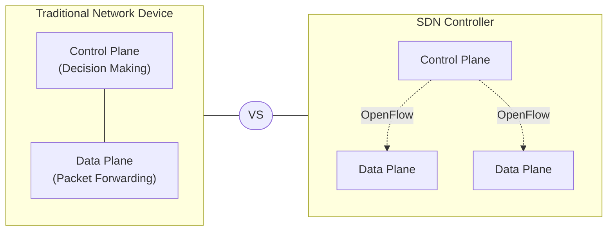

## SDN Controllers

The "brain" of SDN architecture

- maintains a global network view
- translates business requirements into network behavior
- provides a programmable interface to network applications
- manages flow entries into a network device
- enables centralized mangagement and configuration
- examples: OpenDaylight, ONOS, VMware NSX, Cisco ACl, Juniper Contrail

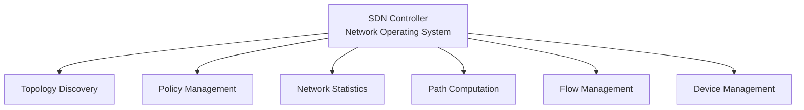

### Northbound APIs

- connect applications to the controller
- often use REST APIs, Java, Python
- abstract network complexity for developers
- eanble policy-based management

### Southbound APIs

- connect controller to network devices
- OpenFlow is the most common protocol
- Define how controller manages devices
- Can include multiple protocols

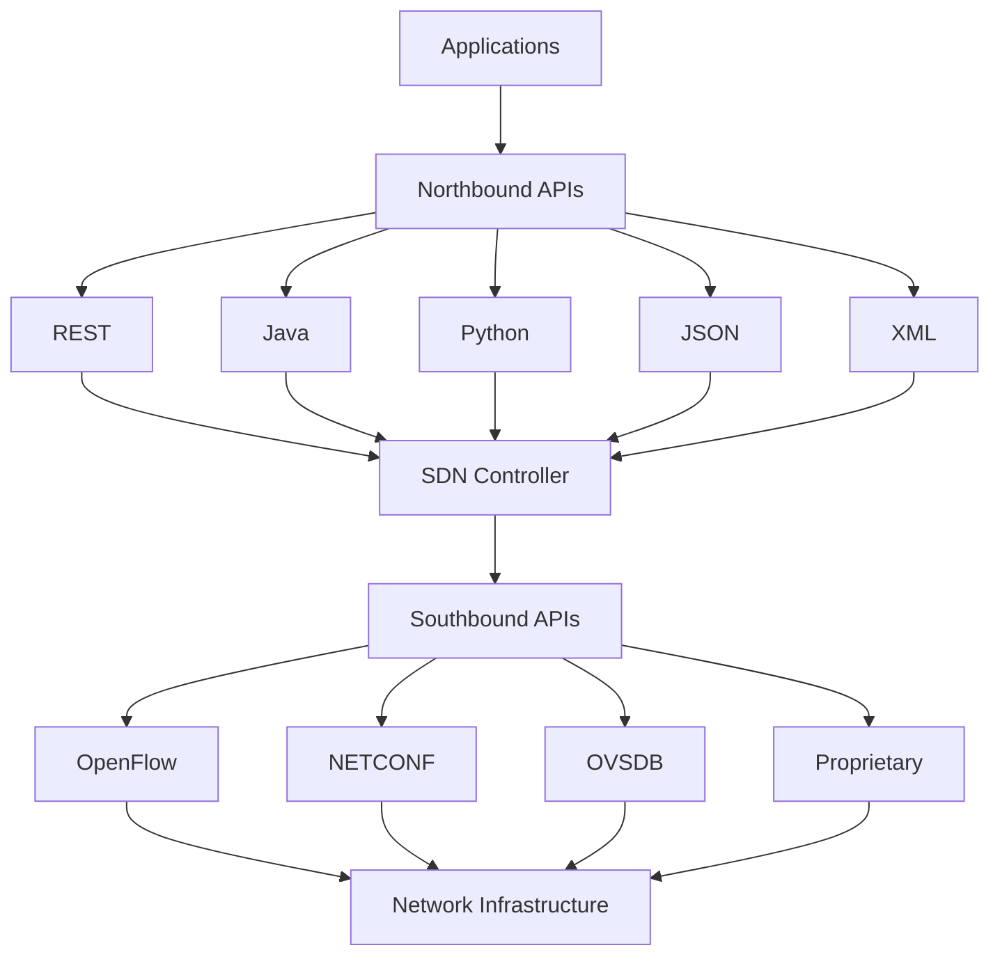

## OpenFlow Protocol

The first standard southbound interface

- enables controller-switch communication
- uses flow tables to control tables
- defines match fields and actions for packets
- acts as a common language between controller and devices
- can provide multi-vendor support
- analogy: like a universal remote control that works with any TV manufacturer

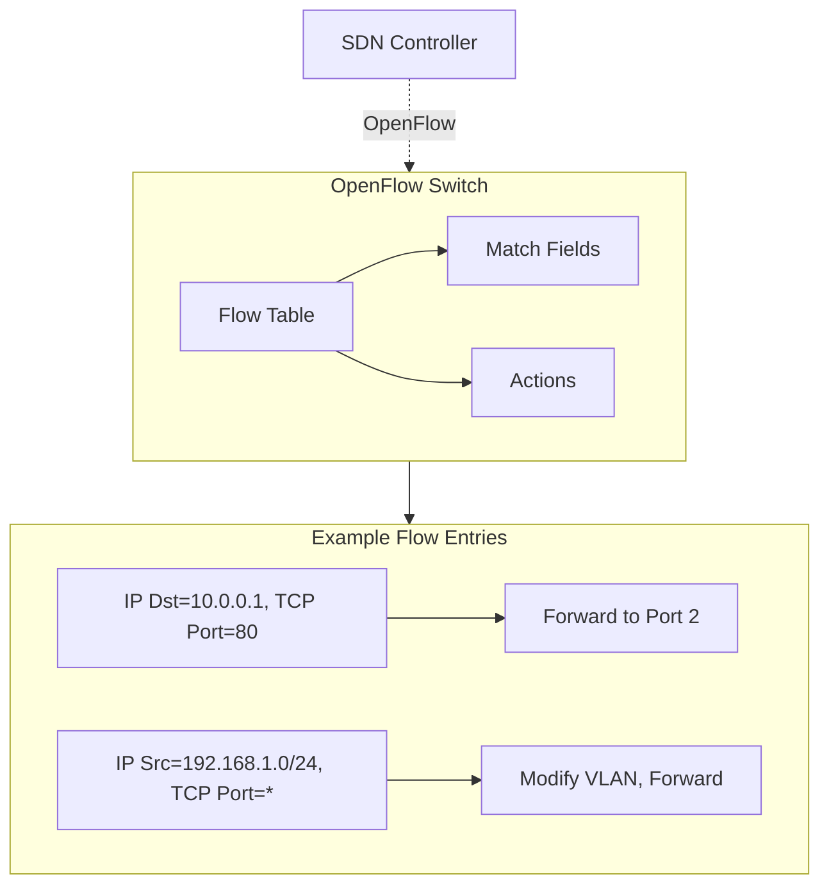

## SDN Implementation Approaches

Common implemenation models:

- Open SDN: based on OpenFlow, vendor-neutral
- API-based SDN: propiatary APIs from vendors
- Overlay SDN: Virtual networks on top of physical
- Hybrid SDN: mix of traditional and SDN approaches
- Key point: No single "right way" to implement SDN - approach depends on organiazation needs and existing infrastructure

### Benefits of SDN

- Network agility: rapid service deployment and changes
- Centralizaed management: simplified operations
- Reduced costs: hardware independence, automation
- Improved security: consistent policy enforcement
- Innovation: faster deployment of new servics
- network visibility: enhanced monitoring and analytics

### SDN Use Cases

- Data centers: automated provisioning, workload mobility
- campus networks: simplified management, policy enforcement
- cloud services: multi-tenant environments, service chaining
- WAN optimization: Dynamic path selection, traffic engineering
- Network security: micro-segmentation, threat response
- service provider networks: network slicing, service delivery
- emerging: itnergation with AI for predictive network management

## Routing: The internets GPS System

- determines the optimal path for data through networks
- enables communication between different networks
- makes the "inter" in internet possible

A routing table is an internal map of network destinations

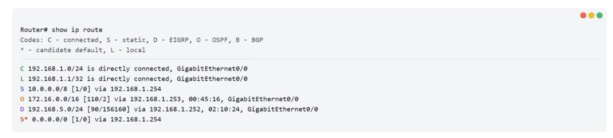

### Key Components

- Destination network: where packets should go
- Next Hop: next router in the path
- Route source: how the route was learned

### Additional Information

- administrative distance: route source reliability
- metric: path preference value
- interface: outgoing network interface

## Route Entries

- connected routes
  - direct connection to a network
  - highest priority (AD = 0)
  - added automatically when interface is configured
  - `C 192.168.1.0/24 is directly connected, GiB/0`
- static routes
  - manually configured by administrator
  - reliable but doesn't adapt to changes
  - low administrative distance (AD = 1)
  - `S 10.0.0.0/8 [1/0] via 192.168.1.254`
- dynamic routes
  - learned through routing protocols
  - adapts automatically to network changes
  - various AD values based on protocol
  - `O 172.16.0.0/16 [110/2] via 192.168.1.253`

### Reading a Route Entry

`O 172.16.0.0/16 [110/2] via 192.168.1.253, 00:45:16, GigabitEthernet/0/0`

- `O`: OSPF protocol
- `172.16.0.0/16`: destination network
- `[110/2]` = AD of 110, metric of 2
- `via 192.168.1.253`: next hop IP
- `00:45:16`: route age
- `GigabitEthernet0/0`: exit interface

## Default Route and Special Routes

- Default route
  - The "catch-all" for when no specific route exists
  - `S* 0.0.0.0/0 [1/0] via 192.168.1.254`
  - Uses `0.0.0.0/0` as destination
  - lowest priority match (last resort)
  - usually points to the internet gateway
- Host routes
  - `L 192.168.1.1/32 is directly connected, GiB/0`
  - Exact match for a single ip address (`/32` mask)
  - highest specificity routes
- network routes
  - `D 192.168.5.0/24 [50/156160] via 192.168.1.252`
  - route to an entire subnet
  - speficity based on prefix length
- floating static routes
  - `S 10.0.0.0/8 [150/0] via 192.168.2.1`
  - static route with higher AD value
  - used as backup routes

## Administrative Distance

- route service trustworthiness
- when multiple routes to the same destination exist, the one with the lowest adminstrative distance vins
- `show ip route 192.168.1.252`
- `D 192.168.5.0/24 [50/156160] via 192.168.1.252`

### common administrative distances

| Route Source   | AD Value | Trustworthiness |
| -------------- | -------: | --------------- |
| Connected      |        0 | Highest         |
| Static         |        1 | Very High       |
| EIGRP Summary  |        5 | High            |
| External BGP   |       20 | High            |
| EIGRP          |       90 | Medium          |
| OSPF           |      110 | Medium          |
| RIP            |      120 | Low             |
| External EIGRP |      170 | Low             |
| Unknown        |      255 | Not used        |

> AD values can be manually adjusted in most routers

## Route Metrics: Chosing the Best Path

Varies between protocols.

- common factors
  - Bandwidth: speed of the link
  - Delay: time to traverse the link
  - Reliability: error rate of the link
  - Load: current traffic on the link
  - Hop count: number of routes in the path
  - MTU: maximum packet size

### Protocol-Specific Metrics

| Protocol | Primary Metrics Used                           |
| -------- | ---------------------------------------------- |
| RIP      | Hop count only                                 |
| OSPF     | Cost (based on bandwidth)                      |
| EIGRP    | Composite: bandwidth, delay, reliability, load |
| BGP      | Complex path attributes and policies           |

## Route Selection Process

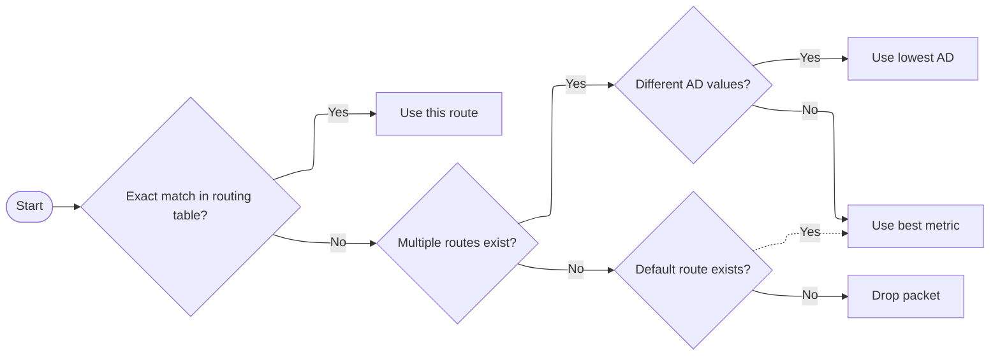

### Route Selection Priority

1. Longest prefix match (most specific route)
2. Lowest administrative distance (most trusted source)
3. Lowest metric (best path according to routing protocol)
4. Equal-cost multi-path (ECMP) if supported
5. Router-specific tiebreakers (e.g., oldest route)

### Common Routing Issues

- Routing loops
  - packets circulate indefinitely between routers
- Route Flapping
  - Route repeatedly becomes available and unavailable
- Convergence Time
  - Time needed for all routers to update after a change
- Route summerization issues
  - improper summarization causing unreachable networks

### Advanced Solutions

- Loop Prevention Mechanisms
  - split horizon with poison reverse
  - TTL (Time to Live) field in packets
  - Route poisoning and hold-down timers
- Fast Convergence Techniques
  - BFD (Bidrectional Forwarding Detection)
  - Tuned hello and dead intervals
  - Incremental SPF algorithms
- Route Summarization Best Practice
  - Hierarchial network design
  - CIDR block alignment
  - Leak maps for exceptions
- Route Filtering and Policy
  - Prefix lists and route maps
  - Administrative distance manipulation
  - conditional advertisement
- Traffic Engineering
  - Manipulating routing to optimize network performanc

## Network Virtualization Fundamentals

- Logical networks independent of physical hardware
- multiple virtual networks on shared physical infrastructure
- software-defined network resources
- Enhanced isolation between tenants
- scalable environments for cloud computing
- analogy: like creating muliple private highways that share the same physical roads, each with its own rules and traffic

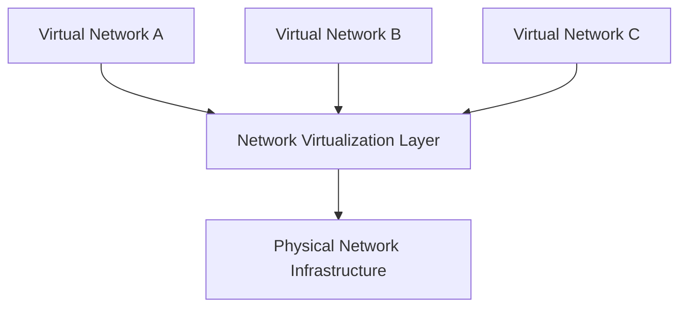

### Evolution of Network Virtualization

- traditional virtualization
  - VLANs (limited to 4094 segments)
  - VLAN Trunking Protocol (VTP)
  - limited scalability
  - restricted to layer 2 domains
  - contrained by physical network topology
- next-generation virtualization
  - VXLAN, NVGRE, STT, Geneve
  - Millions of virtual networks
  - layer 2 over layer 3 (overlay)
  - decoupled from physical constraints
  - cloud-scale operations

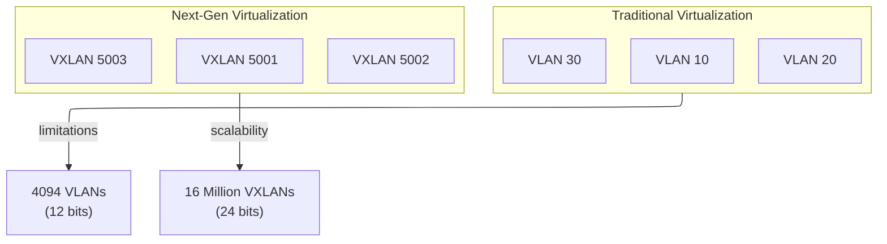

## VXLAN

Virtual Extensible LAN

- overlay technology that tunnels layer 2 traffic over layer 3 networks
- addresses VLAN limitations
- creates isolated segments with 24-bit VXLAN Netowrk Identifier (VNI)
- Enables VM mobility across IP subnet boundaries
- Uses UDP encapsulation (typically port 4789)
- key benefit: allows layer 2 adjacency across layer 3 boundaries, solving multi-tenant scalability changes

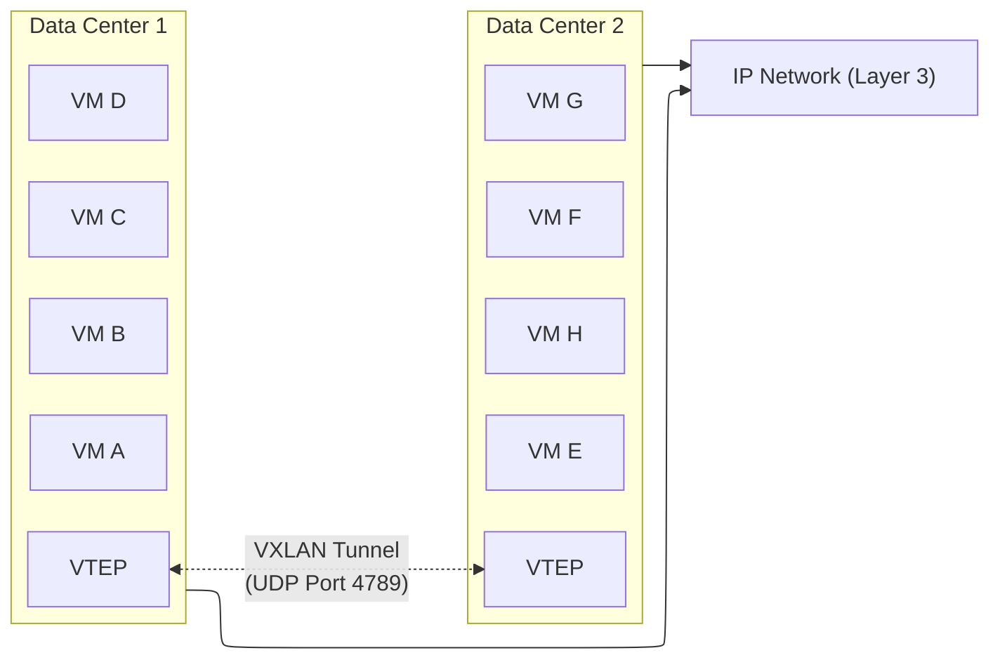

### Framework

- VNI (VXLAN Network Identifier): 24-bit segment ID allowing 16 million isolated networks
- VTEP (VXLAN Tunnel Endpoint): Encapsulates/decapsulates frames
- VXLAN segment: logical layer 2 network identiied by a VNI
- Underlay network: physical IP network providing transport
- overlay network: virtual layer 2 network over the underlay
- analogy: like a postal service (underlay) carrying sealed envelopes (overlay) between buildings (VTEPs)

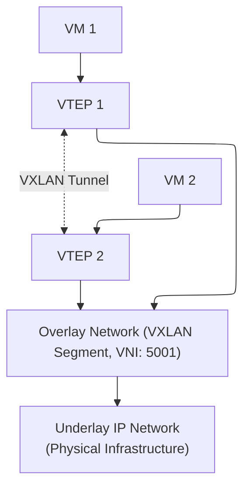

### Operations

1. VM sends Ethernet frame to another VM
1. Source VTEP intercepts the frame and determines the destination VTEP IP address
1. Source VTEP encapsulates the frame with VXLAN/UDP/IP headers
1. Underlay network routes the encapsulated packet to destination VTEP
1. Destination VTEP removes encapsulation and delivers the original Ethernet frame

Key Challenge: learning which VTEP has which MAC addresses (solved with multicast, unicast, or controller-based approaches)

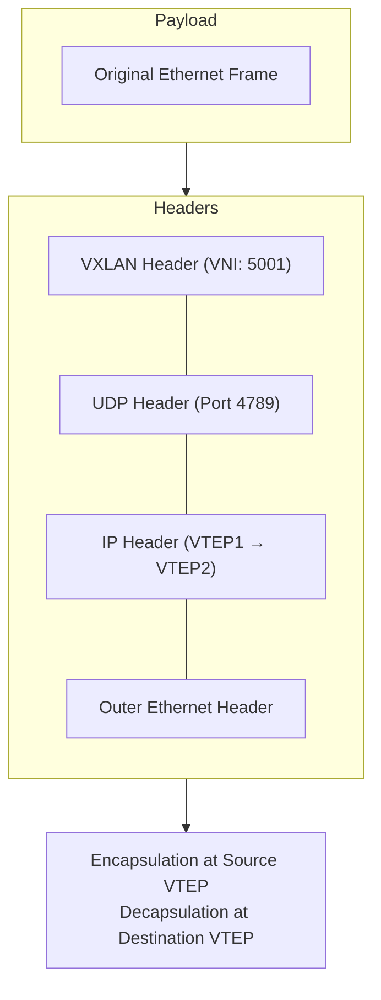

## VXLAN Packet Structure

- original ethernet frame: payload being transported
- VXLAN header: 8 bytes, includes 24-bit VNI and flags
- UDP header: uses destination port 4789 (IANA assigned)
- IP header: source and destination VTEP addresses
- outer ethernet header: for next-hop delivery

MTU impact: VXLAN adds 50+ bytes of overhead, potentially requiring jumbo frames (> 1500 bytes) in the underlay network

|         Size |                      Data                       |
| -----------: | :---------------------------------------------: |
|              |   **Original Ethernet Frame<br /> (Payload)**   |
|      8 bytes |       Flags \| Reserved \| VNI (24 bits)        |
|      8 bytes | Source Port \| Dst Port 4789 \| Length/Checksum |
|     20 bytes | Protocol: UDP \| Src IP: VTEP1 \| Dst IP: VTEP2 |
|     14 bytes |  Dest MAC \| Source MAC \| Type: IP (0x0800)"   |
| **Overhead** |                    50+ bytes                    |

### VXLAN Header Details

The 8-byte VSLAN header contains:

- Flags (8 bits): Only the 1 bit is defined, indicating a valid VNI
- Reserved (24 bits): Set to zero, reserved for future use
- VNI (24 bits): VXLAN Network Identifier, equivelent to VLAN ID
- Reserved (8 bits): Set to zero, reserved for future use

RFC reference: VXLAN is defined in RFC 7348, published by IETF in August 2014

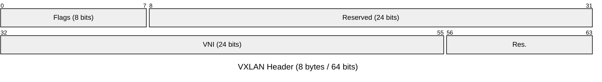

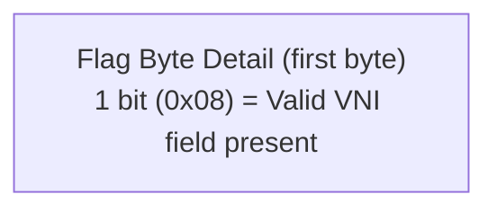

## VXLAN Integration Scenario

- Multi-tenant data center: multiple customers sharing infrastructure
- VM mobility: VMs need to migrate between hosts while maintaining layer 2 adjacency
- Scalability: need for more than 4,094 network segments
- integration with SDN: VXLAN works with centralized controllers to manage network policy
- hybrid cloud: extending on-premises networks to cloud environments

Implmentation options: Hardware VTEP (physical switch), software VTEP (hypervisor), or gateway VTEP (for legacy networks)

## VXLAN Control Plane Options

Learning remote MAC-to-VTEP mappings:

- multicast-based: original approach, using multicast for unknown destinations
- unicast-based: statically configured or dynamically learned VTEP information
- controller-based: SDN controller maintains all mappings
- BGP EVPN: using BGP for distributing MAC and IP information

Industry trend: moving toward BGP EVPN as the preferred control plane for VSLAN deployments

Benefits:

- Scalability beyond 4,094 VLANs (up to 16M segments)
- Layer 2 extension across layer 3 boundaries
- efficient resource utilization in multi-tenant environments
- VM mobility and workload flexibiilty
- integration with SDN and cloud architectures

Challenges:

- MTU considerations (50+ bytes overhead)
- Potential multicast scaling issues
- complexity in troubleshooting encapsulated traffic
- control plane design considerations
- hardware vs. software VTEP performance differences

## Network Transceivers

- TRANSmitter + reCEIVER = Transceiver
- Modular components that convert between electrical and optical signals
- enable connection of different media types to network devices
- hot-swappable and interchangeable
- analogy: like a universal adapter that allows different plugs to connec tto the same power outlet

### types

- SFP: small form-factor pluggable (1 Gbps)
- SFP+: enhanced SFP (10 Gbps)
- QSFP: Quad SFP (40 Gbps)
- QSFP+/QSF28: enhanced QSFP (100 Gbsp)
- GBIC: GigaBit Interfrace Converter (older)

NOTE: form factors determine physical size/shape and are not interchangeable

| Form Factor | Size                   | Speed    |
| ----------- | ---------------------- | -------- |
| SFP         | Small                  | 1 Gbps   |
| SFP+        | Small (similar to SFP) | 10 Gbps  |
| QSFP        | Wider                  | 40 Gbps  |
| QSFP28      | Wider                  | 100 Gbps |

### Media Types

- Copper (T): RJ-45 connections for UTP cabling
- Multi-mode Fiber (SR) - Short range for campus networks
- Single-mode Fiber (LR) - Long range for kilometers
- Extended Range (ER) - For very long distances
- BiDi - Bidirectional using single fiber strand

Example: SFP-10G-SR = 10 Gbps SFP+ for short range multi-mode fiber

### Naming Conventions

- Form factor: SFP, SFP+, QSFP, etc
- Speed: 1G, 10G, 40G, etc
- Media type: T, SR, LR, ER, ZR, BiDi
- wavelength: sometimes included (850nm, 1310nm)
- distance: may be specified (80km, 120km)

Examples:

- SFP-1G-T = 1 Gbps SFP with copper RJ-45
- QSFP-40G-ER4 = 40 Gbps QSFP for extended range

### Compatability

- OEM vs. Third-party: many devices use vendor lockout
- Form Factor: must match device port type
- Speed: must match network requirements
- Wavelength: Must match between transceivers
- Distance: must support required range

TIP: many networks use "coded" transceivers that only work with specific vendor equipment. Third-party compatible options are available

### Direct Attach Cables (DACs)

Alternative to fiber transceivers:

- Fixed-length cables
- Copper twinax for short distances (up to 7m)
- Active Optical Cables (AOCs) for longer runs
- More cost-effective than separate transceivers
- Lower power consumption than traditional transceivers

Best-for: switch-to-switch connections within racks or adjacent racks in a data center

### Technical Considerations

- Maximum distance required for the connection
- Bandwidth requirements for current and future needs
- Fiber types already installed in your infrastructure
- Equipment compatibility with specific transceiver models
- Budget considerations for intial and ongoing costs
- Power and cooling requirements in dense deployments

TIP: Document your transceiver inventory including type, location, and compatibility details

### Troubleshooting

- Incompatible tranceiver with network device
- mismatched transceivers at each end of the link
- dirty or damaged fiber connectors causing signal loss
- exceding maximum distance for the transceiver type
- wrong fiber type (single-mode vs. multi-mode)

Best practice: check diagnostics with commands like `show interface transceiver` to verify optical power levels

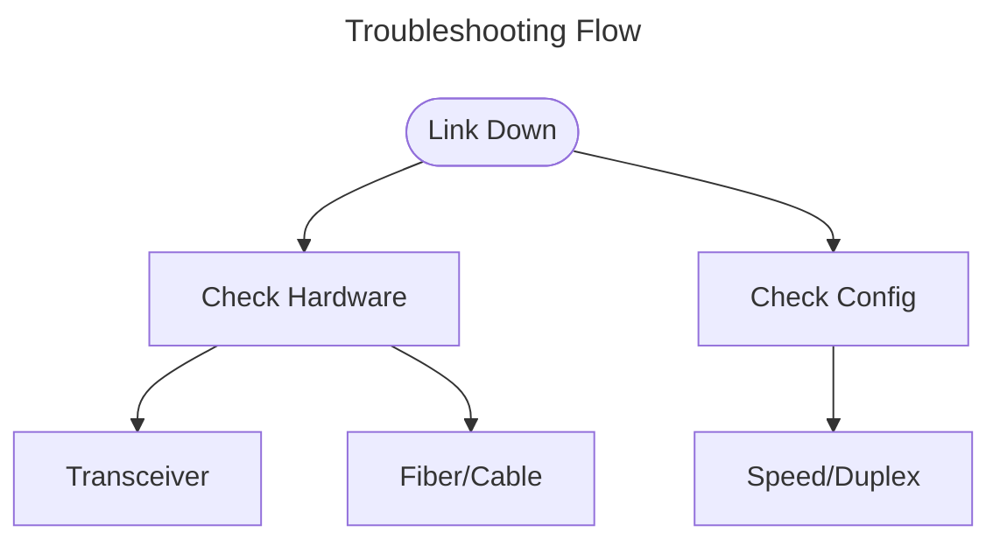

## Zero-trust Security Model

Never trust, always verify

- no automatic trust based on network devices
- every access request must be authenticated
- like a bank vault: ID checked regardless of location

- traditional model
  - castle-and-moat approach
  - trust based on network location
  - once inside, minimal restrictions
- zero trust model
  - micro-perimeters around resources
  - continuous verification for access
  - context-based access decisions

### Principles

- Verify explicitly: authenticaton and authorization based on all available data points
- Least priviledge access: limit user access rights to minimum necessary for their job
- Assume breach: operate with the mindset that a breach has already occurred
- Continuous monitoring: always monitor and validate user and system security in realtime
- dynamic policies: access decisions based on real-time risk analysis
- micro-segmentation: break down security perimeters into smaller zones

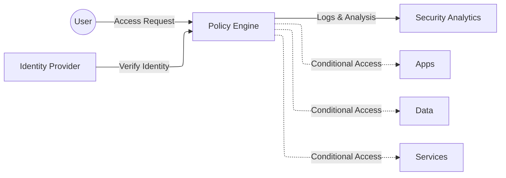

### Implementing Zero-trust

1. Identify your protected surface: Define critical data, applications, and services (DAAS) that must be protected
1. Map transaction flow: document how traffic moves across your network to understand access patterns
1. Design zero-trust architecture: create a security framework with micro-perimeter and policy enforcement points
1. Create zero-trust policies: define specific rules governing who can access what, when and how
1. Deploy monitoring and maintenance: implement continuous monitoring and make ongoing improvements based on analytics
1. Expand and iterate: gradually expand zero trust coverage and refine policies as you learn

### Technologies

- Multi-factor authenication: requires two or more verification methods to establish identify
- Identy and access management: manages digital identities and user access to resources
- micro-segmentation: divides network into secure zones with separate access
- software-defined perimeter: creates dynamically adjusted network boundaries
- analytics and orchistration: continuously monitors behavior and adjusts access controls
- secure access service edge: combines network security functions with WLAN capabilities

### Example: hospital security

- different staff roles require varied access to patient data
- multiple device types across locations
- compliance with healthcare regulationss
- zero-trust
  - Contextual access: doctor accessing patient records from hostipal workstation vs. personal device at home triggers different security checks
  - resource segmentation: lab results, billing systems, and electornic health records each have separate security boundaries
  - just-in-time access: surgeon granted access to specific patient data only durign scheduled procedures
  - device health verification: all connected devices checked for latest security patches before access granted
  - continuous authentication: unusual access patterns (like downloading many records at once) trigger additional verification

benefits:

- improved security posture: minimize attack surface and limit blast radius if a breach occurs
- better visibility: comprehensive monitoring of users, devices, and traffic
- simplified user experience: consistent security approach regardless of user location
- regulatory compliance: helps meet requirements for data access controls
- cloud-ready security: better suited for modern hybrid and multi-cloud environements

challenges:

- implementation complexity: requires significant planning and expertise to deploy
- intial perforamance impact: additional authentication steps may create latency
- legacy system integration: older systems may not support modern authentication methods
- cost considerations: requires investment in new tools and possible architecture changes
- cultural resistance: users may resist additional security measures

## Spanning Tree Protocol

### Network Loop Nightmare

- Netwrok redundancy creates loops
- Broadcast storms flood the network
- MAC address table instability
- Duplicate frame delivery

### How STP Creates Loop-free Networks

- Blocks redundant paths
- Creates a single logical tree
- Maintains backup poths
- Dyanmically adapts to changes s

### Language of STP

- Root bridge: the cetnral reference point for the entire spanning tree
- BPDU: Bridge Protocol Data Units - STPs communication meswsages
- Bridge ID: Priority value + MAC address that identifies switches
- Path cost: numeric value based on link speed to determine best paths

### Roles

- Root port: best path to the root bridge (one per non-root switch)
- Designated port: best path from segment to root bridge (one per segment)
- Blocking port: alternate paths closed to prevent loops

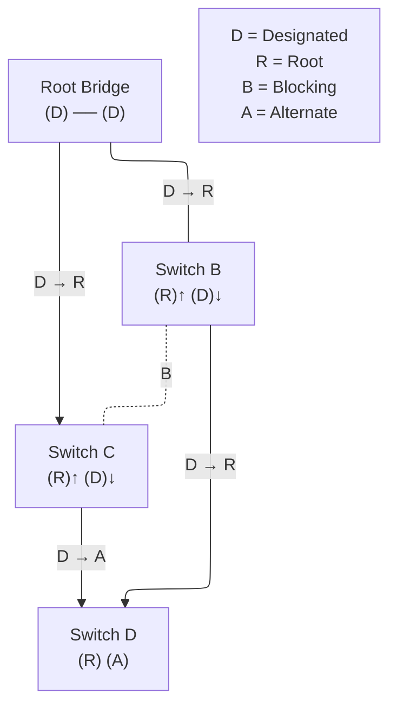

### Life Cycle of STP Ports

1. Blocking (20 sec)
   - Receives BPDUs, no data forwarding
1. Listening (15 sec)
   - Processes BPDUs, learns network topology
1. Learning (15 sec)
   - Build MAC table, no data forwarding
1. Forwarding
   - Normal operation, data forwarding enabled

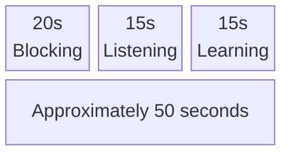

### Choosing the Root Bridge

Election Criteria:

1. Lowest Bridge Priority (default 32768)
1. If tied, lowest MAC address


Best Practice: Manually configure priority on core switches to ensure predictable root bridge selection

### Varients

- RSTP: Rapid STP (802.1w)
  - convergence in ~6 seconds vs. 50 seconds
  - backup port roles
  - direct negotiation with neighboring switches
- MSTP: Multiple STP (802.1s)
  - Multiple spanning trees for different VLANs
  - Load balancing across redundant links
  - Reduces unused bandwidth
- PVST+: Per-VLAN STP+ (Cisco)
  - Separate STP instance per VLAN
  - Different root bridges per VLAN
  - Cisco propietary
- SPB: Shortest Path Bridging
  - IEEE 802.1aq standard
  - Uses IS-IS routing protocol
  - All paths active, no blocked ports

### STP Implementation Best Practices

- Root bridge placment: position at the core of your network with lowest priority
- BPDU Guard: enable on access ports to prevent rogue switches
- Root guard: prevents external switches from becoming root
- Portfast: for end-device ports to bypass STP states

Common Issues:

- Unplanned root bridge elections causing network disruption
- Inconsistent STP versions between switches
- Unprotected access ports allowing rogue switches
- Slow convergence with standard STP

Solution:

Use modern STP variants like RSTP or MSTP with proper guards enabled

## Optimizing Network Interfaces

### Why

- Increased throughput
- Reduced latency
- Better resource utilization
- Improved application performance

### Techniques

- Jumbo frames: Increase MTU size beyond standard 1500 bytes to reduce overhead for large data transfers
  - Increase MTU from 1500 to 9000+ bytes
  - Benefits: less overhead, fewer interupts
  - Best for: storage networks, backups, VM migrations
  - REquirement: all devices in path must support same MTU
- NIC Teaming: Combine mulitple network interfaces for increased bandwidth and redundancy
  - Also known as link aggregation
  - Load balancing: distributes network traffic across multiple NICs to increase total bandwidth
  - fault tolerance: provides network redundancy if one connection fails
  - modes: static teaming, LACP, active-passive configuration
  - requirements: compatible NICs, switch support for aggregation
- Flow control: manage data transmission ratges to prevent buffer overflows and packet loss
  - Traffic management
  - IEEE 802.3x Flow control: Uses PAUSE frames to temporarily halt transmission when bufers are nearly full
  - Priority flow control (PFC): selectively pauses specific traffic classes while allowing others to continue
- TCP offloading: shift TCP processing tasks from CPU to network card to improve system performance
  - TCP segmentation offload: NIC handles breaking large TCP segments into smaller packets
  - Checksum offload: NIC calculates packet checksums instead of CPU
  - Large Receive offload: combines multiple incoming packets before CPU processing

### Network Infterface Configuration Checklist

- Basic settings
  - Speed and duplex mode
  - IP configuration
  - VLAN assignment
- Performance options
  - TCP offloading features
  - Buffer sizes
  - Interrupt moderation
  - MTU configuration
- Team configuration
  - Teaming mode selection
  - Load balancing algorithm
  - failover settings
- Energy Efficiency
  - Energy efficient ethernet
  - power management profiles
- flow control
  - enalbe/disable standard flow control
  - priority flow control (PFC) settings
- monitoring
  - interface statistics
  - error counters
  - bandwidth utilization

### Real World Benefits

- Data Center
  - Storage traffic using jumbo frames can see up to 20% throughput improvement and reduced CPU utilization
- High-Performance Computing
  - TCP offloading redcuces latency for parallel computing clsuters by freeing CPU resources
- Virtualization
  - NIC teaming provides both redundancy and load balancing for VM traffic across multiple physical adapters
- Covnerged networks
  - Flow control mechanisms ensure critical tgraffic continues during congestion periods

## Why Network Planning Matters

- Poor planning consequences
  - Budget overruns and costly rework
  - Performance bottlenecks
  - Security vulnerabiliites
  - Scalability problems
  - Downtime during implementation
- Benefits of Proper Planning
  - Predictable costs and timeline
  - Optimized performance
  - Enhanced security posture
  - Smooth implementation process
  - Future-proof infrastructure

## Pre-Installation Site Assessment

- Physical environment
  - Available space for equipment
  - Power capacity and outlets
  - Cooling and ventilation
  - Physical security measures
  - Cable pathways and distances
- Network requirements
  - Current and future bandwidth needs
  - User count and distribution
  - Critical applicaitons and services
  - Existing network documentation
  - Security requirements
- Regulatory Compliance
  - Building codes and permits
  - Fire safety regulations
  - Industry-specific requirements
  - Accessibiltiy standards
  - Data protection regulations
- Site Survey Tools
  - Wi-Fi analyzer for signal mapping
  - Cable testers for existing infrastructure
  - Thermal cameras for heat distribution
  - Digital measuring tools
  - Network analyzers for traffic patterns

## Creating Network Blueprints

- essential blueprint components
  - Physical topology diagrams
  - Logical network diagrams
  - IP addressing schemes
  - Equipment placement layouts
  - Calbe runs and specifications
  - Rack eleveations and layouts
- documenation best practices
  - use consistent lableing conventions
  - include dedtailed legends
  - provide documenation in digial and physical formats
  - store on-site and off-site copies
  - schedule regular updates

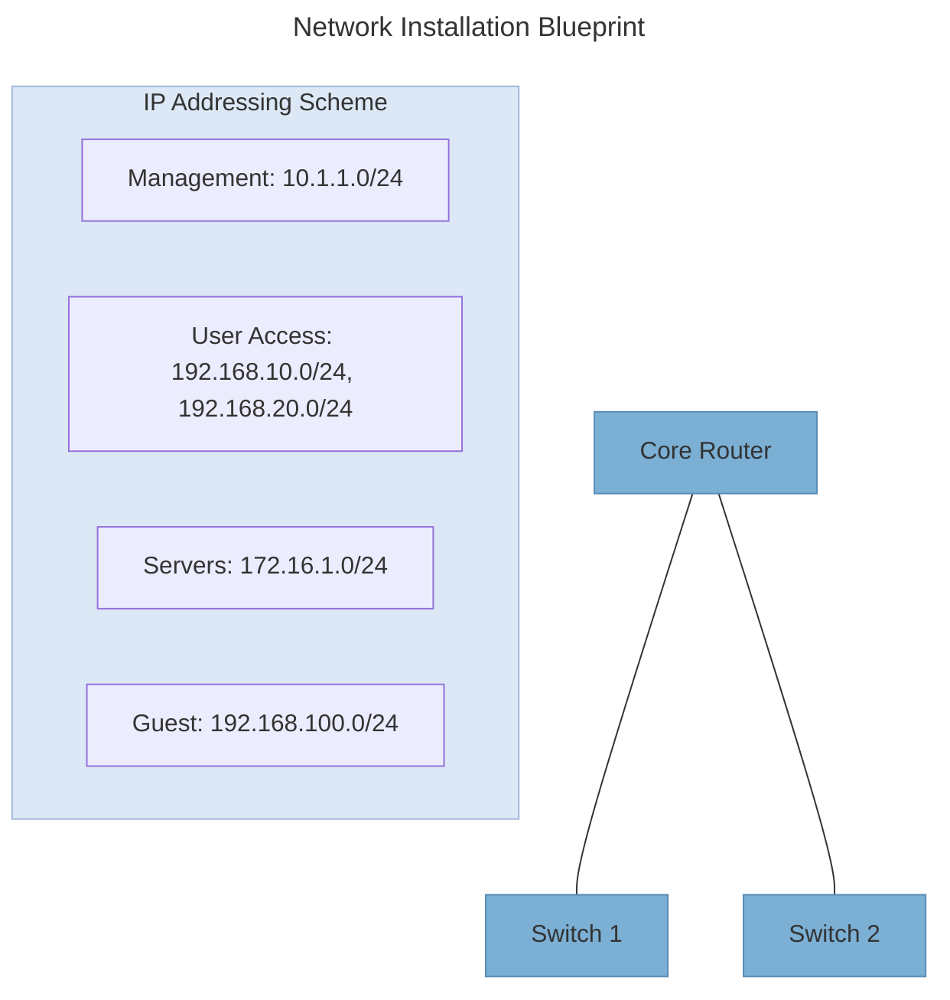

## Tools

- Basic tools
  - Screwdrivers (flathead, philips)
  - Wire cutters and strippers
  - Crimping tools
  - Multimeter
  - Flashlight
  - Label maker
  - Cable ties and organizers
- Testing Equipment
  - Cable testers
  - Tone generators and probes
  - Continuity testers
  - Time-domain reflectoimeter (TDR)
  - Optical power meter
  - Network analyzer
  - Spectrum analyzer for Wi-Fi
- Safety Equipment
  - ESD protection gear
  - safety glasses
  - gloves
  - first aid kit
  - fire extinguisher
  - cable management supplies
  - proper lifting equipment
- Team Equipment
  - two-way radios
  - smartphoines/tablets
  - digital cameras
  - laptops with network tools
  - shared documenation access
- Storage and Organization
  - Tool bags and cases
  - Cable spools and reels
  - Parts organizers
  - Portable workbenches
  - Cable management trays
  - Software tools
    - Network configuration software
    - IP addressing tools
    - Monitoring software
    - Documentation platforms
    - Remote access solutions

## Instalation Best Practices

- Cable Management
  - Use appropiate calbe trays and pathways
  - Maintain proper bend radius
  - Group cables by type and destination
  - Label both ends of every cable
  - Avoid running near power sources
  - Use velcro instead of zip ties when possible
- Equipment placement
  - Allow adequate airflow around equipment
  - Place heaviest equipment at the bottom of racks
  - Allow room for future expansion
  - Ensure easy access for maintenance
  - Consider power distribution requirements
- Testing and Verification
  - Test cables before and after installation
  - Verify configurations agasinst design specs
  - Document all test results
  - Perform end-to-end connectivity testing
  - Validate security measures

## Change Management and Documentation

- Change Control Process
  - Creat formal change request
  - Assess impact and risks
  - Get stakeholder approval
  - Schedule maintenance window
  - Create rollback plan
  - Test changes before implementation
  - Document results and lessons learned
- Documenation requirements
  - Network diagrams (physical or logical)
  - IP address management
  - Configuration files (with comments)
  - Equipment inventory with serial numbers
  - Vendor contract mangement
  - Support procedures and evaluation paths
  - Baseline performancce metrics

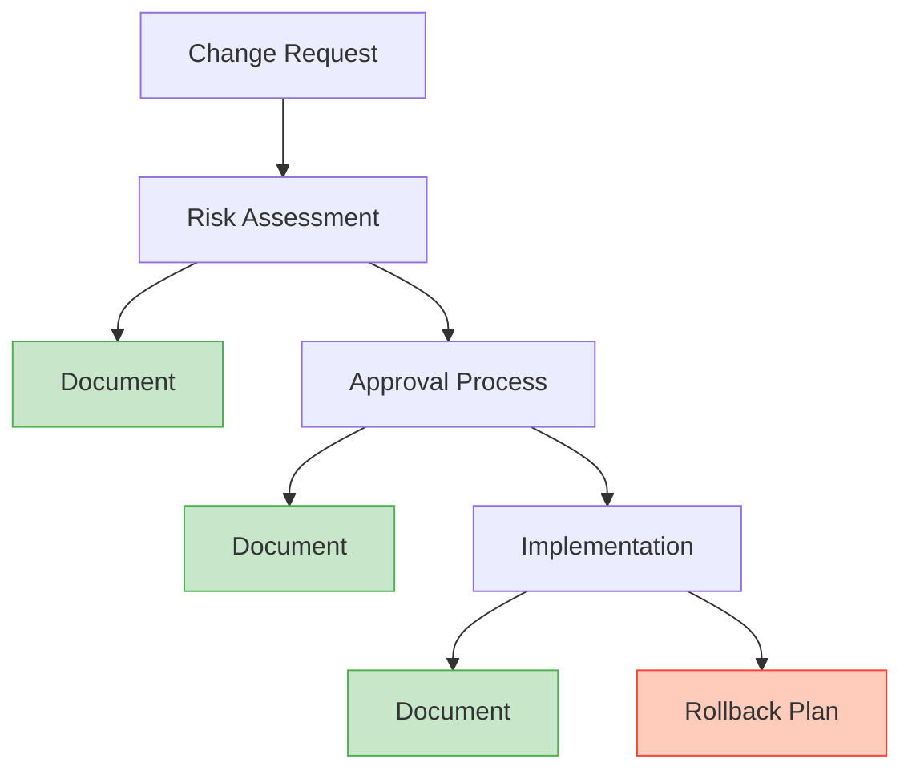

## Testing

- connectivity testing
  - ping tests across network systems
  - traceroute for path verification
  - DNS resolution testing
  - Service availability checks
  - End-to-end application testing
- Performance testing
  - Bandwidth throughput tests
  - Latency and jitter measurements
  - Load testing under simulated traffic
  - load testing under simulated traffic
  - QoS verificaiton for network priority
  - baseline performance documenation
- security testing
  - firewall rule validation
  - access control verification
  - network segmentation testing
  - vulnerability scanning
  - wireless security assessment
- redundancy testing
  - failover testing for critical links
  - power loss simulations
  - route convergence verification
  - high availability failure testing
  - disaster recovery procedure verification

## After Installation

- Knowledge transfer
  - train IT staff on new systems
  - Create operation manual
  - document troubleshooting procedures
  - provide administrative credentials
- monitoring setup
  - conrfigure performance monitoring
  - set up alerts for critical thresholds
  - enabled logging and log aggregation
  - create performance baselines
- maintenance schedules
  - create regular update schedule
  - plan periodic security assessments
  - schedule configuration backups
  - define lifecycle management plan

Closeout checklist

- All test cases passed and documented
- Complete documentation package delivered
- Knowledge transfer sessions completed
- monitoring systems configured
- all project deliverables signed off
- maintenance schedule established
- post-implementation review completed
- lessons learned documented

## Electrical Concepts

- core electrical measurements
  - Voltage (V): electrical pressure that pushes current. like water pressure in a pipe.
  - Amperage (A): flow rate of electrical current. Like water flow rate.
  - Wattage (W): poser consuption (V x A). Like total water power.
  - Ohms (): ressistence to electrical flow
  - Frequency (Hz): cycles per second in AC power

### Alternating Current (AC)

- main buildling power supply
- changes direction periodically
- standard wall outlets provide 120V or 240V
- frequency: 60Hz in North America, 50Hz in many other regions
- powers most networking equipment via power supplies

### Direct Current (DC)

- Flows in one direction only
- Used internally by all electronic devices
- Common DC voltages: 3.3V, 5V, 12V, 48V
- Power over Ethernet (PoE) uses DC
- Telecom equipment often uses ~48V DC

### Power Distribution in Network Environments

Common power configurations

- Standard circuits: 15-20A circuits for basic equipment
- Dedicated circuits: isolated power for electrical equipment
- Power Distribution Units (PDUs): multiple outlets in racks
- Three-phase power: more efficient for high-load environments

Important Distribution Considerations

- Circuit capacity planning to prevent overloads
- Redundant power paths for critical systems
- Proper grounding to prevent electrical hazards
- Power monitoring for usage and trend analysis
- Adequat colling for power distribution equipment

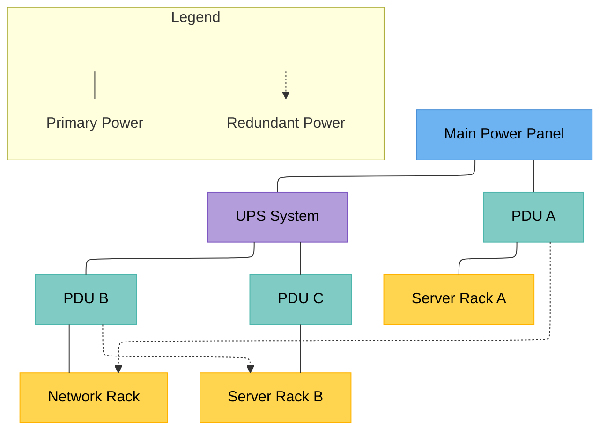

### Common Power Issues and Protection Methods

- power surge
  - sudden voltage increase above normal levels
  - solution
    - surge protectors
    - whole building surge protection
    - UPS with surge protection
- Power Sag
  - Brief drop in voltage (brownout)
  - solutions
    - UPS with voltage regulation
    - line conditioners
    - voltage stabilizers
- power outage
  - Complete loss of electrical power
  - solutions
    - UPS for short term backup
    - Generators for extended outages
    - Redundant power sources
- Electical noise
  - solutions
    - Power conditioners
    - Isolation transformers
    - Proper grounding

UPS (Uninterruptible Power Supply) Types

- Standby UPS
  - Basic protection
  - Switches to battery when power fails
  - Brief transfer time (2-10ms)
  - Best for evolutions and small devices
- Line-interactive UPS
  - Voltage regulation witghout using battery
  - Better protection than standby
  - Minimal transfer time
  - Good for network equipment and servers
- Online/Double-Vonersion UPS
  - Cosntant power conditioning
  - Zero-transfer time
  - Isolation from power problems
  - Best for cricital systems and data centers

### Power Redundancy Planning

Redundancy Configurations

- N+1: Minimum required (N) plus one spare component
- 2N: fully redundant system (twice the minimum requirements)
- 2N+1: Two complete systems plus additional spare components
- Shared redundancy: spare components that can support multiple systems

Redundant Power Implementation

- dual power supplies in electical equipment
- Multiple UPS systems with load balancing
- separate power paths (A/B) power
- Generator backup for extended outages
- Automatic transfer switches between power sources

### Safety

- Personal safety measures
  - Never work on live equipment
  - Use proper lockout/tagout procedures
  - Wear appropiate PPE when required
  - Use insulated tools for electrical work
  - Maintain dry working conditions
  - KNow the location of emergency power shutoffs
- Equipment Protection
  - Proper grounding for all equipment
  - Usej anti-static measures when handling components
  - Maintain proper humidity levels (40-60%)
  - Keep liquids away from electical equipment
  - follow manufactuers power specifications
  - implement cable management to prevent damage
- Facility considerations
  - proper circuit labeling
  - regular electical inspections
  - adequate circuit capacity for equipment
  - proper cable routing separate from water sources
  - use of GFCI outlets in potential wet areas
  - Compliance with local electical codes
- ESD (Electronic Discharge) Protection
  - Use anti-static straps when handling components
  - Anti-static mats for workbenches
  - Anti-static bags for storing sensitive components
  - Properly ground yourself before touching equipment
  - Control humidity in equipment rooms
  - ESD safe tools for component work

### Emergency Procedures

- Electrical Fire
  - Turn off power if safe to do so
  - Use Class C fire extinguisher
  - Call emergency services
  - Evacuate if necessary
- Electric shock
  - Do not touch the victim
  - Turn off power immediately
  - Call for medical assistance
  - Administer first aid if required
- Power Outage
  - Check UPS operation
  - Initiate graceful shutdowns if needed
  - Follow power restoration procedures
  - Monitor equipment during restart

### Power Calculations for Network Equipment

- Understanding Power Metrics
  - Nameplate power: maximum rated power (conservative estimate)
  - Actual power: typical operating power (usually lower)
  - VA (Volt-Amperes): Apparent pwoer used for UPS sizing
  - BTU/hr: heat output for coding calcuations
- Power Calculation Process
  - List all equipment with power requirements
  - AAdd 20-30% capacity buffer for growth
  - Calculate total power in watts and VA
  - Size UPS at least 1.2x calculated load
  - Calculate circuit requirements based on local codes
- Cooling Considerations
  - Convert watts to BTU/hr (1W = 3.412 BTU/hr)
  - Size cooling systems for maximum heat load
  - Consider equipment density in rack planning
  - Account for other heat sources (lights, people)

```mermaid
---
title: Sample Power Calculation
---
block-beta
  columns 4

  H1["Equipment"]:1 H2["Qty"]:1 H3["Watts Each"]:1 H4["Total Watts"]:1
  CS["Core Switch"] CSQ["1"] CSW["750"] CST["750"]
  AS["Access Switches"] ASQ["4"] ASW["150"] AST["600"]
  SV["Servers"] SVQ["3"] SVW["500"] SVT["1,500"]
  SA["Storage Array"] SAQ["1"] SAW["900"] SAT["900"]
  FW["Firewall"] FWQ["2"] FWW["125"] FWT["250"]
  STL["Subtotal"]:3 STV["4,000W"]
  BFL["With 30% Growth Buffer"]:3 BFV["5,200W"]

  UPS["UPS Sizing
  5,200W ÷ 0.8 = 6,500 VA
  (0.8 power factor)"]:2
  HO["Heat Output
  5,200W × 3.412 = 17,742 BTU/hr
  (For HVAC planning)"]:2
  CR["Circuit Requirements
  5,200W ÷ 120V = 43.3A
  (At least 3 × 20A circuits, 80% load rule)"]:4

  style H1 fill:#1a3a5c,color:#fff,stroke:#1a3a5c
  style H2 fill:#1a3a5c,color:#fff,stroke:#1a3a5c
  style H3 fill:#1a3a5c,color:#fff,stroke:#1a3a5c
  style H4 fill:#1a3a5c,color:#fff,stroke:#1a3a5c
  style STL fill:#c5cae9,color:#000,stroke:#7986cb
  style STV fill:#c5cae9,color:#000,stroke:#7986cb
  style BFL fill:#9fa8da,color:#000,stroke:#5c6bc0
  style BFV fill:#9fa8da,color:#000,stroke:#5c6bc0
  style UPS fill:#1b5e20,color:#fff,stroke:#1b5e20
  style HO fill:#7b1fa2,color:#fff,stroke:#7b1fa2
  style CR fill:#e65100,color:#fff,stroke:#e65100

```

### Energy Efficiency Best Practices

- Equipment Selection
  - Choose Energy Star certified equipment
  - Look for 80 PLUS certified power supplies
  - Select equipment with power management features
  - Consider modular systems that scale efficiently
  - Evaluate equipment based on performaqnce per watt
- Power Management
  - Enable power management features
  - Schedulre non-critical equipment downtime
  - Use intelligent PDUs with outlet control
  - Implmeent UPS eco-modes when appropiate
  - Monitor and analyze power usage patterns
- Infrastructure Optimization
  - Virtualize servers to increase utilization
  - Consolidate underutiized equipment
  - Use hot/cold aisle containment
  - optimize operating temperatures (ASHRAE guidelines)
  - implement ariflow management techniques
- Monitoring and Analysis
  - Peak power usage effectiveness (PUE)
  - Deploy power monitoring at multiple levels
  - Use DCIM (Data Center Infrastructure Management) tools
  - Perform regular energy audits
  - Set efficiency goals and track improvements

Energy Efficiency Metrics

- PUE
  - 1.1 - 1.4
  - Power Usage Effectiveness
  - Total facility power + IT equipment power
  - Lower is better (ideal = 1.0)
- DCiE
  - 70%-90%
  - Data Center Infrastructure Efficiency
  - (IT equipment power + total facility power) x 100%
  - higher is better (ideal = 100%)
- CUE
  - 0.5 - 0.8
  - Carbon Usage Effectiveness
  - Total CO₂ Emissions + IT Equipment Energy
  - Lower is better (ideal = 0)

## Network Lifecycle Management

### Why

- Business Impact
  - Reduces unexpected downtime and failures
  - Optimizes captial and operational expenses
  - Ensures infrastructure supports business goals
  - Improves security posture and compliance
  - Enables strategidc planning and budgeting
- Technical Benefits
  - Prevents technology obsolescence
  - Standardizes configurations and procedures
  - Simplifies troubleshooting and support
  - Improves performance and capacity planning
  - Streamlines patch and upgrade processes

### Life Cycle

- Phases
  - Planning: requirements gathering, design, procurement
  - Deployment: impelmentation, testing, documentation
  - Operations: monitoring, maintenance, support
  - Optimization: performance tuning, capacity planning
  - Retirement: decommisioning, replacement planning

- Key Considerations
  - Average network equipment lifespan: 3-7 years
  - Intitial investments vs. operational costs
  - Vendor support and EOL announcements
  - Compliance and security requirements
  - Technology evolution and business needs

### Planning Phase

- Needs Assessment
  - Document current network state and inventory
  - Identify business requirements and objectives
  - Analyze performance metrics and pain points
  - Gather input from stakeholders and end users
  - Assess regulatory and compliance requirements
- Design Development
  - Create detailed network architecture diagrams
  - Define technical specifications and standards
  - Plan for scalability and future growth
  - Design with security principles in mind
  - Consider high availability and redundancy needs
- Vendor Selection
  - Research vendor roadmaps and support policies
  - Analyze total cost of ownership (TCO)
  - Consider interoperability with existing systems
  - Evaluate warranty terms and support options
  - Check for product end-of-life announcements
- Resource Planning
  - Create detailed project timeline and milestones
  - Develop capital and operational budget
  - Assess staff skills and training requirements
  - Plan for potential service disruptions
  - Establish success criteria and KPIs

Pitfalls to Avoid

- Focusing only on current needs
- Inadequate stakeholder input
- Underestimating costs
- Ignoring security requirements
- Poor documentation practices
- Skipping proof-of-concept testing

### Deployment Phase Best Practices

1. Change Management
   - Create detailed implementation plan with milestones
   - Establish formal change control processes
   - Schedule maintenance windows with stakeholder approval
   - Prepare rollback procedures for all changes
   - Communicate timelines and expected impacts
2. Configuration Standardization
   - Create baseline configurations for all devices
   - Use configuration templates and scripts
   - Implement consistent naming conventions
   - Document all non-standard configurations
   - Use configuration management tools
3. Testing & Validation
   - Perform comprehensive pre-deployment testing
   - Develop test cases for all critical functions
   - Test failover and redundancy mechanisms
   - Conduct security vulnerability assessments
   - Validate against established performance baselines
4. Documentation
   - Create as-built network documentation
   - Document IP addressing and VLAN schemes
   - Create updated network diagrams and topology maps
   - Record all configurations and device settings
   - Document standard operating procedures

Strategies

- Pilot deployment
  - Test implementation with limited scope before full deployment
  - Low risk
- Phased rollout
  - Implement changes in stgages across different network segments
  - Balanced approach
- Parallel Implementation
  - Run new and old systems simultaneously until transition is complete
  - resouce intense

### Operations Phase Best Practices

- Monitoring & Alerting
  - Implement comprehensive monitoring solutions
  - Set up meaningful alerting thresholds
  - Monitor performance, availability, and capacity
  - Create custom dashboards for different stakeholders
  - Establish escalation procedures for alerts
  - Regularly review and tune monitoring parameters
- Incident Management
  - Establish incident response workflows
  - Document troubleshooting procedures
  - Maintain updated contact lists for escalations
  - Perform root cause analysis after incidents
  - Track metrics like MTTR (Mean Time To Repair)
  - Communicate effectively during outages
- Maintenance Routines
  - Schedule regular firmware and software updates
  - Perform monthly security patching
  - Conduct quarterly configuration backups
  - Test backup and recovery procedures
  - Review logs and analyze trends
  - Clean and inspect physical infrastructure
- Knowledge Management
  - Maintain updated documentation repository
  - Create and update troubleshooting guides
  - Develop a knowledge base of common issues
  - Document lessons learned from incidents
  - Share best practices across team members
  - Keep inventory and asset information current

### Optimization Phase Best Practices

- Performance Analysis
  - Collect and analyze performance metrics
  - Identify bottlenecks and congestion points
  - Compare actual vs. expected performance
  - Conduct periodic network assessments
  - Use specialized tools for deep packet analysis
- Capacity Planning
  - Forecast growth based on historical trends
  - Monitor resource utilization over time
  - Plan for seasonal or cyclical demand changes
  - Establish upgrade triggers and thresholds
  - Align capacity planning with business forecasts
- Continuous Improvement
  - Implement regular optimization reviews
  - Refine configurations based on performance data
  - Streamline processes and procedures
  - Remove or repurpose underutilized resources
  - Automate routine tasks where possible

### Retirement Phase Best Practices

- When to Retire Equipment
  - End of vendor support or End-of-Life (EOL) announcement
  - Security vulnerabilities that cannot be patched
  - Performance no longer meets business requirements
  - Maintenance costs exceed replacement value
  - Incompatibility with newer systems or standards
  - Environmental or compliance concerns (e.g., energy efficiency)
- Retirement Planning
  - Create inventory of equipment to be retired
  - Identify dependencies and potential impacts
  - Develop data migration and preservation strategy
  - Plan transition to replacement systems
  - Create detailed retirement schedule
  - Establish success criteria for decommissioning
- Secure Decommissioning
  - Back up all configuration data before removal
  - Securely erase or destroy storage media
  - Remove or disable user accounts and access
  - Document removed components and configurations
  - Update network diagrams and documentation
  - Follow chain-of-custody procedures if required
- Disposal & Recycling
  - Follow environmental regulations for e-waste
  - Use certified recycling or disposal vendors
  - Consider equipment donation or resale options
  - Maintain records of proper disposal
  - Recover usable components when appropriate
  - Update asset management systems

Equipment Disposition Options

- Reuse
  - repurpose for less critical functions
- Resell
  - Sell to recover value or via buyback program
- Donate
  - Gift to educational or non-profit organizations
- Recycle
  - PRocess through certified e-waste recyclers

### Documentation Throughout the Life Cycle

- Essential Documentation Types
  - Network diagrams (physical and logical)
  - Configuration standards and templates
  - Inventory and asset management records
  - Standard operating procedures (SOPs)
  - Incident response playbooks
  - Change management records
  - Performance baselines and reports
- Documentation Best Practices
  - Establish clear ownership and review cycles
  - Use version control for all documents
  - Make documentation accessible to relevant stakeholders
  - Update documentation after every change
  - Include details about who, what, when, and why
  - Use standardized templates and formats
  - Link related documentation where appropriate

Documentation in Each Life Cycle Phase

- **Planning Phase** — Requirements, design documents, architecture diagrams, project plans, budgets
- **Deployment Phase** — Implementation guides, configuration templates, test plans, validation reports, as-built documentation
- **Operations Phase** — Maintenance procedures, troubleshooting guides, incident reports, monitoring configurations, SLAs
- **Optimization Phase** — Performance reports, capacity plans, tuning recommendations, improvement roadmaps
- **Retirement Phase** — Decommissioning plans, data migration procedures, disposal certifications, archived configurations

> **Remember:** Documentation that isn't maintained becomes a liability rather than an asset.

## Configuration Management

Configuration Management (CM) is the process of identifying, controlling, documenting, and auditing changes to network devices, systems, and infrastructure. It ensures that network configurations remain consistent, functional, and secure throughout their lifecycle.

**Business Benefits**

- Reduced downtime and service disruptions
- Improved security posture and compliance
- Faster troubleshooting and problem resolution
- More efficient resource utilization
- Simplified auditing and change tracking

### Key Components of Configuration Management

- Configuration Items (CIs)
  - Network devices (routers, switches, firewalls)
  - Server configurations
  - Network services (DHCP, DNS, etc.)
  - Security configurations
  - Virtual network infrastructure
  - Operating system configurations
- Configuration Baseline
  - Standard reference configurations
  - Known, validated working state
  - Starting point for future changes
  - Compliance benchmark
  - Reference for device rebuilds
  - Recovery point for failures
- Configuration Repository
  - Central storage for configurations
  - Version control system
  - Change history tracking
  - Secure access controls
  - Backup and recovery capabilities
  - Configuration comparison tools
- Change Management Process
  - Formal request and approval workflow
  - Risk assessment procedures
  - Testing and validation requirements
  - Implementation planning
  - Rollback procedures
  - Post-change verification

### Configuration Management Process

- Configuration Identification
  - Identify all configuration items in the network
  - Establish naming conventions and identifiers
  - Define relationships between components
  - Create configuration item database
  - Determine configuration attributes to track
- Configuration Documentation
  - Record configuration details for all items
  - Maintain version history of configurations
  - Document configuration dependencies
  - Update network diagrams and topology maps
  - Create configuration backup schedule
- Configuration Control
  - Define change request and approval process
  - Assess impact of proposed changes
  - Establish change authorization levels
  - Document change implementation procedures
  - Create rollback plans for changes
- Configuration Auditing
  - Perform regular configuration verification
  - Compare active configs against baselines
  - Detect unauthorized configuration changes
  - Validate configurations against policies
  - Generate compliance reports

Process Maturity Levels

- Level 1
  - Ad-hoc
- Level 2
  - Repeatable
- Level 3
  - Defined
- Level 4
  - Managed

### Tools and Technologies

- Manual Tools
  - Command line interfaces (CLI)
  - Device configuration scripts
  - Text editors for config files
  - Secure shell (SSH) for device access
  - Text comparison tools
  - Documentation platforms
- Automation Tools
  - Ansible, Puppet, Chef
  - Terraform for infrastructure
  - Python automation scripts
  - Network configuration managers
  - API-based configuration
  - Templates and playbooks
- Monitoring Tools
  - Configuration validation systems
  - Compliance scanning tools
  - Change detection software
  - Network monitoring platforms
  - Configuration auditing tools
  - Log analysis systems
- Version Control
  - Git repositories
  - Specialized network config repos
  - Change tracking systems
  - Configuration snapshots
  - Rollback mechanisms
  - Difference visualization tools
- Security Tools
  - Configuration hardening scanners
  - Secure access management
  - Encrypted configuration storage
  - Compliance validation tools
  - Privileged access management
  - Authentication systems
- CMDB Solutions
  - Configuration Management Databases
  - IT Service Management platforms
  - Asset management systems
  - Relationship mapping tools
  - Configuration item discovery
  - Dependency tracking

### Production Configuration Best Practices

- Standardization
  - Develop standard configuration templates
  - Use consistent naming conventions
  - Standardize network protocols and services
  - Maintain consistent firmware/OS versions
  - Create standard security configurations
  - Document all exceptions to standards
- Change Management
  - Implement formal change control process
  - Test changes in non-production environment
  - Schedule changes during maintenance windows
  - Create detailed implementation plans
  - Develop rollback procedures for all changes
  - Perform post-change validation
- Security Hardening
  - Apply security baseline configurations
  - Remove unnecessary services and features
  - Implement strong authentication methods
  - Configure proper access controls
  - Enable encryption where appropriate
  - Set up logging and monitoring
- Backup & Recovery
  - Establish regular configuration backup schedule
  - Back up before and after any changes
  - Store backups in secure, off-device location
  - Test restoration procedures periodically
  - Document recovery processes
  - Maintain multiple backup versions

Configuration Drift Warning Signs

- Inconsistent behavior across similar devices
- Intermittent netowrk issues
- Security vulnerabilities
- Failed compliance audits

### Configuration Testing and Validation

- Pre-deployment Testing
  - Test configurations in lab environment
  - Use virtual test environments
  - Verify against requirements
  - Check for security vulnerabilities
  - Perform peer review of configurations
- Implementation Validation
  - Verify configuration was applied correctly
  - Check for error messages during application
  - Compare running config with intended config
  - Test basic connectivity and functionality
  - Validate correct device behavior
- Ongoing Verification
  - Schedule regular configuration audits
  - Implement automated configuration checks
  - Monitor for unauthorized changes
  - Periodically verify against baselines
  - Test disaster recovery procedures

### Backup and Recovery

- Backup Strategies
  - Schedule regular automated backups
  - Back up configurations before and after changes
  - Store multiple versions of configurations
  - Centralize backup storage location
  - Encrypt sensitive configuration data
  - Document backup procedures and schedules
- Backup Types
  - **Running Config:** Active configuration in memory
  - **Startup Config:** Configuration loaded at boot
  - **Configuration Archive:** Historical versions
  - **Full Device Backup:** Config + OS + licenses
  - **Golden Image:** Verified standard config
  - **Configuration Templates:** Baseline patterns
- Recovery Procedures
  - Document step-by-step recovery processes
  - Define criteria for initiating recovery
  - Establish recovery time objectives (RTOs)
  - Create device-specific recovery instructions
  - Test recovery procedures regularly
  - Train staff on recovery protocols
- Recovery Methods
  - **Manual Restoration:** Direct CLI configuration
  - **Configuration Push:** Via management system
  - **Zero-Touch Provisioning:** Automated deployment
  - **USB/Console Recovery:** Local file loading
  - **TFTP/SCP/SFTP Recovery:** Network file transfer
  - **Password Recovery:** For access issues

Recovery Time Comparison

- Manual recovery
  - 1-4 hours
- Tool-assisted
  - 30-60 min
- Automated
  - 5-15 min

### Challenges and Solutions

- Common Challenges
  - Configuration drift across devices
  - Undocumented or emergency changes
  - Scale and complexity of modern networks
  - Diverse vendor environments
  - Limited visibility into configurations
  - Manual errors during configuration
- Process Solutions
  - Implement formal change management
  - Create clear configuration standards
  - Develop comprehensive documentation
  - Establish regular audit procedures
  - Create configuration templates
  - Train staff on proper procedures
- Technical Solutions
  - Implement automation and orchestration
  - Use configuration management tools
  - Deploy automated validation systems
  - Adopt infrastructure as code principles
  - Centralize configuration management
  - Implement version control for configs

### Maturity Model

| Level | Name       | Description                                                                                                       |
| ----- | ---------- | ----------------------------------------------------------------------------------------------------------------- |
| 1     | Ad-hoc     | Manual configurations, minimal documentation, reactive changes, no formal process, inconsistent practices         |
| 2     | Repeatable | Basic change control, some documentation, partial standardization, simple backup, inconsistent implementation     |
| 3     | Defined    | Formal processes, configuration standards, regular backups, change approval workflow, basic monitoring            |
| 4     | Managed    | Configuration automation, comprehensive documentation, regular audits, configuration validation, detailed metrics |
| 5     | Optimized  | Infrastructure as code, continuous validation, automated remediation, advanced analytics, continuous improvement  |

## Network Segmentation

### Why

- Security Benefits
  - Limits lateral movement during breaches
  - Creates smaller attack surfaces
  - Facilitates access control enforcement
  - Isolates critical systems and data
  - Simplifies security monitoring
- Operational Benefits
  - Improves network performance
  - Reduces broadcast traffic and congestion
  - Enables tailored security policies
  - Facilitates compliance requirements
  - Simplifies troubleshooting and management

### Fundamentals

- Core Concepts
  - **Boundaries:** Logical or physical network divisions
  - **Trust Zones:** Areas with similar security requirements
  - **Defense-in-Depth:** Multiple layers of security controls
  - **Least Privilege:** Minimal necessary access rights
  - **Choke Points:** Controlled traffic flow intersections
  - **Zero Trust:** "Never trust, always verify" approach
- Segmentation Drivers
  - **Security Requirements:** Protect sensitive assets
  - **Compliance:** PCI DSS, HIPAA, SOX, GDPR, etc.
  - **Performance:** Reduce broadcast domains
  - **Manageability:** Simplify network operations
  - **Containment:** Limit impact of breaches
  - **Traffic Flow Control:** Optimize routing
- Segmentation Criteria
  - **Functional:** By department or business unit
  - **Data Classification:** Based on sensitivity
  - **Location:** Physical site or geographic region
  - **Risk Profile:** High, medium, or low risk systems
  - **Device Type:** Servers, workstations, IoT, etc.
  - **User Role:** Admin, standard user, vendor
- Common Network Segments
  - **DMZ:** Public-facing services
  - **Server Segments:** Application and database servers
  - **User Segments:** Employee workstations
  - **Management Segments:** Administrative access
  - **IoT Segments:** Internet of Things devices
  - **Guest Networks:** Visitors and contractors

### Technologies and Methods

- VLANs
  - Layer 2 logical network segmentation
  - IEEE 802.1Q standard implementation
  - Separates broadcast domains
  - Cost-effective and widely supported
  - Requires routing between VLANs
  - Limited security without additional controls
- Subnetting
  - Layer 3 network subdivision
  - Uses IP address ranges and subnet masks
  - Creates distinct IP networks
  - Requires routing between subnets
  - Foundation for applying access controls
  - Enables efficient IP address management
- Firewalls & ACLs
  - Filter traffic between segments
  - Control access based on various criteria
  - Enforce security policies
  - Can operate at multiple OSI layers
  - Range from basic filtering to advanced inspection
  - Critical for enforcing segment boundaries
- Physical Separation
  - Completely isolated networks
  - Separate physical infrastructure
  - Maximum security for critical systems
  - No direct electronic connectivity
  - Used for high-security environments
  - Can include air-gapped networks
- Virtual Networks
  - Software-defined network isolation
  - Virtualized network functions
  - SDN (Software-Defined Networking)
  - VRF (Virtual Routing and Forwarding)
  - Overlay networks (VXLAN, GRE, etc.)
  - Cloud-native network segmentation
- Micro-segmentation
  - Fine-grained security policies
  - Workload-level segmentation
  - East-west traffic control
  - Dynamic policy enforcement
  - Reduces attack surface dramatically
  - Often implemented in virtualized environments

### VLAN Implementation and Enforcement

- VLAN Configuration Best Practices
  - Create clear VLAN naming conventions
  - Document VLAN purposes and IP ranges
  - Use consistent VLAN IDs across network
  - Implement VLAN pruning for efficiency
  - Utilize private VLANs for isolation
  - Apply principle of least privilege
  - Reserve VLANs for future growth
- VLAN Security Measures
  - Disable unused ports and assign to quarantine VLAN
  - Implement VLAN access control lists (VACLs)
  - Enable BPDU guard on access ports
  - Configure DHCP snooping
  - Implement port security and MAC filtering
  - Use 802.1X for port-based authentication
  - Protect against VLAN hopping attacks

```mermaid
---
config:
  flowchart:
    defaultRenderer: "elk"
---
flowchart TD
    R[Router] -- ACLs --- CS[Core Switch]
    CS --- V10[VLAN 10]
    CS --- V20[VLAN 20]
    CS --- V30[VLAN 30]
    V10 --- PC1[PC1]
    V10 --- PC2[PC2]
    V20 --- PC3[PC3]
    V20 --- PC4[PC4]
    V30 --- PC5[PC5]
    V30 --- PC6[PC6]

    style R fill:#e57373,stroke:#c62828,color:#000
    style CS fill:#90caf9,stroke:#1565c0,color:#000
    style V10 fill:#bbdefb,stroke:#1565c0,color:#000
    style V20 fill:#a5d6a7,stroke:#2e7d32,color:#000
    style V30 fill:#ffcc80,stroke:#e65100,color:#000
    style PC1 fill:#bbdefb,stroke:#1565c0,color:#000
    style PC2 fill:#bbdefb,stroke:#1565c0,color:#000
    style PC3 fill:#a5d6a7,stroke:#2e7d32,color:#000
    style PC4 fill:#a5d6a7,stroke:#2e7d32,color:#000
    style PC5 fill:#ffcc80,stroke:#e65100,color:#000
    style PC6 fill:#ffcc80,stroke:#e65100,color:#000
```

**Example Switch Configuration**

```
switch# configure terminal
switch(config)# vlan 10
switch(config-vlan)# name FINANCE
switch(config-vlan)# exit
switch(config)# interface fa0/1
switch(config-if)# switchport mode access
switch(config-if)# switchport access vlan 10
switch(config-if)# spanning-tree bpduguard enable
switch(config-if)# exit
```

### Firewall Segmenation

- Firewall Deployment Strategies
  - **Perimeter Firewalls:** Internet-facing protection
  - **Internal Firewalls:** Between security zones
  - **Host-based Firewalls:** Endpoint protection
  - **Virtual Firewalls:** Within virtualized environments
  - **Next-Gen Firewalls:** Advanced security features
  - **Distributed Firewalls:** Micro-segmentation
- Firewall Rule Best Practices
  - Follow principle of least privilege
  - Use specific, not general rules
  - Implement explicit deny at end of rule set
  - Document purpose of each rule
  - Review and audit rules regularly
  - Remove redundant and unused rules
  - Test rules before implementing in production

```mermaid
---
title: Zone-Based Firewall Architecture
config:
  flowchart:
    defaultRenderer: "elk"
---
flowchart TD
    I((Internet)) -- Inbound --> FW1[Firewall]
    FW1 -- Filtered --> DMZ

    subgraph DMZ[DMZ Zone]
        Web[Web]
        Email[Email]
        DNS[DNS]
    end

    DMZ -- Controlled --> FW2[Firewall]
    FW2 --> UZ[User Zone]
    FW2 --> AZ[App Zone]
    FW2 --> DZ[Data Zone]

    style FW1 fill:#e57373,stroke:#c62828,color:#000
    style FW2 fill:#90caf9,stroke:#1565c0,color:#000
    style DMZ fill:#ffcdd2,stroke:#c62828
    style UZ fill:#bbdefb,stroke:#1565c0,color:#000
    style AZ fill:#c8e6c9,stroke:#2e7d32,color:#000
    style DZ fill:#e1bee7,stroke:#6a1b9a,color:#000
```

| Source    | Destination | Service | Action |
| --------- | ----------- | ------- | ------ |
| Internet  | DMZ         | HTTP/S  | Allow  |
| App Zone  | Data Zone   | SQL     | Allow  |
| User Zone | Data Zone   | Any     | Deny   |

### Advanced Segmentation Techniques

- Software-Defined Networking (SDN)
  - Centralized network control plane
  - Programmable network configuration
  - Dynamic policy enforcement
  - Separation of control and data planes
  - Scalable micro-segmentation
- Overlay Networks
  - Creates virtual networks on physical infrastructure
  - VXLAN, NVGRE, GRE tunneling protocols
  - Extends Layer 2 domains across Layer 3 boundaries
  - Provides logical isolation for multi-tenant environments
  - Enables network virtualization at scale
- Zero Trust Network Access (ZTNA)
  - "Never trust, always verify" approach
  - Identity-based access controls
  - Continuous authorization and authentication
  - Least privilege access to resources
  - Application-level segmentation

```mermaid
---
title: Micro-segmentation Architecture
config:
  flowchart:
    defaultRenderer: "elk"
---
flowchart TD
    SC[Security Controller]

    subgraph VP[Virtualization Platform]
        subgraph AS[App Server]
            ASP[Security Policy]
            ASVF[Virtual Firewall]
        end
        subgraph WS[Web Server]
            WSP[Security Policy]
            WSVF[Virtual Firewall]
        end
        subgraph DB[DB Server]
            DBP[Security Policy]
            DBVF[Virtual Firewall]
        end
    end

    SC -. policy enforcement .-> AS
    SC -. policy enforcement .-> WS
    SC -. policy enforcement .-> DB
    AS -. blocked .- WS
    WS -. blocked .- DB
    AS -- allowed --- DB

    style SC fill:#bbdefb,stroke:#1565c0,color:#000
    style AS fill:#bbdefb,stroke:#1565c0,color:#000
    style WS fill:#c8e6c9,stroke:#2e7d32,color:#000
    style DB fill:#ffe0b2,stroke:#e65100,color:#000
    style ASVF fill:#e57373,stroke:#c62828,color:#000
    style WSVF fill:#e57373,stroke:#c62828,color:#000
    style DBVF fill:#e57373,stroke:#c62828,color:#000
```

### Network Segmentation Design Methodology

1. Assessment
   - Identify critical assets and data
   - Map data flows and dependencies
   - Document existing network architecture
   - Determine compliance requirements
   - Analyze security threats and risks
   - Establish security objectives
2. Design
   - Define trust zones and boundaries
   - Select appropriate segmentation technologies
   - Create segmentation policies
   - Design monitoring and control systems
   - Plan migration strategy
   - Develop testing procedures
3. Implementation
   - Deploy segmentation in phases
   - Implement monitoring systems
   - Configure security controls
   - Test segmentation effectiveness
   - Validate policy enforcement
   - Document as-built architecture
4. Operations
   - Monitor segmentation effectiveness
   - Detect and respond to violations
   - Manage change processes
   - Perform regular security assessments
   - Update policies as needs evolve
   - Train staff on procedures

Design Considerations

- **Performance Impact** — Consider latency introduced by security controls between segments. Balance security with performance requirements.
- **Operational Complexity** — More segments means more overhead. Ensure you have resources to manage and monitor the segmentation design.
- **Business Continuity** — Plan for failure scenarios. Ensure segmentation doesn't inadvertently create single points of failure.

### Monitoring and Enforcing Segementation

- Continuous Monitoring
  - Monitor traffic patterns between segments
  - Analyze flows for policy violations
  - Implement network traffic analysis
  - Create segment-specific baselines
  - Track security metrics by segment
- Detection Capabilities
  - Detect unauthorized cross-segment traffic
  - Identify segmentation bypass attempts
  - Monitor for misconfigurations
  - Detect changes to segmentation controls
  - Alert on policy violations
- Response & Remediation
  - Automated policy enforcement
  - Quarantine non-compliant systems
  - Implement dynamic access controls
  - Document incident response procedures
  - Restore segmentation after breaches

## VLANs and Their Vulnearabilities

### VLAN Fundamentals

- Virtual Local Area Networks (VLANs) logically segment a physical network
- Use 802.1Q tagging to identify traffic belonging to different VLANs
- Each VLAN forms its own broadcast domain
- Traffic between VLANs requires routing (Layer 3)
- Commonly used for network segmentation and security

### VLAN Security Challenges

- Designed for segmentation, not necessarily security
- Default or misconfigured switches create vulnerabilities
- Implicit trust of tagged frames inside the network
- Complex configurations lead to security oversights
- Multiple attack vectors for bypassing VLAN boundaries

### VLAN Hopping

VLAN hopping is an attack where a malicious actor on one VLAN gains unauthorized access to traffic on other VLANs that would normally be inaccessible.

This attack directly bypasses the Layer 2 isolation that VLANs are designed to provide, allowing attackers to:

- Eavesdrop on traffic from other VLANs
- Access systems on restricted network segments
- Conduct lateral movement across security boundaries
- Potentially launch further attacks against vulnerable systems

#### Attack Prerequisites

- Access to at least one switch port in the network
- Misconfigured switches with vulnerable settings
- Knowledge of the target network's VLAN implementation
- Ability to send specially crafted packets
- Lack of proper VLAN security controls

#### Types of VLAN Hopping Attacks

- **Switch Spoofing:** Exploits Dynamic Trunking Protocol
- **Double Tagging:** Uses nested 802.1Q tags to hop VLANs
- **Multicast Brute Force:** Exploits multicast MAC flooding
- **Private VLAN Attacks:** Bypasses private VLAN isolation

#### Attack Impact

- **Data Confidentiality:** Sensitive information disclosure
- **Network Segmentation:** Breakdown of security boundaries
- **Compliance:** Violations of regulatory requirements
- **Lateral Movement:** Expansion of attack surface
- **Trust:** Undermining of network security assumptions

## Switch Spoofing Attacks

### How Switch Spoofing Works

1. Attacker's device impersonates a switch by sending DTP (Dynamic Trunking Protocol) negotiation messages
2. Vulnerable switch port changes from access mode to trunk mode
3. Trunk port now passes traffic for all VLANs to the attacker
4. Attacker can now see and send traffic on any VLAN
5. Legitimate switch believes it's connected to another network switch

### Common Vulnerabilities

- DTP enabled on switch ports (often default setting)
- Switch ports in "dynamic auto" or "dynamic desirable" mode
- Improper port security implementation
- Lack of switch port configuration auditing
- Native VLAN misconfigurations


```mermaid
---
title: Switch Spoofing Attack Diagram
config:
  layout: elk
---
flowchart TD
    SW["**Network Switch**"]

    SW -->|Port 1| UD["User Device<br>VLAN 10"]
    SW -->|Port 2| SRV["Server<br>VLAN 20"]
    SW -->|Port 3| ATK["Attacker<br>VLAN 10"]

    ATK -->|"1. DTP Negotiation<br>'I'm a switch!'<br>2. Port Changes<br>to Trunk Mode<br>**3. Access<br>to VLAN 20**"| SRV

    subgraph Legend
        L1["Normal User"]
        L2["Attacker"]
    end

    style Legend fill:#f3f4f6,stroke:#9ca3af
    classDef normal fill:#dcfce7,stroke:#16a34a
    classDef attacker fill:#fee2e2,stroke:#dc2626
    classDef neutral fill:#dbeafe,stroke:#2563eb

    class UD normal
    class ATK attacker
    class SW,SRV neutral
    class L1 normal
    class L2 attacker
```

## Double Tagging Attacks

### How Double Tagging Works

1. Attacker creates frames with two 802.1Q VLAN tags
2. Outer tag matches the attacker's native VLAN
3. Inner tag targets the victim VLAN
4. First switch removes only the outer tag (its native VLAN)
5. Second switch processes the inner tag and forwards the frame to the target VLAN
6. Attack is one-way (attacker can send but not receive)

### Requirements for Attack Success

- Attacker must be on the same native VLAN as the trunk port
- Switches must use the same native VLAN for trunk links
- Default native VLAN (often VLAN 1) is typically not tagged
- Multiple switches must be involved in the network path
- No VLAN access controls between the switches

```mermaid
---
title: Double Tagging Attack
config:
  layout: elk
---
flowchart LR
    SW1["**Switch 1**"]:::tag_blue
    SW2["**Switch 2**"]:::tag_blue
    ATK["Attacker
    VLAN 1"]:::danger
    SRV["Server
    VLAN 20"]:::tag_blue

    SW1 -- "Trunk Link
    Native VLAN: 1" --> SW2
    SW1 --> ATK
    SW2 --> SRV
    ATK -. "Attack Traffic Flow" .-> SRV

    subgraph PKTS
        subgraph PKT1["Double Tagged Packet"]
            T1["Tag 1: VLAN 1"]:::tag_red
            T2["Tag 2: VLAN 20"]:::tag_blue
        end

        subgraph PKT2["After Switch 1"]
            T3["Tag: VLAN 20"]:::tag_blue
        end

        subgraph PKT3["After Switch 2"]
            T4["Delivered to VLAN 20"]:::tag_blue
        end

        PKT1 --> PKT2 --> PKT3
    end

    style PKT1 fill:#fef3c7,stroke:#d97706
    style PKT2 fill:#fef3c7,stroke:#d97706
    style PKT3 fill:#fef3c7,stroke:#d97706

    classDef danger fill:#fee2e2,stroke:#dc2626
    classDef neutral fill:#dbeafe,stroke:#2563eb
    classDef tag_red fill:#fca5a5,stroke:#dc2626
    classDef tag_blue fill:#93c5fd,stroke:#2563eb
```

## Detecting VLAN Hopping Attacks

### Network Monitoring

- Monitor for DTP negotiation messages
- Track switch port mode changes
- Watch for unexpected trunking activity
- Analyze traffic patterns between VLANs
- Look for packets with multiple VLAN tags
- Monitor for unusual broadcast traffic

### Warning Signs

- Unexpected traffic between VLANs
- MAC addresses appearing in wrong VLANs
- Unusual server access patterns
- Increased broadcast traffic
- User complaints about network performance
- Port status changes without admin action

### Detection Tools

- Network Intrusion Detection Systems (NIDS)
- Layer 2 traffic analyzers
- VLAN traffic monitoring solutions
- Network behavior analytics
- Switch configuration auditing tools
- SIEM correlation rules for VLAN activity

### Evidence Collection

- Capture switch logs showing port status changes
- Record DTP negotiation messages
- Collect traffic captures with VLAN tags
- Document affected systems and VLANs
- Preserve switch configurations
- Maintain chain of custody for incident response

### Sample VLAN Hopping Detection Log

```
2023-11-15 08:43:22 [SWITCH01] %PORT-5-TRUNK: Port Gi0/12 changed to trunk mode
2023-11-15 08:43:24 [SWITCH01] %DTP-5-TRUNKPORTON: Port Gi0/12 has become trunk port
2023-11-15 08:44:01 [IDS] ALERT: Multiple 802.1Q tags detected from MAC 00:11:22:33:44:55
2023-11-15 08:44:15 [SWITCH02] %SEC-3-VIOLATION: VLAN tag mismatch on port Gi0/8
2023-11-15 08:45:02 [SIEM] CORR-01: Potential VLAN hopping attack in progress
```

## Preventing Switch Spoofing

### Disable DTP

- Turn off Dynamic Trunking Protocol on all ports
- Configure ports explicitly as access or trunk
- Prevent automatic trunk negotiation
- `switchport nonegotiate` command on Cisco switches

### Explicit Port Configuration

- Manually set user ports to access mode
- Explicitly configure trunk ports only where needed
- Avoid "dynamic auto" or "dynamic desirable" modes
- Document all trunk ports and their purposes

### Port Security

- Implement MAC address restrictions on access ports
- Limit number of MAC addresses per port
- Configure violation actions (shutdown, restrict, protect)
- Enable BPDU guard on user-facing ports

### Hardened Switch Configuration

```
! Disable DTP globally (vendor-specific)
no feature dtp

! Configure user access port
interface GigabitEthernet0/1
 description User Access Port
 switchport mode access
 switchport access vlan 10
 switchport nonegotiate
 spanning-tree portfast
 spanning-tree bpduguard enable

! Port security configuration
 switchport port-security
 switchport port-security maximum 2
 switchport port-security violation shutdown
 switchport port-security aging time 30

! Configure trunk port explicitly
interface GigabitEthernet0/24
 description Uplink to Distribution Switch
 switchport trunk encapsulation dot1q
 switchport mode trunk
 switchport nonegotiate
 switchport trunk allowed vlan 10,20,30

! Enable logging for security events
logging buffered 16384
logging console critical
logging monitor warnings
logging trap notifications
```

## Preventing Double Tagging Attacks

### Change Native VLAN

Change the native VLAN on trunk ports to something other than VLAN 1 or any user-accessible VLAN.

```
interface GigabitEthernet0/24
 switchport trunk native vlan 999
```

This reduces the risk of an attacker being on the same native VLAN as trunk links.

### Tag the Native VLAN

Configure switches to tag all VLANs on trunk ports, including the native VLAN.

```
interface GigabitEthernet0/24
 switchport trunk native vlan 999
 vlan dot1q tag native
```

Tagging the native VLAN prevents attackers from exploiting the automatic removal of the native VLAN tag.

### Restrict VLAN Trunking

Explicitly define which VLANs are allowed on trunk ports, removing any unused VLANs.

```
interface GigabitEthernet0/24
 switchport trunk allowed vlan 10,20,30
```

This limits which VLANs can traverse trunk links, reducing potential attack surface.

### Implement VLAN Access Controls

Use VLAN Access Control Lists (VACLs) to filter traffic between VLANs.

```
vlan access-map FILTER 10
 action forward
 match ip address 100
vlan filter FILTER vlan-list 10,20
```

VACLs provide an additional layer of protection against unauthorized inter-VLAN traffic.

### Double Tagging Prevention Strategy

1. Use unused VLAN for native
2. Tag native VLAN on trunks
3. Limit allowed VLANs on trunks
4. Implement VACLs

## VLAN Hopping Mitigation Checklist

### Switch Configuration

- Disable DTP on all user ports
- Explicitly configure trunk/access ports
- Change default/native VLAN on trunks
- Enable tagging for native VLAN
- Restrict allowed VLANs on trunk ports
- Enable port security where appropriate

### Spanning Tree Protection

- Enable BPDU Guard on access ports
- Configure Root Guard on appropriate ports
- Implement Loop Guard for added protection
- Use BPDU Filtering where needed
- Enable PortFast only on end-device ports

### Network Monitoring

- Configure VLAN-specific traffic monitoring
- Enable Switch Port Analyzer (SPAN) where appropriate
- Set up alerts for suspicious VLAN traffic
- Monitor for MAC address anomalies
- Configure logging of port status changes

### VLAN Security Assessment Form

**1. DTP Status Check**
- ✅ DTP disabled on user ports
- ✅ No auto/desirable modes in use

**2. Native VLAN Configuration**
- ✅ Non-default native VLAN used
- ❌ Native VLAN tagging enabled

**3. VLAN Pruning**
- ✅ Only necessary VLANs allowed on trunks
- ✅ Unused VLANs removed from trunk

**4. Port Security**
- ✅ BPDU Guard enabled on access ports
- ⚠️ MAC address limiting configured

**5. VLAN ACLs**
- ❌ VACLs implemented between VLANs
- ⚠️ Private VLANs used where appropriate

**Overall Security Posture: MODERATE RISK**

## Understanding Switch Operation

### Normal Switch Behavior

- Switches maintain a MAC address table (CAM table)
- Maps MAC addresses to physical switch ports
- Learns addresses by examining source MAC of frames
- Forwards frames based on destination MAC
- Unknown destination MACs are flooded to all ports
- CAM tables have finite size (depends on hardware)

### MAC Table Components

- **MAC Address:** 48-bit identifier
- **Port Number:** Physical interface
- **VLAN ID:** Associated VLAN
- **Type:** Dynamic or static entry
- **Age:** Time until entry expires

### MAC Address Table (Example)

| MAC Address       | Port   | Type    |
|-------------------|--------|---------|
| AA:BB:CC:11:22:33 | Port 1 | Dynamic |

### Switch Topology Diagram

```mermaid
---
config:
  layout: elk
---
flowchart TB
  PCA(["PC-A"]) ---|Port 1| SW["Switch"]
  PCB(["PC-B"]) ---|Port 2| SW
  PCC(["PC-C"]) ---|Port 3| SW
  PCD(["PC-D"]) ---|Port 4| SW
  PCA --> SW
  PCC --> SW
```

## What is a MAC Flooding Attack?

### Definition

A MAC flooding attack overwhelms a switch's MAC address table with fake MAC addresses, forcing it to act like a hub and broadcast all traffic to all ports.

When the MAC table is full, the switch cannot learn new address-to-port mappings. As a result, frames with unknown destinations are flooded to all ports, potentially exposing traffic to eavesdropping.

### Attack Process

1. Attacker connects to a switch port
2. Uses specialized tools to generate frames with thousands of random source MAC addresses
3. Switch adds each MAC to its table with the attacker's port
4. MAC address table fills up completely
5. Legitimate entries may be pushed out
6. Switch begins flooding traffic to all ports

### Attack Goals

- **Traffic Sniffing:** Capture traffic not meant for the attacker
- **Man-in-the-Middle:** Intercept communications between hosts
- **Network Reconnaissance:** Gather information about network traffic
- **Denial of Service:** Degrade network performance
- **Prerequisite:** Step for other attacks like ARP poisoning

### Impact

- **Confidentiality:** Exposure of sensitive information
- **Network Performance:** Increased broadcast traffic
- **Switch Resources:** High CPU and memory usage
- **Network Stability:** Potential for service disruption
- **Security Implications:** Bypassing of Layer 2 isolation

## MAC Flooding Attack Mechanics

### Technical Details

- Attackers use tools like macof, Kali Linux, or custom scripts
- Generate frames with randomly crafted source MAC addresses
- Typical desktop switch can hold 8,000+ MAC entries
- Enterprise switches may hold 32,000+ entries
- Can take seconds to minutes to fill a MAC table
- Attack can be sustained as entries age out

### Switch Behavior Under Attack

- Enter "fail-open" mode (function like a hub)
- Forward unknown frames to all ports (flooding)
- May experience high CPU utilization
- Some switches generate alerts or log messages
- Older switches may crash under sustained attacks
- Traffic throughput may significantly decrease

Good catch. Here's the fix — table pulled out as proper Markdown, and the node in the diagram is just a labeled box:

### MAC Address Table (Full)

| MAC Address       | Port   | Type    |
|-------------------|--------|---------|
| 12:34:56:78:9A:BC | Port 4 | Dynamic |
| FE:DC:BA:98:76:54 | Port 4 | Dynamic |

```mermaid
---
title: MAC Flooding Attack
config:
  layout: elk
---
flowchart TD
    MACT["MAC Address Table (Full)"]

    PCA(["PC-A"])
    PCB(["PC-B"])
    PCC(["PC-C"])
    ATK(["Attacker"])
    SW["Switch"]

    MACT --- SW

    PCA -- "Port 1" --- SW
    PCB -- "Port 2" --- SW
    PCC -- "Port 3" --- SW
    ATK -- "Port 4 (Sniffed!)" --- SW
    ATK -- "MAC Flood" --> SW

    style PCA fill:#4CAF50,color:#fff
    style PCB fill:#4CAF50,color:#fff
    style PCC fill:#4CAF50,color:#fff
    style ATK fill:#EF9A9A,color:#333
    style SW fill:#BBDEFB,color:#1565C0
    style MACT fill:#E0E0E0,color:#333
```

## MAC Flooding Attack Tools

### macof

- Part of the dsniff package
- Creates and sends random MAC addresses
- Simple command-line interface
- Can generate thousands of frames per second
- Available on many security testing platforms

```
$ sudo macof -i eth0 -n 10000
```

### Ettercap

- Comprehensive network attack toolkit
- Includes MAC flooding capabilities
- Graphical and command-line interfaces
- Can be combined with other attacks
- Used for network security assessments

```
$ sudo ettercap -T -M arp:remote /target-ip/ //
```

### Custom Scripts

- Python with Scapy library
- Bash scripts with packet crafting tools
- Highly customizable attack parameters
- Can target specific switches or VLANs
- Often used in professional testing

```python
from scapy.all import *
for i in range(10000):
    packet = Ether(src=RandMAC())
    sendp(packet)
```

## Responsible Use Warning

**Educational Purpose Only**

These tools are discussed for educational understanding of security vulnerabilities. Always use in controlled lab environments with proper authorization.

**Legal Implications**

Using these tools against networks without explicit permission is illegal in most jurisdictions and may violate computer abuse laws.

**Ethical Considerations**

Security professionals should follow ethical guidelines and obtain proper authorization before conducting security testing.

## Detecting MAC Flooding Attacks

### Warning Signs

- Sudden spike in MAC address table entries
- Multiple MAC addresses associated with a single port
- Rapid MAC address table changes
- Increased broadcast traffic across the network
- Network slowdowns or performance degradation
- High CPU utilization on switches
- Unusual traffic patterns observed in packet captures

### Monitoring Methods

- Regular checking of MAC address tables
- SNMP monitoring of switch performance
- NetFlow/sFlow traffic analysis
- Network Intrusion Detection Systems (NIDS)
- Switch port analyzers (SPAN/Mirror ports)
- Log monitoring for security events

### Detection Examples

**Switch CLI Command Output**

```
Switch# show mac address-table count

Mac Entries for Vlan 1:
--------------------------
Dynamic Address Count : 4075
Static Address Count : 2
Total Mac Addresses : 4077

Total Mac Address Space Available: 924
```

**Switch Log Messages**

```
%SW_MATM-4-MACFLAP_NOTIF: Host 00:01:02:03:04:05 in vlan 1 is flapping between port Gi0/1 and port Gi0/24
%CAM_TABLE_FULL: CAM table full, host learning disabled on vlan 1
%SECURITY-4-MACTHRASH: Excessive host moves detected between port Gi0/1 and port Gi0/24
```

# Mitigating MAC Flooding Attacks

## Port Security

Limit the number of MAC addresses allowed on a port.

```
Switch(config)# interface fa0/1
Switch(config-if)# switchport port-security
Switch(config-if)# switchport port-security maximum 3
Switch(config-if)# switchport port-security violation shutdown
```

Restricts each port to a specific number of MAC addresses and defines the action when violated.

## MAC Address Filtering

Allow only specific MAC addresses on certain ports.

```
Switch(config)# interface fa0/1
Switch(config-if)# switchport port-security
Switch(config-if)# switchport port-security mac-address 00:11:22:33:44:55
Switch(config-if)# switchport port-security mac-address sticky
```

Explicitly allow only known MAC addresses or learn addresses and make them sticky.

## 802.1X Authentication

Implement port-based network access control.

```
Switch(config)# aaa new-model
Switch(config)# aaa authentication dot1x default group radius
Switch(config)# dot1x system-auth-control
Switch(config)# interface fa0/1
Switch(config-if)# dot1x port-control auto
```

Requires authentication before allowing network access, preventing unauthorized devices.

## Additional Mitigation Strategies

### DHCP Snooping

Prevents rogue DHCP servers and creates a binding table of MAC/IP addresses that can be used by other security features.

```
Switch(config)# ip dhcp snooping
Switch(config)# ip dhcp snooping vlan 10,20
```

### Dynamic ARP Inspection (DAI)

Validates ARP packets and prevents ARP poisoning attacks that often follow MAC flooding.

```
Switch(config)# ip arp inspection vlan 10,20
Switch(config)# interface range fa0/1-24
Switch(config-if-range)# ip arp inspection trust
```

### Network Segmentation

Use VLANs and ACLs to limit the scope and impact of MAC flooding attacks.

```
Switch(config)# vlan 10
Switch(config-vlan)# name Engineering
Switch(config)# interface fa0/1
Switch(config-if)# switchport access vlan 10
```

### Regular Auditing

Periodically review switch configurations and monitor for suspicious activity.

```
Switch# show port-security
Switch# show port-security address
Switch# show mac address-table
Switch# show logging | include CAM
```

# Port Security Implementation

## Port Security Modes

- **Static:** Manually configure allowed MAC addresses
- **Dynamic:** Learn MAC addresses up to configured maximum
- **Sticky:** Learn addresses and add them to running configuration

```
Switch(config-if)# switchport port-security mac-address sticky
```

## Violation Modes

- **Protect:** Drop packets from unknown sources, no notification
- **Restrict:** Drop packets, increment violation counter, send notification
- **Shutdown:** Error-disable the port, log message (default)

```
Switch(config-if)# switchport port-security violation restrict
```

## Aging Configuration

- **Absolute:** Remove secure MAC addresses after specified time
- **Inactivity:** Remove addresses inactive for specified time
- Aging prevents table saturation with old entries
- Typically configured in minutes (0 disables aging)

```
Switch(config-if)# switchport port-security aging time 30
Switch(config-if)# switchport port-security aging type inactivity
```

## Verification Commands

- Check port security status and configuration
- View secure MAC addresses on the switch
- Monitor security violations
- Verify interface status

```
Switch# show port-security
Switch# show port-security interface fa0/1
Switch# show port-security address
Switch# show interfaces status err-disabled
```

## Port Security Best Practices

### End-User Ports

```
switchport mode access
switchport port-security
switchport port-security maximum 1
switchport port-security violation restrict
switchport port-security aging time 60
spanning-tree bpduguard enable
```

### Server Ports

```
switchport mode access
switchport port-security
switchport port-security maximum 3
switchport port-security mac-address sticky
switchport port-security violation shutdown
spanning-tree portfast
```

### Infrastructure Ports

```
switchport mode trunk
switchport nonegotiate
switchport trunk allowed vlan 10,20,30
spanning-tree guard root
ip dhcp snooping trust
ip arp inspection trust
```

# Case Study: Detecting and Mitigating a MAC Flooding Attack

## Scenario

A financial services company experienced network slowdowns and intermittent connectivity issues. Users reported that sensitive applications were occasionally accessible to unauthorized departments.

- Network divided into VLANs by department
- Critical financial data on isolated segments
- No port security implemented on access switches
- Default switch configurations used

## Detection

- Network team noticed high CPU utilization on several access switches
- Switch logs showed "CAM table full" errors
- MAC address tables contained thousands of entries on a single port
- Network packet captures revealed unusual broadcast traffic
- Security monitoring detected VLAN leakage between departments

## Response

- Isolated the suspicious port by disabling it
- Performed forensic analysis of the connected device
- Discovered unauthorized software installed by a contractor
- Verified no data exfiltration occurred
- Implemented immediate security controls

## Resolution and Lessons Learned

### Immediate Actions

1. Implemented port security on all access switches
2. Limited MAC addresses to 1-3 per port depending on device type
3. Enabled sticky MAC address learning for server ports
4. Configured violation mode to restrict or shutdown
5. Cleared all MAC address tables and allowed relearning

### Long-term Improvements

1. Implemented 802.1X for user authentication
2. Deployed DHCP snooping and Dynamic ARP Inspection
3. Configured automated monitoring for switch resources
4. Set up alerts for MAC address table anomalies
5. Created secure baseline configurations for all switches
6. Established regular security audits of network devices

### Policy Changes

1. Updated contractor access requirements
2. Implemented change management for network configurations
3. Required security approval for new network connections
4. Regular security awareness training for all staff
5. Developed incident response playbook for network attacks

### Key Lessons

- Default configurations are often vulnerable to attacks
- Layer 2 security is as important as perimeter security
- Simple controls like port security can prevent sophisticated attacks
- Regular monitoring is essential for early detection
- Security must be implemented in layers (defense-in-depth)
- Security awareness should extend to contractors and vendors

## Network Deception Techniques

### Address Resolution Protocol Fundamentals

What is ARP?

- Address matchmaker of networks
- Maps IP addresses to MAC addresses
- Essential for local network communication
- Operates at Layer 2 (Data Link Layer)

## ARP Process Steps

1. Computer A needs to send data to Computer B's IP but doesn't know its MAC address
2. Computer A broadcasts an ARP request to everyone on the local network
3. Only Computer B responds with its MAC address
4. Computer A saves this mapping in its ARP cache for future use

### ARP Cache Manipulation Attacks

What is ARP poisoning?

- Attacker sends falsified ARP messages
- Links attacker's MAC address with legitimate IP
- Creates incorrect entries in ARP tables
- Also known as "ARP spoofing"

```mermaid
---
title: ARP Poisoning Attack Mechanism
---
sequenceDiagram
    participant A as Victim A<br/>IP: 192.168.5.10
    participant Att as Attacker<br/>IP: 192.168.5.50
    participant R as Router<br/>IP: 192.168.5.1

    Att->>A: "Router IP (192.168.5.1) is at Attacker's MAC"
    Att->>R: "Victim IP (192.168.5.10) is at Attacker's MAC"
    Note over A,R: Intercepted Traffic flows through Attacker
```

**Attack Process:**

1. Attacker sends fake ARP messages to both victim and router
2. Both update their ARP tables with incorrect information
3. Traffic between victim and router now flows through attacker
4. Attacker can view, modify, or block traffic (Man-in-the-Middle)

### Defending Against ARP Attacks

**Technical Defenses:**

- Static ARP entries for critical devices
- Packet inspection and filtering
- ARP spoofing detection tools
- DHCP snooping and Dynamic ARP Inspection
- Virtual LANs (VLANs) for network segmentation

**Best Practices:**

- Use encrypted protocols (HTTPS, SSH, etc.)
- Implement proper network segmentation
- Regularly monitor network traffic
- Deploy IDS/IPS systems
- Use VPNs for sensitive communications

> **Practical Example:** For a network with 10 critical servers and a gateway router, create static ARP entries on each device to prevent ARP poisoning between these essential nodes.

### Domain Name System Fundamentals

What is DNS?

- The internet's directory service
- Translates domain names to ip addresses
- Hierarchial and distributed database
- Cirtical for internet navigation
- types
  - Recursive resolvers
  - root servers
  - TLD servers
  - authoratative servers

#### DNS Resolution Process

1. Client requests the IP for "www.example.com" from local DNS server
1. If not cached, local DNS asks a root DNS server
1. Root server refers to the .com TLD server
1. TLD server refers to example.com's authoriatative server
1. Authatative server provides the IP address
1. Local DNS caches the result and returns it to client

### DNS Cache Corruption Attacks

What is DNS poisoning?

- corrupting DNS resolver's cache
- assocaite legitimate domain names with malicious IP addresses
- Usually targets recursive DNS servers
- Also known as "DNS cache poisoning" or "DNS spoofing"

### DNS Poisoning Attack Mechanism

1. Birthday attacks - exploiting probabilty to forge DNS responses
1. Kaminksy attak - exploits predictablity in transaction IDs
1. DNS response forgery - race condition between legitimate and fake responses
1. Targeted forwarding DNS server compromise

### Defending Against DNS Poisoning

Technical Solutions

- DNSSEC (DNS Security Extensions)
- DNS over HTTPS (DoH)
- DNS over TLS (DoT)
- Transaction IP and port randomization
- Query rate limiting

Best Practices

- Keep DNS software updated
- Use reputable DNS services
- Monitor DNS traffic for anomalies
- Implement proper access controls
- Train users about DNS security risks

How DNSSEC works


DNSSEC adds digital signatures to DNS records, allowing resolvers to verify authenticity. It creates a chain of traust from the root zone down to the individual domains, making it much harder for attackers to forge DNS requests.

## Comparing ARP and DNS Poisoning

| | **ARP Poisoning** | **DNS Poisoning** |
|---|---|---|
| **Scope** | Local network only | Can affect multiple networks |
| **Target** | IP to MAC resolution | Domain name to IP resolution |
| **Impact** | Traffic interception between specific devices | Widespread redirection to malicious sites |
| **Complexity** | Lower - requires local network access | Higher - requires sophisticated techniques |
| **Detection** | Easier to detect with proper monitoring | Harder to detect, can persist longer |

**Real-World Impact:**

In 2018, attackers used DNS poisoning to redirect traffic from a major cryptocurrency site to a fake one, stealing approximately $150,000 in digital currency before the attack was discovered.

## Security Rules Fundamentals

What are security rules?

- Defined conditions that control network traffic
- Specify what traffic is allowed or blocked
- Applied at various security enforcement points
- Foundation of network security policy

### Anatomy of Security Rules

Core Components

- Source: where traffic originates
- Destination: where traffic is headed
- Service/Port: type of traffic (HTTP, SSH, etc.)
- Action: Allow, deny, or monitor

Additional Parameters

- Time restrictions: when rule is active
- Logging: record matches for analysis
- State: connection tracking information
- Priority/order: sequence of rule evaluation

Remember: rules are typically processes in the order they are found

## Types of Security Rules

**Based on Implementation**

- **Firewall Rules** — Control traffic passing through network boundaries
- **ACL (Access Control Lists)** — Applied to interfaces, control traffic in/out of networks
- **Security Group Rules** — Applied to resources in cloud environments
- **WAF Rules** — Protect web applications from specific attacks

**Based on Functionality**

- **Permit/Deny Rules** — Basic allow or block decisions for traffic
- **Inspection Rules** — Examine packet contents for policy violations
- **Rate Limiting Rules** — Control traffic volume to prevent overload
- **NAT Rules** — Modify traffic addresses for routing purposes

```mermaid
---
title: How Security Rules Are Processed
config:
  layout: elk
---
flowchart TD
    A([Packet Arrives]):::light --> B["**Check Rule #1**
    Match? Apply action & stop"]:::blue
    B --> C["**Check Rule #2**
    Match? Apply action & stop"]:::blue
    C --> D["**Check Rule #3**
    Match? Apply action & stop"]:::blue
    D --> E["**Apply Default Action**
    (Usually Deny - Implicit Deny)"]:::pink

    classDef light fill:#dce8f5,stroke:#a0bcd8,color:#111
    classDef blue fill:#7baed4,stroke:#5a8db8,color:#111
    classDef pink fill:#f8d0cc,stroke:#e0a8a0,color:#111
```

**Key Principles:**

- Rules are processed in order (top to bottom)
- Processing stops at the first matching rule
- Rule order is critical - more specific rules should come before general rules
- Default action is applied if no rules match (usually deny for security)

## Stateful vs. Stateless Security Rules

| | **Stateful Filtering** | **Stateless Filtering** |
|---|---|---|
| **Definition** | Tracks the state of active connections and makes decisions based on connection context | Evaluates each packet individually based on static rules without tracking connection state |
| **Characteristics** | • Maintains a connection table<br>• "Remembers" established sessions<br>• Automatically allows return traffic<br>• More intelligent but resource-intensive | • No connection memory<br>• Evaluates each packet independently<br>• Requires explicit rules for both directions<br>• Faster but less intelligent |
| **Example** | When a client requests a webpage, stateful rules automatically allow the server's response back through the firewall | For client-server communication, you need two separate rules: one for outbound client requests and another for inbound server responses |

**Analogy:**

Stateless rules are like a bouncer checking IDs at a club entrance with no memory. Stateful rules are like a bouncer who remembers who already entered and allows them back in without rechecking ID.

### Security Rule Examples

#### Basic Firewall Rule Example

```
allow tcp from 10.10.20.0/24 to 192.168.5.25 port 443
```

This rule allows HTTPS traffic from the 10.10.20.0 subnet to a specific server.

#### AWS Security Group Rule Example

```
Direction:   Inbound
Source:      172.31.0.0/16
Protocol:    TCP
Port Range:  3306
Description: Allow MySQL from internal network
```

Allows MySQL database connections only from the internal VPC network.

#### Access Control List (ACL) Example

```
access-list 101 deny   tcp any any eq 23
access-list 101 permit ip  10.0.0.0 0.0.0.255 any
```

Blocks all Telnet traffic and allows all other protocols from the 10.0.0.0/24 network.

### Security Rule Design Best Practices

**Design Principles**

- ✅ **Least Privilege Principle** — Allow only what's necessary, deny everything else
- ✅ **Defense in Depth** — Deploy multiple layers of rules at different points
- ✅ **Rule Specificity** — Be as specific as possible with source, destination, and service
- ✅ **Regular Review** — Periodically audit rules to remove outdated ones

**Common Mistakes**

- ⚠️ **Overly Permissive Rules** — Using "any" for source or destination when not needed
- ⚠️ **Rule Shadowing** — When a rule is never reached because an earlier rule always matches
- ⚠️ **Insufficient Logging** — Not enabling logging for critical rules
- ⚠️ **Rule Sprawl** — Too many overlapping or redundant rules

> ⚡ **Pro Tip:** Document the purpose of each rule! When you revisit your ruleset months later, you'll thank yourself.

### Testing and Validating Security Rules

**Testing Methods**

- **Rule Simulation** — Use vendor tools to simulate traffic against rules without actual deployment
- **Lab Testing** — Deploy rules in a controlled environment before production
- **Traffic Generation Tools** — Create test traffic to verify rule behavior
- **Rule Audit Tools** — Automated analysis for rule conflicts and optimization

**Testing Checklist**

1. Verify legitimate traffic passes correctly
2. Confirm prohibited traffic is properly blocked
3. Check rule order optimization
4. Validate logging is working properly
5. Ensure rule performance is acceptable
6. Test rule behavior under heavy load

> ⚠️ **Important:** Always have a rollback plan when implementing new security rules in production! A misconfigured rule could block legitimate traffic and cause an outage.

### Managing Security Rules Lifecycle

**1. Documentation**

- Document rule purpose
- Note requestor & approval
- Map to security requirements
- Maintain change history

**2. Regular Review**

- Schedule periodic reviews
- Identify unused rules
- Check for outdated rules
- Review hit counts

**3. Optimization**

- Reorder for performance
- Consolidate similar rules
- Use rule grouping
- Remove redundancies

**Change Management Process**

1. Request with business justification
2. Security team review and risk assessment
3. Approval by authorized personnel
4. Implementation in test environment
5. Testing and validation
6. Scheduled production implementation
7. Post-implementation verification

**Automation Benefits**

- Consistency across environments
- Reduced human error
- Faster deployment and updates
- Policy-as-code for version control
- Automated compliance checks
- Integration with CI/CD pipelines

### Zero Trust and Modern Security Rules

**Zero Trust Principles**

- ✅ **Never Trust, Always Verify** — All traffic is untrusted regardless of source
- ✅ **Least Privilege Access** — Grant minimal access needed for function
- ✅ **Microsegmentation** — Divide network into secure zones
- ✅ **Continuous Monitoring** — Always watch for suspicious activity

**Zero Trust Security Rules**

Attributes of Zero Trust Rules:

- Identity-based rather than IP-based
- Consider context (device, time, location)
- Integrate with identity providers
- Apply to internal traffic (not just perimeter)
- Dynamically adjust based on risk scoring
- Continuous authentication and authorization

**Traditional vs. Zero Trust**

| **Traditional** | **Zero Trust** |
|---|---|
| "Trust but verify" | "Never trust, always verify" |
| Trust inside the perimeter | No inherent trust anywhere |
| Location-based trust | Identity-based trust |

**Example Modern Rule Structure:**

```
IF
  User.department = "Finance" AND
  Device.compliance = "Compliant" AND
  Authentication.mfa = "Completed" AND
  RiskScore < "Medium"
THEN
  Allow access to FinanceApp
  Apply session restrictions
  Enable enhanced monitoring
```

Note how this rule considers identity, device state, authentication strength, and risk - not just network location.

## Hetwork Logging

### Why Network Logging Matters

**Key Benefits**

- Troubleshooting network issues
- Detecting security incidents
- Performance optimization
- Compliance requirements
- Capacity planning

**Network Without Logs Is Like...**

- Driving a car without a dashboard
- Flying a plane in thick fog without instruments
- Running a business without financial records
- Managing health without medical history

**Remember:**

"You can't manage what you can't measure, and you can't measure what you don't log."

### Types of Network Logs

**Device Logs**

- **Router & Switch Logs** — Interface status, routing updates, hardware issues
- **Firewall Logs** — Connection attempts, blocked traffic, policy violations
- **Wireless AP Logs** — Client connections, signal issues, interference
- **Load Balancer Logs** — Traffic distribution, health checks, service availability

**Security Logs**

- **Authentication Logs** — Login successes/failures, privilege changes
- **IDS/IPS Logs** — Attack detections, suspicious activities, threats
- **VPN Logs** — Remote access sessions, tunnel establishment
- **Proxy/Web Gateway Logs** — URL requests, content filtering, malware blocks

**Performance Logs**

- Bandwidth utilization metrics
- Latency and jitter measurements
- Quality of Service (QoS) statistics
- Network congestion indicators

**Traffic Logs**

- NetFlow/sFlow/IPFIX records
- DNS query logs
- Connection tracking data
- Protocol-specific logs (HTTP, email, etc.)

### Anatomy of Network Logs

**Common Log Components**

```
Jan 15 08:23:45                                ① Timestamp
firewall-01                                    ② Device Identifier
%SEC-6-IPACCESSLOGP:                           ③ Facility/Severity
list 102 denied tcp                            ④ Message Content
  192.168.1.100(3541) -> 10.0.0.57(22)        ⑤ Source/Destination
  1 packet (denied)                            ⑥ Action Taken

```

1. **Timestamp** — When the event occurred
2. **Device Identifier** — Which device generated the log
3. **Facility/Severity** — Type and importance of message
4. **Message Content** — The actual event details
5. **Source/Destination** — Involved IP addresses and ports
6. **Action Taken** — What the device did in response

**Log Formats Vary By Vendor:**

While the components above are common, each manufacturer uses different formats. Standardization through syslog or GELF helps normalize logs for analysis.

### Log Severity Levels

**Standard Syslog Severity Levels**

Most network devices use the syslog severity scale from 0 (most severe) to 7 (least severe)

| Level | Name | Description | Example |
|---|---|---|---|
| 0 | Emergency | System is unusable | "Kernel panic - not syncing: Fatal exception" |
| 1 | Alert | Action must be taken immediately | "Temperature exceeds critical threshold" |
| 2 | Critical | Critical conditions | "Primary link down, no failover available" |
| 3 | Error | Error conditions | "Interface GigabitEthernet1/0/1 is down" |
| 4 | Warning | Warning conditions | "High CPU utilization: 85%" |
| 5 | Notice | Normal but significant conditions | "Interface GigabitEthernet1/0/1 is up" |
| 6 | Informational | Informational messages | "User admin logged in from 192.168.1.100" |
| 7 | Debug | Debug-level messages | "Packet details: TCP flags=SYN,ACK seq=1242515" |

**Logging Level Best Practice:**

In production, usually collect levels 0-5 continuously. Enable level 6-7 temporarily for troubleshooting.

### Network Monitoring Fundamentals

**What Is Network Monitoring?**

Continuous observation of network devices, traffic, and services to ensure performance, availability, and security.

**Key Differences: Logs vs. Monitoring**

- **Logs are historical** — Records of past events
- **Monitoring is real-time** — Continuous observation of current state
- **Logs are events** — Discrete occurrences at specific times
- **Monitoring tracks metrics** — Continuous measurements over time

**Monitoring Categories**

- *Availability Monitoring*
  - Up/down status of devices and services
  - Reachability tests (ping, TCP checks)
  - Automated alerts for outages

- *Performance Monitoring*
  - Bandwidth utilization
  - Latency, jitter, packet loss
  - Resource usage (CPU, memory)

- *Security Monitoring*
  - Unusual traffic patterns
  - Authentication attempts
  - Known threat indicators

- *Configuration Monitoring*
  - Changes to device configurations
  - Policy compliance checking
  - Firmware/software versions

**Effective Monitoring Approach:**

Combine logs (what happened) with monitoring (what's happening) for complete network visibility.

### Monitoring Protocols & Technologies

**SNMP (Simple Network Management Protocol)**

Industry standard for collecting information from network devices. SNMP uses a manager-agent model.

1. **GET:** Request specific information
2. **SET:** Change device configuration
3. **TRAP:** Asynchronous device notifications

> Always use SNMPv3 for security (authentication and encryption)

**Traffic Flow Analysis**

- **NetFlow/IPFIX** — Cisco-developed standard for network traffic accounting and analysis
- **sFlow** — Sampled packet-based monitoring for high-speed networks
- **jFlow** — Juniper's flow monitoring technology

Flow data helps identify top talkers, applications, and traffic patterns.

**Active Monitoring**

- **ICMP (Ping)** — Basic reachability and latency testing
- **Synthetic Transactions** — Simulated user actions to verify service functionality
- **Path Analysis** — Traceroute and MTR for analyzing network paths

**Passive Monitoring**

- **SPAN/Port Mirroring** — Copy traffic from one port to another for analysis
- **TAPs (Test Access Points)** — Hardware devices that provide access to network traffic
- **Packet Capture & Analysis** — Detailed inspection of network packets

**Selection Criteria:**

Choose protocols based on your monitoring goals, device support, and security requirements.

### Log Collection & Aggregation

**Centralized Logging Architecture**

```mermaid
---
config:
  layout: elk
---
flowchart LR
    src["Network Devices<br>Security Devices<br>Servers & Applications"]
    ct["Collection & Transport<br>Syslog, Agents, APIs"]
    clr["Central Log Repository<br>(SIEM, ELK, Graylog)"]
    pa["Processing & Analysis<br>Parsing, Indexing,<br>Correlation"]
    out["Alerts<br>Dashboards<br>Reports"]

    src --> ct --> clr --> pa --> out
```

**Collection Methods**

1. **Syslog** — Standard protocol for network device logs
2. **Collection Agents** — Software installed on devices to forward logs
3. **API Integration** — Direct data collection from applications
4. **SNMP Traps** — Asynchronous notifications from devices

**Common Tools & Solutions**

1. **SIEM Systems** — Splunk, QRadar, ArcSight
2. **Open Source Stacks** — ELK (Elasticsearch, Logstash, Kibana), Graylog
3. **Cloud-Based Solutions** — Azure Monitor, AWS CloudWatch, Google Cloud Logging
4. **Log Forwarders** — Fluentd, Logstash, NXLog, rsyslog

> ⚠️ **Challenge:** High-volume logs require significant storage and processing. Implement log rotation, compression, and retention policies.

### Critical Network Log Sources

**Authentication & Access Control**

- **Authentication Servers** *(Active Directory, RADIUS, LDAP, TACACS+)*
  - Key events: Login successes/failures, privilege changes, account lockouts
- **Network Access Control** *(802.1X, NAC solutions)*
  - Key events: Device authentication status, quarantine actions, policy violations
- **VPN Concentrators** *(Remote access logs)*
  - Key events: Connection establishment, disconnections, authentication failures

**Security Devices**

- **Firewalls** *(Perimeter and internal firewalls)*
  - Key events: Allowed/blocked connections, policy matches, configuration changes
- **IDS/IPS** *(Intrusion detection/prevention systems)*
  - Key events: Attack signatures, malicious activity, prevention actions
- **Web Security Gateways** *(Proxy servers, content filters)*
  - Key events: URL filtering, malware blocks, policy violations

**Core Infrastructure**

- **Core Routers & Switches** *(Infrastructure devices)*
  - Key events: Interface status, routing changes, hardware failures
- **Load Balancers** *(Application delivery controllers)*
  - Key events: Server health, traffic distribution, SSL handshakes
- **DNS & DHCP Servers** *(Network service logs)*
  - Key events: Resolution requests, lease assignments, zone transfers

**Critical Services**

- **Web/Application Servers** *(HTTP/HTTPS service logs)*
  - Key events: Access logs, error logs, performance metrics
- **Database Servers** *(Transaction and access logs)*
  - Key events: Authentication, query performance, errors
- **Email Gateways** *(Mail transport logs)*
  - Key events: Message delivery, spam/malware filtering, relay attempts

### Log Analysis Techniques

**Basic Log Analysis**

1. **Filtering & Searching** — Using keywords, timeframes, and field values to find relevant events
2. **Pattern Matching** — Regular expressions to identify specific log formats or error patterns
3. **Threshold Analysis** — Detecting when values exceed normal or acceptable limits
4. **Trend Analysis** — Tracking changes over time to identify emerging issues

**Advanced Techniques**

1. **Event Correlation** — Connecting related events across multiple log sources
2. **Anomaly Detection** — Identifying deviations from normal behavior patterns
3. **Machine Learning** — Automated pattern recognition and predictive analytics
4. **Behavioral Analytics** — Analyzing entity behaviors to identify suspicious activities

**Common Analysis Scenarios**

- *Security Threat Detection* — Signs to look for:
  - Failed login attempts from multiple sources
  - Unusual login times or locations
  - Unexpected outbound connections
  - Abnormal data transfer patterns

- *Performance Troubleshooting* — Signs to look for:
  - Increasing error rates
  - Growing latency or response times
  - Resource exhaustion warnings
  - Timeouts and connection failures

- *Operational Monitoring* — Signs to look for:
  - Configuration changes
  - Service restarts or failures
  - Disk space warnings
  - Certificate expiration notices

**Effective Analysis Strategy:**

Begin with simple searches and gradually build more complex correlation rules as you understand your network's normal behavior patterns.

### Security Monitoring Focus Areas

**Authentication & Access**

- *Authentication Failures* — Monitor for:
  - Multiple failed login attempts
  - Brute force attack patterns
  - Password spraying attempts
  - Off-hours authentication

- *Privilege Escalation* — Monitor for:
  - Unexpected privilege changes
  - Admin/root account usage
  - Permission changes on critical systems

**Network Threats**

- *Lateral Movement* — Monitor for:
  - Unusual internal port scanning
  - Suspicious RDP/SSH connections
  - Abnormal protocol usage

- *Exfiltration Attempts* — Monitor for:
  - Large outbound data transfers
  - Connections to suspicious domains
  - Unusual DNS traffic patterns

**Policy Violations**

- *Firewall Policy Violations* — Monitor for:
  - Repeated denied connection attempts
  - Traffic to prohibited destinations
  - Unusual services or protocols

- *Web Access Violations* — Monitor for:
  - Access to unauthorized sites
  - Attempts to bypass content filtering
  - Downloads from suspicious sources

**System Integrity**

- *Configuration Changes* — Monitor for:
  - Unauthorized device configurations
  - Security control disabling
  - Routing table modifications

- *Service Availability* — Monitor for:
  - Unexpected service stoppages
  - DDoS attack indicators
  - Unusual resource consumption

**Alert Strategy:**

Implement tiered alerting with clear escalation paths. Prioritize high-impact security events while minimizing false positives.

### Logging & Monitoring Best Practices

**Implementation Best Practices**

- ✅ **Time Synchronization** — Implement NTP across all devices to ensure accurate timestamps
- ✅ **Consistent Time Zones** — Use UTC for all logs to avoid confusion during analysis
- ✅ **Log Transport Security** — Encrypt log transport with TLS/SSL to prevent eavesdropping
- ✅ **Redundancy** — Implement fail-over for critical log collection systems
- ✅ **Log Integrity** — Use digital signatures or hashing to detect log tampering

**Operational Best Practices**

- ✅ **Regular Review** — Schedule routine log reviews, don't just wait for alerts
- ✅ **Tuning** — Continuously refine alerts to reduce false positives
- ✅ **Baseline Establishment** — Document normal behavior patterns to identify anomalies
- ✅ **Documentation** — Maintain playbooks for responding to common alerts
- ✅ **Testing** — Regularly validate that logging and alerting functions work

**Common Pitfalls**

- ⚠️ Insufficient storage planning for log growth
- ⚠️ Alert fatigue from too many notifications
- ⚠️ Collecting logs but never analyzing them
- ⚠️ Missing critical log sources

**Compliance Considerations**

- 📄 PCI DSS requires at least 1 year of log retention
- 📄 HIPAA requires audit controls and regular review
- 📄 SOX requires change monitoring and audit trails
- 📄 GDPR has specific data protection requirements

## Network Visibility 

### What is SNMP?

- **S**imple **N**etwork **M**anagement **P**rotocol
- Industry standard for network monitoring
- Like a health check system for your network
- Operates at the Application layer
- Uses UDP port 161 for queries
- Uses UDP port 162 for traps

### Components

- Manager (N M S)
  - The control center that requests and collects information
- Agent
  - Software on managed devices that collects and provides data
- M I B
  - Management Information Base: organized database of monitored objects

### How SNMP Works: The Communication Flow

```mermaid
sequenceDiagram
    participant NMS as NMS Manager<br/>(Monitoring Station)
    participant R as Router<br/>with SNMP Agent
    participant SW as Switch<br/>with SNMP Agent
    participant SRV as Server<br/>with SNMP Agent

    NMS->>R: GET Request
    R->>NMS: Response

    SW->>NMS: TRAP/INFORM (Alert for issues)
    SRV->>NMS: TRAP/INFORM (Alert for issues)
```

### SNMP Operations: How Information Flows

**Manager to Agent**

- **GET**: Request specific information — *"What's your current CPU usage?"*
- **GET NEXT**: Retrieve next item in sequence — *"What's the next network interface?"*
- **SET**: Change a value on the device — *"Change this configuration parameter"*

**Agent to Manager**

- **TRAP**: Alert about an event — *"Memory usage exceeded 90%!"*
- **INFORM**: Alert that requires confirmation — *"Link down on port 24. Please acknowledge."*
- **RESPONSE**: Reply to a GET request — *"CPU usage is currently 45%"*

### The MIB Structure: Organizing Network Information

```mermaid
---
config:
  layout: elk
---
flowchart TD
    A([ROOT]):::dark --> B([1 - ISO]):::dark
    B --> C([3 - ORG]):::mid
    C --> D([6 - DOD]):::mid
    D --> E([1 - Internet]):::light
    E --> F([1 - Directory]):::lighter
    E --> G([2 - Management]):::lighter

    classDef dark fill:#2563eb,stroke:#1d4ed8,color:#fff
    classDef mid fill:#3b82f6,stroke:#2563eb,color:#fff
    classDef light fill:#93c5fd,stroke:#60a5fa,color:#111
    classDef lighter fill:#bfdbfe,stroke:#93c5fd,color:#111
```

**What is a MIB?**

- Hierarchical database that defines what information can be collected
- Each monitored object has a unique identifier (OID)
- Example OID: 1.3.6.1.2.1.1.3 — System uptime in the standard MIB 2
- Like a library filing system for network information

### SNMP Versions: Security Evolution

| | **SNMPv1** | **SNMPv2c** | **SNMPv3** |
|---|---|---|---|
| **Tag** | Original but Insecure | Better Performance | Modern & Secure |
| **Features** | • Simple community strings<br>• Plain text authentication<br>• Limited command set<br>• No encryption | • Added bulk data retrieval<br>• Better error handling<br>• Still uses community strings<br>• No real security improvements | • Authentication (username/password)<br>• Message integrity checks<br>• Encryption (privacy)<br>• Access control |
| **Security** | Like having a door with a simple latch | Faster but still vulnerable | Like a modern secure door with proper locks |

### Real-World SNMP Application

**Network Health Monitoring**

- 🟢 **Router-Main (10.1.1.1)** — CPU: 12% | Memory: 45% | Uptime: 42 days
- 🟡 **Switch-Floor2 (10.1.1.15)** — CPU: 38% | Memory: 72% | Uptime: 124 days
- 🔴 **Server-Web1 (10.1.2.5)** — CPU: 95% | Memory: 89% | Uptime: 2 days

**How it works:** SNMP constantly polls devices to maintain this dashboard, with automatic alerts for issues

**Automated Response Example**

1. **Issue Detected** — Switch port utilization exceeds 90% threshold
2. **SNMP Trap Sent** — Device sends TRAP to monitoring system
3. **Automated Action** — Monitoring system sends SNMP SET command to adjust QoS settings
4. **Resolution** — Network performance improved without human intervention

### Best Practices for SNMP Implementation

**Security Considerations**

1. **Use SNMPv3** whenever possible — Only secure version with proper authentication and encryption
2. **Complex community strings** if using v1/v2c — Avoid defaults like "public" and "private"
3. **Restrict access** with ACLs and firewalls — Only allow SNMP traffic from management stations

**Implementation Tips**

1. **Use consistent polling intervals** — Balance between network load and data freshness
2. **Configure appropriate thresholds** — Avoid alert fatigue with sensible warning levels
3. **Implement redundant monitoring** — Multiple NMS systems to avoid single points of failure

### SNMP: Key Takeaways

- **Core Components** — Manager, Agents, and MIB form the foundation of network monitoring
- **Security Evolution** — From insecure v1 to highly secure v3 with encryption and authentication
- **Real-time Monitoring** — Proactive alerts and automated responses keep networks healthy

**Remember:** SNMP is like a doctor for your network - it monitors vital signs, alerts you to problems, and helps maintain optimal network health

## Time Coordination

### Time Matters in Networks

- Accurate timestamps for security logs
- Authentication and encryption protocols
- Database transaction ordering
- Scheduled operations
- Content delivery synchronization
- Financial transactions timing

### When Clocks Don't Agree: The Consequences

**Security Complications**

- **Kerberos authentication failures** — Time skew greater than 5 minutes causes login failures
- **Certificate validation problems** — Certificates appear expired when they're not
- **Log file inconsistency** — Cannot trace attack sequence accurately

**Operational Issues**

- **Database transaction errors** — Incorrect sequence and race conditions
- **Backup failures** — File changes missed between backups
- **Multi-user collaboration issues** — Incorrect version control and conflicts

> ⚠️ Time drift as small as milliseconds can impact high-frequency trading and real-time systems

### NTP: The Network's Timekeeper

**What is NTP?**

Network Time Protocol - the internet standard for clock synchronization

1. One of the oldest Internet protocols (1985)
2. Typically accurate within 10s of milliseconds over public internet
3. Uses UDP port 123
4. Current version is NTPv4

**Like a global clock tower**

NTP coordinates time by comparing multiple reference sources and adjusting local clocks gradually

**Fun fact:** NTP can detect and compensate for network latency to achieve greater accuracy!

### The NTP Hierarchy: Time's Pyramid

```mermaid
---
config:
  layout: elk
---
flowchart TD
    S0["**Stratum 0**
    Atomic Clocks"]:::gold
    S1["**Stratum 1**
    Primary Servers"]:::dark
    S2["**Stratum 2**
    Secondary Servers"]:::mid
    S3["**Stratum 3**
    Client Servers"]:::light

    S0 --> S1 --> S2 --> S3

    classDef gold fill:#f59e0b,stroke:#d97706,color:#fff
    classDef dark fill:#2563eb,stroke:#1d4ed8,color:#fff
    classDef mid fill:#3b82f6,stroke:#2563eb,color:#fff
    classDef light fill:#93c5fd,stroke:#60a5fa,color:#111
```

- **Stratum 0** — Highly precise reference clocks (atomic clocks, GPS); not directly accessible on the network
- **Stratum 1** — Directly connected to Stratum 0 devices; the most accurate network time servers
- **Stratum 2** — Sync with Stratum 1 servers; often used by ISPs and large organizations
- **Stratum 3+** — Sync with Stratum 2 servers; most corporate networks operate here

 ### How NTP Works: The Synchronization Dance

**The NTP Algorithm**

1. Client sends timestamp to server (t1)
2. Server records receipt time (t2)
3. Server sends response with timestamps (t3)
4. Client records arrival time (t4)

With these four timestamps, NTP can:
- Calculate round-trip delay
- Determine clock offset
- Account for network latency

```mermaid
---
config:
  layout: elk
---
sequenceDiagram
    participant C as Client (t1, t4)
    participant S as Server (t2, t3)

    C->>S: Time Request (t1)
    S->>C: Response with t1, t2, t3
    Note over C: Client calculates:<br/>Offset = ((t2-t1) + (t3-t4))/2
```

**Gradual Adjustment**

NTP makes small, gradual adjustments to avoid disrupting time-sensitive applications

Two adjustment methods:
- **Slewing** - gradually speeds up or slows down the clock
- **Stepping** - jumps to correct time (only for large offsets)

### Beyond NTP: Precision Time Protocol (PTP)

**What is PTP (IEEE 1588)?**

A protocol providing microsecond-to-nanosecond accuracy for specialized applications

- ✅ **Hardware timestamping** — Uses network card hardware for improved accuracy
- ✅ **Multicast or unicast** — Supports both communication methods
- ✅ **Boundary clocks** — Network devices that participate in time synchronization

**When to Use PTP vs NTP**

| **NTP** | **PTP** |
|---|---|
| General network synchronization | Industrial automation |
| Typical business applications | Power grid monitoring |
| Internet-based synchronization | Financial trading systems |
| Millisecond accuracy needs | Microsecond accuracy needs |

> ℹ️ **PTP requires specialized hardware** — Network infrastructure must support PTP for optimal performance

**Accuracy Comparison**

| NTP | PTP |
|---|---|
| 1-10ms | ~100ns |

### Network Time Best Practices

**Implementation Recommendations**

1. **Use multiple time sources** — At least four independent sources for redundancy
2. **Create internal time hierarchy** — Dedicated internal time servers to reduce external traffic
3. **Use geographically diverse sources** — Minimize impact of regional outages
4. **Consider local time sources** — GPS receivers or atomic clocks for critical systems

**Security Considerations**

- ⚠️ **Use authenticated NTP** — Prevents spoofing attacks that could manipulate time
- ⚠️ **Restrict NTP traffic** — Implement firewall rules to limit NTP to trusted sources
- ⚠️ **Monitor for time jumps** — Sudden changes could indicate an attack
- ⚠️ **Be aware of NTP reflection attacks** — Configure servers to prevent becoming amplification points

**Sample NTP Architecture**

```mermaid
---
config:
  layout: elk
---
flowchart TD
    I["Internet
    NTP Pool Servers"]:::light
    L["Local
    GPS Receiver"]:::gold
    INT["**Internal**
    Primary Time Servers"]:::dark
    ND["Network Devices"]:::light
    CS["Client Systems"]:::light

    I --> INT
    L --> INT
    INT --> ND
    INT --> CS

    classDef light fill:#93c5fd,stroke:#60a5fa,color:#111
    classDef gold fill:#fde68a,stroke:#f59e0b,color:#111
    classDef dark fill:#2563eb,stroke:#1d4ed8,color:#fff
```

### Troubleshooting Time Sync Issues

**Common Problems**

- ❌ **Unreachable time servers** — Network connectivity or firewall issues
- ❌ **Large time disparities** — System may refuse to sync if offset is too large
- ❌ **Competing time sources** — Multiple synchronization services running
- ❌ **Hardware clock drift** — Faulty or aging hardware causing rapid drift

**Diagnostic Commands**

Windows:
```
w32tm /query /status
w32tm /query /peers
w32tm /resync
```

Linux:
```
timedatectl status
ntpq -p
chronyc sources
```

Cisco IOS:
```
show ntp status
show ntp associations
```

> Most time sync issues require:
> 1. Verification of time server accessibility
> 2. Confirming correct service configuration
> 3. Checking for network constraints

**Troubleshooting Workflow**

1. **Verify Service** — Check if time service is running
2. **Check Sources** — Confirm time server connections
3. **Network Path** — Verify connectivity and firewalls
4. **Force Sync** — Manually trigger synchronization