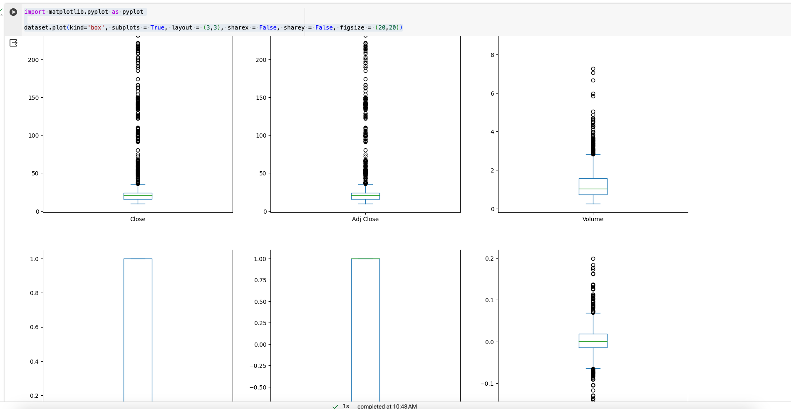
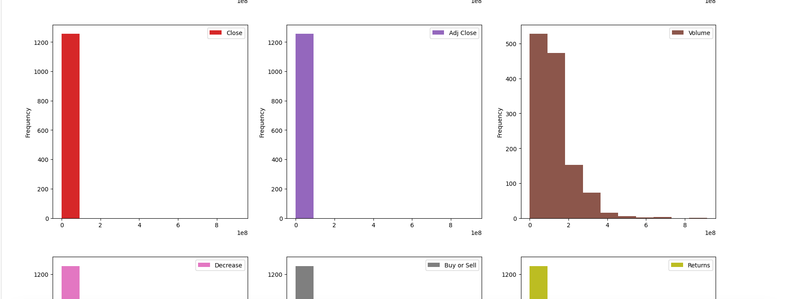
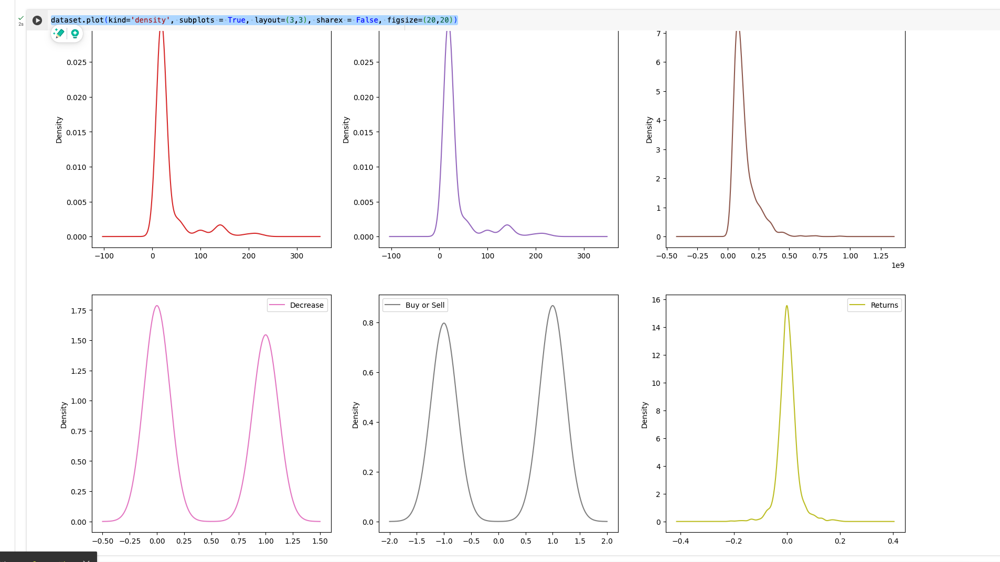
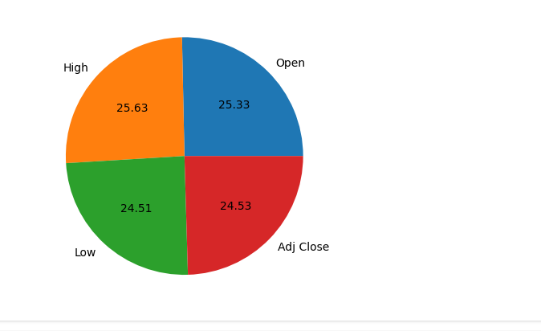
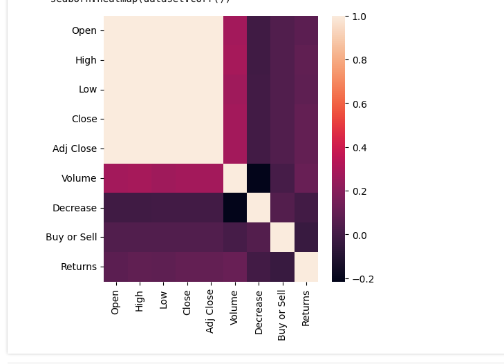
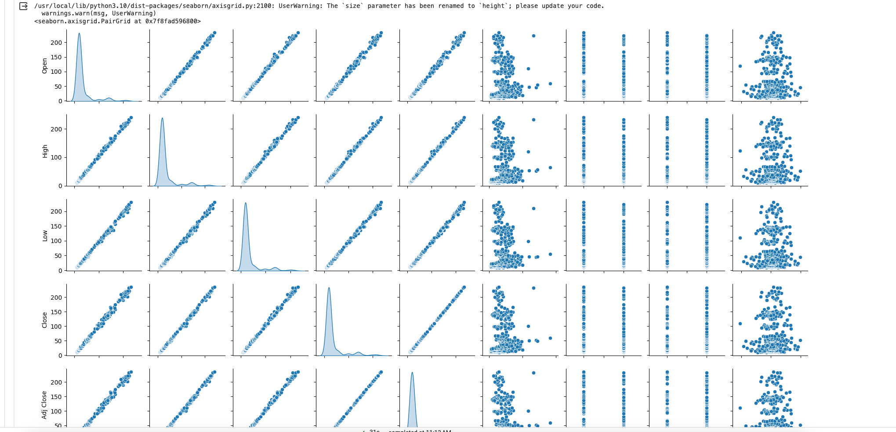

<https://training.mammothinteractive.com/courses/2098254/lectures/47229136>

## Pandas, MatPlotLib

```python
dataset = dataset.dropna() # drop nulls/NA
dataset.describe() # describe the shape and stats
dataset.isnull().values.any() # nulls have to be handled
```

`dataset.groupby('Class').size() # not useful on numbers so much but categories`

```bash
Class
Negative    625
Positive    630
dtype: int64
```


```python
import matplotlib.pyplot as pyplot

dataset.plot(kind='box', subplots = True, layout = (3,3), sharex = False, sharey = False, figsize = (20,20))`
```



```python
dataset.plot(kind='hist', subplots=True, layout =(3,3), sharex = False, sharey = False, figsize=(20,20))
```



```python
dataset.hist()
pyplot.show()

pyplot.hist(dataset['High'], bins=100)

pyplot.xlabel('High Price of Stock')
pyplot.ylabel('Frequency of Price Range')
pyplot.show()
```

individual line charts

```python
dataset.plot(kind = 'line', subplots = True, layout=(3,3), sharex = False, sharey = False, figsize=(20,20))
```

multiple columns on a line graph

```python
stock_prices = dataset[['Open', 'High', 'Low', 'Adj Close']]

pyplot.plot(stock_prices)
pyplot.legend(stock_prices)
pyplot.show()
```

scatter

```python
pyplot.scatter(dataset['Open'], dataset['Close'])

pyplot.xlabel('Open')
pyplot.ylabel('Close')

pyplot.show()
```

```python
dataset.plot(kind='density', subplots = True, layout=(3,3), sharex = False, figsize=(20,20))
```



```python
sizes = stock_prices.iloc[0]
column_names = ['Open', 'High', 'Low', 'Adj Close']

pyplot.pie(sizes, labels=column_names, autopct='%.2f')
```



positive and negatives

```python
dataframe_objects = dataset.select_dtypes(include = ['object']).copy()
dataframe_objects

dataframe_ints = dataset.select_dtypes(include = ['int']).copy()

num_of_positive_returns = dataframe_objects[dataframe_objects == 'Positive'].count().sum()
num_of_negative_returns = dataframe_objects[dataframe_objects == 'Negative'].count().sum()

list_of_return_counts = [num_of_positive_returns, num_of_negative_returns]

COLUMN_NAMES = ['Positive', 'Negative']
PIE_CHART_COLORS = ['orange', 'blue']
pyplot.pie(list_of_return_counts, labels=COLUMN_NAMES, autopct = '%.1f%%', startangle=90, colors = PIE_CHART_COLORS)
pyplot.show()
```

## Seaborn

```python
import seaborn

seaborn.countplot(x = 'Class', data = dataset)

```

```python
import seaborn

pyplot.figure(figsize=(5,5))

seaborn.heatmap(dataset.corr())

pyplot.show()
```

Show coorelations, beige is 1:1.



coorelation

```python
dataset.corr()
```

compare coorelations

```python
seaborn.pairplot(dataset, diag_kind = 'kde', size = 2)
```



## Bokeh

<https://docs.bokeh.org/en/latest/index.html>

```python
from bokeh.plotting import figure, output_notebook
from bokeh.io import show

output_notebook()

PLOT_SIDE_LENGTH = 500
bokeh_figure = figure(width=PLOT_SIDE_LENGTH, height=PLOT_SIDE_LENGTH)
bokeh_figure.line(dataset.index, dataset['Low'])
show(bokeh_figure)
```

multiple data points

```python
scatter_figure = figure(width=PLOT_SIDE_LENGTH, height=PLOT_SIDE_LENGTH)

circle_x = dataset['Open']
circle_y = dataset['Close']
scatter_figure.circle(circle_x, circle_y)


square_x = dataset['High']
square_y = dataset['Low']
scatter_figure.square(square_x, square_y, color='green')

output_notebook()
show(scatter_figure)
```

## 3D Plot

```python
from mpl_toolkits import mplot3d

figure = pyplot.figure()

figure_axes = pyplot.axes(projection = '3d')

xdata = dataset['Open']
ydata = dataset['High']
zdata = dataset['Adj Close']

pyplot.xlabel('Open')
pyplot.ylabel('High')

figure_axes.scatter3D(xdata, ydata, zdata)
```

## yellowbrick

rank features

```python
from yellowbrick.features import Rank1D

feature_list = ['Open', 'High', 'Low', 'Volume', 'Decrease', 'Buy', 'Returns']
features = dataset[feature_list]
features.info()

X = features.to_numpy()
y = dataset['Adj Close'].to_numpy()

visualizer = Rank1D(algorithm = 'shapiro', features=feature_list)
visualizer.fit(X,y)
visualizer.transform(X)
visualizer.poof()

from yellowbrick.features import Rank2D

visualizer_2D = Rank2D(features = feature_list, algorithm = 'covariance')
visualizer_2D.fit(X,y)
visualizer_2D.transform(X)
visualizer_2D.poof()
```
