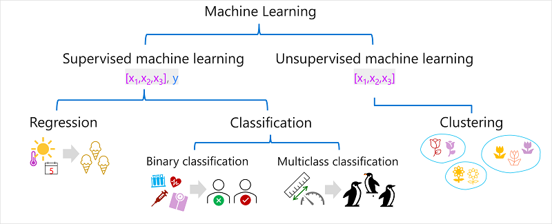
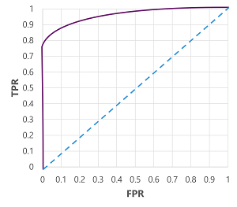

https://learn.microsoft.com/en-us/training/modules/get-started-ai-fundamentals/

## Intro

- __Machine learning__ - This is often the foundation for an AI system, and is the way we "teach" a computer model to make predictions and draw conclusions from data.
- __Computer vision__ - Capabilities within AI to interpret the world visually through cameras, video, and images.
- __Natural language processing__ - Capabilities within AI for a computer to interpret written or spoken language, and respond in kind.
- __Document intelligence__ - Capabilities within AI that deal with managing, processing, and using high volumes of data found in forms and documents.
- __Knowledge mining__ - Capabilities within AI to extract information from large volumes of often unstructured data to create a searchable knowledge store.
- __Generative AI__ - Capabilities within AI that create original content in a variety of formats including natural language, image, code, and more.

## Machine Learning

Data scientists can use data to train machine learning models to make predictions and inferences based on the relationships they find in the data.

__Azure Machine Learning service__ - a cloud-based platform for creating, managing, and publishing machine learning models. Azure Machine Learning Studio offers multiple authoring experiences such as:

- Automatic Machine Learning - this feature enables non-experts to quickly create an effective machine learning model from data.
- Azure Machine Learning Designer - a graphical interface enabling no-code development of machine learning solutions.
- Data metric visualization - analyze and optimize your experiments with visualization.
- Notebooks - write and run your own code in managed Jupyter Notebook servers that are directly integrated in the studio.

### ML as a Function

- Based on mathematics and Statistics
- Defining the function is known as training
- Predicting new values is known as inference
- Often see the feature as var `x` and the label as var `y`
- `x` is usually a vector, multiple values
- an algorithm is applied to the data to try to determine a relationship beween the features and the label
- the results of the algorithm is a model

### Types of ML

#### Supervised Learning

- includes both feature values and known labels
- __regression__ - is a form of supervised machine learning in which the label predicted by the model is a numeric value.
- __classification__ - is a form of supervised machine learning in which the label represents a categorization, or class
- __binary classification__ - is a form of classification in which the label has two possible values (mutually exclusive).
- __multiclass classification__ - extends binary classification to predict a label that represents one of multiple possible classes

#### Unsupervised Learning

- involves training models using only feature values
- algorithms determine relationships between the features of the observations in the training data
- __clustering__ - A clustering algorithm identifies similarities between observations based on their features, and groups them into discrete clusters.

## Computer Vision

__Seeing AI__ - Designed for the blind and low vision community, the Seeing AI app harnesses the power of AI to open up the visual world and describe nearby people, text and objects.

- __Image classification__ - Image classification involves training a machine learning model to classify images based on their contents.
- __Object detection__ - Object detection machine learning models are trained to classify individual objects within an image, and identify their location with a bounding box.
- __Semantic segmentation__ - Semantic segmentation is an advanced machine learning technique in which individual pixels in the image are classified according to the object to which they belong.
- __Image analysis__ - You can create solutions that combine machine learning models with advanced image analysis techniques to extract information from images, including "tags" that could help catalog the image or even descriptive captions that summarize the scene shown in the image.
- __Face detection analysis and recognition__ - Face detection is a specialized form of object detection that locates human faces in an image. This can be combined with classification and facial geometry analysis techniques to recognize individuals based on their facial features.
- __Optical character recognition (OCR)__ - Optical character recognition is a technique used to detect and read text in images. You can use OCR to read text in photographs (for example, road signs or store fronts) or to extract information from scanned documents such as letters, invoices, or forms.

__Azure AI Vision__ - The service features are available for use and testing in the Azure Vision Studio and other programming languages. Some features of Azure AI Vision include:

- Image Analysis: capabilities for analyzing images and video, and extracting descriptions, tags, objects, and text.
- Face: capabilities that enable you to build face detection and facial recognition solutions.
- Optical Character Recognition (OCR): capabilities for extracting printed or handwritten text from images, enabling access to a digital version of the scanned text.

## Natural Language Processing

Natural language processing (NLP) is the area of AI that deals with creating software that understands written and spoken language.

__Azure AI Language__ - Some features of Azure AI Language include understanding and analyzing text, training conversational language models that can understand spoken or text-based commands, and building intelligent applications.

__Azure AI Speech__ - Azure AI Speech features include speech recognition and synthesis, real-time translations, conversation transcriptions, and more.

## Document Intelligence

Document Intelligence is the area of AI that deals with managing, processing, and using high volumes of a variety of data found in forms and documents. Document intelligence enables you to create software that can automate processing for contracts, health documents, financial forms and more

__Azure AI Document Intelligence__ - Features of Azure AI Document Intelligence help automate document processing in applications and workflows, enhance data-driven strategies, and enrich document search capabilities. You can use prebuilt models to add intelligent document processing for invoices, receipts, health insurance cards, tax forms, and more. You can also use Azure AI Document Intelligence to create custom models with your own labeled datasets. The service features are available for use and testing in the Document Intelligence Studio and other programming languages.

__Knowledge mining__ is the term used to describe solutions that involve extracting information from large volumes of often unstructured data to create a searchable knowledge store.

__Azure AI Search__ - an enterprise, search solution that has tools for building indexes. The indexes can then be used for internal only use, or to enable searchable content on public facing internet assets.

## Generative AI

Generative AI describes a category of capabilities within AI that create original content. People typically interact with generative AI that has been built into chat applications. Generative AI applications take in natural language input, and return appropriate responses in a variety of formats including natural language, image, code, and audio.

__Azure OpenAI Service__ - is Microsoft's cloud solution for deploying, customizing, and hosting generative AI models. It brings together the best of OpenAI's cutting edge models and APIs with the security and scalability of the Azure cloud platform.

## Challenges and Risks

| Challenge or Risk                     | Example                                                                                                   |
|---------------------------------------|-----------------------------------------------------------------------------------------------------------|
| Bias can affect results               | A loan-approval model discriminates by gender due to bias in the data with which it was trained           |
| Errors may cause harm                 | An autonomous vehicle experiences a system failure and causes a collision                                 |
| Data could be exposed                 | A medical diagnostic bot is trained using sensitive patient data, which is stored insecurely              |
| Solutions may not work for everyone   | A home automation assistant provides no audio output for visually impaired users                          |
| Users must trust a complex system     | An AI-based financial tool makes investment recommendations - what are they based on?                     |
| Who's liable for AI-driven decisions? | An innocent person is convicted of a crime based on evidence from facial recognition – who's responsible? |

## Responsible AI

https://www.microsoft.com/ai/responsible-ai-resources

## Regression

Regression models are trained to predict numeric label values based on training data that includes both features and known labels.

- Part of a dataset is selected for training, others are held back for valiation.
- An alogrithm (e.g. linear regression) is used to train a model.
- Use the validation dataset to test the model
- Conpare known actual values with predicted values

### Evaluation Metrics

Mean Absolute Error (MAE): mean value (average) of the absolute variance of error (-3 and +3 = 3). e.g.  (2, 3, 3, 1, 2, and 3) is 2.33

### Mean Squared Error (MSE)

 Takes all descrepancies between predicted and actual labels into account equally. This is squaring the actual values and calculating mean. This is used when more small errors are more desirable than larger but fewer errors. e.g. (which are 4, 9, 9, 1, 4, and 9) is 6

### Root Mean Squared Error (RMSE)

The result of MSE no longer represents the quantity measured by the label. To measure in terms of number, take the square root of the MSE. e.g.  √6, which is 2.45

### Coefficient of Determination (R-Squared)

A metric that measures the proportion of variance in the validation results that can be explained by the model, as opposed to some anomalous aspect of the validation data.

The calculation for R2 is more complex than for the previous metrics. It compares the sum of squared differences between predicted and actual labels with the sum of squared differences between the actual label values and the mean of actual label values.

$$ R^2 = {1 - \sum(y - \hat{y})^2 \div \sum(y-\bar{y})^2} $$

A number between 0 and 1. The closer to 1 the better the model is at fitting the validation data. e.g. 0.95

### Iterative Training

A data scientist would iteratively train the model varying:

- Feature selection and preperation.
- Algogrithm selection
- Algogrithm parameters

## Binary Classification

Follows the same process as regression, but instead of calculating numeric values, the model calculates probablity values for class assignment.

Only two possible values. e.g. true, false or 1,0

To train the model, use an algorithm to fit the training data to a function that calculates probablity of the class label being true.

There are many algorithms that can be used for binary classification, such as logistic regression, which derives a sigmoid (S-shaped) function with values between 0.0 and 1.0

**Logic regression is used for classification, but not regression.**

$$ f(x) = P(y=1 | x) $$

### Evaluation Metrics

- Create a matrix of correct and incorrect predictions for each possible label.

|   | 0 | 1 |
|---|---|---|
| 0 | 2 | 0 |
| 1 | 1 | 3 |

$ x\ axis = \hat{y},\ y\ axis = y $

The visualization is called a confusion matrix.

- ŷ=0 and y=0: True negatives (TN)
- ŷ=1 and y=0: False positives (FP)
- ŷ=0 and y=1: False negatives (FN)
- ŷ=1 and y=1: True positives (TP)

The arrangement of the confusion matrix is such that correct (true) predictions are shown in a diagonal line from top-left to bottom-right. Often, color-intensity is used to indicate the number of predictions in each cell, so a quick glance at a model that predicts well should reveal a deeply shaded diagonal trend.

### Accuracy

The simplest metric you can calculate from the confusion matrix is accuracy - the proportion of predictions that the model got right

$$ (TN + TP) \div (TN + FN + FP + TP) $$

e.g. 0.83

### Recall

Recall is a metric that measures the proportion of positive cases that the model identified correctly. i.e. How many did the model predict to be positive?

$$ TP \div (TP + FN) $$

e.g. 0.75

## Precision

Similar metric to recall, but measures the proportion of predicted positive cases where the true label is actually positive. i.e. What proportion of the positive predictions were correct?

$$ TP \div (TP + FP) $$

e.g. 1.0

## F1-score

F1-score is the overall metric that combined recall and precision.

$$ (2 x Precision x Recall) \div (Precision + Recall) $$

e.g. 0.86

## Area Under the Curve (AUC)

Another name for recall is the true positive rate (TPR), and there's an equivalent metric called the false positive rate (FPR).

$$ FPR = FP \div (FP + TN) $$

e.g. FPR 0

These metrics are often used to evaluate a model by plotting a received operator characteristic (ROC) curve that compares the TPR and FPR for every possible threshold value between 0.0 and 1.0

The ROC curve for a perfect model would go straight up the TPR axis on the left and then across the FPR axis at the top. Since the plot area for the curve measures 1x1, the area under this perfect curve would be 1.0 (meaning that the model is correct 100% of the time). In contrast, a diagonal line from the bottom-left to the top-right represents the results that would be achieved by randomly guessing a binary label; producing an area under the curve of 0.5. In other words, given two possible class labels, you could reasonably expect to guess correctly 50% of the time.

In the case of our diabetes model, the curve above is produced, and the area under the curve (AUC) metric is 0.875. Since the AUC is higher than 0.5, we can conclude the model performs better at predicting whether or not a patient has diabetes than randomly guessing.

## Multiclass Classification

Multiclass classification is used to predict to which of multiple possible classes an observation belongs. As a supervised machine learning technique, it follows the same iterative train, validate, and evaluate process as regression and binary classification in which a subset of the training data is held back to validate the trained model.

### Algorithms

#### One-vs-Rest (OvR) algorithms

One-vs-Rest algorithms train a binary classification function for each class, each calculating the probability that the observation is an example of the target class.

$$ f^0(x) = P(y=0 | x) $$
$$ f^1(x) = P(y=1 | x) $$
$$ f^2(x) = P(y=2 | x) $$

Each algorithm produces a sigmoid function that calculates a probability value between 0.0 and 1.0

#### Multinomial algorithms

As an alternative approach is to use a multinomial algorithm, which creates a single function that returns a multi-valued output. The output is a vector (an array of values) that contains the probability distribution for all possible classes - with a probability score for each class which when totaled add up to 1.0

$$ f(x) = [P(y=0|x), P(y=1|x), P(y=2|x)] $$

e.g. [0.2, 0.3, 0.5]

### Evaluation Metrics

Create a confustion matrix with all possibilities.

|   | 0 | 1 | 2 |
|---|---|---|---|
| 0 | 2 | 0 | 0 |
| 1 | 0 | 2 | 0 |
| 2 | 0 | 1 | 2 |

$ x\ axis = \hat{y},\ y\ axis = y $

To calculate the overall accuracy, recall, and precision metrics, you use the total of the TP, TN, FP, and FN metrics

- Overall accuracy = (13+6)÷(13+6+1+1) = 0.90
- Overall recall = 6÷(6+1) = 0.86
- Overall precision = 6÷(6+1) = 0.86
- Overall F1-score = (2x0.86x0.86)÷(0.86+0.86) = 0.86

## Clustering

Clustering is a form of unsupervised machine learning in which observations are grouped into clusters based on similarities in their data values, or features. This kind of machine learning is considered unsupervised because it doesn't make use of previously known label values to train a model. In a clustering model, the label is the cluster to which the observation is assigned, based only on its features.

There are multiple algorithms you can use for clustering. One of the most commonly used algorithms is K-Means clustering, which consists of the following steps:

- feature (x) values are vectorized to define n-dimensional coordinates. (n is number of features)
- you decide how many clusters you want to use. Call this k.
- Each data point is assigned to its nearest centroid
- Each centroid is moved to the center of the data points assigned to it based on the mean distance between points.
- After each centroid is moved, the data points are reassigned to the nearest centroid.
- The centroid movement and re-allocation steps are repeated until the cluster become stable or a predetermined number of iterations is reached.

### Evaluation Metrics

Since there's no known label with which to compare the predicted cluster assignments, evaluation of a clustering model is based on how well the resulting clusters are separated from one another.

- Average distance to cluster center: How close, on average, each point in the cluster is to the centroid of the cluster.
- Average distance to other center: How close, on average, each point in the cluster is to the centroid of all other clusters.
- Maximum distance to cluster center: The furthest distance between a point in the cluster and its centroid.
- Silhouette: A value between -1 and 1 that summarizes the ratio of distance between points in the same cluster and points in different clusters (The closer to 1, the better the cluster separation).

## Deep Learning

Deep learning is an advanced form of machine learning that tries to emulate the way the human brain learns. The key to deep learning is the creation of an artificial neural network that simulates electrochemical activity in biological neurons by using mathematical functions

Artificial neural networks are made up of multiple layers of neurons - essentially defining a deeply nested function. This architecture is the reason the technique is referred to as deep learning and the models produced by it are often referred to as deep neural networks (DNNs). You can use deep neural networks for many kinds of machine learning problem, including regression and classification, as well as more specialized models for natural language processing and computer vision.

### how doea a neural network learn?

The weights in a neural network are central to how it calculates predicted values for labels. During the training process, the model learns the weights that will result in the most accurate predictions.

- Training and validation data are defined. Training features are fed into the input layer
- The neurons in each layer apply their weights, initially assigned randomly, and feed data through the network.
- The output layer produces a vecotr containing the calculated values for $ \hat{y}$
- A loss function is used to compare the predicted $ \hat{y}$ to known $y$ values and aggregates the difference. Known as loss.
- An optimization function can use differential calculus to evalute the influence of each weight in the network on the loss and determine how they could be adjusted to reduce the loss. Techniques vary, common is gradient descent, where each weight is increased/decreased to minimize loss.
- The changes are backpropagated to layers in the network, replacing previously used values
- The process is repeated over multiple iterations (epochs) until the loss is minimized and the model predicts acceptably accurate results.

## Azure Machine Learning

Cloud service for training, deploying, and managing machine learning models.

- Centralized storage and management of datasets for model training and evaluation.
- On-demand compute resources on which you can run machine learning jobs, such as training a model.
- Automated machine learning (AutoML), which makes it easy to run multiple training jobs with different algorithms and parameters to find the best model for your data.
- Visual tools to define orchestrated pipelines for processes such as model training or inferencing.
- Integration with common machine learning frameworks such as MLflow, which make it easier to manage model training, evaluation, and deployment at scale.
- Built-in support for visualizing and evaluating metrics for responsible AI, including model explainability, fairness assessment, and others.

## Azure Machine Learning Studio

- Import and explore data.
- Create and use compute resources.
- Run code in notebooks.
- Use visual tools to create jobs and pipelines.
- Use automated machine learning to train models.
- View details of trained models, including evaluation metrics, responsible AI information, and training parameters.
- Deploy trained models for on-request and batch inferencing.
- Import and manage models from a comprehensive model catalog.
