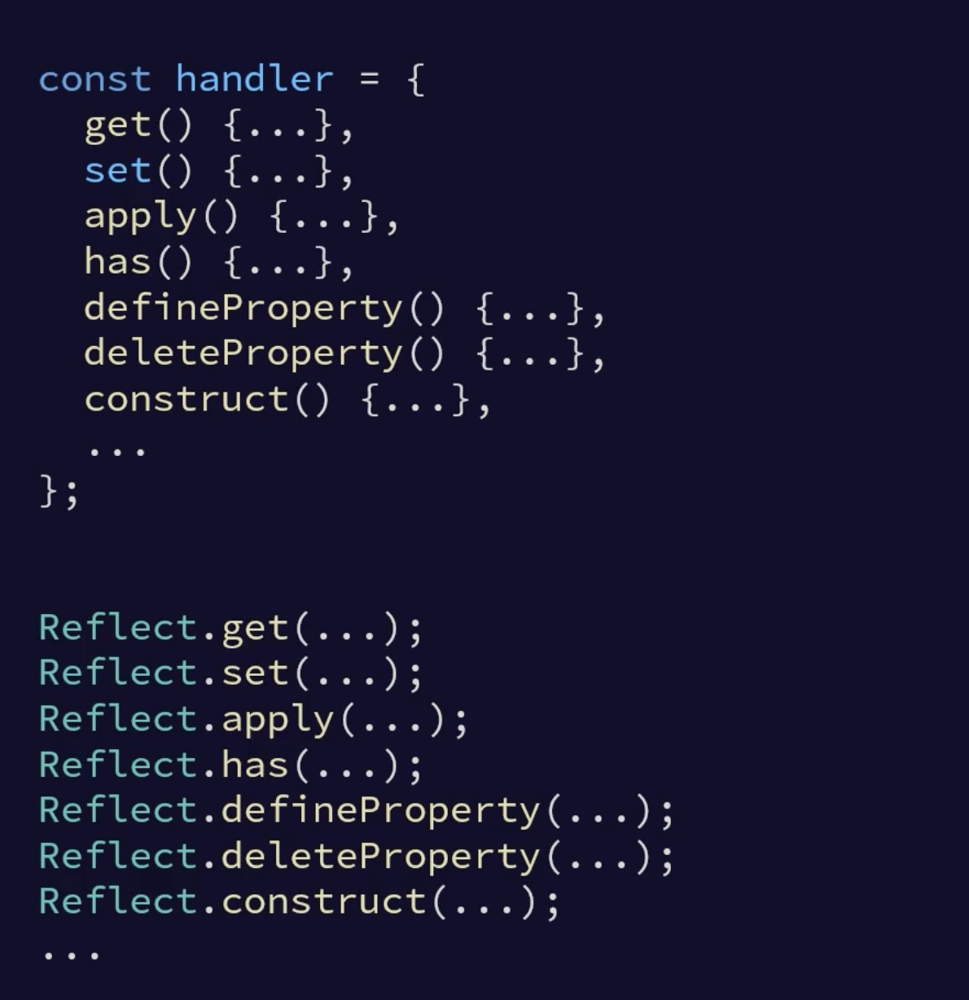

https://app.pluralsight.com/library/courses/javascript-proxy-objects-reflect/table-of-contents

https://replit.com/@kaltepeter/pluralsight-proxy-objects#index.js

## Proxy Objects

- Must provide a handler or you get: `TypeError: Cannot create proxy with a non-object as target or handler`
- Targets also must be objects
- `const custProxy = new Proxy(customer, {});` would create a proxy with no special handling.
- Handler set trap must return true if successful. If failed throw an exception, don't return false
- When using arrow functions args are symbols

Simple example.

```javascript
const customer = {
    firstName: "",
    lastName: "",
    phone: "",
    companyName: "",
};

const handler = {
    set(target, prop, val) {
        out(`Setting ${prop} - ${val}`);
        // if (prop === "firstName") {
        target[prop] = val;
        // }
        return true;
    },
};

const custProxy = new Proxy(customer, handler);
custProxy.firstName = "Shawn";
custProxy.lastName = "Wildermuth";
```

## What Can Be Proxied

Only objects.

- ❌ number
- ❌ boolean
- ❌ string
- ❌ null
- ❌ undefined
- ❌ symbol
- ✅ object
- ✅ array
- ✅ date
- ✅ set
- ✅ map

## Traps

- Object level middleware.
- Allows you to opt-into take responsibility for operations
- You can trap operations, not properties

### Use Cases

- Validation
- Notification of property changes
- Auditing
- Often used for reactivity

## Functions

Use the apply trap to wrap a function.

```javascript
const formatCustomer = (cust) => {
    return `${cust.lastName}, ${cust.firstName}`;
};

const formatProxy = new Proxy(formatCustomer, {
    apply: (target, thisArg, args) => {
        out(`Calling ${target}`);
        return target.apply(thisArg, args);
    },
});

out(formatProxy(custProxy));
```

## Iteration

### Arrays

- Still objects
- multiple traps may be needed
- array proxy doesn't wrap items, the keys printed are things like foreach, length, or the item index

```javascript
   const people = [
        {
            name: "Shawn",
            age: 50,
        },
        {
            name: "James",
            age: 44,
        },
        {
            name: "Betty",
            age: 29,
        },
        {
            name: "Phillip",
            age: 88,
        },
    ];

    const proxyCollection = new Proxy(people, {
        get: (target, key) => {
            out(`Key: ${key}`);
            if (key === "pop") throw Error("pop is not allowed");
            return target[key];
        },
        set: (target, key, value) => {
            if (key < target.length) {
                throw new Error("Cannot assign existing items");
            }
            return (target[key] = value);
        },
    });

    proxyCollection.forEach((c) => {
        out(`foreach: ${c.name}`);
    });

    // proxyCollection.splice(1, 1, { name: "Bob" });
```

### Objects

```javascript
    const customer = {
        firstname: "Shawn",
        lastname: "Wildermuth",
        phone: "4045551212",
        companyname: "Wilder Minds",
        _id: 100,
    };

    const proxyCust = new Proxy(customer, {
        ownKeys: (target) => {
            return Object.keys(target).filter((k) => k[0] !== "_");
        },
        get: (target, key) => {
            if (key[0] === "_") {
                return;
            }
            return target[key];
        },
        set: (target, key, value) => {
            if (key[0] === "_") {
                throw Error(`Could not find ${key} in object`);
            }
            return (target[key] = value);
        },
        has: (target, key) => {
            if (key[0] === "_") {
                return false;
            }
            return key in target;
        },
    });

    for (let key in proxyCust) {
        out(key);
        out(customer[key]);
    }

    out(proxyCust._id);
    // proxyCust._id = 101;

    if ("_id" in proxyCust) {
        out("Found");
    }
```

### Nested Proxies

- you can return proxies from getters
- proxies can be slow

```javascript
get: (target, key) => {
    out(`Key is ${key}`);
    if (key[0] === "_") {
        return;
    }
    return new Proxy(target[key], {
        get: (t, k) => {
            out(`nested: ${k}`);
            return t[k];
        },
    });
},
```

## Proxies in Action

- you can create a proxy for a class
- this is for the 'type'
- basically a constructor function
- key is a construct trap

### Classes

```javascript
import out from "./out.js";
import Order from "./order.js";

export const classes = () => {
    out("Starting classes...\n");

    const classProxy = new Proxy(Order, {
        construct: (target, args) => {
            out(`calling constructor`);
            return new Proxy(new target(...args), {
                get: (target, key) => {
                    out(`getting ${key}`);
                    return target[key];
                },
            });
        },
    });
    const order = new classProxy(1001, 1, "Net 30");
    out(order.terms);

    out("Ending classes...\n\n");
};

export default classes;
```

DefineProperty trap can handle setting unknowns, etc. This will not work if a set if defined because it's the same thing.

In this example the defineProperty trap is not hit.

```javascript
    set: (target, key, value) => {
        return (target[key] = value);
    },
    defineProperty: (target, key, desc) => {
        if (key.indexOf("_") > -1) {
            throw new Error("Cannot define properties with _");
        }
        out(`Defining property ${key}`);
        return true
    },
```

If you need to protect property names and set, do it all in defineProperty.

```javascript
defineProperty: (target, key, desc) => {
    if (key.indexOf("_") > -1) {
        throw new Error("Cannot define properties with _");
    }
    out(`Defining property ${key}`);
    return target[key] = desc.value; // same as return true
},
```

#### delete trap

```javascript
deleteProperty: (target, key) => {
    if (key === "age") {
        throw new Error("Cannot delete age");
    }
    delete target[key];
    return true;
},
```

#### prevent extensibility

```javascript
isExtensible: (target) => {
    out(`testing extensibility`);
    return Object.isExtensible(target);
},
preventExtensions: (target) => {
    out(`Locking down object`);
    return Object.preventExtensions(target);
},
```

### throttling functions

```javascript
const checkUpdates = () => {
    out(`Fetching`);
    return true;
};

let lastTime = 0;
let cached = false;

const funcProxy = new Proxy(checkUpdates, {
    apply: (target, theThis, args) => {
        const newTime = new Date().getTime();
        if (newTime - lastTime > 1000) {
            cached = target.apply(theThis, args);
            lastTime = newTime;
        }
        return cached;
    },
});

while (true) {
    funcProxy();
}
```

### async throttling function

```javascript
 const checkUpdates = async () => {
    out(`Fetching`);
    try {
        const result = await fetch(`https://catfact.ninja/fact`);
        const { fact } = await result.json();
        return fact;
    } catch (e) {
        out(e);
    }
    return true;
};

let lastTime = 0;
let cached = false;

const funcProxy = new Proxy(checkUpdates, {
    apply: async (target, theThis, args) => {
        const newTime = new Date().getTime();
        if (newTime - lastTime > 1000) {
            cached = await target.apply(theThis, args);
            lastTime = newTime;
            out(cached);
        }
        return cached;
    },
});

while (true) {
    await funcProxy();
}
```

### revocable proxies

For short term use, one way call. 

```javascript
const some = {
    name: "Shawn",
    city: "Atlanta",
};

const someProxy = Proxy.revocable(some, {
    get: (target, key) => {
        if (key === "name") return target[key].toUpperCase();
        return target[key];
    },
});

out(`${someProxy.proxy.name} from ${someProxy.proxy.city}`);
someProxy.revoke();
// out(`${someProxy.proxy.name} from ${someProxy.proxy.city}`); # throw error
out(`${someProxy.name} from ${someProxy.city}`);
out(`${some.name} from ${some.city}`);
```

### Limitations of Proxies

- Browser support. Incomplete poly-fill for older browsers
- Not able to detect a proxy
- Can be a drag on performance

## Reflect API

- static object 
- API for performing proxy operations
- Does not require a proxy
- Mirrors the Handler
- Very little use outside proxy



```javascript
const person = {
    name: "Shawn",
};

Reflect.set(person, "name", "Bob");
out(Reflect.get(person, "name"));
```

```javascript
const theOrder = new Proxy(order, {
    get: (target, key) => {
        out(`reading a property: ${key}`);
        return Reflect.get(target, key);
    },
});

out(theOrder.orderNumber);

const theOrder = new Proxy(order, {
    get() {
        const result = Reflect.get(...arguments);
        out(`reading a property: ${result}`);
        return result;
    },
    set() {
        return Reflect.set(...arguments);
    },
    apply() {
        return Reflect.apply(...arguments);
    },
    defineProperty() {
        return Reflect.defineProperty(...arguments);
    },
});

theOrder.orderNumber = 1002;
out(theOrder.orderNumber);
```