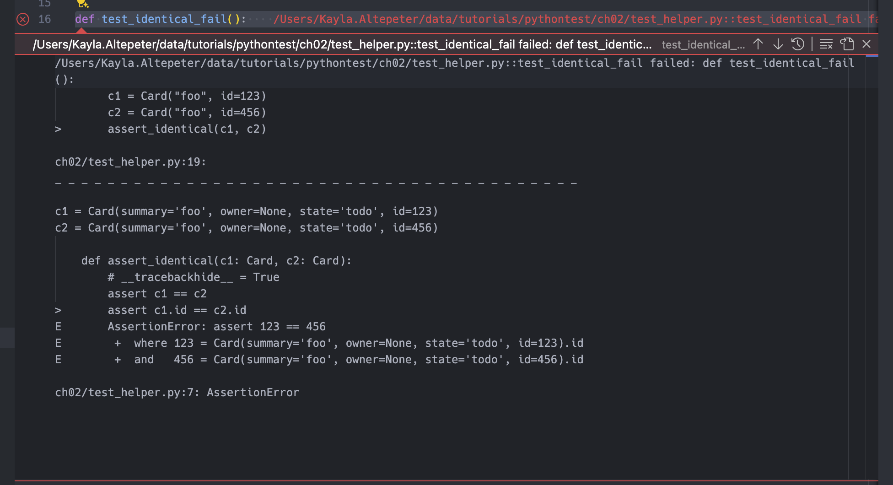
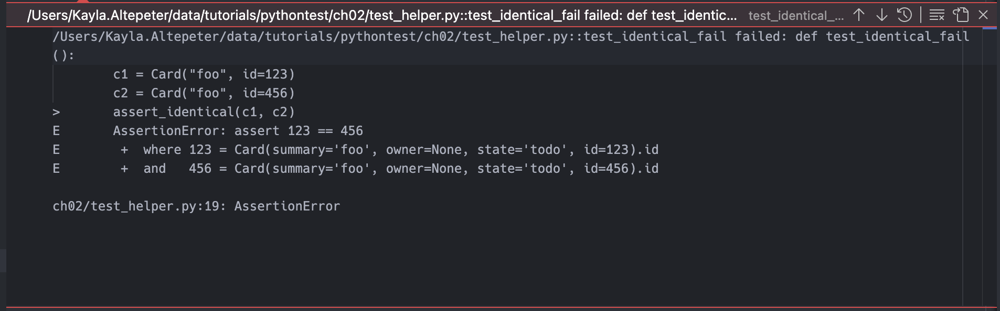

https://pythontest.teachable.com/p/complete-pytest-course

The videos are more up to date than the book(https://pragprog.com/titles/bopytest2/python-testing-with-pytest-second-edition/). The video matches the book chapters.

The book on oreilly: https://learning.oreilly.com/library/view/python-testing-with/9781680509427/

## Running

`-v` verbose, add more v's for more detail

`pytest` basic run

`pytest <path>` execute tests in a dir

`--tb=no` disable traceback

`pytest -v --tb=no --no-summary` concise run output

`pytest -v --tb=no --no-summary -k _classes` run all with keyword 'classes'

`pytest -v --tb=no --no-summary -k "equality and diff"` logic for keyword equality and not diff

`-s or --capture=no` turns off pytest output capture. By default passing tests don't log anything, passing `-s` will log output.

`--setup-show` show test setup

VSCode python extension supports running tests, they need to be configured. https://code.visualstudio.com/docs/python/testing

## Test Discovery

- Files named test_*.py or *_test.py
- Classes names TestSomething

## Test Outcomes

- PASSED (.)
- FAILED (F) - exception in test
- SKIPPED (S) - marked to skip
- XFAIL (x) - marked as expected to fail
- XPASS (X) - expected to fail but passed
- ERROR (E) - exception in fixture

`@pytest.mark.xfail(reason="example of xfail")` will output 'example of xfail' in the log

## Pip

get pip deps

```python
pip install pipdeptree
pipdeptree

pip list --not-required # show top level items
```

## Writing Test Functions

```python
assert c is None # checking none
assert c == 0   # checking equality

# code in block raises exception
with pytest.raises(TypeError):
    pass

# more specific exception checking, messy, use the generic type instead
with pytest.raises(TypeError) as exc_info:
        cards.CardsDB()
    expected = "missing 1 required positional argument"
    assert expected in str(exc_info.value)
```

## Assertion Helpers

Error Messages



`__tracebackhide__ = True` hide traceback for helper funtions, makes it clearer where the failure happened.



## Structure

Given/When/Then or Arrange/Act/Assert

Grouping in classes

```python
class TestEquality:
    def test_equality(self):
        c1 = Card("something", "brian", "todo", 123)
        c2 = Card("something", "brian", "todo", 123)
        assert c1 == c2
```

Running just the class: `pytest test_classes.py::TestEquality -v`

## Pytest Fixtures

`@pytest.fixture()` creates a fixture

```python
@pytest.fixture()
def fixture_name()
    # arrange/setup
    yield # or return if no teardown
    # teardown

# passin to test
def test_something(fixture_name):
    # act
    # assert
```

`pytest test_count.py -v --setup-show` will trace control flow in tests.

### Scopes

`@pytest.fixture(scope="module")` creates a fixture in the module scope. This can create one setup/teardown for the module, like expensive db setup.

- `scope="function"` (default) - run once per test function
- `scope='class'` - run once per test class
- `scope='module'` - run once per module
- `scope='package'` - run once per test directory
- `scope='session'` - run once per test session (invocation of pytest)

### Sharing Fixtures Through `conftest.py`

- Moving fixtures to `conftest.py` will make them available to multiple files without imports.
- You can have multiple `conftest.py` files.
- Run with `--fixures` to find all fixtures.
- `pytest a --fixtures-per-test` list all fixutres per test for the directory `a`

### Multiple Fixture Levels

- Fixtures at a higher level, like session can preserve state which will break or make tests less reliable.
- You can layer fixtures to handle things seperately, like session scope is just creating db, and the function scope can use that fixure to clear the data.

```python
@pytest.fixture(scope="session")
def db():
    """CardsDB object connected to a temporary database"""
    with TemporaryDirectory() as db_dir:
        db_path = Path(db_dir)
        db_ = cards.CardsDB(db_path)
        yield db_
        db_.close()


@pytest.fixture(scope="function")
def cards_db(db):
    """CardsDB object that's empty"""
    db.delete_all()
    return db
```


### Dynamic Scope

This will change db scope based on command line arg of `--func-db`. To run with a clean db after each function pass that in.

`pytest d/test_count.py --setup-show --func-db`

```python
def pytest_addoption(parser):
    parser.addoption(
        "--func-db",
        action="store_true",
        default=False,
        help="new db for each test",
    )


def db_scope(fixture_name, config):
    if config.getoption("--func-db", None):
        return "function"
    return "session"


@pytest.fixture(scope=db_scope)
def db():
    """CardsDB object connected to a temporary database"""
    with TemporaryDirectory() as db_dir:
        db_path = Path(db_dir)
        db_ = cards.CardsDB(db_path)
        yield db_
        db_.close()
```

### Autouse

Example, wrapping with a time duration output. Autouse doesn't have a lot of use cases but is powerful.

```python
@pytest.fixture(autouse=True, scope="session")
def footer_session_scope():
    """Report the time at the end of a session."""
    yield
    now = time.time()
    print("--")
    print("finished : {}".format(
        time.strftime("%d %b %X", time.localtime(now))))
    print("-----------------")


@pytest.fixture(autouse=True)
def footer_function_scope():
    """Report test durations after each function."""
    start = time.time()
    yield
    stop = time.time()
    delta = stop - start
    print("\ntest duration : {:0.3} seconds".format(delta))
```

### Rename Fixtures

Use case: obvious name is taken by something already imported.

```python
@pytest.fixture(name="ultimate_answer")
def ultimate_answer_fixture():
    return 42


def test_everything(ultimate_answer):
    assert ultimate_answer == 42
```

## Builtin Fixtures

`pytest --fixtures` to list them, lists the builtins

`tmp_path_factory` [session scope] -- .../_pytest/tmpdir.py:241
    Return a :class:`pytest.TempPathFactory` instance for the test session.

`tmp_path` -- .../_pytest/tmpdir.py:256
    Return a temporary directory path object which is unique to each test
    function invocation, created as a sub directory of the base temporary
    directory.

`tmp_path_retention_count` (default 3) controls how many tmp files are preserved for debugging based on policy, default policy `all`. https://docs.pytest.org/en/latest/reference/reference.html#confval-tmp_path_retention_count

```python
def test_tmp_path(tmp_path):
    file = tmp_path / "file.txt"
    file.write_text("Hello")
    assert file.read_text() == "Hello"


def test_tmp_path_factory(tmp_path_factory):
    path = tmp_path_factory.mktemp("sub")
    file = path / "file.txt"
    file.write_text("Hello")
    assert file.read_text() == "Hello"
```

`capsys` -- .../_pytest/capture.py:981
    Enable text capturing of writes to ``sys.stdout`` and ``sys.stderr``.

Captures output during test execution, then provides methods to access the captured output.

```python
# manual way
def test_version_v1():
    process = subprocess.run(
        ["cards", "version"], capture_output=True, text=True
    )
    output = process.stdout.rstrip()
    assert output == cards.__version__

# capsys
def test_version_v2(capsys):
    cards.cli.version()
    output = capsys.readouterr().out.rstrip()
    assert output == cards.__version__

# print all output, not just failing, use this for particular tests
def test_disabled(capsys):
    with capsys.disabled():
        print("\ncapsys disabled print")
```

Typer: used for buildling CLIs and has testing utils. Capsys is not needed typically with this.

```python
import cards
from typer.testing import CliRunner


def test_version_v3():
    runner = CliRunner()
    result = runner.invoke(cards.app, ["version"])
    output = result.output.rstrip()
    assert output == cards.__version__
```

### Monkey Patching

https://docs.pytest.org/en/latest/how-to/monkeypatch.html

`monkeypatch` -- .../_pytest/monkeypatch.py:32
    A convenient fixture for monkey-patching.

`cards.cli.pathlib.Path` is patching the pathlib.Path import in cards.cli

```python
# source
def get_path():
    db_path_env = os.getenv("CARDS_DB_DIR", "")
    if db_path_env:
        db_path = pathlib.Path(db_path_env)
    else:
        db_path = pathlib.Path.home() / "cards_db"
    return db_path

# patch
def test_patch_get_path(monkeypatch, tmp_path):
    def fake_get_path():
        return tmp_path

    monkeypatch.setattr(cards.cli,
                        "get_path",
                        fake_get_path)
    assert run_cards("config") == str(tmp_path)
    assert run_cards("count") == "0"

# source
Path.home() # patch only home

# patch
def test_patch_home(monkeypatch, tmp_path):
    def fake_home():
        return tmp_path

    monkeypatch.setattr(cards.cli.pathlib.Path,
                        "home",
                        fake_home)

    full_cards_dir = tmp_path / "cards_db"
    print(full_cards_dir)
    assert run_cards("config") == str(full_cards_dir)
    assert run_cards("count") == "0"

# source
os.getenv("CARDS_DB_DIR", "") # only the env var

# patch only env var
def test_patch_env_var(monkeypatch, tmp_path):
    monkeypatch.setenv("CARDS_DB_DIR", str(tmp_path))

    assert run_cards("config") == str(tmp_path)
    assert run_cards("count") == "0"
```

- Patch the smallest amount as possible.
- Design for testability, i.e. env var

## Parameterization

Turning one test funciton into multiple test cases.

- A test failure is easier to debug than a loop
- Reduces boilerplate
- Only parameterize the meaningful changes
- Parameterize the fixture to make it easier to do work around the params. Returning the param makes the tests nice.

```python
# no parameters
def test_finish_from_done(cards_db):
    index = cards_db.add_card(Card("write pytest book", state="done"))
    cards_db.finish(index)
    card = cards_db.get_card(index)
    assert card.state == "done"


def test_finish_from_in_prog(cards_db):
    index = cards_db.add_card(Card("create video course", state="in prog"))
    cards_db.finish(index)
    card = cards_db.get_card(index)
    assert card.state == "done"


def test_finish_from_todo(cards_db):
    index = cards_db.add_card(Card("write tdd book", state="todo"))
    cards_db.finish(index)
    card = cards_db.get_card(index)
    assert card.state == "done"

# with loop
def test_finish(cards_db):
    for c in [
        Card("write pytest book", state="done"),
        Card("create video course", state="in prog"),
        Card("write tdd book", state="todo"),
    ]:
        index = cards_db.add_card(c)
        cards_db.finish(index)
        card = cards_db.get_card(index)
        assert card.state == "done"

# with parameters
@pytest.mark.parametrize(
    "start_summary, start_state",
    [
        ("write pytest book", "done"),
        ("create video course", "in prog"),
        ("write tdd book", "todo"),
    ],
)
def test_finish(cards_db, start_summary, start_state):
    initial_card = Card(summary=start_summary, state=start_state)
    index = cards_db.add_card(initial_card)

    cards_db.finish(index)

    card = cards_db.get_card(index)
    assert card.state == "done"


# simple parameters, only the start_state is varied, summary is reused.
@pytest.mark.parametrize("start_state", ["done", "in prog", "todo"])
def test_finish_simple(cards_db, start_state):
    c = Card("write tdd book", state=start_state)
    index = cards_db.add_card(c)
    cards_db.finish(index)
    card = cards_db.get_card(index)
    assert card.state == "done"

# parameterize the fixture
@pytest.fixture(params=["done", "in prog", "todo"])
def start_state(request):
    # do work
    return request.param


def test_finish(cards_db, start_state):
    c = Card("write tdd book", state=start_state)
    index = cards_db.add_card(c)
    cards_db.finish(index)
    card = cards_db.get_card(index)
    assert card.state == "done"
```

### Hooks

https://docs.pytest.org/en/7.1.x/reference/reference.html#hooks

Normally used by plugins, can be used in conftest files.

This example looks for a fixture named 'start_state' and parameterizes it.

`parametrize` is spelt funky.

```python
def pytest_generate_tests(metafunc):
    if "start_state" in metafunc.fixturenames:
        metafunc.parametrize("start_state", ["done", "in prog", "todo"])


def test_finish(cards_db, start_state):
    c = Card("write tdd book", state=start_state)
    index = cards_db.add_card(c)
    cards_db.finish(index)
    card = cards_db.get_card(index)
    assert card.state == "done"
```

## Markers

- `@pytest.mark.parametrize()`
- `@pytest.mark.skip()` skip the test, use reason to give info as to why
- `@pytest.mark.skipif()` conditionally skip. Supports multiple ifs.
- `@pytest.mark.xfail()` exepected to fail. Can set strict=True in the ini file.

- Use `--markers` to show all markers

Run with `-ra` to show reasons. `-r` shows extra summary. `-a` is all except passed.

Run with `-m` to run a marker, you can put logic like and or or in these

`s` is skipped
`A` all

```python
from packaging.version import parse

# skip if the major is less than 2
@pytest.mark.skipif(
    parse(cards.__version__).major < 2,
    reason="Card < comparison not supported in 1.x",
)

# expects version less than 2 to fails
@pytest.mark.xfail(
    parse(cards.__version__).major < 2,
    reason="Card < comparison not supported in 1.x",
)

# will mark as xpass or xfail
@pytest.mark.xfail(reason="XPASS demo")

# Waiting for a fix, whwen it passes alert
@pytest.mark.xfail(reason="strict demo", strict=True)
```

### Reasons to Use

- skipif, rarely if ever, not for versions. OS diffs.
- xfail to watch for a fix from someoneelse
- skip hard to justify

### Custom Markers

Register

```python
[pytest]
markers =
    smoke: subset of tests
    exception: check for expected exceptions
```

```python
# mark
@pytest.mark.smoke

# run with
pytest -m smoke
```

- `pytestmark = pytest.mark.finish` at top of file to mark all in file.
- `pytest.param("in prog", marks=pytest.mark.smoke)` mark param
- Can apply to function, classes, params
- Strict. `--strict-markers` will go faster and report mistyped markers.

```python
# pytest.ini settings
addopts =
    --strict-markers
    -ra
```

### Using with Fixtures

`pip install faker`

```python
@pytest.fixture(scope="function")
def cards_db(db, request, faker):
    # start empty
    db.delete_all()

    # support for `@pytest.mark.num_cards(<some number>)`

    # random seed
    faker.seed_instance(101)
    m = request.node.get_closest_marker("num_cards")
    if m and len(m.args) > 0:
        num_cards = m.args[0]
        for _ in range(num_cards):
            db.add_card(
                Card(summary=faker.sentence(), owner=faker.first_name())
            )
    return db

def test_no_marker(cards_db):
    assert cards_db.count() == 0


@pytest.mark.num_cards
def test_marker_with_no_param(cards_db):
    assert cards_db.count() == 0


@pytest.mark.num_cards(3)
def test_three_cards(cards_db):
    assert cards_db.count() == 3
    # just for fun, let's look at the cards Faker made for us
    print()
    for c in cards_db.list_cards():
        print(c)
```

## Testing Stategy

- write down test strategy
- change strategy when needed
- communicate changes

### Test Scope

- User visiable functions / features
- Security
- Performance
- Loading
- Input Validation
- Testing enough to sleep at night

### Architecture

- how is the application divided?
- team divisions
- consider layers, subsystems, even directory structure
- is there an API? is there a UI?
- Any external service/system that needs mocked, stubbed, or otherwise avoided during testing?

### Prioritizes

- recent
- core
- risk
- problmatic
- expertise

### Creating test cases

1. start with a non-trivial happy path
1. Then look at cases that represent
    - interesting sets of input
    - interesting starting states
    - interesting end states
    - all possible error states

## Configuration Files

- `conftest.py`
    - contains fixtures and hook functions
    - can be at root or subdirectory
- `__init__.py`
    - show in test subdirectories
    - allow test file name duplication
- `tox.ini`
    - for using tox, can combine pytest.ini here
- `setup.cfg`
    - not recommended by pytest, can cause weird issues hard to track down
- `pyproject.toml`
    - used with poetry

pytest determines root directory by starting at current and looking for conf file in each parent until found.

- recommended to add a conf file even if empty in each dir to prevent search up

Example files

```python
# pytest.ini
[pytest]
addopts =
    --strict-markers
    --strict-config
    -ra

testpaths = tests

markers =
    smoke: subset of tests
    exception: check for expected exceptions

# tox.ini, can combine pytest.init setting
[tox]
; tox specific settings

[pytest]
addopts =
    --strict-markers
    --strict-config
    -ra

testpaths = tests

markers =
    smoke: subset of tests
    exception: check for expected exceptions

# setup.cfg, least recommended
[tool:pytest]
addopts =
    --strict-markers
    --strict-config
    -ra

testpaths = tests

markers =
    smoke: subset of tests
    exception: check for expected exceptions

# pyproject.toml
[tool.pytest.ini_options]
addopts = [
    "--strict-markers",
    "--strict-config",
    "-ra"
    ]

testpaths = "tests"

markers = [
	"smoke: subset of tests",
	"exception: check for expected exceptions"
]
```

### Avoid Name Collision

`__init__.py` with pytest will avoid name collisions, the file can be empty. Doesn't affect imports.

Recommended to always add to sub directories.

## Coverage

`pip install pytest-cov` also installs coverage.

`pytest ch07 --cov=cards` run coverage for a directory for an installed package

`coverage run --source=cards -m pytest ch07` runs with coverage directly

`coverage report` runs the report separate

`coverage report --show-missing` show missing

`pytest --cov=cards ch07 --cov-report=term-missing` run missing with pytest


.coveragerc

```
[paths]
source =
  cards_proj/src/cards
  */site-packages/cards
```

This will map site-packages path to the local dir for better output


`pytest --cov=cards ch07 --cov-report=html` generate html, or run as normal and then run `coverage html`

`--cov-branch` will collect branch coverage

`#pragma: no cover` skip coverage for a line, will show gray in report

`pytest ch09/tests_api -cov=cards --cov=ch09/tests_api` will get coverage on tests as well. This will catch test name collisions which drop coverage.

`--cov=single_file` will execute for a single file

## Mocking

`typer` running and testing CLIs
`shlex` utility for parsing command line args

### patch attribute

```python
# patch cards, __version__ and return 1.2.3
def test_mock_version():
    with mock.patch.object(cards, "__version__", "1.2.3"):
        result = cards_cli("version")
        assert result == "1.2.3"
```

### Patch Class and Methods

```python
from unittest import mock

import cards

from cards_cli_helper import cards_cli

# patch the cards.CardsDB
def test_config():
    with mock.patch.object(cards, "CardsDB") as MockCardsDB:
        MockCardsDB.return_value.path.return_value = "/foo/"
        result = cards_cli("config")
        assert result == "/foo/"
```

### Fixture for Mocking

The fixture patches the mock source.

```python
from unittest import mock

import cards
import pytest

from cards_cli_helper import cards_cli


@pytest.fixture()
def mock_cardsdb():
    with mock.patch.object(cards, "CardsDB") as CardsDB:
        yield CardsDB.return_value


def test_config(mock_cardsdb):
    mock_cardsdb.path.return_value = "/foo/"
    result = cards_cli("config")
    assert result == "/foo/"

```

### Autospec

`autospec=True` is safer to use with mocks.

```python
from unittest import mock

import cards
import pytest

from cards_cli_helper import cards_cli


@pytest.fixture()
def mock_cardsdb():
    with mock.patch.object(cards, "CardsDB") as CardsDB:
        yield CardsDB.return_value

# passes but invalid
def test_bad_mock(mock_cardsdb):
    mock_cardsdb.path(35)  # invalid arguments
    mock_cardsdb.not_valid()  # invalid function

# would catch bad interface
@pytest.fixture()
def mock_cardsdb_with_autospec():
    with mock.patch.object(cards, "CardsDB", autospec=True) as CardsDB:
        yield CardsDB.return_value
```

### Asserting Calls

```python
def test_start(mock_cardsdb):
    cards_cli("start 23")
    mock_cardsdb.start.assert_called_with(23)
```

### Exceptions

Testing exceptions uses side_effect

```python
def test_delete_invalid(mock_cardsdb):
    mock_cardsdb.delete_card.side_effect = cards.api.InvalidCardId
    out = cards_cli("delete 25")
    assert "Error: Invalid card id 25" in out


def test_start_invalid(mock_cardsdb):
    mock_cardsdb.start.side_effect = cards.api.InvalidCardId
    out = cards_cli("start 25")
    assert "Error: Invalid card id 25" in out
```

## Exclusions

.coveragerc exclude func name __main__, this function is just for testing manually.

```python
[report]
exclude_also =
  if __name__ == .__main__.:
```

## Details

https://docs.python.org/3/library/unittest.mock.html#module-unittest.mock

Downsides

- tests with mocks don't test behavior
- test with mocks test implementation
- refactoring can cause mock-based tests to fail
- These are bad kind of change detector test
    - detecting behavior changes -> good
    - detecting implementation change -> bad

When to Use

- exceptions or error conditions, difficult to reproduce
- external system that are slow or unreasonable to use with testing
    - payment gateways
    - sending email
- it's nice to have mocks but don't reach for them first

## Avoiding Mocks

Test at multiple layers.

- Using other layers to execute another test will improve coverage and testing, this is preferred to mocks

## Plugins

- databases
    - pytest-postgresql, pytest-mongo, pytest-mysql, pytest-dynamodb
- http servers
    - pytest-httpserver
- requests
    - responses, betamax
- misc
    - pytest-rabbitmq, pytest-redis

## tox

- mini local ci system
- build project, create venv, install projects and dependencies, run tests
- can run multiple versions of python
- can have a matrix of dependent project versions
- running linters and other checks
- helping determine if you code is ready to push
- later runs are faster

`pip install tox`

tox.ini

```ini
[tox]
envlist = py312

[testenv]
deps = pytest
commands = pytest

```

Run with `tox`

Run with a config `tox -c tox_2_mult_pythons.ini`

Run one env with `-e py312`

multiple pythons

```ini
[tox]
envlist = py38, py39, py310, py311, py312

[testenv]
deps = pytest
commands = pytest

; package
;
; tells tox what kind of thing to build
package = wheel

; wheel_build_env
;
; which environment to save the built wheel
; when set to a constant, tells tox to
; only build the wheel once for all environments
;
; In our case, it will show up in .tox/.pkg
wheel_build_env = .pkg
```

with coverage

```ini
[tox]
envlist = py38, py39, py310, py311, py312

[testenv]
deps =
  pytest
  pytest-cov
commands = pytest --cov=cards --cov=tests
package = wheel
wheel_build_env = .pkg
```

coverage fail below a percentage: `--cov-fail-under=100`

positional args

```ini
commands =
  pytest --cov=cards --cov=tests --cov-branch --cov-fail-under=100 {posargs}
```

`tox -c tox_5_posargs.ini -e py312 -- -v -k test_version --no-cov`

final config

```ini
[tox]
envlist = py38, py39, py310, py311, py312
skip_missing_interpreters = True

[testenv]
deps =
  pytest
  pytest-cov
commands =
  pytest --cov=cards --cov=tests {posargs}
package = wheel
wheel_build_env = .pkg

[pytest]
addopts =
    --strict-markers
    --strict-config
    -ra
    --cov-branch
    --cov-fail-under=100
    --color=yes
testpaths = tests
pythonpath = tests/cli

[coverage:paths]
source =
    src
    */site-packages"

[coverage:report]
exclude_also =
    if __name__ == .__main__.:
```

`skip_missing_interpreters` will allow it to run if only some versions are on a machine, needs one

combines pytest.ini and tox.ini

### GitHub Actions

https://docs.github.com/en/actions/automating-builds-and-tests/building-and-testing-python

```
name: main

on: [push, pull_request]

env:
  PYTHONUNBUFFERED: "1"
  FORCE_COLOR: "1"

jobs:
  build:

    runs-on: ubuntu-latest

    strategy:
      matrix:
        python: ["3.8", "3.9", "3.10", "3.11", "3.12"]

    steps:
      - uses: actions/checkout@v4
      - name: Setup Python
        uses: actions/setup-python@v4
        with:
          python-version: ${{ matrix.python }}
          cache: 'pip'
      - name: Install Tox and any other packages
        run: pip install tox
      - name: Run Tox
        run: tox -e py

```

`PYTHONUNBUFFERED` don't buffer python output, print right away. Helpful for logging.
`FORCE_COLOR` tox colors

Runs tox for each version.

`tox -e py` runs tox for the installed version

## Testing Scripts and Applications

### Scripts

```python
# source
import argparse

parser = argparse.ArgumentParser()
parser.add_argument("name", type=str, default="World", nargs="?")
args = parser.parse_args()

print(f"Hello, {args.name}!")
```

```python
def test_hello():
    result = run(["python", "hello_world.py"], capture_output=True, text=True)
    output = result.stdout
    assert output == "Hello, World!\n"
```

Args

```python
# without helpers
def test_hello_with_name():
    result = run(["python", "hello.py", "Brian"], capture_output=True, text=True)
    output = result.stdout
    assert output == "Hello, Brian!\n"

# with helpers
def test_hello():
    command = shlex.split("python hello.py")
    result = run(command, capture_output=True, text=True)
    output = result.stdout
    assert output == "Hello, World!\n"


def test_hello_with_name():
    command = shlex.split("python hello.py Brian")
    result = run(command, capture_output=True, text=True)
    output = result.stdout
    assert output == "Hello, Brian!\n"

# with params and helpers
@pytest.mark.parametrize(
    "command, expected",
    [
        ("python hello.py", "Hello, World!"),
        ("python hello.py Brian", "Hello, Brian!"),
    ],
)
def test_hello(command, expected):
    result = run(shlex.split(command), capture_output=True, text=True)
    output = result.stdout.rstrip()
    assert output == expected
```

tox

```ini
[tox]
envlist = py311, py312
no_package = true

[testenv]
deps = pytest
commands = pytest

[pytest]
```

### script with functions

```python
# source
import argparse


def parse_args(arg_list: list[str] | None):
    parser = argparse.ArgumentParser()
    parser.add_argument("name", type=str, default="World", nargs="?")
    return parser.parse_args(arg_list)


def main(arg_list: list[str] | None = None):
    args = parse_args(arg_list)
    print(f"Hello, {args.name}!")


if __name__ == "__main__":
    main()
```

biggest difference is imports and calls

```python
import hello


def test_hello(capsys):
    hello.main([])
    output = capsys.readouterr().out.rstrip()
    assert output == "Hello, World!"


def test_hello_brian(capsys):
    hello.main(["Brian"])
    output = capsys.readouterr().out.rstrip()
    assert output == "Hello, Brian!"


def test_parse_args_no_args():
    arg_n = hello.parse_args([])
    assert arg_n.name == "World"


def test_parse_args_Brian():
    arg_n = hello.parse_args(["Brian"])
    assert arg_n.name == "Brian"
```

### Splitting src and test

This tells python where src are tests are.

```ini
[pytest]
pythonpath = src
testpaths = tests
```

### Apps

- requirements.txt can be pinned or unpinned, tox will use it

```text
click==8.1.7
```

```ini
[tox]
envlist = py311, py312
no_package = true

[testenv]
deps = pytest
       -rrequirements.txt
commands = pytest

[pytest]
testpaths = tests
pythonpath = src
```

```python
# source
import click


@click.command()
@click.argument("name", required=False, default="World")
def main(name: str):
    print(f"Hello, {name}!")


if __name__ == "__main__":
    main()
```

```python
import hello
from click.testing import CliRunner

runner = CliRunner()


def test_hello():
    result = runner.invoke(hello.main)
    assert result.stdout.rstrip() == "Hello, World!"


def test_hello_with_name():
    result = runner.invoke(hello.main, ["Brian"])
    assert result.stdout.rstrip() == "Hello, Brian!"

```

## Errors and Debugging

`pip install -e ./cards_proj` install as editable

```toml
[project.optional-dependencies]
test = [
    "pytest",
    "tox",
    "coverage",
    "pytest-cov",
]
```

Install the test group: `pip install -e "./cards_proj[test]"`

## Debugging with pytest flags

### Flags for selecting which tests to run, in which order, and when to stop:

* `--lf` / `--last-failed`: Runs just the tests that failed last
* `--ff` / `--failed-first`: Runs all the tests, starting with the last failed
* `-x` / `--exitfirst`: Stops the tests session after the first failure
* `--maxfail=num`: Stops the tests after num failures
* `--nf` / `--new-first`: Runs all the tests, ordered by file modification time
* `--sw` / `--stepwise`: Stops the tests at the first failure. Starts the tests at the last failure next time
* `--sw-skip` / `--stepwise-skip`: Same as --sw, but skips the first failure

### Flags to control pytest output:
* `-v` / `--verbose`: Displays all the test names, passing or failing
* `--tb=[auto/long/short/line/native/no]`: Controls the traceback style
* `-l` / `--showlocals`: Displays local variables alongside the stacktrace

### Flags to start a command-line debugger:
* `--pdb`: Starts an interactive debugging session at the point of failure
* `--trace`: Starts the pdb source-code debugger immediately when running each test

## Debugging with pdb

Where to get more help:
* https://docs.python.org/3/library/pdb.html
* https://docs.python.org/3/library/pdb.html#debugger-commands


### Meta commands:
* `h(elp)`: Prints a list of commands
* `h(elp) command`: Prints help on a command
* `q(uit)`: Exits pdb

### Seeing where you are:
* `l(ist)`: Lists 11 lines around the current line. Using it again lists the next 11 lines, and so on.
* `l(ist) .`: The same as above, but with a dot. Lists 11 lines around the current line. Handy if you’ve use l(list) a few times and have lost your current position
* `l(ist) first, last`: Lists a specific set of lines
* `ll`: Lists all source code for the current function
* `w(here)`: Prints the stack trace

### Looking at values:
* `p(rint) expr`: Evaluates expr and prints the value
* `pp expr`: Same as p(rint) expr but uses pretty-print from the pprint module.

### Great for structures
* `a(rgs)`: Prints the argument list of the current function

### Execution commands:
* `s(tep)`: Executes the current line and steps to the next line in your source code even if it’s inside a function
* `n(ext)`: Executes the current line and steps to the next line in the current
function
* `r(eturn)`: Continues until the current function returns
* `c(ontinue)`: Continues until the next breakpoint. When used with --trace, continues until the start of the next test
* `unt(il) lineno`: Continues until the given line number

### Debugging With Tox

`tox -c cards_proj/tox.ini -e py312 -- --pdb` pass in pdb

## Plugins

- https://docs.pytest.org/en/latest/reference/plugin_list.html
- https://pypi.org/ search `pytest-`
- https://github.com/pytest-dev
- https://docs.pytest.org/en/latest/how-to/plugins.html
- https://podcast.pythontest.com/

### Change Flow

- pytest-order specify order with markers
- pytest-randomly randomize test runs. Use `-p no:randomly` to turn off.
- pytest-repeat repeat single or multiple test
- pytest-rerunfailures only rerun failures
- pytest-xdist run in parallel

### Change Output

- pytest-instafail fail with full output instantly. normal output is saved up
- pytest-sugar change dots to checks
- pytest-html gen html report

### Web Development

- pytest-selenium selenium driver
- pytest-splinter nicer wrapper for selenium
- pytest-django for testing django
- pytest-flask for testing flask

### Fake Data

- faker generate fake data
- model-bakery generate djando objects with fake data
- pytest-factoryboy generate db models for testing
- pytest-mimesis like faker but supposedly faster

### Extend pytest

- pytest-cov output coverage
- pytest-benchmark timing
- pytest-timeout make sure they don't run too long
- pytest-asyncio testing async
- pytest-bdd test in bdd style
- pytest-freezegun freezes time
- pytest-mock wrapper around unit test mock api

## Plugin

Local plugin to skip slow tests

```ini
import pytest


def pytest_configure(config):
    config.addinivalue_line("markers", "slow: mark test as slow to run")


def pytest_addoption(parser):
    parser.addoption(
        "--slow", action="store_true", help="include tests marked slow"
    )


def pytest_collection_modifyitems(config, items):
    if config.getoption("--slow"):
        # go ahead and run tests as normal
        return
    else:
        # skip the slow tests
        skip_slow = pytest.mark.skip(reason="need --slow option to run")
        for item in items:
            if item.get_closest_marker("slow"):
                item.add_marker(skip_slow)
```

## Building a Plugin

- https://packaging.python.org/en/latest/
- https://podcast.pythontest.com/episodes/197-python-project-trove-classifiers-do-you-need-this-bit-of-pyproject-toml-metadata
- https://docs.pytest.org/en/latest/reference/reference.html#pytest.RunResult


1. `pip intall flit`
1. `flit init`
1. Edit `pyproject.toml`

```toml
[build-system]
requires = ["flit_core >=3.2,<4"]
build-backend = "flit_core.buildapi"

[project]
name = "pytest-skip-slow"
authors = [{name = "A Person"}]
license = {file = "LICENSE"}
classifiers = ["License :: OSI Approved :: MIT License", "Framework :: Pytest"]
# dynamic = ["version", "description"]
version = "0.0.1"
description = "Skip slow tests with Pytest"
readme = "README.md"

[project.urls]
Home = "https://github.com/okken/pytest_skip_slow"

[project.entry-points.pytest11]
skip_slow = "pytest_skip_slow"

[tool.flit.module]
name = "pytest_skip_slow"
```

Run `flit build` or `flit build --no-use-vcs`

1. `pip install pytest`
1. `pip install -e ./`
1. `pytest examples`

### Testing

```toml
[project.optional-dependencies]
test = ["tox"]
```

tox.ini. This will build once for all envs.

```ini
[tox]
envlist = py{38, 38, 39, 310, 311, 312}

[testenv]
deps = pytest
package = wheel
wheel_build_env = .pkg
commands = pytest {posargs}
description = Run pytest

[pytest]
testpaths = tests
```

conftest.py

```python
pytest_plugins = ["pytester"]
```

example test

```python

@pytest.fixture()
def examples(pytester):
    pytester.copy_example("examples/test_slow.py")


def test_skip_slow(pytester, examples):
    result = pytester.runpytest("-v")
    result.stdout.fnmatch_lines(
        [
            "*test_normal PASSED*",
            "*test_slow SKIPPED (need --slow option to run)*",
        ]
    )
    result.assert_outcomes(passed=1, skipped=1)


def test_run_slow(pytester, examples):
    result = pytester.runpytest("--slow")
    result.assert_outcomes(passed=2)


def test_run_only_slow(pytester, examples):
    result = pytester.runpytest("-v", "-m", "slow", "--slow")
    result.stdout.fnmatch_lines(["*test_slow PASSED*"])
    outcomes = result.parseoutcomes()
    assert outcomes["passed"] == 1
    assert outcomes["deselected"] == 1


def test_help(pytester):
    result = pytester.runpytest("--help")
    result.stdout.fnmatch_lines(
        ["*--slow * include tests marked slow*"]
    )
```

### Using src Directory

Point to the plugin entrypoint and add __init__.py in the module.

```toml
[project.entry-points.pytest11]
skip_slow = "pytest_skip_slow.plugin"
```

## Advanced Parametrization

### Using custom identifiers ids option in `@pytest.mark.parametrize(ids=...)`

```python
# return default str result
card_list = [
    Card("foo", state="todo"),
    Card("foo", state="in prog"),
    Card("foo", state="done"),
]

@pytest.mark.parametrize("starting_card", card_list, ids=str)
def test_id_str(cards_db, starting_card):
    index = cards_db.add_card(starting_card)
    cards_db.finish(index)
    card = cards_db.get_card(index)
    assert card.state == "done"

# return by status
def card_state(card):
    return card.state


@pytest.mark.parametrize("starting_card", card_list, ids=card_state)
def test_id_func(cards_db, starting_card):
    index = cards_db.add_card(starting_card)
    cards_db.finish(index)
    card = cards_db.get_card(index)
    assert card.state == "done"

# or
@pytest.mark.parametrize( "starting_card", card_list, ids=lambda c: c.state)
def test_id_lambda(cards_db, starting_card):
    ...
    index = cards_db.add_card(starting_card)
    cards_db.finish(index)
    card = cards_db.get_card(index)
    assert card.state == "done"

# override
c_list = [
    Card("foo", state="todo"),
    pytest.param(Card("foo", state="in prog"), id="special"),
    Card("foo", state="done"),
]


@pytest.mark.parametrize("starting_card", c_list, ids=card_state)
def test_id_param(cards_db, starting_card):
    ...
    index = cards_db.add_card(starting_card)
    cards_db.finish(index)
    card = cards_db.get_card(index)
    assert card.state == "done"


# list
id_list = ["todo", "in prog", "done"]


@pytest.mark.parametrize("starting_card", card_list, ids=id_list)
def test_id_list(cards_db, starting_card):
    ...
    index = cards_db.add_card(starting_card)
    cards_db.finish(index)
    card = cards_db.get_card(index)
    assert card.state == "done"

# with object
text_variants = {
    "Short": "x",
    "With Spaces": "x y z",
    "End In Spaces": "x    ",
    "Mixed Case": "SuMmArY wItH MiXeD cAsE",
    "Unicode": "¡¢£¤¥¦§¨©ª«¬®¯°±²³´µ¶·¸¹º»¼½¾",
    "Newlines": "a\nb\nc",
    "Tabs": "a\tb\tc",
}


@pytest.mark.parametrize(
    "variant", text_variants.values(), ids=text_variants.keys()
)
def test_summary_variants(cards_db, variant):
    i = cards_db.add_card(Card(summary=variant))
    c = cards_db.get_card(i)
    assert c.summary == variant
```

### Using dynamic values. Generating parameters at runtime

This may affect memory, it's during test discovery.

```python
def text_variants():
    variants = {
        "Short": "x",
        "With Spaces": "x y z",
        "End in Spaces": "x    ",
        "Mixed Case": "SuMmArY wItH MiXeD cAsE",
        "Unicode": "¡¢£¤¥¦§¨©ª«¬®¯°±²³´µ¶·¸¹º»¼½¾",
        "Newlines": "a\nb\nc",
        "Tabs": "a\tb\tc",
    }
    for key, value in variants.items():
        yield pytest.param(value, id=key)


@pytest.mark.parametrize("variant", text_variants())
def test_summary(cards_db, variant):
    i = cards_db.add_card(Card(summary=variant))
    c = cards_db.get_card(i)
    assert c.summary == variant

```

### Using multiple parameters

- Usually list on outside and tuple on inside.
- Using underscore to split words in values is preferred because output uses spaces and hyphen

```python
@pytest.mark.parametrize(
    "summary, owner, state",
    [
        ("short", "First", "todo"),
        ("short", "First", "in prog"),
        # ...
    ],
)
def test_add_lots(cards_db, summary, owner, state):
    """Make sure adding to db doesn't change values."""
    i = cards_db.add_card(Card(summary, owner=owner, state=state))
    card = cards_db.get_card(i)

    expected = Card(summary, owner=owner, state=state)
    assert card == expected


summaries = ["short", "a bit longer"]
owners = ["First", "First M. Last"]
states = ["todo", "in prog", "done"]


@pytest.mark.parametrize("state", states)
@pytest.mark.parametrize("owner", owners)
@pytest.mark.parametrize("summary", summaries)
def test_stacking(cards_db, summary, owner, state):
    """Make sure adding to db doesn't change values."""
    expected = Card(summary, owner=owner, state=state)
    i = cards_db.add_card(Card(summary, owner=owner, state=state))
    card = cards_db.get_card(i)
    assert card == expected
```

### Indirect parametrization (and optionally indirect)

Looks for a fixture called 'user'

```python
@pytest.fixture()
def user(request):
    role = request.param
    print(f"\nLog in as {role}")
    yield role
    print(f"\nLog out {role}")


@pytest.mark.parametrize(
    "user", ["admin", "team_member", "visitor"], indirect=["user"]
)
def test_access_rights(user):
    print(f"Test access rights for {user}")


@pytest.mark.parametrize(
    "user", ["admin", "team_member"], indirect=["user"]
)
def test_special_rights(user):
    print(f"Test access rights for {user}")#
```

selecting a subset of fixture parameters

```python
@pytest.fixture(params=["admin", "team_member", "visitor"])
def user(request):
    role = request.param
    print(f"\nLog in as {role}")
    yield role
    print(f"\nLog out {role}")


def test_everyone(user):
    ...


@pytest.mark.parametrize("user", ["admin"], indirect=["user"])
def test_just_admin(user):
    ...
```

optional indirect

sets a default of 'visitor'

```python
@pytest.fixture()
def user(request):
    role = getattr(request, "param", "visitor")
    print(f"\nLog in as {role}")
    yield role
    print(f"\nLog out {role}")


def test_unspecified_user(user):
    ...


@pytest.mark.parametrize(
    "user", ["admin", "team_member"], indirect=["user"]
)
def test_admin_and_team_member(user):
    ...

```
