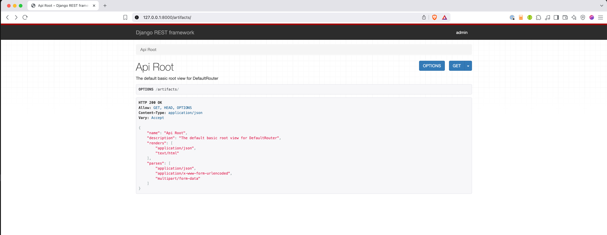

https://realpython.com/courses/django-rest-framework/

## REST

- Client-server architecture
- Stateless
- Cacheable
- Layered system
- Code on demand
- Uniform interface
    - Resources are identified as requests
    - Resource manipulation through representations
    - Self-descriptive messages
    - Hypermedia as the engine of application state (HATEOAS)

## Django REST Framework

- Toolkit for developing RESTful APIs in Django
- Integrastes with Django models, views and URL patterns
- Provides mechanisms for both function and class based views
- Serialization for both ORM and non-ORM data sources
- Built-in web interface
- https://www.django-rest-framework.org/

### DRF Serialization and Views

- Serializers
    - Change objects into text aqnd text back into objects
    - With or without Django ORM
- Views
    - Utilities to write Django views that serialize and deserialize data


```python
# people/models.py
from django.db import models


class Person(models.Model):
    first = models.CharField(max_length=50)
    last = models.CharField(max_length=50)
    title = models.CharField(max_length=5)
    
    class Meta:
        verbose_name_plural = "People"

 

# people/serializers.py
from rest_framework import serializers
from .models import Person


class PersonSerializer(serializers.ModelSerializer):
    class Meta:
        model = Person
        fields = ['id', 'first', 'last', 'title']


# people/views.py
from rest_framework.decorators import api_view
from rest_framework.response import Response

from .models import Person
from .serializers import PersonSerializer


@api_view(['GET'])
def list_people(request):
    people = Person.objects.all()
    serializer = PersonSerializer(people, many=True)
    content = {
        "people": serializer.data
    }

    return Response(content)
```


```bash
curl -s http://127.0.0.1:8000/people/list_people/ | python -m json.tool  
```


### DRF ViewSets

- ViewSets
    - Class based utilities for encaspsulating common REST/HTTP methods
    - Automatically get List, Retrieve, Create, Update, Update Partial, and Delete actions
    - Router define all the URL mappings
- Routers
    - Map between ViewSets and Django URL routes

```python
# artifacts/views.py
from rest_framework import viewsets

from .models import Artifact
from .serializers import ArtifactSerializer


class ArtifactViewSet(viewsets.ModelViewSet):
    serializer_class = ArtifactSerializer

    def get_queryset(self):
        return Artifact.objects.all()


# artifacts/urls.py
from django.urls import path, include
from rest_framework.routers import DefaultRouter

from . import views

router = DefaultRouter()
router.register(r'artifacts', views.ArtifactViewSet, 'artifact')

urlpatterns = [
    path('', include(router.urls)),
]

```

```bash
curl -s http://127.0.0.1:8000/artifacts/ | python -m json.tool    # prints router urls
curl -s http://127.0.0.1:8000/artifacts/artifacts/ | python -m json.tool 
curl -s http://127.0.0.1:8000/artifacts/artifacts/2/ | python -m json.tool  
curl -s -X POST -d "name=Ark of the Covenant" -d "shiny=True"  http://127.0.0.1:8000/artifacts/artifacts/ | python -m json.tool 
curl -s -X PUT -d "name=Golden Idol" -d "shiny=True"  http://127.0.0.1:8000/artifacts/artifacts/1/ | python -m json.tool 
curl -s -X PATCH -d "shiny=False"  http://127.0.0.1:8000/artifacts/artifacts/1/ | python -m json.tool  
curl -s -X DELETE http://127.0.0.1:8000/artifacts/artifacts/1/ 
```

### Web Interface and Renderers

- Web Interface
    - Out of the box, DRF comes with a web interface
- Renderers
    - Type of response is based on:
        - Renderers installed
        - HTTP Accept header
    - Change the renderer in settings.py
    - Alternatively, you can set the renderer in the viewset
    - Third party packages for more formats




### Permissions

- DRF `IsAdminUser`is more like `is_staff`
- object level can be checked
- By default inside of BasePermission, permission is granted
- Listing is different than updates/items
- A few things can acccidentally expose things


```python
from django.contrib.auth.decorators import login_required
from django.shortcuts import render

from rest_framework import viewsets
from rest_framework.permissions import BasePermission

from .models import Book
from .serializers import BookSerializer


class IsSuperUser(BasePermission):
    def has_permission(self, request, view):
        return request.user.is_superuser
    
    def has_object_permission(self, request, view, obj):
        return request.user.is_superuser
    

class IsIndy(BasePermission):
    def has_object_permission(self, request, view, obj):
        if not obj.restricted:
            return True
        
        return request.user.username == 'indy'


class BookViewSet(viewsets.ModelViewSet):
    serializer_class = BookSerializer
    permission_classes = [IsIndy | IsSuperUser]

    def get_queryset(self):
        if self.request.user.is_staff:
            return Book.objects.all()
        
        return Book.objects.filter(restricted=False)
    

@login_required
def library(request):
    return render(request, 'library.html')
```

### Serializers without ORM

- Inherit from `serializers.Serializer` class and combine fields to construct arbitrary objects
- similar to how you declare ORM objects
- https://www.django-rest-framework.org/api-guide/fields/


```python
# vehicles/models/tools.py
class Tool:
    def __init__(self, name, make):
        self.name = name
        self.make = make
        
         
# vehicles/serializers/tools.py
from rest_framework import serializers


class ToolSerializer(serializers.Serializer):
    name = serializers.CharField(max_length=50)
    make = serializers.CharField(max_length=50)

# vehicles/views/tools.py
from rest_framework.decorators import api_view
from rest_framework.response import Response

from vehicles.models import Tool
from vehicles.serializers.tools import ToolSerializer


@api_view(['GET'])
def list_tools(request):
    tools = [
        Tool("hammer", "Mastercraft"),
        Tool("wrench", "Husky")
    ]

    serializer = ToolSerializer(tools, many=True)
    content = {
        "tools": serializer.data
    }

    return Response(content)

```

### Nested Django ORM objects

- DRF provides methods for serializing related ORM objects
- Reference foreign keys by id
- Nest serialized relationships

```python
# vehicles/models/vehicles.py
from django.db import models


class Vehicle(models.Model):
    name = models.CharField(max_length=100)


class Part(models.Model):
    name = models.CharField(max_length=100)
    make = models.CharField(max_length=100)
    vehicle = models.ForeignKey(Vehicle, on_delete=models.CASCADE)


# vehicles/serializers/vehicles.py
from rest_framework import serializers
from vehicles.models import Vehicle, Part


class SerialNumberField(serializers.Field):
    def to_representation(self, value):
        code = value.make[:3].upper()
        return f"{code}-{value.id}"
    

class PartSerializer(serializers.ModelSerializer):
    serial_no = SerialNumberField(source="*")

    class Meta:
        model = Part
        fields = ["url", "name", "vehicle", "serial_no"]


class VehicleSerializer(serializers.ModelSerializer):
    part_set = PartSerializer(many=True, read_only=True)

    class Meta:
        model = Vehicle
        fields = ["url", "name", "part_set"]

# vehicles/views/vehicles.py
from rest_framework import viewsets
from rest_framework.response import Response

from vehicles.models import Vehicle, Part
from vehicles.serializers.vehicles import VehicleSerializer, PartSerializer


class PartViewSet(viewsets.ModelViewSet):
    queryset = Part.objects.all()
    serializer_class = PartSerializer


class VehicleViewSet(viewsets.ModelViewSet):
    serializer_class = VehicleSerializer

    def get_queryset(self):
        return Vehicle.objects.all()
```

### ViewSet Actions

- compounded serialization
    - A common pattern is to declare an API that includes multiple objects
    - Everything you might need in a single-page application
    - Delcare aq view and nest multiple serializers


```python
# api/urls.py
from django.urls import path, include
from rest_framework.routers import DefaultRouter

from . import views

router = DefaultRouter()
router.register(r"doctors", views.DoctorsViewSet, "doctors")
router.register(r"mass_delete", views.MassDeleteArtifactsViewSet, "mass_delete")

urlpatterns = [
    path("v1/", include(router.urls)),
    path("v1/listing/", views.listing),
]

# api/views.py
from rest_framework import viewsets, mixins
from rest_framework.decorators import action, api_view
from rest_framework.response import Response

from artifacts.models import Artifact
from people.models import Person
from vehicles.models import Vehicle
from people.serializers import PersonSerializer
from vehicles.serializers.vehicles import VehicleSerializer


class DoctorsViewSet(mixins.ListModelMixin, viewsets.GenericViewSet):
    def list(self, request):
        doctors = Person.objects.filter(title="Dr.")
        results = {
            "doctors": PersonSerializer(doctors, many=True).data,
        }

        return Response(results)
    

class MassDeleteArtifactsViewSet(mixins.DestroyModelMixin, 
                                 viewsets.GenericViewSet):
    @action(detail=False, methods=["delete"])
    def mass_delete(self, request, pk=None):
        for artifact_id in request.POST['ids'].split(","):
            Artifact.objects.get(id=artifact_id).delete()

        return Response()


@api_view(["GET"])
def listing(request):
    doctors = Person.objects.filter(title="Dr.")
    Vehicles = Vehicle.objects.all()

    context = {
        "request": request,
    }
    vehicle_serializer = VehicleSerializer(Vehicles, 
                                           many=True, 
                                           context=context)
    results = {
        "doctors": PersonSerializer(doctors, many=True).data,
        "vehicles": vehicle_serializer.data,
    }

    return Response(results)

```