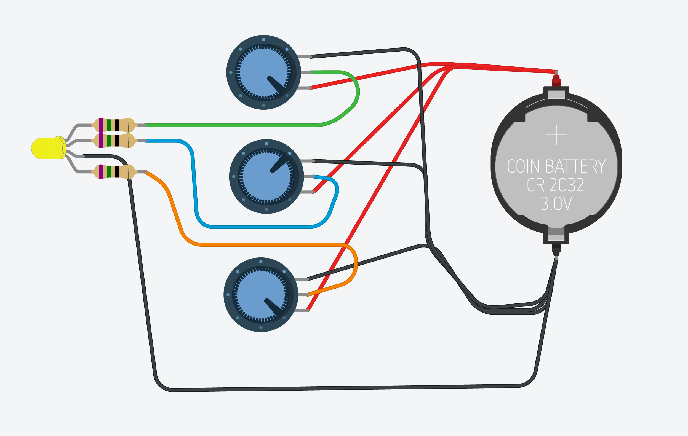
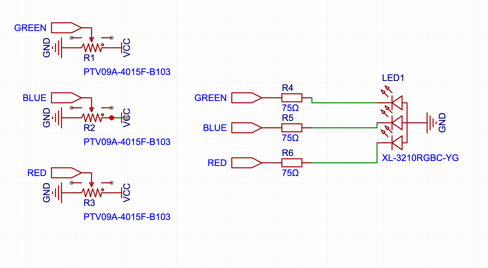
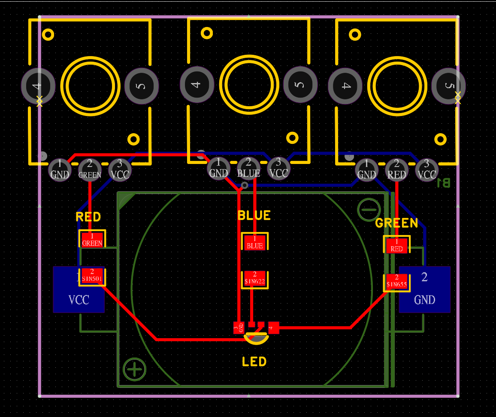

https://skillet.academy/courses/enrolled/2624407

## Resistors

Resistors are passive electronic components that limit or control the flow of electronic current in a circuit

- They dissipate electrical energy in the form of heat while reduciing the voltage and current in a circuit
- types
    - Fixed resistors (with a specific resistence value)
    - variable resistors: such as potentiometers and rheostats, which allow for adjustable resistors
- variable
    - Also known as potentiometers or rheostats, are electronic components whose resistence can be manually adjusted
    - provide variable resistence in a circuit, allowing users to control the current flow or voltage levels
    - potentiometers: used for volume control in audio equipment, tuning in radio and adjusting brightness in lighting circuits
    - LDR (light dependent resistor): used to deterine brightness
    - Rheostats: tuned once and never touched
    - Trimmers: preset potentiometers, compact and precise 
- Use Ohms law to determine the resistors needed in a circuit

## Capacitors

Capacitors are electronic components that store and release electrical energy in a circuit

- They consist of two conductive plates separated by an insulating material (dielectric), storing energy in the form of an electric field when voltage is applied
- Applications
    - Energy storage: temporarily store energy for power supply stabilization
    - Filtering: smooth out fluctuations in power supply voltages
    - Timing circuits: control timing elements in ossillators and timers
- Types
    - ceramic: various forms
    - electrolitic: high capacitor, power supply filtering, polarized
    - tantalome: aerospace and military
    - film: audio/video
    - super/ultra: high capacity

$$E = \frac{1}{2} \times C \times V^2$$

- E is in Joules
- C is in Farad (F)
- V is Volts

## Inductors

Inductors are passive electronic components that store energy in a magnetic field when electrical current flows through them.

- Composed of a coil of wire, inductors resist changes in current and can temporarily store energy in the magnetic field created by the current.
- Core is made of air, iron, and other ferite materials
- The number of turns in the coil, the coils geometry, and the coil material significanlty affects the inductuce.
- Measured in henries (H) 
- When an electric current flows through the coil of an inductor it creates a magnetic field around the core, the energy is stored in the magnetic field
- Applications
    - Filtering: used in power supplies to filter out AC noise from DC signals
    - Energy storage: sotre energy in switch-mode power supplies
    - Tuning circuits: employed in Radio Frequency (RF) tuning and signal processing to select specific frequencies
    - Also used in transformers
    - Chokes: block high frequency AC signals, allow low freq AC and DC to pass
    - Metal detectors
- Can create fields that intefere

### Calculate Inductance

$$L = \frac{N^2 \times μ \times A}{l}$$

- L is inductance
- N number of turns in the coil
- μ is the permiability of the core
- A is the cross sectional area of the core
- l is the length

### Calculate Amount of Energy Stored

$$E = \frac{1}{2} \times L \times I^2$$

- E is energy in joules (J)
- L inductance in henries (H)
- I is current in amps (A)

### Formula given by Faraday's law of induction

$$V = -L \times \frac{dI}{dt}$$

- V is induced voltage
- L is inductance
- dI / dt is rate of change of current over time

### Self inductance

Property to induce a voltage in itself due to a change in current through the coil, also known as back EMF.

### Mutual inductance

The magnetic field of one placed next to another that the magnetic field of one induces a voltage in another. Used in transformers where energy is transferred between a shared magnetic field.

### Core Materials

- air: where core losses must be minimized. Low inductance, ideal for RF
- iron: higher. Power applications.
- Ferad core: high permiabillity and low losses at high frequency. Broader and switching power supplies. Capacitors for current. 

## Transformers

Transformers are electrical devices that transfer energy between two or more circuits through electromagnetic induction

- Composd of primary and secondary coils wound around a magnetic core, transformers step up (increase) or step down (decrease) voltage levels while maintaining the same frequency
- When a AC current flows through a primary winding it creates a time varied magnetic field in the core. This change induces a voltage in the secondary winding.
- Types
    - step up, increase voltage
    - step down, decrease voltage
    - isollation, electrical isolation between primary and secondary
    - auto transformer
- Applications
    - Power distribution: step up voltage for long-distance transmission and step down voltage for safe residential and commerical use
    - isolation: provide electrical isolation between different parts of a circuit to enhance safety
    - impedance matchimng: match impedance between different circuits to maximize power transfer and miniize signal
- When exceding limitations of inductors, look at transformers

$$\frac{VS}{VP} = \frac{NS}{NP} $$

- VS seondary voltage
- VP primary voltage
- NS number of turns in secondary
- NP number of turns in primary

## Diodes

Diodes are semiconductor devices that allow current to flow in one direction only, acting as one-way value for electical current

- comprised of a p-n junction, diodes conduct electricity when forward-biased (positive voltage applied to the anode) and block current when reverse-based (negative voltage applied to the anode)
- usually around 0.7 volts allows current to flow
- reverse increases depletion region
- forward dcecrease depletion region
- forward: current increases exponentially
- reverse: stays near 0 until breakdown voltage is reached, then conducts in reverse
- Applications
    - Rectification: convert AC to DC in power supplies
    - protection: protect circuits from voltage spikes by clamping and redirecting excess voltage
    - signal demodulation: extract audio signals from modulated radio frequency signals in communication devices
- types
    - standard: rectification, clamping, general purpose. Variability to block reverse current
    - sender: allow reverse to flow once break down voltage is reached
    - shotkey: low forward volage drop (0.2, 0.3), high frequency. Power supplies, RF cicuits
    - Varactor: variable capitors, controlled by reverse bias voltage. Tuning, radio frequency

## LEDs

Light Emitting Diode: are semiconductor devices that emit light when current flows through them, converting electrical energy into visible light.

- Operation: emit light when forward-based (positive voltage applied to the anode)
- Types: available in various colors (red, green, blue, white) based on semiconductor materials and construction
    - Energy band gap of material
    - Red, orange, yellow: Gallium arsenide phosphide (GaAsP) or Gallium phosphide (GaP). Lower band gap
    - Green: gallium phosphide (GaP) or Gallium nitride (GaN)  higher band gap
    - Blue: Gallium nitride (GaN) or Indium gallium nitride (InGaN). higher energy band gap. Harder to make. Paved the way for white LEDs.
- Threshold voltage, typically 1.8v - 3.3v depending on color and material. Below its off. As it gets passed, higher voltage is brighter. 
- Use resistors to prevent damage
- One lead is longer than the other to show anode vs. cathode
- Applications
    - Used in eelctronic devices to indicate power status, operation modes, and alerts.
    - Lighting: effecicent alternative to incadescent bulbs in displays, singage, automotive lighting and general illumintation
    - Displays: Integrated into alphanumeric displays and large-scale vidceo screens (LED TVs)

## Rectifiers

Rectifiers are electronic devices that convert alternating current (AC) to direct current (DC), essential for providing stable DC power from an AC source

- Utilizes diodes to allow current to flow in only one direction, effectively transforming the AC input into a pulsating DC output.
- Half wave: only half the signal goes through, creates a pulsating DC output. Inefficient, using half the AC
- Full wave
    - center tap transformer with two diodes, splits the signal into two haves. Doubles the output
    - bridge rectifier, 4 diodes in a bridge configuration, more efficient and common. Converts both positive and negative halves to DC
    - has ripples, pulsating, use filtering to smooth
- Applications
    - Power supplies: used in AC-DC power adapters and battery chargers to provide DC voltage
    - Signal demodulation: extracts the DC component from AC signals in radio receivers
    - Voltage multiplication: in voltage multiplier circuits to generate high DC voltages from lower AC voltages

## Transistors

Transistors are semiconductor devices used to amplify or switch elctronic signals and electrical power

- Consist of three layers of semiconductor material, forming either an NPN or PNP structure, with three terminals: emitter, base and collector. By applyi8ng a small current to the base, a larger current flows from collector to the emitter (or vice versa for PNP)
- BJT are very common. 
- FET use an electric field, more energy efficient
- Applications
    - Amplification: increase the strength of weak signals in audio, radio, and other communication devices
    - Switching: act as electronic switches in digital circuits, controlling current flow in computer processors and memory
    - Regulation: Used in voltage regulators to maintain a constant output voltage
- bi-polar junction (BJT), analog and digital circuits. Amplications and switching
- field effect (FET), electrical fields. N-channel and P-channel. More energy efficient
- darlington: two BJT for high current gains.

## Integrated Circuits

Integrated Circuits (ICs) are compact, sendiconductor devices that contain multiple electronic componenets (transitors, diodes, resistors, capacitors) on a single chip to perform various functions.

- ICs integrate various circuite elements into a tiny package, enabling comnplex functions like amplication, signal processing, and digital computation. They can be analog, digital, or mixed signal. 
- Also called micro controllers
- Applications
    - Computers and mobile devices. Serve as microprocessors, memory chips, and logic gates, forming the backgone of digital technology
    - Consumer electronics: power devices like televisions, radios, and home appliances by providing control and processing signal capabilities
    - Automotive and industrial: used in control systems, sensors, and communication modules to enhance functionality and performance

## Sensors

Sensors are devices that detect and respond to changes in environmental conditions, converting physcial phenomena into electrical signals.

- Operate by sensing physical inputs such as light, temperature, pressure, motion, or chemical properties and output an electrical signal that can be measured and processed. Often using Variable resistors.
- temperature sensors: termisiters, thermocouples
- light sensors: photo diodes, light meters, optical communication, automatic lighting, LDR
- motion sensors: accelerometers, smart phone, vehicle stability
- gyroscope: measure rate of rotation, gaming, smart phones, and drones
- chemical sesnors: detect alcohol in blood
- bio sensors: detect biological anolites, glucose sensor
- pressure: meassure force, weather, industrial process control, pizoelectric and capacitive
- infrared: thermal imaging, remote controls, proximity
- ultrasonic: high frequency sounds waves, measure distance, parking, robots, level measurements

## Actuators

Actuators are devices that convert electridcal energy into mechanical motion, enabling control and movement in various systems

- Operate by receiving a control signal and producing a physical change, such as linear motion, to perform a specific task.
- Input energy to mechanical energy. Electrical, pneumatic, or hydrolic
- Motion: linear or rotary
- Many have feedback to capture position, speed, or force of the motion, allowing precise control
- Electric motors, converts electrical energy to rotational movement
- Solonoids: produce linear energy by converting energy to an electro-magnetic field moving the plunger or core. Used in locking mechanisms, automotive starters, fuel injectors, and transmission controls. Industrial applications, precise control of a bolt. 
- pneumatic: compressed air to generate motion. Automation like pick and place, packaging systems. Robotics to mimic muscle tissue.
- DC motors: brush or brushless. Brushless are more reliable. More types.
- Examples
    - Elecrtric motors: used in robotics, household appliances, and industrial machinery to create rotation movement.
    - Solenoids: employed in locking mechanisms, such as electronic door locks and automotive start systems, to provide linear motion.
    - Pneumatic actuators: utilized in automation systems and machinery, using compressed air to generate mechanical motion for tasks like clamping or moving parts

## Circuit Design

1. Define the purpose: clearly outline the circuits function and what components are necessary to achieve it.
1. Chose components: select components such as resistors, capacitors, diodes, transitors, and integrated circuits baszed on their electrical characteristics and suitability for the application
    - Learn to read data sheets
1. Circuit schematic: Draw a schematic diagram illustrating how components are connected, showing the flow of current and signal paths
1. Calculate values: calculate resistor values for current limiting, voltage dividers, or impedance matching using Ohm's law and component data sheets
1. Prototype and test: build a prototype on a breadboard to verify functionality and performance. Test the expected behavior, voltage levels, signal integrity, and any necessary adjustments
1. PCB Design (optional): For more permenant solutions, design a printed circuit board (PCB) layout using CAD software to minimize size, optimize routing, and ensure electrical connections are correct.
1. Documentation: document the circuit design, including schematics, component values, and any special notes for future reference or replication
1. Iteration and optimization: iterate on the design based on testing results and feedback, optimizing for performance, efficiency, and reliability

## Analog vs. Digital

### Analog

- Utilize continous signals that vary in amplitude to represent information
- Output is smooth and continous waveform
- Examples: audio amplifiers, analog sensors, analog-to-digital converters

### Digital

- Use descrete signals that represent information in binary form (0s and 1s)
- Output is discrete and characterized by high or low voltage levels
- Examples: microprocessors, memory chips, logic gates

### Comparing

- Signal representation: analog circuites represent data with varying voltages, while digital circuits use binary states (on/off)  
    - digital stores data reliably even with noise
- Complexity: digital circuits can handle complex operations and calculations, whereas analog circuits are typically simpler in design
_ Noise sensitivity: analog circuits are more susceptible to noise and interference compared to digital circuits, which are most robust.

## Circuit Symbols

Circuit schematics are visual representations of electronic circuits using symbols to denote components and lines to show connections

- Provide a clear, standardized way to understand and design circuits without needing to physically build them
- Engineers asnd designers use schematics to plan, analyzxe, and communicate circuit designs efficiently before actual construction, ensuring functionality and reliability

## Simulating Circuits

- https://www.tinkercad.com/: online autocad tool
- Can export image or .brd file

## Desiging and Manufacturing Circuits

- https://easyeda.com/page/download?src=index
- JLCPCB is very large, manufactured in china

