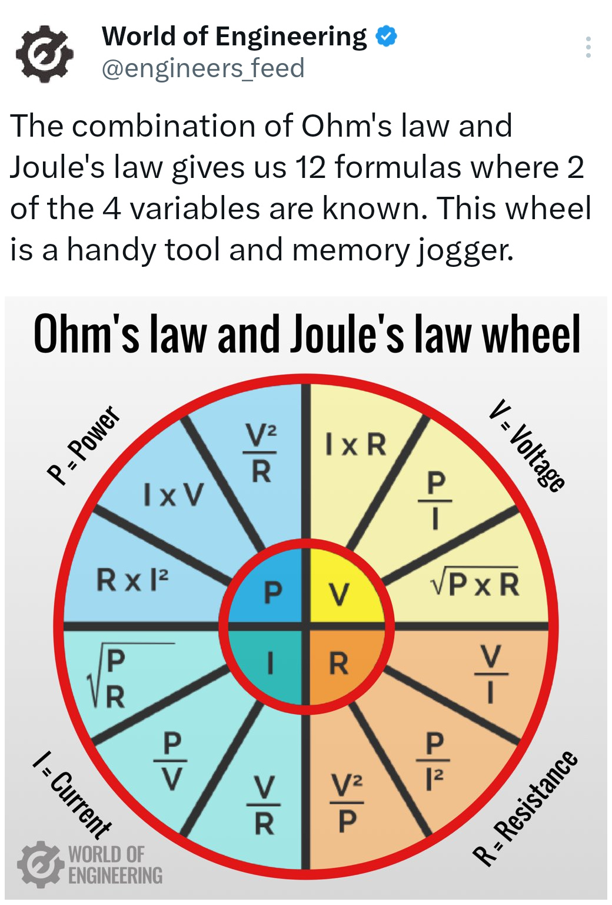
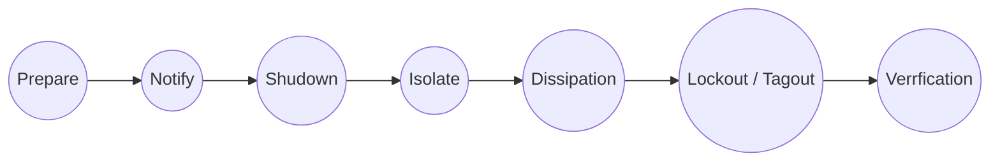

## What is electricity?

- Electricity is the flow of electric charge
- Carried by electrons
- Positive flows towards negative and negative towards positive

AC vs. DC: AC travels further and is the foundation of the grid

## What is energy?

- moving muscles and heating food
- cannot be created or destroyed
- movement, heat, light, sounds, etc.

## How does electricity work?

- electrons move between atoms within materials that conduct electricity
- electricy needs a closed path, liket a circuit to flow
- voltage: is the force that makes electrons flow. Like pressure in a water pipe.
- current: is the amount of electricity flowing, like the amount of water flowing through a pipe

## Static vs. Current Electricity

|                 | Static Electricity                                                                                                         | Current Electricity                                                              |
| --------------- | -------------------------------------------------------------------------------------------------------------------------- | -------------------------------------------------------------------------------- |
| Definition      | Static electricity is the accumulation of electric charge on the surface of objects. This charge remains until discharged. | Current electricity is the continous flow of electric charge through a conductor |
| Examples        | Rubbing a balloon on hair, lightning.                                                                                      | Electricity flwoing through wires to power homes and devices.                    |
| Characteristics | Charge buildup occurs without a continous flow, noticeable when it suddenly discharges, a shock.                           | Requires a closed circuit to be measured in amperes (A).                         |

Laser printers use static to put toner on paper.

## Currents

### AC (Alternating Current)

- Electricity constatly changes direction (positive to negative and back), like a wave. Measured in Hertz. 
- Produced in power plants. 
- Can easily be transformed to higher or lower voltages. 
- Can travel long distances. 
- House wall outlets
- Powering homes, appliances
- Easy to transform to lower voltages
- Electric shock can be very dangerous

### DC (Direct Current)

- Electricity flows in a constant direction (only positive to negative). 
- Primarily batteries
- Batteries convert chemical energy to currents
- Phone, laptop, solar panels, etc., often after converting to DC
- Can't go over long distances, lose power over distance
- High voltage DC is now being used in new ways to go over long distances in specific applications
- Devices that require consistent power use DC
- lower energy output over long distance
- harder to convert 
- Generally safer, less EMF and shock. High voltage can be dangerous
- Preferred in sensitive environments

## Measuring Electricity

- Voltage (V, Volts) potential difference between two points in an electrical field. Like pressure pushing water through a pipe.
- Current (Amperes, A) current is the flow of electric charge through a conductor. Like the flow of water through a pipe.
- Resistence (Ohms, Ω) resistence is a measure of how material opposes the flow of the current. It's like the friction that water experiences in a pipe. 
- Step up or step down is converting voltage up or down
- Voltage is how much you feel, amps is the damage. 
- Ohms law describes the relationship

## Measuring Tools

- 

## Electronic Circuit

- Controls electri current to perform tasks
- It includes components like resistors and transistors onnected by wires
- Found in all electronic devices

### Series Circuit

- Configuration: components are connected end to end forming a single path for current flow
- Current: same current through all components
- Voltage: Total is the sum of voltages across each component
- If one component fails, the entire circuit is broken
- Simplistic applications, like decorative lights

### Parallel Circuit
- Configuraiton: Components are connected across common points, providing multiple paths for current
- Current: different paths can have different currents; total current is the sum of the currents through each path
- Voltage: voltage across each component is the same.
- Easier to troubleshoot. 
- Adding more branches decreases reistence, decreasing load on a single path
- If one component fails, all continue to operate
- Complex systems, like home or auto electrical systems

## Resistence

- Opposition to current flow in a material, measured in ohms (Ω)
- Influenced by material, length, cross-sectional area, and temperature.
- Longer or thinner wires have a higher resistence
- copper and aluminum has low resistence
- rubber, glass, and plastic have high resistence
- Semi-conductors: Silicone flow between conductor and insulator, under certain condiditons
- Resistence typically increases with temperature for conductors. 
- Semi-conductors and other materials may decrease resistence with temperature increase

### Ohm's Law

- Volate (V) equals current (I) multiplied by resistence (R)
- Used for calculating volatge, current or resistence in circuits.
- P = Power (Watts)
- V = Voltage (Volts)
- C = Current (Amps)
- In AC is used to understand impedence, DC is resistence

$$V=I \times R$$

$$5V=0.5A \times 10Ω$$

## Health and Safety

- Critical importance: adhering to electical safety protocols is essential
- Consequences: electrical accidents can causae severe injuries and damage

### Risks

- Exposed wire: can cause shock or short circuits
- Overloaded circuits: risk of overheating and fires
- Wet conditions: increase the likelihood of electrical shocks
- Faulty equipment: can lead to unpredictable hazards

## PPE and Controlling Hazards

- Purpose: protects against electrical hazards and injuries
- Type of PPE: gloves, helmets, and protective clothing
- Proper use: ensure correct fitting and usage for maximum protection
- Maintence: regular cleaning and storage to maintain effectiveness
- inspection: check for damage or wear before each use to ensure safety

### Controlling Hazardouse Energy

- Definition: Lockout/tagout prevents accidental energy relase during maintenance
- Procedure steps: follow a specific sequence to safely de-energize equipment
- Authorized personal: Only trained individuals should perform lockout/tagout.
- Verification: Ensure all energy sources are effectively isolated before work begins. 

### Best Practices

- Safety guidelines: follow specific procedures for each type of electrical equipment
- Codes and standards: adhere to established electrical codes for safety. 
- Equipment inspection: regularily check and maintain electrical equipment
- Personal Protective Equipment: Use appropiate PPE when working with eletrical devices
- Emergency prodecures: know the steps to take in case of electrical accidents

## Responding to Emergencies

- Effects of shock: can cause burns, muscle contractions, and cardiac arrest
- Response proedures: safely disconnect the victim from the electical source
- CPR importance: provide immediate CPR if the victim is unresponsive
- AED training: Use and AED to help restore normal heart rhythm

