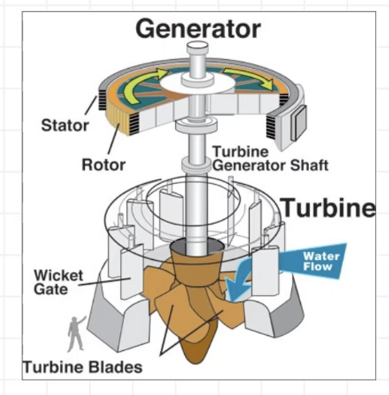
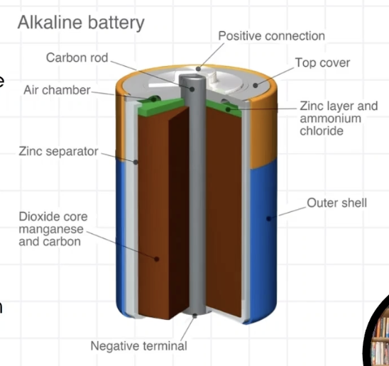

https://skillet.academy/courses/component-mastery/lectures/56567416

## Power Plants

- Use various sources of energy
- Examples include:
    - Fossil fuels (coal, gas, oil) to create steam. High emissions but efficient. 
    - wind turbines use wind energy. Require a lot of land.
    - Solar panels capturing solar. 
    - hydroelectric dams using flowing water. Ecosystem disruption
    - Nuclear power plants uses fission to release large amounts of heat and generate steam. Low emissions but has radio active waste and safety concerns
- The turbine consists of a magnet and a coil of wire inside the turbine

### Making Electricity Useful

 - Generators: create electricty from other sources like burning fuels, wind, water, or sunlight
 - Batteries: store electricity for use later
    - Electro chemical cells
    - Lead acid are in vehicles and backup power supplies. They are heavy, robust, deliver high current. They have low energy density. 
    - Lithium ion are used in portable electronics, electric vehicles, and grid storage. Has higher energy density, lightweight. Long life span. Ability to quickly charge or discharge can cause them to explode.
    - Solid state: emerging technology, higher energy density and better safety over Lithium ion. They use a solid electrolyte instead of liquid. No acid.
    - Flow: large scale energy storage applications, liquid stored in external tanks. Capacity can be scaled by scaling tanks. Used in grid storage.
 - Electrical devices: transform electricty into light, heat, motion, and other forms of energy
    - Lighting such as LEDs
    - Heat, uses resistent material to generate heat
    - Motors create movement using electro magnents
    - Communicating and computing, microprocessors, memory, etc.

## Turbines

- Capture energy: turbines act like giant pinwheels, using blades to capture the energy of moving fluids like wind, water, or steam
- Spin it up: the force fo the fluid creates lift on the blades, casuing them to rotate a central shaft
- Power generation: the rotational energy is used to generate electricity (spinning a generator) perform other mechanical tasks

- Electromagnetism in action: generators rely on a scientific principle called electromagnetism. The principle states that whenever a conductor (wire) moves through a magnetic field, an electric current is induced in the wire.
- The spinning magic: inside a generator, a strong magnet is positioned near a coil of wire. As the turbine shaft spins, it rotates the coil of wire within the magnetic field.
- Electric current flow: following the principle of electromagnetism, the movement of the coil of wire through the magnetic field creates an electric current in the wire. The electric current is what we use to power our homes and appliances.

## Fossil Fuels

- Definition: Non-renewable energy sources derived from ancient organic materials (coal, oil, natural gas)
- Advantages
    - Abundant and widely available
    - Well-established infrastructure for extraction, refinement, and distribution
- Challenges:
    - Environmental impact: greenhouse gas emission contribute to climate change
    - Finite resource: depletion and increasing difficulty of extraction
- Future outlook: transistion to cleanr alternatives like renewable energy sources

## Renewable Energy

- Definition: energy sources replensihed naturually over time (solar, wind, hydro, geothermal)
- Advantages:
    - Clean energy. Minimal greenhouse gas emissions, reducing environmental impact
    - Renewable: Endless supply, reducing dependence on finite resources
    - Diversification: harnessing multiple sources reduces reliance on a single energy type
- Challenges:
    - Intermittency. Variability on energy production due to weather conditions (wind, solar)
    - Initial investement: higher upfront costs for infrastructure and technology
    - Wind: locate in ocean to avoid impacting wildlife and noise pollution. 
    - Large damns can impact the environment, using rivers and smaller scale can be less damaging
- Future outlook: rapid growth and innovation in renewable technologies, driving down costs and increasing efficiency

## Traditional Grids

### Distributing Electricity
- Generation: Power plants, generate electicity (11kV to 25kV)
- Transmission: 
    - High voltage lines: transmit electricity over long distances (110kV to 765kV) to reduce energy loss.
    - Step-up transformers: increase voltage for efficient transmission
    - High-voltage, low amperage, reduces loss by heat
- Substations
    - Step-down transformers: reduce voltage to distribution levels (2.4kV to 33kV)
    - Switching equipment: direct electricity to distribution lines
- Distribution
    - Distribution lines: deliver electricity locally
    - Distribution transformers: further reduce voltage for consumer use (120V to 480V)

## Smart Grids

Smart grids are modern electrical grids equipped with digital technology to improve efficiency, reliability, and sustainability.

- US has invested heavily, Germany as well. 
- Grants/funding available SGIG
- Smart meters, advanced sensors, EV infrastructure, renewal sources. 
- Advantages:
    - Enhanced efficiency: real-time monitoring and control optimize energy distribution, reducing waste
    - Reliability: automated fault detection and self healing capabilities minimize downtime during outages
    - Integraftion of renewal energy: smart grids accomodate teh decentralized nature of renewable sources, ensuring smooth integration
    - Consumers can sell energy back to the grid 

## Smart Grid Componenets
- Advnaced meters: provide real-time data on energy consumption, enabling better demand management
- Distribution automation: automated switches and sensors detect faults and reroute power, minimizing disruptions
- Energy storage: batters and other storage technologies store excess energy for use during peak demand periods.
- Challenges
    - Cybersecurity: vulnerability to cyber threats requires robust security measures
    - Cost: upgrading to smart grid infrastructure involves significent investment
- Future outlook
    - Coninued expansion and innovation in smart grid technology, driven by the need for sustainable and resilient energy systems

## What is a Bettery?

Batteries are electrochemical devices that store and release energy through chemical reactions.

- Electrodes: Anode (negative) and cathode (positive) electrodes imersed in an electrolyte solution
- Chemicasl reactions: during discharge, electrons flow from anode to cathode, generating electricity. During charging, the process is reversed.
- Electrolyte: facillitates ion movement between electrodes, completing the circuit

## Battery Types

- Lithium-ion: commonly used in portable electronics and electric vehicles due to high energy density and long lifespan
- Lead-acid: traditional batters for automotive starting and lighting applications
- Nickel-metal hydride (NiMH): used in hybrid vehicles and rechargeable consumer electronics
- Nickel-cadmium: power tools, aviation, military, emergency lights. Long term reliability, long cycle life. Toxic cadmium. Charge fast. Memory effect, needs full discharge.
- Sodium-ion: new, cheaper to replace litium ion

## Electric Vehicles

Electric vehicles (EVs) are automobiles powered by electric motors and rechargeable batteries instead of internal combustion engines

- Zero emissions: reduce air pollution and greenhouse gas emissions, promoting cleaner air and mitigating climate change
- Energy efficiency: electric motors are more efficient than internal combustion enginers, converting a higher percentage of energy from the battery to propulsion
- Lower operating costs: EVs have fewer moving parts and require less maintenence than conventional vehicles, resulting in lower long-term costs
- Challenges
    - Infrastructure: insufficient charging infrastructure limits widespread adoption, particularly in rural areas or regsions with limited access to charging stations
    - Range anxiety: concerns about running out of battery charge before reaching a charging station, especially for long-distance travel
    - Battery technology: advances in battery technology are needed to increase energy density, reduce charging time, and lower costs for widespread adoption. 
    - Weight: heavier, more stress on roads/etc.

## Electricity Usage

- Home
    - encompasses applicances and devices for lighting, heating, cooling, cooking, entertainment, and more
    - Incadesent are least efficient, compact florescent is more efficient but has mercury, LED are most efficient
    - HVAC: AC, heaters, heat pumps, space heaters, furnances
    - Cooking: microwave, toaster oven, oven. Single run of microwave is efficient, oven for larger meals
- Energy-efficient appliances: invest in energy star certified applicances with high energy efficiency ratings
- Smart thermostats: programmable thermostats adjust heating and cooling based on occupancy and schedule, optimizing energy use
- LED lighting: replace incandescent bulbs with energy-efficient LED bulbs to reduce lighting costs
- Energy monitoring: use smart meters or energy monitoring devices to track and analyze home energy consumption
- Behavorial changes: unplug electronics when not in use, utilize natural lighting, and adjust thermostat settings for energy savings
- Renewable energy: insall rooftop solar panels or subscribe to community solar programs to generatge clean electricity and reduce reliance on the grid
- Benefits:
    - Cost savings: lower electricity bills result in long-term financial savings
    - Environmental impact: reduced energy consumption helps mitigate climate change and converve natural resources
    - Energy independence: by generating renewable onsite, homeowners can achieve greater energy independence and resilience.

    