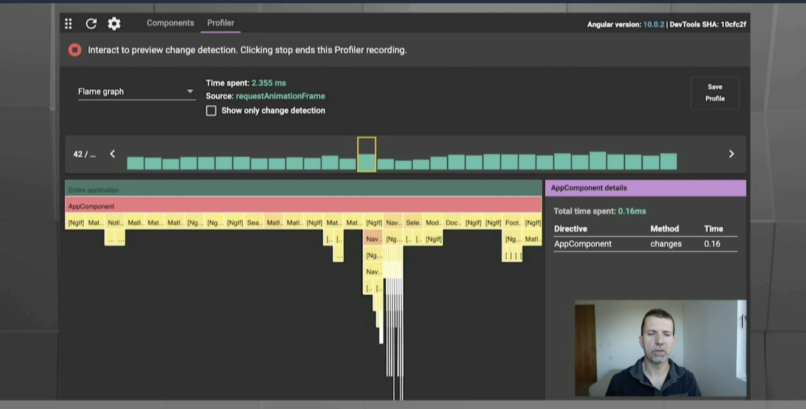

# Day 1

## Keynote

https://angular.io/guide/roadmap - collaborative process

- Ivy compile and runtime i18n
- Webpack 5 and micro-frontends
- angular devtools
  - augry team 
  
  

- optional ngmodules
- zoneless

https://blog.angular.io/angular-localization-with-ivy-4d8becefb6aa

## Sustainable Angular Architectures with Monorepos and Strategic Domain Driven Design

### Domain Driven Design

- Shared Kernel 
- 

## NX cache

https://github.com/nrwl/nx-incremental-large-repo

## Q & A

NX spring boot or python

Manfred: Pain points on separate repo vs. nx.

Cost of separate:

- freedom for different angular versions, have to maintain support for versions
- publishing in nx is a breeze

# hallway

https://thinkster.io/pro/yearly/enterpriseng

## RxJS Patterns in Angular

